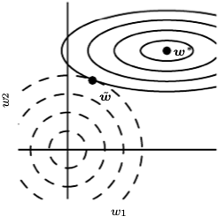
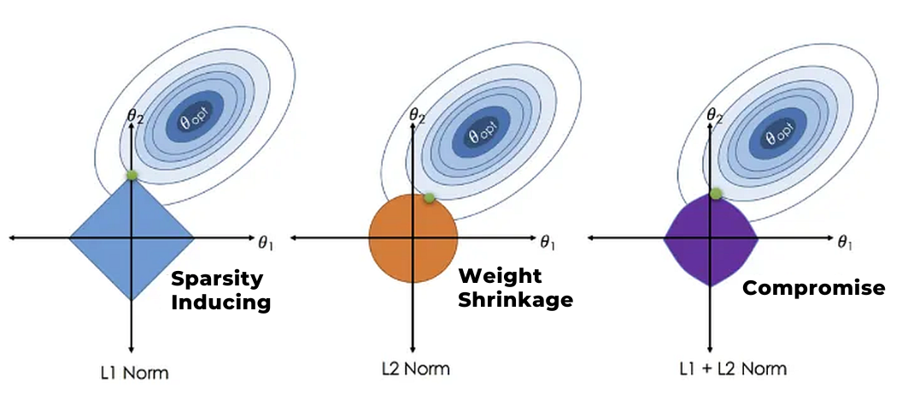

# Statistical Learning Theory

* Capacity
  * One way to quantify the capacity of a binary classifier is the VC dimension.
* Generalization error
  * Generalization error = Approximation error + Estimation error + Optimization error. 
    * Setup
      * Assume we have input space $\mathcal{X}$, output space $\mathcal{Y} = {-1,1}$, and unknown distribution $D$ on $\mathcal{X} \times \mathcal{Y}$. 
      * We observe $n$ pairs ${(x_i, y_i)}_{i=1}^n$ drawn i.i.d. from $D$. 
      * Suppose we have functions $f : \mathcal{X} \rightarrow \mathcal{Y}$ that predicts $y$ from $x$. 
      * For simplicity of notation, we shall use classification error.
    * True risk: $R^{true}(f) := \mathbb{P}_{(X,Y) \sim D}(f(X) \neq Y) = \mathbb{E}_{(X,Y) \sim D}\mathbf{1}_{[f(X)\neq Y]}$
    * $R^{true}(t) = \inf_fR^{true}(f)$
      * Our target function $t$ is the function that minimizes true risk over all possible measurable functions
    * $R^{true}(f^*) = \inf_{f \in \mathcal{F}}R^{true}(f)$
      * Given a class of functions $\mathcal{F}$, $f^*$ is the function in this class that minimizes true risk. 
    * $R^{emp}(f) = \frac 1n \sum_{i=1}^n \mathbf{1}_{[f(x_i)\neq y_i]}$
      * Our empirical risk is our estimate of true risk. 
    * $R^{emp}(f^{emp}) = \inf_{f \in \mathcal{F}}R^{emp}(f)$
      * Given a class of functions $\mathcal{F}$, $f^{emp}$ is the function in this class that minimizes empirical risk. 
    * $f^{opt}$, our optimization algorithm's best guess of $f^{emp}$
    * Generalization error: $R^{true}(f^{opt}) - R^{true}(t)$
    * Approximation error: $R^{true}(f^*) - R^{true}(t)$
    * Estimation error: $R^{true}(f^{emp}) - R^{true}(f^*)$
    * Optimization error: $R^{true}(f^{opt}) - R^{true}(f^{emp})$
  * Another type of generalization error
    * We often say talk about generalization as the difference in train and test error.
    * Note that this difference is _none_ of the terms above, since these measured quantities are $R^{emp}$ values rather than $R^{true}$
    * Instead, this seems to estimate $R^{true}(f^{opt}) - R^{emp}(f^{opt})$
    * Roughly, the difference between training and test error is of order $\sqrt{\frac{d_{vc}\log n}{n}}$
      * I.e. "generalization" error decreases with lower model capacity / more data.
* Bias
  * The bias of an estimator $\hat{\pmb{\theta}}_m=\mathbb{E}\left(\hat{\pmb{\theta}}_m\right)-\pmb{\theta}_{true}$, where the expectation is over the data (seen as samples from a RV)
* MSE & Bias-Variance Tradeoff
  * $\operatorname{MSE}= \mathbb{E}\left[\left(\hat{\theta}_m-\theta\right)^2\right] \\ =\operatorname{Bias}\left(\hat{\theta}_m\right)^2+\operatorname{Var}\left(\hat{\theta}_m\right)$
    * The proof starts with $\mathbb{E}\left[\left(\hat{\theta}_m-\mathbb{E}(\hat{\theta}_m) + \mathbb{E}(\hat{\theta}_m) -\theta\right)^2\right]$
  * Desirable estimators keep MSE low, and therefore balance bias and variance (bias-variance tradeoff)
  * Note a similar decomposition of the data generating process $y = f(x) + \epsilon$, $\operatorname{Var}(\epsilon) = \sigma^2$
    * $\operatorname{MSE} = \mathbb{E}[(y-\hat{y})^2] = \operatorname{Bias}(\hat{y})^2+\operatorname{Var}(\hat{y})+\sigma^2$, where we term $\sigma^2$ as the irreducible error.
      * We start by showing that $\mathbb{E}[(y-\hat{y})^2] = \mathbb{E}[(f(x)-\hat{f}(x))^2] + \mathbb{E}[\epsilon^2]$, then proceed as per the estimator case.
* Parameter Regularization
  * [Goodfellow](https://www.deeplearningbook.org/contents/regularization.html) defines regularization as “any modification we make to a learning algorithm that is intended to reduce its generalization error but not its training error.”
  * One family of regularization strategies are based on regularizing estimators, which works by trading increased bias for reduced variance. 
  * L2/Ridge/Tikhonov Regularization
    * We modify $L(\pmb\theta)$ to $\tilde{L}(\pmb\theta) = L(\pmb\theta) + \frac{\alpha}{2}\mathbf{\pmb\theta^\top \pmb\theta}$
    * Gradient $\nabla_{\pmb\theta}\tilde{L}(\pmb\theta) = \nabla_{\pmb\theta}L(\pmb\theta) + \alpha\pmb\theta$
    * Let $\pmb\theta^* = \arg\min_{\pmb\theta}L(\pmb\theta) $
      * Then $L(\pmb\theta) \approx L(\pmb\theta^*) + \frac{1}{2}(\pmb\theta - \pmb\theta^*)^\top\mathbf{H}(\pmb\theta - \pmb\theta^*)$
      * $\nabla_{\pmb\theta}\tilde{L}(\pmb\theta) \approx \mathbf{H}(\pmb\theta - \pmb\theta^*) + \alpha\pmb\theta$
      * $= 0$ when $\pmb\theta = (\mathbf{H}+\alpha\mathbf{I})^{-1}\mathbf{H}\pmb\theta^*$
      * = $\mathbf{Q}(\pmb\lambda + \alpha\mathbf{I})^{-1}\pmb\lambda\mathbf{Q}^{\top}\pmb\theta^*$, using the eigendecomposition of $\mathbf{H}$ since it is real and symmetric.
      * The component of $\theta^*$ that is aligned with the $i^{th}$ eigenvector of $\mathbf{H}$ is rescaled by a factor of $\frac{\lambda_i}{\lambda_i + \alpha}$
        * As a result, the effect of regularization is larger when $\lambda_i$ is smaller. 
        * [Source](https://www.deeplearningbook.org/contents/regularization.html)
          * In this picture, the eigenvalue of $\mathbf{H}$ is low in the first dimension ($x$ axis). 
          * Because the objective function does not express a strong preference along this direction, the regularizer has a strong effect on this axis.
  * L1 Regularization 
    * We modify $L(\pmb\theta)$ to $\tilde{L}(\pmb\theta) = L(\pmb\theta) + \alpha\mathbf{||\pmb\theta||_1}$
    * Sub-gradient $\nabla_{\pmb\theta}\tilde{L}(\pmb\theta) = \nabla_{\pmb\theta}L(\pmb\theta) + \alpha\operatorname{sign}(\pmb\theta)$
    * If our Hessian is diagonal, (for example if we used PCA to remove the pairwise feature correlation in linear regression), 
      * The minimizer of the 2nd order approximation of $\tilde{L}(\pmb\theta)$ is given by:
      * $\theta_i=\operatorname{sign}\left(\theta_i^*\right) \max \left\{\left|\theta_i^*\right|-\frac{\alpha}{H_{ii}}, 0\right\},$ which shrinks parameters and encourages sparsity.
  * Bayesian Perspective
    * Note that the loss functions above permit Bayesian interpretations, where if our prior on $\pmb\theta$ is a Laplace/Normal zero-mean distribution, we get the lasso/ridge loss functions when computing the posterior likelihood. 
    - This provides additional insight as to why ridge shrinks parameters and lasso induces sparsity.
  * Constrained Optimization Perspective
    - Note that per our discussion around the [Lagrangian](../01_linear_algebra_and_calculus/notes.md), our loss functions above are the "dual" interpretation of the respective optimization problems.
    - We can also think of these problems in their "primal" form, e.g. Minimize $L(\pmb\theta)$ subject to $g(\pmb\theta) \leq c$.
      - In principle, we can solve for $c$, but we need both $\alpha$ and $L$. 
    - This helps motivate the effect of these methods on $\pmb\theta$. In particular, ridge regression shrinks coefficients to 0, while lasso regression induces sparsity. [Source](https://medium.com/codex/understanding-l1-and-l2-regularization-the-guardians-against-overfitting-175fa69263dd)
    - Functionally, there are reasons to also use explicit constraints (and reprojection) ([Goodfellow](https://www.deeplearningbook.org/contents/regularization.html))
  - Under-determined problems
    - Regularization can help make matrices invertible
    - Regularization can help convergence properties (pick between multiple "optimal" solutions)
* Consistency
  * $\operatorname{lim}_{n \rightarrow \infty} \hat{\theta}_n=\theta$
  * Biased but consistent: 
    * Suppose $x \sim \mathcal{N}(\mu, \sigma^2)$, and we estimate $\hat{\sigma}^2 = \frac1n\sum^n (x_i - \bar{x})^2$
    * Then $\mathbb{E}[\hat{\sigma}^2] = \frac{n-1}{n}\sigma^2$
    * This estimator is consistent because $\operatorname{Var}(\hat{\sigma}^2) = \frac{2\sigma^4 (n-1)}{n^2}$
      * Proof: Using [Cochran's theorem](https://en.wikipedia.org/wiki/Cochran%27s_theorem#Sample_mean_and_sample_variance), we have that $\frac1n\sum^n (x_i - \bar{x})^2 \sim \frac{\sigma^2}{n}\chi^2_{n-1},$ and $\operatorname{Var}[\chi^2_{n-1}] = 2(n-1)$
      * Intuition for $n-1$ is the same as bias for sample variance - using $\bar{x}$ instead of $\mu$ naturally reduces the estimated quantity.
  * Unbiased but not consistent:
    * $\hat{\mu} = x^{(1)}$
* Maximum Likelihood Estimation
  * $\pmb{\theta}_{MLE} = \operatorname{argmax}_{\pmb{\theta}}p(\mathbf{x}; \pmb{\theta})=\underset{\pmb{\theta}}{\arg \max } \mathbb{E}_{\mathbf{x} \sim \hat{p}_{\text {data }}} [\log p_{\text {model }}(\mathbf{x} ; \pmb{\theta})]$
    * Note that minimizing this is the same as minimizing $D_{\mathrm{KL}}\left(\hat{p}_{\text {data }} \| p_{\text {model}}\right)=\mathbb{E}_{\mathbf{x} \sim \hat{p}_{\text {data }}}\left[\log \hat{p}_{\text {data }}(\mathbf{x})-\log p_{\text {model }}(\mathbf{x})\right]$
    * Which is also the same as minimizing the cross-entropy loss $-\mathbb{E}_{\mathbf{x} \sim \hat{p}_{\text {data }}}\left[\log p_{\text {model }}(\mathbf{x})\right]$
    * Note that in linear regression, this is the same as minimizing MSE.
  * Properties
    * Under appropraite conditions, $\pmb{\theta}_{MLE}$ is consistent:
      * $p_{data}$ must lie within the model family $p_{model}(\pmb{\theta})$
      * The true distribution of $p_{data}$ must correspond to exactly one value of $\pmb{\theta}$
* Efficiency (let's switch to scalars for simplicity)
  * Fisher Information $\mathcal{I}(\theta)=\mathrm{E}\left[\left.\left(\frac{\partial}{\partial \theta} \log f(X ; \theta)\right)^2 \right\rvert\, \theta\right] = -\mathrm{E}\left[\left.\frac{\partial^2}{\partial^2 \theta} \log f(X ; \theta) \right\rvert\, \theta\right]$ is the variance of the score.
    * Intuitively, when the score has high variance, i.e. the likelihood function varies significantly wrt $\theta$, the distribution is highly peaked. In other words, the data $\mathbf{x}$ conveys _more_ information about $\theta$ (given $\theta$) than if the pdf was flatter. 
  * The Cramér–Rao lower bound for the scalar unbiased case is then given by $\operatorname{Var}(\hat{\theta})\geq\frac{1}{I(\theta)}$.
    * Again, this makes sense. High $\mathcal{I}(\theta) \rightarrow$ Peaky distribution $\rightarrow$ Smaller lower bound, i.e. our precision for our estimator is higher. 
  * Now, **Efficiency** for an unbiased estimator is then defined as $e(\hat{\theta}) = \frac{I(\theta)^{-1}}{\operatorname{Var}(\hat{\theta})}$. This is bounded above by 1 and it gives a measure of how precise the estimator is (relative to the theoretical maximum precision).
  * Note that for large $n$ (and under certain conditions), the maximum likelihood estimator is both consistent and efficient (achieves the lower bound). 
    * I.e. No consistent estimator has a lower MSE than it, and hence this is an appropriate estimator.
    * **However**, for smaller $n$, regularization may useful to obtain a biased estimator with lower variance