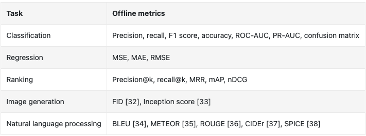
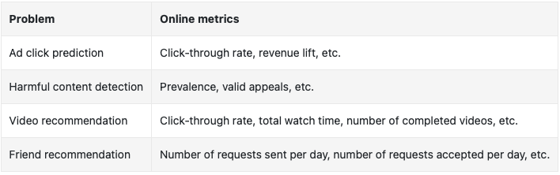
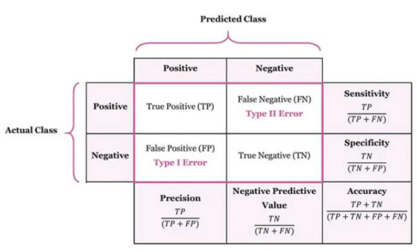

# Testing and Metrics

* Metrics
  * [Source](https://bytebytego.com/courses/machine-learning-system-design-interview/introduction-and-overview)
  * [Source](https://bytebytego.com/courses/machine-learning-system-design-interview/introduction-and-overview)
  * Details
    * Classification
      * [Source](https://www.researchgate.net/publication/381097743_ECG_Classification_System_based_on_time_Domain_Features_with_Least_Square_Support_Vector_Machine_LS-SVM)
      * Additionally, we have the following definitions:
        * Recall = TPR = Sensitivity
        * FPR = 1 - Specificity 
      * In cases where both precision and recall are equally important, we can try to optimize $F_1=2 * \frac{\text { precision * recall }}{\text { precision + recall }}$
      * AUROC (Area under Receiver Operator Characteristic)
        * The ROC curve plots TPR vs FPR, for varying "thresholds" of what constitutes a change in classification.
      * Another common curve is the precision-recall curve.
      * Cross-Entropy loss: 
        * $Loss =-\frac{1}{n}\sum_i\sum_k [y_{ik}\log(\hat{p}_{ik})$], where $y_i \in \mathbb{R}^k$ takes a one-hot encoding form and $\hat{p}_i$ represents our predictions for this data point.
        * In the binary form, $-\frac{1}{n}\sum_i (y_i\log(\hat{p}_{i}) + (1-y_i)\log(1-\hat{p}_{i}))$
        * Normalized: $\frac{CE}{-(p\log(p) + (1-p)\log(1-p))}$, where $p$ is the average probability over the training set. 
          * 0 is perfect, <1 is better than predicting average. 
        * Weight rare samples more with focal loss: Instead of $-\log(p)$, do $-(1-p)^\gamma \log(p)$.
    * Losses
      * Huber Loss: MSE if error is small, if not use MAE
      * Quantile loss: $L(\hat{y}, y) = \max(q(y - \hat{y}), (q-1)(y - \hat{y}))$
      * Hinge loss
    * Forecast problems:
      * Mean Absolute Percentage Error: $100 \frac{1}{n} \sum_{n=1}^n\left|\frac{A_k-F_5}{A_4}\right|$
      * Symmetric MAPE: $\frac{100}{n} \sum_{t=1}^n \frac{\left|F_t-A_t\right|}{\left(\left|A_t\right|+\left|F_t\right|\right) / 2}$
    * Ranking
      * Mean Reciprocal Rank (MRR): $\frac{1}{n} \sum_i^n \frac{1}{rank_i}$ Average of the reciprocal of the first/top relevant item 
      * Mean Average Precision (mAP): $\frac{1}{nk}\sum_{ik}(P@k_i)$ 
      * Normalized Discounted Cumulated Gain (nDCG):
        * DCG: $\sum_i^n \frac{rel_i}{\log_2(i+1)}$
        * nDCG: $\frac{DCG}{Ideal DCG}$
    * Image generation
      * FID: $d_F\left(\mathcal{N}(\mu, \Sigma), \mathcal{N}\left(\mu^{\prime}, \Sigma^{\prime}\right)\right)^2=\left\|\mu-\mu^{\prime}\right\|_2^2+\operatorname{tr}\left(\Sigma+\Sigma^{\prime}-2\left(\Sigma \Sigma^{\prime}\right)^{\frac{1}{2}}\right)$
      * Inception score: $I S\left(p_{\text {gen }}, p_{\text {dis }}\right):=\exp \left(\mathbb{E}_{x \sim p_{g e n}}\left[D_{K L}\left(p_{\text {dis }}(\cdot \mid x) \| \int p_{\text {dis }}(\cdot \mid x) p_{g e n}(x) d x\right)\right]\right)$
    * NLP
      * BLEU: $p_n(\hat{S} ; S):=\frac{\sum_{i=1}^M \sum_{s \in G_n\left(\hat{y}^{(i)}\right)} \min \left(C\left(s, \hat{y}^{(i)}\right), \max _{y \in S_i} C(s, y)\right)}{\sum_{i=1}^M \sum_{s \in G_n\left(\hat{y}^{(i)}\right)} C\left(s, \hat{y}^{(i)}\right)}$ (comparing translated sentence and reference sentence). Intelligibility/grammatical correctness is not taken into account.  
      * METEOR: Maps unigrams in candidate and reference. Idea is to increase score with more matches, and penalize chunks, where chunks are defined as a set of unigrams that are adjacent in the candidate and in the reference.
      * ROUGE: Overlap of n-grams between candidate and reference. 
      * CIDEr: 
        * Uses TF-IDF to weight n-grams
        * Computes the cosine distance between candidate and reference sentence
      * SPICE: 
        * Deals with image labeling.
        * Is an F1 score, where we're matching the number of tuples in the actual and predicted labels. 
    * Some other terms (that can be used both in/out of binary classification)
      * The **p-value** is the probability of observing the value of the calculated test statistic under the null hypothesis assumptions. We usually compare the observed p-value to a chosen level of alpha.
      * Alpha: The probability of a type 1 (false positive) error := 1 - Confidence Level.
      * Beta: The probability of a type 2 (false negative) error := 1 - Power. With higher power, we generally get higher sensitivity/recall. However, we get lower specificity.
* Tests
  * z-test
    * We use the z-test when the population variance $\sigma^2$ is known. 
    * Formally, due to CLT, we say that $z = \frac{\bar{x}-\mu_0}{\sigma/\sqrt{n}} \sim \mathcal{N}(0,1)$
  * Student's t-test
    * We use the t-test when the population variance $\sigma^2$ is unknown, and instead estimate this with $s^2$
    * $t = \frac{\bar{x}-\mu_0}{s/\sqrt{n}} \sim t_{n-1}$
  * Welch's t-test
    * [Welch's t-test](https://en.wikipedia.org/wiki/Welch%27s_t-test) is used when the two samples have unequal variance. 
  * Chi-squared test statistic
    * This is often used in the analysis of contingency tables to see whether two categorical variables are independent of each other.
    * Importantly, we say that $\sum_i \frac{(O_i-E_i)^2}{E_i} \sim \chi^2,$ and [this example](https://en.wikipedia.org/wiki/Chi-squared_test#Example_chi-squared_test_for_categorical_data) is particularly instructive for how we might use this.
  * ANOVA 
    * In a one-way ANOVA, the F-statistic the ratio {variation between sample means}/{variation within the samples}. When the variation between sample means is higher than expected (where the denominator is an estimator for the amount of noise), we reject the null hypothesis that all means are the same. 
    * In a two-way ANOVA, instead of having one categorical variable, we now have two. 
* Multiple Hypothesis Testing
  * When $m > 1$ tests are done, the probability of rejecting the null hypothesis by chance alone can be too high. This is because the significance of individual tests do not represent the Family-Wise Error Rate (FWER).
  * Various correction techniques exist to reduce false positives, but we note that these naturally reduce power.
  * Bonferroni correction: Change $\alpha = \alpha_0 /m $. This is often criticized as being too conservative, so we have other forms of correction: 
  * Šidák correction: $\alpha = 1 - (1-\alpha_0)^{1/m}$
  * Holm-Bonferroni correction:
    * Sort the $m$ p-values, and if $p_i \leq \frac{\alpha_0}{m+1-k}$, we reject $H_i$
    * This applies early stoppage, so the moment we do not reject $H_i$, all subsequent hypotheses are not rejected too.
* Model Statistics
  * Overfitting
    * To combat overfitting, we can use cross-validation and compare training and validation curves
    * AIC ($2k - 2\ln (\hat{L})$) and BIC ($k\ln n - 2\ln (\hat{L})$) are ways to tradeoff training performance and model complexity ($k$ is the number of estimated parameters).
* Cross-Validation
  * Cross-Validation is used for hyperparameter selection. When evaluating on a test set, we get an expectation for how a model performs for a given set of hyperparameters. 
    * If we were critical of the _way_ we picked hyperparameters, then there is indeed a chance that another set of hyperparameters is "better", but didn't get selected due to our CV methodology - enter Nested CV.
  * Nested CV is used for evaluation. Here, in each outer loop, a different set of hyperparameter selection is used. This therefore says that the model being evaluated includes the method of selecting hyperparameters. 