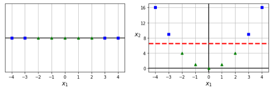

# Support Vector Machines

- SVMs are often used for binary classification problems. For convention, we assume $y_i \in \{-1, 1\}$.
- The prediction for a point $\mathbf{x} \in \mathbb{R}^p$ is given by $\operatorname{sign}(\pmb{\lambda}^{\top}\mathbf{x}+\lambda_0)$
  - Geometrically, $\pmb{\lambda}$ and $\lambda_0$ define a hyperplane in $\mathbb{R}^{p+1}$, where points on different sides are classified as 1 and -1.
- Support Vectors
  - $\pmb{\lambda} = \sum_i \alpha_iy_i\mathbf{x_i^{\top}}, \alpha_i \geq 0$. This hyperplane is determined by the "support vectors" $\mathbf{x_i}$ for which $\alpha_i > 0$. The number of these vectors typically $\ll n$.
  - Another interpretation is that a prediction is the weighted sum of $y_i\mathbf{x_i^{\top}x}$, where $y_i$ conveys class information and $\mathbf{x_i^{\top}x}$ is the similarity between points
  - Note that the _only_ parameters to estimate are therefore $\pmb\alpha$ and $\lambda_0$. 
- Pros and Cons
  - Pros:
    - Works well when data is linearly separable, or linearly separable in a higher dimension
  - Cons:
    - Long training time, and possibly long-ish inference time if kernel is used
    - Separability is harder with larger data sets
    - Less interpretable than other models
- The prospective reader is encouraged to check out [Lagrangian and KKT Conditions](../01_linear_algebra_and_calculus/notes.md) before continuing.

## Hard Margin SVMs

- Hard margin SVMs assumes that the data is linearly separable and tries to maximize the distance between the hyperplane $\pmb\lambda^{\top}\mathbf{x}+\lambda_0$ and the point closest to it. 
- The support vectors are the points that are the minimum distance to this boundary. 
- For this reason, feature scaling _does_ affect the hyperplane chosen (thinking through a 3 point example [(0,0), (0.5, 1), (1,0)] should show us changing support vectors as we scale the x-axis).
- Jumping ahead, we have the following solution for $\hat{\pmb\alpha}$ and $\hat{\lambda_0}$:
  - $\hat{\pmb\alpha} = \operatorname{argmax}_{\pmb\alpha}\mathcal{L}(\pmb{\alpha}), \mathcal{L}(\pmb{\alpha})=\sum_{i=1}^n \alpha_i-\frac{1}{2} \sum_{i, k} \alpha_i \alpha_k y_i y_k \mathbf{x}_i^T \mathbf{x}_k \quad$ s.t. $\quad\left\{\begin{array}{l}\alpha_i \geq 0 \quad i=1 \ldots n \\ \sum_{i=1}^n \alpha_i y_i=0\end{array}\right.$
  - $\hat{\pmb{\lambda}}=\sum_{i=1}^n \hat{\alpha}_i y_i \mathbf{x}_i$
  - $\hat{\lambda_0} = 1 - \hat{\pmb\lambda}^{\top}\mathbf{x_i}$, where $\mathbf{x_i}$ is a positive support vector. 
- Proof:
  - We want to maximize the margin $\operatorname{min}_i \left( y_i(\pmb\lambda^{\top}\mathbf{x}+\lambda_0) \right)$
  - Equivalently, we can set the margin to be 1 and minimize $||\pmb\lambda||_2$:
  - $\min _{\pmb\lambda, \lambda_0} \frac{1}{2}\|\pmb{\lambda}\|_2^2 \quad$ s.t. $\quad-y_i\left(\pmb{\lambda}^T \mathbf{x}_i+\lambda_0\right)+1 \leq 0 \quad i=1 \ldots n$
  - Which permits the lagrangian $\mathcal{L}\left(\left[\pmb{\lambda}, \lambda_0\right], \pmb{\alpha}\right)=\frac{1}{2} \sum_{j=1}^p \lambda_j^2+\sum_{i=1}^n \alpha_i\left[-y_i\left(\pmb{\lambda}^T \mathbf{x}_i+\lambda_0\right)+1\right]$.
  - Switching to the dual to solve for $\pmb{\alpha}$, we get the following equations:
    - $\pmb{\lambda}=\sum_{i=1}^n \alpha_i y_i \mathbf{x}_i$, from $\nabla_\lambda \mathcal{L}\left(\left[\pmb{\lambda}, \lambda_0\right], \pmb{\alpha}\right)$
    - $\sum_{i=1}^n \alpha_i y_i=0$ from $\frac{\partial}{\partial \lambda_0} \mathcal{L}\left(\left[\pmb{\lambda}, \lambda_0\right], \pmb{\alpha}\right)$
    - $\alpha_i \geq 0$
  - Plugging these back into the dual form of the Lagrangian yields our solution
- Optimization - How do we _actually_ solve for $\alpha_i$?
  - We usually use quadratic programming solvers, such as Sequential Minimal Optimization, that iteratively solves for $\alpha_i, \alpha_j$ simultaneously.
  - The runtime complexity of SVMs is around $O(n^2)$ to $O(n^3)$. 
- Note on support vectors:
  - Note that the complementary slackness condition $\alpha_i\left[-y_i\left(\pmb{\lambda}^T \mathbf{x}_i+\lambda_0\right)+1\right]$ means that:
    - If a point is not on the boundary, it is not a SV
    - If a point is an SV, it is on the boundary
    - **_However, if a point is on the boundary, it may not be an SV_**

## Soft Margin SVMs
- Soft margin SVMs do not require linear separability. In addition, this can help our hyperplane be more robust to outliers. 
- Jumping ahead, we have the following solution:
  - $\hat{\pmb\alpha} = \operatorname{argmax}_{\pmb\alpha}\mathcal{L}(\pmb{\alpha}), \mathcal{L}(\pmb{\alpha})= \sum_{i=1}^n \alpha_i-\frac{1}{2} \sum_{i, k=1}^n \alpha_i \alpha_k y_i y_k \mathbf{x}_i^T \mathbf{x}_k \quad$ s.t. $\quad\left\{\begin{array}{l}0 \leq \alpha_i \leq C \quad i=1 \ldots n \\ \sum_{i=1}^n \alpha_i y_i=0\end{array}\right.$
  - $\hat{\pmb{\lambda}}=\sum_{i=1}^n \hat{\alpha}_i y_i \mathbf{x}_i$
  - $\hat{\lambda_0} = 1 - \hat{\pmb\lambda}^{\top}\mathbf{x_i}$, where $\mathbf{x_i}$ is a positive support vector with $0 < \alpha_i < C$.
- Proof:
  - We edit our primal problem to $\min _{\lambda_1, \lambda_0, \xi} \frac{1}{2}\|\pmb{\lambda}\|_2^2+C \sum_{i=1}^n \xi_i$ s.t. $\quad\left\{\begin{array}{l}y_i\left(\pmb{\lambda}^T \mathbf{x}_i+\lambda_0\right) \geq 1-\xi_i \\ \xi_i \geq 0\end{array}\right.$
  - This permits the lagrangian $\mathcal{L}\left(\pmb{\lambda}, \lambda_0, \xi, \pmb{\alpha}, \mathbf{r}\right)=\frac{1}{2}\|\pmb{\lambda}\|_2^2+C \sum_{i=1}^n \xi_i-\sum_{i=1}^n \alpha_i\left[y_i\left(\pmb{\lambda}^T \mathbf{x}_i+\lambda_0\right)-1+\xi_i\right]-\sum_{i=1}^n r_i \xi_i$
  - Switching to the dual, we get the same equations as the Hard Margin SVM, with the following additions:
    - $\mathbf{r}=C-\pmb{\alpha}$, from $\nabla_{\xi} \mathcal{L}\left(\left[\pmb{\lambda}, \lambda_0, \xi\right], \pmb{\alpha}, \mathbf{r}\right)$
    - $r_i \geq 0$
  - Which when plugged into our dual form of the Lagrangian yields our solution
  - Now getting $\hat{\lambda_0}$ is slightly more tricky, where we should now look for support vectors with $0 < \alpha_i < C$, which due to complementary slackness ensures that $\xi_i = 0$. 
- If $\xi_i \geq 1,$ the point is misclassified.
- Every point within the margin (including those that are misclassified) are support vectors:
  - $\xi_i > 0 \rightarrow r_i = 0 \rightarrow \alpha_i = C$

## Kernel Trick

- Kernel Regression
  - Kernel regression uses a kernel as a weighting function: $\operatorname{pred}(x) = \frac{\sum_i y_ik(x, x_i)}{\sum_i k(x, x_i)}$
  - Note that this is similar to what we're doing, where $\pmb{\lambda}^{\top}\mathbf{x}+\lambda_0 = \sum_{i=1}^n \alpha_i y_i \mathbf{x}_i^{\top}\mathbf{x}+\lambda_0$
  - The intuition of kernel methods is to map the points to a higher dimensional space to more easily separate the data.
  - [Source](https://behesht.medium.com/support-vector-machies-part1-classification-fc1cc382b8a4)
- Back to SVM: Note that when solving for $\hat{\pmb\alpha}$, we see the equation $\mathcal{L}(\pmb{\alpha})= \sum_{i=1}^n \alpha_i-\frac{1}{2} \sum_{i, k=1}^n \alpha_i \alpha_k y_i y_k \mathbf{x}_i^T \mathbf{x}_k$
- The kernel trick replaces $\mathbf{x}_i^T \mathbf{x}_k$ with $k(\mathbf{x}_i, \mathbf{x}_k) = \phi(\mathbf{x_i})^{\top}\phi(\mathbf{x_k})$. 
- We then solve for a new $\hat{\pmb\alpha}$, which we use to solve for a new $\hat{\lambda_0} = 1 - \sum_i \hat{\alpha}_i y_i k(\mathbf{x_i}, \mathbf{x_{sv}})$
- Prediction on a new point $\mathbf{x}$ = $\operatorname{sign}(f(\mathbf{x})),$ where $f(\mathbf{x})= b + \sum_i^n\alpha_ik(\mathbf{x_i, x})$
  - Why is this useful?
    - It enables us to learn models that are nonlinear as a function of $\mathbf{x}$ using convex optimization techniques that are guaranteed to converge efficiently. 
    - The kernel function $k$ admits an implementation that is significantly more computationally efficient than first constructing the $\phi(\mathbf{x})$ vectors.
  - The Gaussian kernel can be thought of increasing the weight of points close (in terms of Euclidean distance) to $\mathbf{x}$.
- A drawback here is that for _every_ prediction, we need to consider all the training samples.
  - However, if most $\alpha_i = 0$, our computation is sped up significantly.

## Support Vector Regressions
- Support Vector Regressions similarly minimizes $\frac{1}{2}\|B\|_2^2$, but now subject to $|y_i - (\mathbf{B^{\top}} + B_0)| \leq \epsilon$.
- In the "soft margin" case, we add two slack variables such that:
  - $|y_i - (\mathbf{B^{\top}} + B_0)| \leq \epsilon + \xi_n$
  - $|(\mathbf{B^{\top}} + B_0) - y_i| \leq \epsilon + \xi_n^*$
- Conceptually, the points that have an error larger than $\epsilon$ are now our support vectors, and unlike linear regression where we minimize the squared loss, we're now minimizing the L1 norm of these errors. 
- More details can be found on [mathworks](https://www.mathworks.com/help/stats/understanding-support-vector-machine-regression.html).