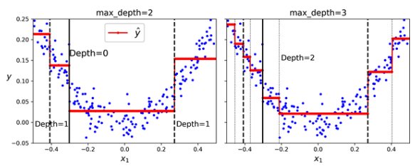

# Decision Trees

- Decision trees are versatile algorithms that can perform both classification and regression tasks.
- At a high level, decision trees iteratively make splits that maximize information gain / reduce entropy. 
- Doing so excessively has a high propensity for the model to overfit, so a tree would need to employ regularization to combat this. 
- Computational Complexity
  - Supposing we have $n$ samples and $m$ nodes, training is generally $O(nm\log m)$ and inference is $O(\log m)$.
- Sensitivity to Axis Orientation
  - We can only split based on input features and in some circumstances, a change of basis may be appropriate. 
- Invariant to feature scaling / centering.
- High Variance
  - Trees can change drastically based on hyperparameter choice (Scikit-Learn also naturally incorporates stochasticity). One method of combating this is with [Random Forests](../10_ensemble_learning/notes.md).
- Two common algorithms used here are C4.5 and CART. 

## Information Gain
- Cost Function
  - At each node, a tree will decide to split feature $k$ along threshold $t_k$ in a way to minimize it's cost function:
  - $\mathcal{L}(k, t_k) = \frac{n_{left}}{n}H_{left} + \frac{n_{left}}{n}H_{right}$, where $n$ denotes the number of samples and $H$ is a measure of entropy.
  - C4.5 uses the classic Entropy as $H$, while CART uses Gini Impurity as $H$. 
    - Ultimately, these metrics increase with increasing uncertainty in each subtree - the more "evenly split" the samples are across classes, the more the entropy. 
    - Gini impurity is _slightly_ faster to compute, but there shouldn't be a large difference between the two metrics.
    - When the methodologies do differ, Gini impurity tends to be more prone to isolating frequent classes into its own subtree, while Entropy produces more balanced trees. 
  - [Rudin's notes](https://users.cs.duke.edu/~cynthia/CourseNotes/DecisionTreeNotes.pdf) are particularly instructive for how splitting works.
- Entropy
  - $H(\mathbf{p}) = -\sum_i p_i\log(p_i)$
- Gini Impurity
  - $H(\mathbf{p}) = 1 - \sum_i p_i^2$

## Regularization 
### Pruning
- CART
  - CART uses "minimal cost complexity", where it eliminates a subtree if it doesn't reduce the error rate enough relative to the number of leaves.
  - $\mathcal{L}(k, t_k) = \sum_{\text {leaves } j} \sum_{x_i \in \text { leaf } j} \mathbf{1}_{\left[y_i \neq \text { leaf's class }\right]}+C[\#$ leaves in subtree $]$
- C4.5
  - C4.5 uses "upper bound estimation", where it eliminates/replaces a subtree (with its most common branch) if it doesn't reduce the upper bound enough. 
  - What does "upper bound" mean?
    - As we increase the number of nodes, our misclassification error decreases. 
    - However, with fewer samples, our _estimate_ of our misclassification error is now more uncertain. 
    - I.e. as we keep splitting, we trading off lower variance for lower bias.
    - Instead, we can ask, what's the upper bound of what the misclassification error could be? Even if a split reduces the mean error, but fails to reduce this upper bound, it is reasonable to not split. 
    - Concretely, in a binary classification problem, we can find the highest $p$ such that the observed misclassification error has a significance level of a pre-chosen $\alpha$. 
    - Again, [Rudin's notes](https://users.cs.duke.edu/~cynthia/CourseNotes/DecisionTreeNotes.pdf) are very instructive here.
### Hyperparameters
- A simpler way to reduce model capacity would be to reduce properties like max_depth, max_features, max_leaf_nodes, min_samples_split, min_samples_leaf, etc. 
## Regression
- While we have focused on the classification problem, trees can also output continuous values, where the value for each leaf is the same. 
- 
- CART
  - Essentially, we replace entropy and misclassification error with MSE. 
  - For splitting, we greedily choose feature $j$ and split point $s$ solving
    - $\min _{\substack{j, s \\ \text { for each feature } j \text { do } \\ \text { a linesearch over } s}}\left[\min _{C_1} \sum_{x_i \in\left\{\text { leaf } \mid x^{(j)} \leq s\right\}}\left(y_i-C_1\right)^2+\min _{C_2} \sum_{x_i \in\left\{\text { leaf } \mid x^{(j)}>s\right\}}\left(y_i-C_2\right)^2\right]$
  - For pruning, we do
    - $\operatorname{cost}=\sum_{\text {leaves } j} \sum_{x_i \in S_j}\left(y_i-\bar{y}_{S_j}\right)^2+C[\#$ leaves in tree $]$