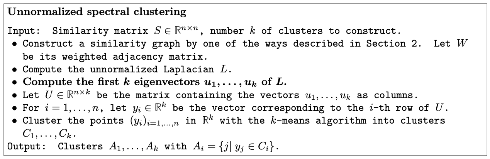

# Unsupervised Clustering

- Active Learning
  - Unsupervised tasks often rear their head when labelling is expensive. 
  - Active learning is when a human interacts with a learning algorithm. One such example is uncertainty sampling, where a human iteratively labels the samples that a model is most uncertain about. 
- K-means
  - K-means initializes with $k$ clusters and assigns each $\mathbf{x}_i$ to a cluster, aiming to minimize the distance from every point to the centroid of it's cluster.
  - Algorithm:
    - Initialize $k$ centers randomly. 
    - Assign each point to the center closest to it. 
    - Update the center to the centroid of all points assigned to it. (Which corresponds if our loss is the sum of squared distances between points and their centers)
    - Repeat from step 2 until converge.
  - To pick $k$
    - We can plot the loss versus $k$ and use the "elbow" method.
    - Alternatively, we can look at the average silhouette score
      - The silhouette score for a datapoint $\mathbf{x}$ is given by $\frac{b-a}{\max(a,b)},$ where $a$ is the average distance between $\mathbf{x}$ and points within its cluster, and $b$ is its distance to the nearest point that is not in its cluster.
      - The higher the silhouette score the better. Points well inside a cluster will have a score of 1 and those near the edges would have -1. 
  - K-means may sometimes have high variance and be sensitive to initialization. 
  - K-means also considers distance in the euclidean space, i.e. clusters are circular.
- DBSCAN works as follows (per [Géron](https://www.amazon.com/Hands-Machine-Learning-Scikit-Learn-TensorFlow/dp/1098125975)):
  - For each instance, the algorithm counts how many instances are located within a small distance ε (epsilon) from it. This region is called the instance’s 
ε-neighborhood.
  - If an instance has at least min_samples instances in its ε-neighborhood (including itself), then it is considered a core instance. In other words, core instances are those that are located in dense regions. 
  - All instances in the neighborhood of a core instance belong to the same cluster. This neighborhood may include other core instances; therefore, a long sequence of neighboring core instances forms a single cluster. 
  - Any instance that is not a core instance and does not have one in its neighborhood is considered an anomaly.
- Spectral Clustering
  - We quote an [_excellent_ tutorial on Spectral Clustering](https://people.csail.mit.edu/dsontag/courses/ml14/notes/Luxburg07_tutorial_spectral_clustering.pdf)
  - 
  - The linked article elaborates how this is related to the RatioCut problem.
    - A key piece of intuition is that $U_{ik} > 0$ implies that the $i^{th}$ datapoint is likely to belong to the $k^{th}$ cluster. 
- Gaussian Mixture Models and Expectation Maximization
  - GMMs is a "soft" clustering algorithm were each point probabilistically "belongs" to all clusters.
  - It is a generative model, where if we want to generate a point from a cluster, we would draw from a multivariate Gaussian. This permits elliptical clusters.
  - Model
    - Terminology
      - We have $n$ points $\mathbf{X}_i$ and $K$ clusters
      - $Z_i \in \{1, 2, \ldots, K\}$ is the cluster assignment for $\mathbf{X}_i$.
      - $\mathbf{w} \in \mathbb{R}^K$ are mixture weights such that $\sum_i w_i = 1$.
    - $Z_i \mid \mathbf{w} \sim \operatorname{Categorical}(\mathbf{w})$
    - $X_i \mid Z_i = k \sim \mathcal{N}(\pmb\mu_k, \pmb\Sigma_k)$
  - MLE:
    - Let the collection of $w_i$s, $\pmb\mu_i$s and $\pmb\Sigma_i$s be termed as $\pmb\theta$. 
    - $\log \operatorname{likelihood} (\pmb\theta) = \sum_i \log \sum_k P(\mathbf{X}_i = \mathbf{x}_i, Z_i = k \mid \pmb \theta) = \sum_i \log \sum_k [\gamma_{ik\pmb\theta_t}\frac{P(\mathbf{X}_i = \mathbf{x}_i, Z_i = k \mid \pmb \theta)}{\gamma_{ik\pmb\theta_t}}]$
      - $\gamma_{ik\pmb\theta_t} := P(Z_i = k \mid \mathbf{X}_i = \mathbf{x}_i, \pmb\theta_t)$
    - Auxiliary Function
      - We now specify an Auxiliary Function $A(\pmb\theta, \pmb\theta_t) \leq \log \operatorname{likelihood} (\pmb\theta)$
      - $A(\pmb\theta, \pmb\theta_t) = \sum_i \sum_k [\gamma_{ik\pmb\theta_t} \log \frac{P(\mathbf{X}_i = \mathbf{x}_i, Z_i = k \mid \pmb \theta)}{\gamma_{ik\pmb\theta_t}}]$
        - This is a lower bound due to Jensen's inequality. Intuition: since $\log$ is a concave function, $\log(\sum_i (a_ib_i)) \leq \sum_i (a_i \log b_i)$ where $\sum_i a_i = 1$ (weighted sum).
      - Note too that $A(\pmb\theta_t, \pmb\theta_t) = \log \operatorname{likelihood} (\pmb\theta_t)$ ([Proof](https://users.cs.duke.edu/~cynthia/CourseNotes/GMMEMNotes.pdf)).
    - EM
      - The EM algorithm allows us to find $\arg\max_{\pmb\theta} \log \operatorname{likelihood} (\pmb\theta)$ by iteratively updating $\pmb\theta_t$.
      - Intuition:
        - Suppose we start with $\pmb\theta_t$
        - Find $\pmb\theta_{t+1} = \arg\max_{\pmb\theta} A(\pmb\theta, \pmb\theta_t)$.
        - Then $\log \operatorname{likelihood} (\pmb\theta_t) \leq A(\pmb\theta_t, \pmb\theta_t) \leq A(\pmb\theta_{t+1}, \pmb\theta_t) \leq \log \operatorname{likelihood} (\pmb\theta_{t+1})$
        - [Source](https://people.duke.edu/~ccc14/sta-663-2016/14_ExpectationMaximization.html)
        - Note that we are not guaranteed to find the global maxima. 
      - E-step: Compute $\gamma_{ik\pmb\theta_t}$. 
        - $P(Z_i = k \mid \mathbf{X}_i = \mathbf{x}_i, \pmb\theta_t) = \frac{P(\mathbf{X}_i = \mathbf{x}_i \mid Z_i = k, \pmb\theta_t) P(Z_i = k \mid \pmb\theta_t)}{P(\mathbf{X}_i = \mathbf{x}_i \mid \pmb\theta_t)} = \frac{w_{kt}\mathcal{N}(\mathbf{x}_i ; \pmb\mu_{kt}, \pmb\Sigma_{kt})}{\sum_{k'}w_{k't}\mathcal{N}(\mathbf{x}_i ; \pmb\mu_{k't}, \pmb\Sigma_{k't})}$
      - M-step: Find $\pmb\theta_{t+1}$ and set $\pmb\theta_t = \pmb\theta_{t+1}$. 
        - Permit some abuse of notation where we now set $\gamma{ikt} := \gamma_{ik\pmb\theta_t}$
        - Skipping derivation steps where we differentiate $A(\pmb\theta, \pmb\theta_t)$ (or the Lagrangian for $\mathbf{w}_t$), we get
        - $\pmb\mu_{k, t+1} = \frac{\sum_i(\gamma_{ikt}\mathbf{x}_i)}{\sum_i \gamma_{ikt}}$ (Centroid of points, weighted by probability of each point being in said cluster)
        - $\pmb\Sigma_{k, t+1} = \frac{\sum_i(\gamma_{ikt}(\mathbf{x}_i - \pmb\mu_{k, t+1})(\mathbf{x}_i - \pmb\mu_{k, t+1})^{\top})}{\sum_i \gamma_{ikt}}$  (Sample variance of points wrt cluster center, weighted by probability of being in said cluster)
        - $w_{k', t+1} = \frac{\sum_i \gamma_{ik't}}{n}$ (Summed probability of each point belonging to cluster $k'$)
  - GMMs can be used for anomaly detection, where low probability points are likely outliers. 
  - Bayesian Gaussian Mixture Models can also allow us to form a posterior over the number of clusters needed, rather than have $K$ be a hyperparameter to tune. 
  - Computational Complexity: Due to the relatively slow speed of convergence, one may use k-means to initialize starting points and number of clusters. 
    - Number of clusters can also be chosen with other metrics like AIC and BIC. 