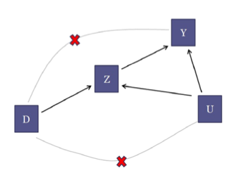

# Causal Inference

Note: This was written with reference to [Li's notes](https://www2.stat.duke.edu/~fl35/CausalInferenceClass.html). I've recently found [Alves' book](https://matheusfacure.github.io/python-causality-handbook/landing-page.html) to be very digestible (and fun to read!), and am hoping to rewrite this page at some point.

## Setup
- $Z$: Treatment. For now we will mostly focus on binary treatments (A/B Testing)
- $Y$: Outcome
- $X$: Observed covariates or confounders
- $U$: Unobserved covariates or confounders
- Estimands:
  - Average Treatment Effect: $\tau^{ATE} = \mathbb{E}[Y_i(1)-Y_i(0)]$ across samples $i$.
  - Average Treatment Effect For Treated: $\tau^{ATT} = \mathbb{E}[Y_i(1)-Y_i(0) \mid Z_i = 1]$.
  - Average Treatment Effect For Control: $\tau^{ATC} = \mathbb{E}[Y_i(1)-Y_i(0) \mid Z_i = 0]$.
  - $\tau^{ATE} = P(Z_i = 1)\tau^{ATT} + P(Z_i = 0)\tau^{ATC}$

## Common Assumptions
- SUTVA
  - No Interference: $\mathbb{E}[Y_i(z) \mid Z_{j, j\neq i}] = \mathbb{E}[Y_i(z)]$
    - Violating examples:
      - Vaccination: If others are vaccinated, the usefulness of vaccination to an individual decreases.
      - App UI: Suppose you display a sale larger, and an item sells out. Then displaying a sale larger no longer does anything. 
  - Consistency: there are no different versions of a treatment. 
- Ignorability / Unconfoundedness
  - $P(Z_i = 1 \mid X_i, Y_i(0), Y_i(1)) = P(Z_i = 1 \mid X_i)$

## Overview
- Causal Inference is a missing data issue: We can observe at most one of the potential outcomes for each unit, the other(s) are missing.
- Due to this, care must be taken when setting up experiments and during inference.
- Experiments
  - Randomized: Assignment mechanism is known, controlled, and random (stronger than unconfoundedness)
  - Observational studies: Assignment mechanism is unknown and uncontrolled, but often assumed to be unconfounded conditional on observed covariates or unobserved quantities. 
  - Natural/quasi-experiments: Assignment mechanism is known, controlled, but not random. 
- Inference
  - Two overarching schools of thought:
    - Imputation: Impute the missing potential outcomes
    - Weighting: Weight the observed data to represent a target population 

## Randomized Experiments
- Randomized Experiments implies unconfoundedness. 
- $\tau^{ATE} = \tau^{ATT} = \tau^{ATC}$ 
- Covariates can be imbalanced by chance, and this increases the variance of our estimator. 
  - Again, we have two options:
    - Design better experiments: stratified randomized experiments, paired randomized experiments, rerandomization
    - Or correct imbalance in analysis
      - Model-based Imputation, e.g. Regression (ANCOVA): 
        - $Y_i = \beta_0 + \beta_1Z_i + \beta_2X_i + \epsilon_i $. We can account for covariate imbalance with the $X_i$ term.
        - For a more efficient estimator, we should also add interaction effects of $X$ and $Z$. Remember to center $X$ so that we can directly use the estimated coefficient for $Z$!
      - Propensity Score Weighting (See Observational Studies)

## Observational Studies
- Required Assumptions
  - Unconfoundedness
    - Within subpopulations defined by values of observed covariates, the treatment assignment is random
  - Overlap
    - $0 < P(Z_i = 1 \mid X_i) < 1$ for all $i$. 
    - $e(x) = P(Z_i = 1 \mid X_i)$ is called the propensity score.
    - For all possible values of the covariates, there are both treated and control units. Suppose you never treated anyone from Singapore, how will you estimate the ATE on Singaporeans? 
- ATE Estimation Strategies
  - Intuition
    - One natural thing to do is to take the mean outcome of the treatment group minus the mean outcome of the control group. 
    - This is problematic because there may be covariate imbalance between the two groups, and this covariate may change the ATE. 
    - The key intuition is to then control for this covariate imbalance. 
  - Outcome Modeling
    - Fit a regression model to observed data and estimate the outcome for when each $X_i$ receives treatment, $\hat{\mu}_1(X_i)$ (and vice versa).
    - $\tau^{reg} = \frac{1}{N}\sum_i^N \left[ Z_i(Y_i - \hat{\mu}_0(X_i)) + (1-Z_i)(\hat{\mu}_1(X_i) - Y_i)\right]$
      - When we have the data, use it, and when we don't, impute it with the regression model. 
    - We're controlling for the covariate imbalance by directly modeling its influence.
    - Imputation methods
      - Outcome Modeling is one sort of imputation technique we can use. There exists others, e.g. matching where we impute outcomes based on nearest neighbors.
  - Inverse Probability Weighting
    - $\tau^{ipw} = \frac{\sum_i^N Z_iY_i/\hat{e}(X_i)}{\sum_i^N Z_i/\hat{e}(X_i)} - \frac{\sum_i^N (1-Z_i)Y_i/\{1-\hat{e}(X_i)\}}{\sum_i^N (1-Z_i)/\{1-\hat{e}(X_i)\}}$
    - Inverse weighting corrects for covariate imbalance by under-weighting subgroups that may be overrepresented in each treatment group.
  - Combining both: Doubly-Robust (DR) estimator
- Extending past linear models
  - Suppose we have many confounders and it is hard to accurately model their impact, especially because they are nonlinear. 
  - Relatedly, how can we incorporate causal principles into more complex algorithms? 
  - [Double Machine Learning](https://matheusfacure.github.io/python-causality-handbook/22-Debiased-Orthogonal-Machine-Learning.html) provides a framework for doing so, and proceeds in 3 steps:
    - $Y$ is our target, $X$ are our covariates and confounders, $T$ is our treatment, $m_i$ are models.
    - Obtain residuals $\tilde{Y} = Y - m_1(X), \tilde{T} = T - m_2(X)$
    - Then our ATE can be estimated with $m_3(X)$, which is trained with $\frac{\tilde{Y}}{\tilde{T}} = m_3(X)$.
- We have _assumed_ unconfoundedness. But what if this fails? For example, there exists unmeasured confounders $U$? 
  - Natural/Quasi-Experiments

## Natural/Quasi-Experiments
- To handle unmeasured confounding, we use instrumental variables (IV), which influence treatment assignment but is independent of unmeasured confounders, and has no direct effect on the outcome except through its effect on treatment.
  - One such instrumental variable is say, the distance from a hospital, when studying the effect of cardiac catheterization on patients suffering a heart attack. 
  - [Source](https://link.springer.com/referenceworkentry/10.1007/978-1-4939-6704-9_7-1)
- A 2 stage regression is appropriate here:
  - Estimate the "unconfounded portion" of $Z_i$, $\hat{Z}_i$
    - $\hat{Z}_i = \hat{\alpha}_0 + \hat{\alpha}_1D_i+\hat{\alpha}_2X_i$
    - $Y_i = \beta_0 + \beta_1\hat{Z}_i+\beta_2X_i + \epsilon_i$
  - The ATE estimate is given by $\hat{\beta}_1$, although the variance estimate here cannot simply be taken from the 2nd regression.
- Noncompliance
  - The IV Approach to Noncompliance assumes that the assigned treatment $D_i$, our IV, is randomly assigned. 
  - Then, the ATE of assignment $D_i$ on outcome $Y_i$ is simply 
    - $E(Y_i \mid D_i = 1) - E(Y_i \mid D_i = 0) = \frac{\sum_i Y_iD_i}{\sum_i D_i} - \frac{\sum_i Y_i(1-D_i)}{\sum_i (1-D_i)}$. 
    - In other words, we disregard compliance information. 
    - Intuitively, this makes sense because compliance properties would still apply when assigning treatment in the future. 
  - Now, however, if we are interested on the ATE of treatment $Z_i$ on outcome $Y_i$ (assuming we forced everyone to take the drug, what's its impact), then we have:
    - $\frac{E(Y_i \mid D_i = 1) - E(Y_i \mid D_i = 0)}{E(Z_i \mid D_i = 1) - E(Z_i \mid D_i = 0)}$
- Discontinuities
  - Consider a pre-treatment variable $D_i$ where the treatment status $Z_i$ changes discontinuously wrt to $D_i$.
    - E.g. An educational program / financial aid
  - Ways to estimate the ATE around this discontinuity include:
    - Continuity: Fit local curves around the threshold and estimate based on cutoffs
    - Local randomization: Find a neighborhood around the threshold and proceed as in a RCT within the neighborhood.

## Difference in Differences
- Suppose we now have temporal effects - $Z_i = 1$ for a subgroup after a certain time $t$ and 0 before.
- One method for ATE estimation is the DiD method, which relies on the parallel trends assumption.
  - Note that DID also permits unobserved confounders to affect assignment as long as their effect is separable and time-invariant. 
  - What happens if these effects are separable but time-varying?
    - Enter synthetic control, which tries to estimate the unobserved $Y_{1t}(0)$ with a weighted sum of the observed outcomes for the control units. 
    - The goal of SC is to find these weights. 