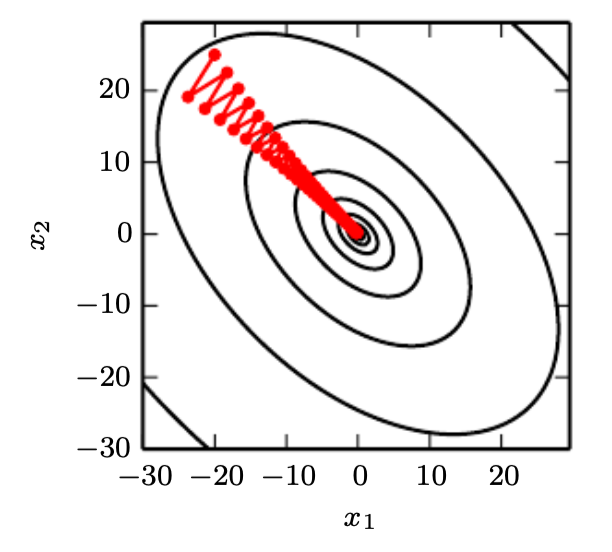

# Optimization and Regularization

## Overfitting / Regularization

- For general notes about regularization, refer to [Statistical Learning Theory](../../classical/03_statistical_learning_theory)
- [Goodfellow](https://www.deeplearningbook.org/contents/regularization.html) defines regularization as “any modification we make to a learning algorithm that is intended to reduce its generalization error but not its training error.”
- This section shall focus on regularization for deep learning, which is pertinent because neural network's expressiveness leave them vulnerable to overfitting.
- Parameter regularization 
  - This is often referred to with the `weight_decay` parameter in PyTorch. 
  - Usually, we leave the basis terms unregularized, since each bias controls only a single variable. This means that we do not induce too much variance by leaving the biases unregularized.
- Early Stopping
- Dropout
  - Training
    - We zero out a fraction of nodes in each layer
    - Debias each layer by normalizing by the fraction of nodes that were retained
  - Evaluation
    - Do not do the zeroing

## First-Order Methods

- GD:
  - $\mathbf{x}_{k+1}=\mathbf{x}_k-\eta \nabla f\left(\mathbf{x}_k\right)$
- Stochastic Gradient Descent (SGD) is mainly done for computational reasons. The expectation of a minibatch is still unbiased.
- Stalling optimization
  - Saddle points
  - Vanishing gradients
- Size of learning rate:
  - Each step of gradient descent is not guaranteed to reduce the loss. 
  - Specifically, it only works because we disregard higher order terms in the Taylor's expansion when the learning rate is small enough.
  - To the extent that the function that we minimize can be approximated well by a quadratic function, 
    - $f(\mathbf{x}-\eta\mathbf{g}) = f(\mathbf{x}) - \eta\mathbf{g^{\top}g}+\frac{1}{2}\eta^2\mathbf{g^{\top}Hg}$, where $\mathbf{g} = \nabla_\mathbf{x}f(\mathbf{x})$
    - Optimal step size when $\mathbf{g^{\top}Hg} \geq 0$, $\eta^* = \frac{\mathbf{g^{\top}g}}{\mathbf{g^{\top}Hg}}$
    - In the worst case when $\mathbf{g}$ aligns with the corresponding eigenvector, $\eta^* = \frac{1}{\lambda_{max}}$
    - [Goh's article](https://distill.pub/2017/momentum/) talks more about the connection of GD with eigenvectors
      - The error of the initial guess can be decomposed into $p$ vectors (errors) in the $Q$-basis, where $Q$ are the eigenvectors of $\mathbf{H}$.
      - Each of these errors follows its own, solitary path to the minimum, decreasing exponentially with a compounding rate of (1- $\eta\lambda_i$)
      - This places constraints on $\eta$, and gives 
        - Optimal $\eta = \frac{2}{\lambda_{min} + \lambda_{max}}$ (The formula here is different because we no longer assume that the gradient is along the direction of the eigenvector associated with $\lambda_{max}$)
        - Optimal rate $ = \frac{\lambda_{max}/\lambda_{min}-1}{\lambda_{max}/\lambda_{min}+1}$
          - Hence, Hessians with larger condition numbers would cause GD to perform more poorly.
  - Scheduling
    - Common decays $\eta$ are piecewise constant, polynomial decay (e.g. $\frac{1}{\sqrt{t}}$) and exponential decay. 
    - If we don't want to decrease the learning rate too much at the beginning, we can consider a consine scheduler
    - Warmup schedulers are also appropriate when optimization is more unstable.
- Condition number
  - When the condition number of the Hessian is high (pathological curves), gradient descent performs poorly. 
  - Intuitively, gradient descent is unaware of the difference in second derivatives, so it does not know to explore in the direction where the derivative remains negative for longer.
    - [Source](https://www.deeplearningbook.org/contents/numerical.html)

## Second-Order Methods

- Newton's method
  - Suppose we want to minimize $f(\mathbf{x})$.
  - We use the following update rule: $\mathbf{x}_{k+1}=\mathbf{x}_k-H\left(\mathbf{x}_k\right)^{-1} \nabla f\left(\mathbf{x}_k\right)$
    - $f\left(\mathbf{x}_k+\Delta \mathbf{x}\right) \approx f\left(\mathbf{x}_k\right)+\nabla f\left(\mathbf{x}_k\right)^{\mathrm{T}} \Delta \mathbf{x}+\frac{1}{2} \Delta \mathbf{x}^{\mathrm{T}} H \Delta \mathbf{x}$
    - $\nabla f\left(\mathbf{x}_k+\Delta \mathbf{x}\right) \approx \nabla f\left(\mathbf{x}_k\right)+H \Delta \mathbf{x}$
    - Setting the gradient to be zero gives our update function.
    - We can also "step" slightly less in that direction, $-\eta H\left(\mathbf{x}_k\right)^{-1} \nabla f\left(\mathbf{x}_k\right)$, $0 < \eta < 1$.
  - Nature of stationary point
    - While in gradient descent, we can ensure that we're moving toward a minima, Newton's method is attracted to all stationary points.
    - Therefore, when the loss function is nonconvex, this method could instead get us to local **maxima**
      - Regularization methods are used to prevent this
  - The time complexity is understandably dominated by inverting the Hessian, which we try to address in Quasi-Newton methods
- Fisher's scoring replaces $H$ with it's expectation, the negative of the Fisher's Information matrix. The advantage of doing so is that this is always positive semi-definite and therefore can aid convergence issues.
- Quasi-Newton methods
  - Quasi-Newton methods avoid computing the inverse of the Hessian by _estimating it through iteration_. Concretely, it uses the following update step:
  - $B_{k+1}\left[\mathbf{x}_{k+1}-\mathbf{x}_k\right]=\nabla f\left(\mathbf{x}_{k+1}\right)-\nabla f\left(\mathbf{x}_k\right)$
    - The intuition here is that we don't want to compute the inverse,  so we iterate on the equation before that.
- Preconditioning
  - Now, instead of $\mathbf{x}_{k+1}=\mathbf{x}_k-\eta H\left(\mathbf{x}_k\right)^{-1} \nabla f\left(\mathbf{x}_k\right),$ what if we did $\mathbf{x}_{k+1}=\mathbf{x}_k-\eta \operatorname{diag}(H\left(\mathbf{x}_k\right))^{-1} \nabla f\left(\mathbf{x}_k\right)?$
    - This is a huge simplification, but intuitively this addresses the pathological curve issues we saw above, scaling the learning rate per dimension roughly according to the curvature along those directions.

## Going Back to First-Order Methods

- Momentum
  - Algo
    - $m^{(t)} = \beta m^{(t-1)} + g^{(t)}$
    - $w^{(t)} = w^{(t-1)} - \eta m^{(t)}$
  - We can see this as reducing the variance induces by SGD
    - Re: pathological curves, GD oscillates while momentum helps because the changing direction of the gradient cancels itself out.
  - Per [Goh's article](https://distill.pub/2017/momentum/):
    - We may also view the errors in the eigenvector space
    - Now the range of step sizes that allow for convergence are $0 < \eta < \frac{2 + 2\beta}{\lambda_i}$, so momentum allows us to increase the step size.
    - Optimal $\eta = \left( \frac{2}{\sqrt{\lambda_{min}} + \sqrt{\lambda_{max}}} \right)^2, \beta = \left( \frac{\sqrt{\lambda_{min}} - \sqrt{\lambda_{max}}}{\sqrt{\lambda_{min}} + \sqrt{\lambda_{max}}} \right)^2$
    - Optimal rate $ = \frac{\sqrt{\lambda_{max}/\lambda_{min}}-1}{\sqrt{\lambda_{max}/\lambda_{min}}+1}$: We can converge faster provided we know the eigenvalues. 
- Adagrad
  - Intuition: Remember the idea from preconditioning: 
    - Instead of doing $\mathbf{x}_{k+1}=\mathbf{x}_k-\eta H\left(\mathbf{x}_k\right)^{-1} \nabla f\left(\mathbf{x}_k\right),$ what if we did $\mathbf{x}_{k+1}=\mathbf{x}_k-\eta \operatorname{diag}(H\left(\mathbf{x}_k\right))^{-1} \nabla f\left(\mathbf{x}_k\right)?$
    - Instead of scaling the $i^{th}$ coordinate by $\frac{1}{H_{ii}}$, let's estimate it by the SD of the gradients. 
  - Algorithm
    - $v^{(t)} = v^{(t-1)} + \left(g^{(t)}\right)^2$
    - $w^{(t)} = w^{(t-1)} - \frac{\eta}{\sqrt{v^{(t)} + \epsilon} }\circ g^{(t)} $
  - One issue is that $v^{(t)}$ continues to grow, so we're somewhat scaling $\eta$ by $\frac{1}{\sqrt{t}}$
- RMSProp
  - Intuition: Addresses scaling issue
  - Algorithm
    - $v^{(t)} = \beta_2 v^{(t-1)} + (1-\beta_2)\left(g^{(t)}\right)^2$
    - $w^{(t)} = w^{(t-1)} - \frac{\eta}{\sqrt{v^{(t)} + \epsilon} }\circ g^{(t)} $
- Adadelta
  - Intuition: We still want $\eta$ to decrease over time, how should we do this? Let's parameterize $\eta$.
    - Idea is that if our weight updates are small, then we reduce the learning rate. 
  - Algorithm
    - $v^{(t)} = \beta_2 v^{(t-1)} + (1-\beta_2)\left(g^{(t)}\right)^2$
    - $w^{(t)} = w^{(t-1)} - \frac{\eta^{(t)}}{\sqrt{v^{(t)} + \epsilon} }\circ g^{(t)} $, where
      - $\eta^{(t)} = \sqrt{\Delta w^{(t-1)} + \epsilon}$, 
      - $\Delta w^{(t-1)} = \beta_2\Delta w^{(t-2)} + (1-\beta_2)(w^{(t-1)} - w^{(t-2)})$, 
- Adam
  - Intuition
    - Momentum
    - RMSProp-like pre-conditioning
    - Debiasing
  - Algo
    - $m^{(t)} = \beta_1 m^{(t-1)} + (1 - \beta_1)\cdot g^{(t)}$ (momentum)
    - $v^{(t)} = \beta_2 v^{(t-1)} + (1 - \beta_2)\cdot \left(g^{(t)}\right)^2$ (pre-conditioning)
    - $\hat{m}^{(t)} = \frac{m^{(t)}}{1-(\beta_1)^t}, \hat{v}^{(t)} = \frac{v^{(t)}}{1-(\beta_2)^t}$ (de-biasing)
    - $w^{(t)} = w^{(t-1)} - \frac{\eta}{\sqrt{\hat{v}^{(t)}} + \epsilon}\circ \hat{m}^{(t)}$ (change in $\epsilon$ is for empirical reasons)
  - Debiasing:
    - With initializations of $m^{(0)} = v^{(0)} = 0$, and high $\beta_1, \beta_2$, there's a significant bias especially at the start. 
    - Now note that $(1-\beta_1)\sum_{i=0}^n(\beta_1)^i = 1-(\beta_1)^{n+1}$, which motivates our de-biasing term.
    - Our de-biasing term increases $m^{(t)}, v^{(t)}$, especially when $t$ is low, and converging to a ratio of 1 when $t$ increases.
  - To understand
    - Adaptive learning rate. ToDo: Understand more about this. 
    - Note that implementation only increments $t$ whenever update_param is called. Curious to know how this interacts with say, dropout. Is this how PyTorch implements Adam?
  - Vs other algorithms:
    - Adam is the most commonly used optimizer in Deep Learning as it usually performs better than other optimizers, especially for deep networks.
    - Adaptive learning rate helps when initialization is bad.
    - Steep optima:
      - SGD: Touches steep gradient and then overshoots 
      - SGDM: Momentum overshoots 
      - Adam: Adaptive learning rate allows it to stay in minimum, probably because of some consideration of curvature
    - But there are scenarios that SGD (with momentum) may generalize better as Adam tends to overfit.
      - Adam can get stuck in local optima while SGD finds the wider minima that tend to generalize better.
      - [Source](https://arxiv.org/pdf/1609.04836)