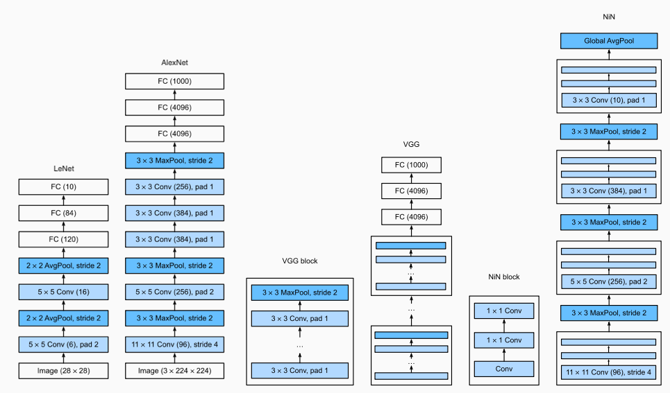
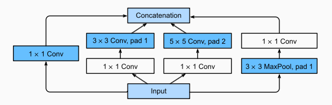
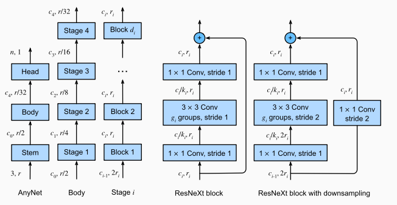

# CNNs

## Layers
- Convolutions
  - Invariance
    - "What Waldo looks like does not depend upon where Waldo is located" [Source](http://d2l.ai/chapter_convolutional-neural-networks/why-conv.html)
  - Locality
    - Earliest layers focus on local regions, deeper layers capture longer-range features
    - For ex, `torch.tensor([[1.0, -1.0]])` is a vertical edge detector (see code)
  - Additional Details
    - Convolutions, without padding and with kernel size 1, transform a tensor of shape $N \times C_{in} \times H \times W$ into $N \times C_{out} \times (H-k+1) \times (W-k+1)$.
    - The number of parameters are $C_{out}(k^2C_{in} + 1)$
    - Disregarding channel numbers for now, naïve implementations of convolutions are $O(HWk^2)$, but if we use fast fourier transforms we can get this down to $O(HW\log (HW))$. 
      - The intuitive idea is that we can split the frequencies and add them together with a phase shift. 
      - This divide and conquer algorithm, $T(n) = 2T(n/2)+O(n)$ is $O(n\log n)$
    - With padding and stride, we get the following output shape
      - $H_{out} = \left\lfloor\frac{H_{in}  + 2 \times \text{padding} - \text{dilation} \times (\text{kernel_size} - 1) - 1}{\text{stride}} + 1\right\rfloor$
- Pooling
  - Pooling operates per channel and so $C_{out}$ = $C_{in}$
- We typically use [Batch Normalization](../01_basics/notes.md) to help training.

## Pre-Inception
- [Source](http://d2l.ai/chapter_convolutional-modern/nin.html)
  - AlexNet: More layers!
  - VGG: More layers (blocks)!
  - NiN: 
    - Large kernels are expensive, FC layers are expensive. 
    - Use cheaper 1x1 convolutions to add local nonlinearities across the channel activations

## Inception 
- [Source](http://d2l.ai/chapter_convolutional-modern/googlenet.html)
- The Inception block is used in GoogleNet and consists of multiple convolution blocks concatenated together. 
  - Different sized kernels capture different effects.
  - Of course, we can also replace the smaller kernels with bigger kernels, but this is both computationally costly, and may put a lot more burden on the model. 
- We also use $1 \times 1$ convolutions to reduce the dimensionality of our inputs prior to the more computationally costly $3 \times 3$ and $5 \times 5$ convolutions.

## ResNet
- ResNet Block: [Source](https://arxiv.org/pdf/1603.05027)
- Intuition:
  - Residuals: Instead of modeling $x_{l+1}=F(x_{l})$, we model $x_{l+1}=x_{l}+F(x_{l})$ where $F$ is a non-linear mapping. In so doing, each successive layer models the "residual" error (like Boosting!)
  - Reusing earlier features allows us to use both abstract features in deep layers and low-level features in early layers for prediction. 
  - Regularization/Stability: $\frac{\partial x_{l+1}}{\partial x_{l}} = \mathbf{I} + \frac{\partial F(x_{l})}{\partial x_{l}}$: This makes the gradients more stable. 
  - Loss Function: Skip connections do seem to smooth out the loss function
    - [Source](https://arxiv.org/pdf/1712.09913)
      - To generate this plot, authors randomly sampled 2 directions to perturb the weights in. 
      - The key innovation of this paper is to normalize these directions according to the norm of the original weights in each filter. 
      - While it is not super satisfying that 2 random directions were chosen, 
        - The authors showed that empirically, results seemed pretty consistent with different choices of directions.
        - The 2 directions are also probabilistically orthogonal in high dimensions.
- Downsampling
  - The ResNet uses multiple ResNet blocks and downsamples the data as we get deeper into the network. 
    - Note that even though $H$ and $W$ decrease, the number of channels increase. 
  - This downsampling is usually done with $1 \times 1$ convolutions with a stride of 2. 
  - The stride of 2 unfortunately throws out 75% of data, and ResNet-D instead uses pooling to prevent this.
  - $1 \times 1$ convolutions are also used to handle the residual connections, since the number of channels, and image dimensions are changing.
- Pre-activation ResNet
  - The original ResNet block applies a non-linear activation function after the skip connection. In contrast, the pre-activation ResNet block applies the non-linearity at the beginning of $F$. 
  - For very deep network, the pre-activation ResNet has shown to perform better as the gradient flow is guaranteed to have the identity matrix, and is not affected by any non-linear activations.
- ResNeXt
  - More channels is helpful but expensive
  - We can use 1x1 convolutions to downsample into multiple groups of a few channels, and then upsample and add

## DenseNet
- [Source](https://arxiv.org/pdf/1608.06993)
- To me, this is very similar to pre-activation ResNet. A few ways that DenseNet is different is that 
  - It concatenates rather than adds. I view this as allowing more flexible weights to be applied. ResNet probably has the ability to learn the same formulation, but it might be harder to learn.
  - It is more parameter efficient. Empirically, it achieves similar performance to ResNet with fewer parameters. 
- Transition layers are added to reduce the dimensionality, both for $H$ and $W$, and the number of channels (which increase significantly from the multiple concatenations). 
  - Here, we first we use a 1x1 convolution for dimensionality reduction.
  - To reduce the height and width dimension, we then apply an average pooling with kernel size 2 and stride 2, similar to ResNet-D.

## AnyNet
- AnyNet is used to design network design spaces
  - 
- RegNet uses the AnyNet general architecture and applies constraints to restrict the search space

## U-Net
- [Source](https://arxiv.org/pdf/1505.04597v1)
- U-Nets also use the concept of skip connections as it downsamples and then upsamples data. 