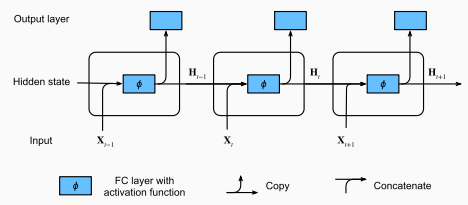
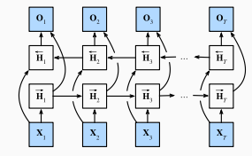
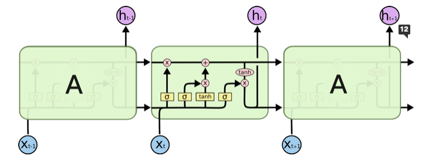
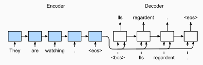
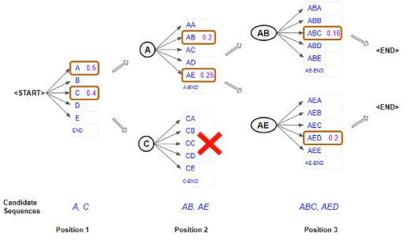

# RNNs

## RNNs

- Recurrent neural nets deal with sequence information. The idea is to use a hidden state to store sequence information up to time step $t-1$.
  - $P(x_t \mid x_{t-1}, \ldots, x_1) \approx P(x_t \mid h_{t-1})$
- Concretely, we have 
  - [Source](http://d2l.ai/chapter_recurrent-neural-networks/rnn.html)
  - $h_t = \tanh(W_h\cdot[h_{t-1}, x_t] + b_h),$ where $h_t, h_{t-1}, b_h \in \mathbb{R}^h$, $x_t \in \mathbb{R}^d$, $W_h \in \mathbb{R}^{h \times (h + d)}$
  - $o_t = W_oh_t + b_o$, where $o_t, b_o \in \mathbb{R}^d$, $W_o \in \mathbb{R}^{d \times h}$
- Bidirectional RNNs
  - Suitable when lookahead is ok.
  - [Source](http://d2l.ai/chapter_recurrent-modern/bi-rnn.html)
  - $h^{(f)}_t = \tanh(W^{(f)}_h\cdot[h_{t-1}, x_t] + b^{(f)}_h)$ 
  - $h^{(b)}_t = \tanh(W^{(b)}_h\cdot[h_{t+1}, x_t] + b^{(b)}_h)$ 
  - $o_t = W_o \cdot [h^{(f)}_t, h^{(b)}_t] + b_o$
- Due to the reuse of weight matrices in RNN, [backpropagation through time](https://www.geeksforgeeks.org/ml-back-propagation-through-time/) involves taking the product of many matrices
  - This can lead to vanishing/exploding gradients
    - The vanishing gradient issue also causes "forgetting" issues over long sequences.
  - This is computationally expensive
  - Solutions
    - Truncation
    - Gradient clipping

## LSTMs

- LSTMs use a combination of gates to better retain information over a long sequence.
- Concretely, we have
  - [Source](http://colah.github.io/posts/2015-08-Understanding-LSTMs/)
  - Forget gate $f_t = \sigma(W_f \cdot [h_{t-1}, x_t] + b_f)$
    - How much of previous cell state to keep
  - Input gate $i_t = \sigma(W_i \cdot [h_{t-1}, x_t] + b_i)$
    - How much of current step to keep
  - Cell state update $\tilde{C}_t = \tanh(W_c \cdot [h_{t-1}, x_t] + b_C)$
  - Cell state $C_t = f_t \odot C_{t-1} + i_t \odot \tilde{C}_t$
  - Output gate $o_t = \sigma(W_o \cdot [h_{t-1}, x_t] + b_o)$
    - How much of cell state to output
  - Output $h_t = o_t \odot \tanh(C_t)$ 
  - Note that $h_t$ still needs to go through an output matrix to be decoded.
- Variants
  - Peephole connections: Passing in $C_{t-1}$ to calculation of $f_t, i_t$, and/or $C_t$ to calculation of $o_t$.
  - Coupling forget and input gates, $C_t = f_t \odot C_{t-1} + (1-f_t) \odot \tilde{C}_t$
  - GRUs

## GRUs

- Simplifies LSTMs
- Intuition:
  - Coupling forget and input gates
  - Merging cell state and hidden state
  - Getting rid of additional $\tanh$ step (all "components" have already gone through $\tanh$ activation)
  - Introducing a reset gate
- Update gate $z_t = \sigma(W_z\cdot [h_{t-1}, x_t] + b_z)$ (Think of this as 1-$f_t$)
- Reset gate $r_t = \sigma(W_r\cdot [h_{t-1}, x_t] + b_r)$ 
- Cell state update $\tilde{C}_t = \tanh(W_c \cdot [r_t \odot h_{t-1}, x_t] + b_C)$
- Output = Cell state $h_t = C_t = (1-z_t) \odot C_{t-1} + z_t \odot \tilde{C}_t$

## Seq2seq

- So far, our RNN model handles aligned sequence tasks, where the input at each time step aligns with a corresponding target.
- In seq2seq problems, inputs and outputs each consist of variable-length unaligned sequences, such as in machine translation. 
- Here, we typically rely on the encoder-decoder architecture:
  - [Source](http://d2l.ai/chapter_recurrent-modern/seq2seq.html)
  - The RNN encoder encodes the input sequence into a context vector, which is then decoded by the RNN decoder
    - The limited size of the context vector forms a bottleneck, which we address with [attention](../08_attention_transformers/notes.md). 
- The decoder allows our output to be a different length from our input. 
  - In training, we specify the length of the output we want, and predict our desired output. 
    - Note the shifting in the image above.
  - In inference, we predict token by token.

## Beam Search
- When outputting text sequentially, the most probable next _sequence_ may not start with the most probable next _token_. 
- Beam search trades off accuracy and computational cost by maintaining a fixed number of "beams", until the decoder predicts the "<END>" token.
  - [Source](https://towardsdatascience.com/foundations-of-nlp-explained-visually-beam-search-how-it-works-1586b9849a24)

## Metrics
- Cross Entropy loss can be used when predicting tokens
- For evaluating output sequences, BLEU is a popular measure that matches $n$-grams between the predicted sequence and the target sequence.
  - Bounded between 0 and 1
  - When similarity is higher, BLEU is higher
  - Matching longer $n$-grams have higher weight