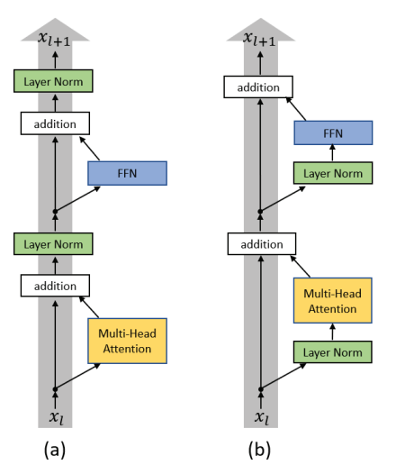
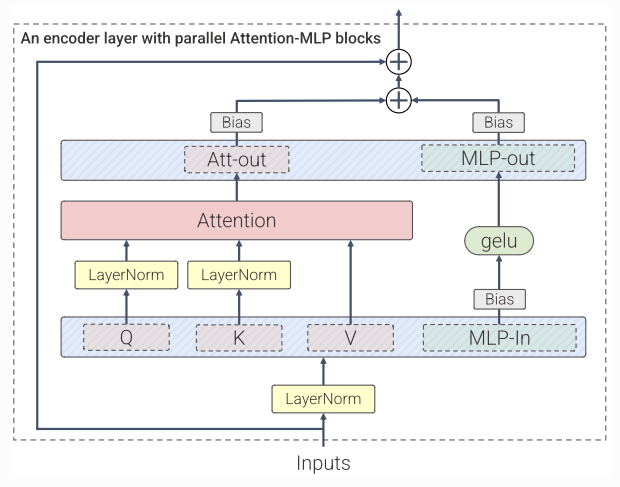

# Transformers

I've found transformers to be _very confusing_. To that end, these notes aim to be an end-to-end tutorial of what transformers are. While these notes should be comprehensive, I've found the following resources to be particularly instructive:
- [3Blue1Brown Videos, DL5, DL6 and DL7](https://www.youtube.com/watch?v=wjZofJX0v4M&list=PLZHQObOWTQDNU6R1_67000Dx_ZCJB-3pi&index=6)
- [A Mathematical Framework for Transformer Circuits](https://transformer-circuits.pub/2021/framework/index.html)
- [The Transformer Family Version 2.0](https://lilianweng.github.io/posts/2023-01-27-the-transformer-family-v2/#combination-of-local-and-global-context)

## Encoders and Decoders

- The [transformer paper](https://arxiv.org/pdf/1706.03762) was released with an encoder-decoder architecture. 
  -  (Encoder is left, Decoder is right)
- Traditionally, "the main difference is that encoders are designed to learn embeddings that can be used for various predictive modeling tasks such as classification. In contrast, decoders are designed to generate new texts, for example, answering user queries." [Source](https://magazine.sebastianraschka.com/p/understanding-encoder-and-decoder)
- I've found this to be confusing especially since:
  - Encoder-only models like BERT also "decode" embeddings into output tokens or text during training.
  - Decoder-only models like GPT do alter token embeddings during training.  
- Ultimately, I think the traditional understanding is still useful in comprehending what encoders/decoders are, but would like to point out two other distinctions that may help in categorization / model selection. 
  - For encoders, output token length is the same as input token length. 
  - For decoders, training is done in an autoregressive fashion. 
- Today, many tasks that were originally achieved with encoder-decoder models can be achieved with decoder-only models. 
- More details in [Pretraining (NLP)](../17_nlp/pre_training.md).

## Attention

- Due to the success of decoder-only models, the main innovation of the transformer is in attention. 
- Terminology:
  - $d$ : The model size / hidden state dimension / positional encoding size.
  - $h$ : The number of heads in multi-head attention layer.
  - $d_k$: The head dimension. 
  - $L$ : The segment length of input sequence.
  - $\mathbf{X} \in \mathbb{R}^{L \times d}$ : The input sequence where each element has been mapped into an embedding vector of dimension $d$. Note that this represents _one_ sample of training data.
  - $\mathbf{x}_i \in \mathbb{R}^{1 \times d}$ : The $i^{th}$ input token, $i^{th}$ row in $\mathbf{X}$.
  - $\mathbf{W}^{k,i}, \mathbf{W}^{q,i} \in \mathbb{R}^{d \times d_k}$: The key and query weight matrix for head $i$.
  - $\mathbf{W}^{v,i} \in \mathbb{R}^{d \times d_v}$: The value weight matrix for head $i$.
  - $\mathbf{W}^{o,i} \in \mathbb{R}^{d_v \times \ d}$: The output weight matrix for head $i$.
  - $\mathbf{W}^{o} \in \mathbb{R}^{hd_v \times \ d}$: The overall output weight matrix, formed by concatenating each $\mathbf{W}^{o,i}$ row-wise. 
  - $\mathbf{K}^i = \mathbf{XW}^{k,i}, \mathbf{Q}^i = \mathbf{XW}^{q,i} \in \mathbb{R}^{L \times d_k}$: The key and query input embeddings for head $i$.
  - $\mathbf{V}^i = \mathbf{XW}^{v,i} \in \mathbb{R}^{L \times d_v}$: The value input embeddings for head $i$. 
  - $\mathbf{k}_j^i, \mathbf{q}_j^i \in \mathbb{R}^{d_k}, \mathbf{v}_j^i \in \mathbb{R}^{d_v}$: The key, query and value embeddings for the $j^{th}$ token in the input sequence ($j^{th}$ row).
- Goal:
  - The goal of training is to obtain parameters for $\mathbf{W}^{k,i}, \mathbf{W}^{q,i}, \mathbf{W}^{v,i}, \mathbf{W}^{o,i}$, and MLP layers (not discussed yet).
- Multi-head self-attention
  - An attention block adds (because of residual connection) to input $\mathbf{X}$: 
    - $\mathbf{Y} = \sum_i \left[ \operatorname{softmax}(\frac{\mathbf{Q}^i\mathbf{K}^{i\top}}{\sqrt{d_k}})\mathbf{V}^i\mathbf{W}^{o,i} \right]$ (softmax is applied such that row sums are 1)
  - Naming
    - Multi-head: Summing over $i$ heads
    - Self: Using the same $\mathbf{X}$ for $\mathbf{Q}^i, \mathbf{K}^i$ and $\mathbf{V}^i$ matrices
    - Attention: $\operatorname{attn}(\mathbf{Q}^i, \mathbf{K}^i, \mathbf{V}^i) = \operatorname{softmax}(\frac{\mathbf{Q}^i\mathbf{K}^{i\top}}{\sqrt{d_k}})\mathbf{V}^i$
  - Confusion
    - Typically, we see the following formula: $[\operatorname{attn}(\mathbf{Q}^1, \mathbf{K}^1, \mathbf{V}^1); \dots; \operatorname{attn}(\mathbf{Q}^h, \mathbf{K}^h, \mathbf{V}^h)]\mathbf{W}^o$. This is [mathematically equivalent](https://transformer-circuits.pub/2021/framework/index.html#architecture-attn-independent) to the formula we presented.
  - Multi-head
    - Having multiple heads allows us to learn different attention patterns (see intuition)
    - Each attention head can be computed in parallel.
    - Usually, we set $d_k = d_v = \frac{d}{h}$.
  - Permutation invariance
    - Swapping rows $i$ and $j$ in $\mathbf{X}$ would swap rows $i$ and $j$ in $\mathbf{Y}$.
- Intuition
  - $\mathbf{q}_j^i, \mathbf{k}_j^i$ and $\mathbf{v}_j^i$ are lower-dimensional representations of the $j^{th}$ input token. 
    - I'm not sure if there's a compelling reason for it to be lower dimensional outside of computational cost. 
  - $A = \operatorname{softmax}(\frac{\mathbf{Q}^i\mathbf{K}^{i\top}}{\sqrt{d_k}})$ is a matrix where $A_{ab}$ represents how similar $\mathbf{k}_b^i$ is to $\mathbf{q}_a^i$, relative to the other keys. 
  - What attention head $i$ does to the $a^{th}$ row of $\mathbf{X}$, is to _add_ additional context to its embedding, given by $\sum_b (A_{ab}\mathbf{v}_b^{i\top}\mathbf{W}^{o,i})$
  - Here, we see that every input token can now absorb context from any other input token in the same sequence (limited by $L$). This addresses a major weakness in [RNNs](../07_rnns/notes.md), which faced the context vector bottleneck issue.
  - Why do we need matrices to convert $\mathbf{X}$ into these $\mathbf{q}_j^i, \mathbf{k}_j^i$ and $\mathbf{v}_j^i$ vectors?
    - This allows us to more flexibly query and match queries. One such example is to find the following word for the last time we encountered the current word. (See [Q and K Composition](../21_safety/02_interpretability.md))
  - Why do we model $\mathbf{v}_b^i$ and $\mathbf{W}^{o,i}$ separately?
    - My intuition is that it's computational. 
- Softmax and Temperature
  - The softmax ensures that the row sums are 1. 
  - The temperature is related to how large our denominator $\sqrt{d_k}$ is. As this denominator increases, our weights are more even. 
  - Motivation for $\sqrt{d_k}$: Supposing our entries of $\mathbf{q}_j^i$ and $\mathbf{k}_j^i$ are variance one, this ensures that the entries of our matrix are variance one. Therefore, it's a reasonable scalar to prevent concentrating too much on the most similar keys. 

## Positional Embeddings

- Note that in many language tasks, storing the relative positions is important. 
- However, because the self-attention operation is permutation invariant (if we just use token embeddings), we need to provide additional order information. 
- We do this by _adding_ a matrix $\mathbf{P} \in \mathbb{R}^{L \times d}$
- Types of positional embedding
  - Sinusoidal
    - $P_{ij} = \sin(\frac{i}{10000^\frac{j}{d}})$ if $j$ even, and 
    - $P_{ij} = \cos(\frac{i}{10000^\frac{j-1}{d}})$ if $j$ odd
    - Under this formulation, the wavelengths vary from $2\pi$ to $10000\times2\pi$.
  - Other [types](https://lilianweng.github.io/posts/2023-01-27-the-transformer-family-v2/#positional-encoding) of embedding include learned, relative and rotary embeddings (see below).
- Note, while it feels more natural to concatenate these embeddings, this is easier to implement and [perhaps](https://kazemnejad.com/blog/transformer_architecture_positional_encoding/) we may think of $d$ being large enough to store position and semantic information in different dimensions.

## MLP

- It is important to remember that while attention is the key innovation of transformers, 2/3 of parameters in a transformer is in its linear layers. 
- [This video](https://www.youtube.com/watch?v=9-Jl0dxWQs8&list=PLZHQObOWTQDNU6R1_67000Dx_ZCJB-3pi&index=8) provides some useful intuition for what MLP layers do. 
  - Suppose we have input to MLP $\mathbf{X} \in \mathbb{R}^{L \times d}$
  - The MLP layers do $(\operatorname{ReLU}(\mathbf{X}\mathbf{W}^1))\mathbf{W}^2$, where $\mathbf{W}^1 \in \mathbb{R}^{d \times d'}, d' > d$.
  - Note that in such a transformation, _unlike attention_, each of the $L$ tokens do _not_ influence each other, i.e. we can process each token in parallel. 
  - $\mathbf{W}^1$ projects $\mathbf{X}$ into a higher-dimensional vector before $\mathbf{W}^2$ projects it down. 
    - One hypothesis is that each entry (column) of $\mathbf{x}_i\mathbf{W}^1 \in \mathbb{R}^{1 \times d'}$ represents a question, e.g. is $\mathbf{x}_i$ correlated with "Michael Jordan"?
    - $\mathbf{W}^2$ then says, if $\mathbf{x}_i$ is correlated with "Michael Jordan", then add a particular vector (e.g. "basketball") to $\mathbf{x}_i$'s embedding. 
    - As [research on SAEs indicate]((https://transformer-circuits.pub/2023/monosemantic-features/index.html)), the neurons in $\operatorname{ReLU}(\mathbf{X}\mathbf{W}^1))$ are often polysemantic, i.e. under the question paradigm, they correspond to multiple questions.  
  - Potentially unanswered question: Why do we need the MLP layers? What does it do that the attention heads cannot? 
    - Suppose that $\operatorname{softmax}(\frac{\mathbf{Q}^i\mathbf{K}^{i\top}}{\sqrt{d_k}})$ is the identity matrix. 
    - Then we're essentially adding $\mathbf{XW}^{v,i}\mathbf{W}^{o,i}$ to $\mathbf{X}$, which looks very similar?
    - Notable differences
      - $\mathbf{XW}^{v,i}$ is lower dimensional than $\mathbf{XW}^1$, so maybe interference makes it harder to add the correct embeddings? 
      - Lack of activation: If something has a negative activation to "Michael Jordan" (which can happen with 0 correlation but negative bias), what the attention head would do is _subtract_ the "basketball" embedding, which may not be what we want to do. 
    - Or maybe it's just more parameter efficient, since we don't need to compute and store a huge identity matrix. 

## Masking

- For the encoder, we use padding/truncation to ensure that input sequences are of the same length
  - We use masking to ensure that we do not attend to padding tokens.
- For the decoder, we use masking to ensure that we do not attend to a token ahead of the token being predicted.
  - As per [seq2seq](../07_rnns/notes.md), we also use shift our input so that we don't pass in our output by accident. 

## Additional details
- Residual connections
  - This helps to mitigate the vanishing gradient problem. 
  - This also helps us think of transfomers as "adding to the residual stream"
- Learning-Rate Warm Up
  - When training a transformer, we usually gradually increase the learning rate from 0 on to our originally specified learning rate in the first few iterations.
  - Explanations
    - Adam uses the bias correction factors which however can lead to a higher variance in the adaptive learning rate during the first iterations. Improved optimizers like RAdam have been shown to overcome this issue.
    - The iteratively applied Layer Normalization across layers can lead to very high gradients during the first iterations, which can be solved by using Pre-Layer Normalization.
- Layer Normalization
  - We typically use [Layer Normalization](../01_basics/notes.md) to stabilize the network and reduces the training time
  - We don't use batch normalization here because batches tend to be small for language tasks, which could induce high variance in batch statistics.
  - Pre-LN Transformer
    - [Source](https://proceedings.mlr.press/v119/xiong20b/xiong20b.pdf)
    - In the original (Post-LN) Transformer, gradients in certain layers can be very large.
    - The Pre-LN Transformer normalizes these and eliminate the need for warm up.
- Initialization
  - Xavier initialization should be appropriate, but [BERT and GPT2 initializes weights with a smaller SD of 0.02](https://aclanthology.org/D19-1083.pdf)
  - GPT2 also scales weights of residual layers by $1/\sqrt{N}$, to account for the accumulation on the residual path.
- Cross attention
  - Cross-attention is relevant when dealing with an encoder-decoder architecture.
  - Cross-attention is also useful for [conditional generation](../10_diffusion/notes.md). 
    - Typically, keys and values come from encoder, queries come from decoder.
    - Suppose we're conditioning image generation (decoder) on text (encoder). Think of this as adding the relevant text embeddings to the image embeddings. 

## Extensions

- A key bottleneck is in the computation of the $\mathbf{Q}^i\mathbf{K}^{i\top}$ matrix, which is $O(L^2d)$.
  - This is why larger context lengths are a big deal! (But also note that they allow for [increased vulnerabilities](../21_safety/03_alignment.md))
  - Reducing compute: algorithmic extensions [(The Transformer Family Version 2.0)](https://lilianweng.github.io/posts/2023-01-27-the-transformer-family-v2/#combination-of-local-and-global-context)
    - Memory methods to "cache" information
    - Methods to selectively incorporate _some_ global context (sparse attention, etc.)
    - Attention free transformers
      - $Y=f(X) ; Y_t=\sigma_q\left(Q_t\right) \odot \frac{\sum_{t^{\prime}=1}^T \exp \left(K_{t^{\prime}}+w_{t, t^{\prime}}\right) \odot V_{t^{\prime}}}{\sum_{t^{\prime}=1}^T \exp \left(K_{t^{\prime}}+w_{t, t^{\prime}}\right)}$
        - I personally wonder how similar this is to normal transformers. To me, the hadamard product would distort values significantly. 
  - Reducing bandwidth
    - Flash attention performs kernel fusion by using recursion to compute softmax denominator ([explanation](https://gordicaleksa.medium.com/eli5-flash-attention-5c44017022ad))
    - This is implemented with PyTorch's default attention modules.
  - Parallel architectures 
    - [Parallel architectures](https://arxiv.org/pdf/2211.05953) are sometimes used in big models, trading off expressiveness for efficiency
      - 
- Grouped Attention 
  - Reduce the number of key and value heads and have multiple query heads attend to one key head.
- Positional Embeddings
  - While the original paper used absolute positional embeddings, later models like BERT and GPT-2 used learned positional embeddings. 
  - Relative position embeddings simplifies this and only encodes relative positions in attention weights. 
  - [RoPE](https://arxiv.org/pdf/2104.09864) provides a _computationally efficient_ way to encode relative positions in attention weights
    - We no longer provide positional information to $\mathbf{V}^i$, so we give up absolute positional information. 
    - Consider $(\mathbf{Q}^i\mathbf{K}^{i\top})_{mn}$, and let us not consider multiple heads for now (removing the $i$ superscript henceforth, and replacing head dimension $d_k$ with a general $d$)
      - $(\mathbf{Q}\mathbf{K}^{\top})_{mn}$ = $\mathbf{q}_m^\top\mathbf{k}_n = \mathbf{x}_m\mathbf{W}^q\mathbf{W}^{k\top}\mathbf{x}_n^\top$
      - For RoPE, we replace $\mathbf{q}_m^\top\mathbf{k}_n$ with $\mathbf{q}_m^\top(\mathbf{R}_{\pmb\Theta, m}^d)^\top\mathbf{R}_{\pmb\Theta, n}^d\mathbf{k}_n$, where $\mathbf{R}_{\pmb\Theta, m}^d=\left(\begin{array}{ccccccc}\cos m \theta_1 & -\sin m \theta_1 & 0 & 0 & \cdots & 0 & 0 \\ \sin m \theta_1 & \cos m \theta_1 & 0 & 0 & \cdots & 0 & 0 \\ 0 & 0 & \cos m \theta_2 & -\sin m \theta_2 & \cdots & 0 & 0 \\ 0 & 0 & \sin m \theta_2 & \cos m \theta_2 & \cdots & 0 & 0 \\ \vdots & \vdots & \vdots & \vdots & \ddots & \vdots & \vdots \\ 0 & 0 & 0 & 0 & \cdots & \cos m \theta_{d / 2} & -\sin m \theta_{d / 2} \\ 0 & 0 & 0 & 0 & \cdots & \sin m \theta_{d / 2} & \cos m \theta_{d / 2}\end{array}\right)$
        - We can show that this reduces to $\mathbf{q}_m^\top\mathbf{R}_{\pmb\Theta, n-m}^d\mathbf{k}_n$
          - Hence, this form encodes relative positions into attention weights. 
          - Geometrically, this is natural to reason in 2D. 
            - $\mathbf{R}_{\pmb\Theta, n-m}^d\mathbf{k}_n$ rotates $\mathbf{k}_n$ counter-clockwise by $n\theta_1$. 
            - The dot product $\mathbf{q}_m^\top\mathbf{k}_n $ is the unnormalized cosine angle of the two vectors, $\theta_0$. 
            - Hence, the new dot product is another unnormalized cosine angle, where the angle is now $\theta_0 + (n-m)\theta_1$.
        - Implementation details
          - $\theta_i=10000^{-\frac{2(i-1)}{d}}, i \in\left[1,2, \ldots, \frac{d}{2}\right]$
            - Given that we rotate each pair of features by $m\theta_i$, we can view $\theta_is$ as frequencies with wavelength $\frac{2\pi}{\theta_i}$. 
            - For $i = 1$, we rotate the fastest at 1 radian per token (high frequency), and shortest wavelength $2\pi$ tokens.
            - For $i = \frac{d}{2}$, we rotate the slowest at approximately $\frac{1}{10000}$ radians per token (low frequency) and longest wavelength $20000\pi$ tokens.
            - For this reason, 10000 is known as the base wavelength. The higher this is, the longer the wavelengths for a given $i$, allowing the model to attend to longer contexts.
            - This is worth restating: _There is a connection between the base wavelength and the longest context length we can support without erroneous alignment._ 
              - This [PR](https://github.com/ggerganov/llama.cpp/pull/2295) also suggests scaling base wavelength somewhat proportionally to context length.
              - Note that for $i = \frac{d}{2}$, the maximum context length we can support is $2\pi$(base wavelength). However, the constant of proportionality is off. For example, it seems ideal to have a base wavelength of 57200 for a context size of 8192 ([link](https://github.com/ggerganov/llama.cpp/pull/2054)). My guess is that we not only need the largest $i = \frac{d}{2}$, but multiple $i$s to support the context length. 
            - In extending the context length from 8k to 131k, we [adjust the frequencies](https://www.reddit.com/r/MachineLearning/comments/1hovvmm/d_rope_frequency_calculation_for_llama/) such that lower frequencies are scaled down even more. 
            - Extentions 
              - I find [this article](https://arxiv.org/pdf/2410.06205) very interesting, but haven't fully digested it. 
              - Also, it feels like we're not using most of our positional information. Is there a more efficient way to do so? Have we explored e.g. linear $\theta_i$s sufficiently?
          - Re-ordering of features
            - Notice that $\mathbf{R}_{\pmb\Theta, n}^d$ rotates consecutive pairs of features by the same angle. 
            - Regardless of how we permute the features prior to rotation (thereby choosing pairs), the transformation is still a function of $n-m$
            - Hence, for both the query and key vectors, we pair feature $i$ with feature $i + d/2$. (Possibly out of convenience?)
            - Concretely, we convert $\binom{{k}_n^{(i)}}{{k}_n^{\left(i+\frac{d}{2}\right)}}$ into $\binom{k_n^{(i)} \cos n \theta_i-k_n^{\left(i+\frac{d}{2}\right)} \sin n \theta_i}{k_n^{\left(i+\frac{d}{2}\right)} \cos n \theta_i+k_n^{(i)} \sin n \theta_i}$
            - As the above form suggests, we can compute the matrix multiplication in a computationally efficient manner due to the sparsity of $\mathbf{R}_{\pmb\Theta, n}^d$. 
            - Concretely, expressing $\mathbf{K} = \left[ \mathbf{K}_1 ; \mathbf{K}_2\right]$, for $\mathbf{K}_1, \mathbf{K}_2$ with equal columns, we do:
              - $\left[ \mathbf{K}_1 ; \mathbf{K}_2\right] \odot \left[ \mathbf{C}_{cos}; \mathbf{C}_{cos}\right] + \left[ -\mathbf{K}_2; \mathbf{K}_1\right] \odot \left[ \mathbf{C}_{sin}; \mathbf{C}_{sin}\right]$, for $\left(\mathbf{C}_{g}\right)_{ij} = i\theta_j$
            - Note that we do the same transformations for $\mathbf{Q}$. 