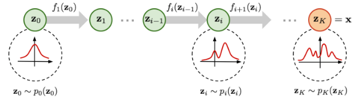
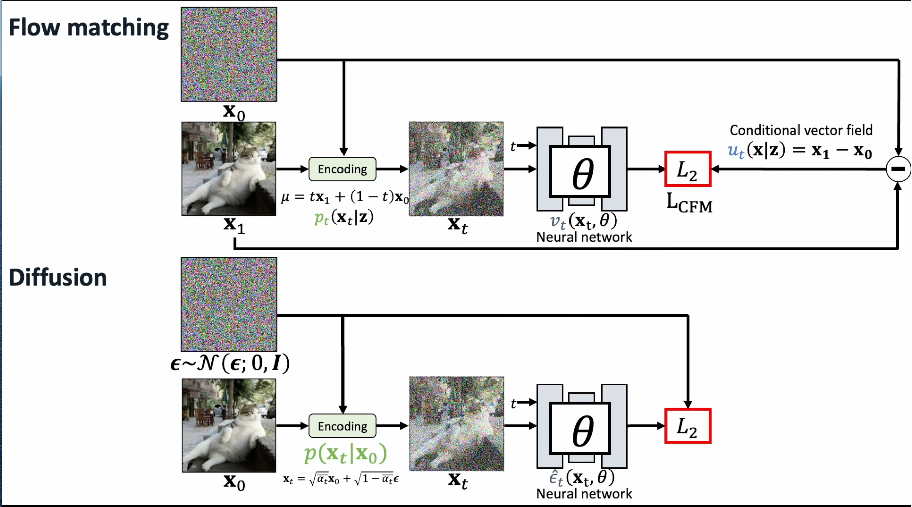
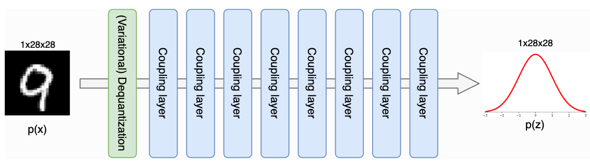
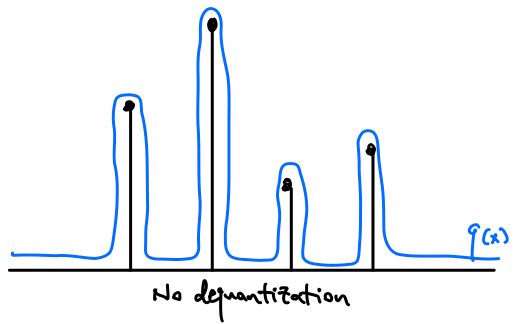
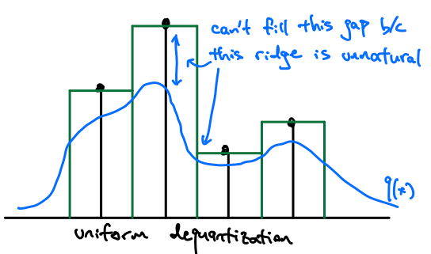
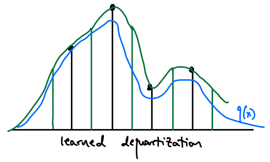
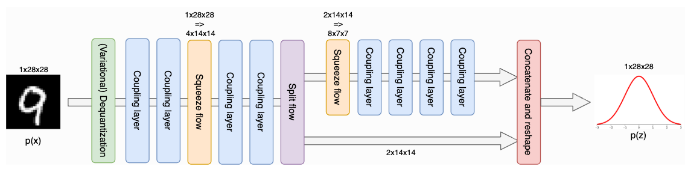

# Flows

- As before, we want to generate samples $\mathbf{x}$ from unknown distribution $p(\mathbf{x})$
- Some good resources here are:
  - [How I Understand Flow Matching](https://www.youtube.com/watch?v=DDq_pIfHqLs)
  - [An Introduction to Flow Matching](https://mlg.eng.cam.ac.uk/blog/2024/01/20/flow-matching.html)
  - [Flow-based Deep Generative Models](https://lilianweng.github.io/posts/2018-10-13-flow-models/)
- I apologize for the inconsistent notation in this document, I don't have time right now to edit images.

## Normalizing Flow

- We start with $\mathbf{z}_0 \sim p_0(\mathbf{z}_0),$ which can be easily sampled from, and transform it into $\mathbf{x}$ with invertible functions $f_i$
  - [Source](https://lilianweng.github.io/posts/2018-10-13-flow-models/)
  - $\log p(\mathbf{x}) = \log \pi_K(\mathbf{z}_K) = \log \pi_0(\mathbf{z}_0) - \sum_{i=1}^K\log\vert \operatorname{det} \frac{df_i}{d\mathbf{z}_{i-1}}\vert$ [Details]((https://lilianweng.github.io/posts/2018-10-13-flow-models/))
  - This surfaces two requirements for our $f_i$:
    - They are invertible
    - They yield Jacobians whose log determinants are easy to compute 
- Lower Triangular Jacobians
  - Lower Triangular Jacobians are desirable because their determinant is simply the product of terms on the diagonal. 
  - RealNVP is an example of this ([Source](https://www.youtube.com/watch?v=DDq_pIfHqLs)) 
    - 
    - GLOW extends this idea of permutation by using invertible $1 \times 1$ convolutions, but we note that we now need to compute the determinant of the weight matrices. 
  - Autoregressive flows are another example of this ([Source](https://www.youtube.com/watch?v=DDq_pIfHqLs)) 
    - 
- Residual Flows
  - Residual flows permit more expressive Jacobians.
  - $\mathbf{z}_i = \mathbf{z}_{i-1}+u(\mathbf{z}_{i-1})$, where $u$ is a neural network
    - This is invertible by the Banach fixed point theorem if $u$ is contractive, i.e. with Lipschitz constant less than unity. 
    - Jacobian:
      - Unfortunately, we now need to compute the trace of a power series of Jacobian matrices. 
      - [Behrmann et al.](https://arxiv.org/pdf/1811.00995) use the Skilling-Hutchinson estimator to estimate the trace, with a fixed truncation to approximate the infinite series. 
      - Given that this truncation introduces bias, [residual flows](https://arxiv.org/pdf/1906.02735) provides an unbiased estimator by reweighting the finite terms.  

## Continuous Normalizing Flow

- Let us switch notations from $\mathbf{z}_i$ to $\mathbf{x}_i$.
- Starting with the residual flow equation, $\mathbf{x}_{i+1} = \mathbf{x}_i + \frac{1}{K} u(\mathbf{x}_i)$
- As $K \rightarrow \infty$, we get $\frac{d\mathbf{x}_t}{dt} = u_t(\mathbf{x}_t)$, where $u_t(\mathbf{x}_t)$ is known as our vector field. 
- Our goal is to represent $u_t(\mathbf{x}_t)$ with a neural network, which gives us our neural ordinary differential equation:
  - $\frac{d\mathbf{x}_t}{dt} = u_t(\mathbf{x}_t, \theta)$
- Continuity/transport equation:
  - $\frac{dp_\theta(\mathbf{x}_t)}{dt} = -\operatorname{div}(p_\theta(\mathbf{x}_t)u_t(\mathbf{x}_t, \theta))$
- $\frac{d\log p_\theta(\mathbf{x}_t)}{dt} = -\operatorname{div}(u_t(\mathbf{x}_t, \theta))$
- $\log p_\theta(\mathbf{x}) = \log p_0(\mathbf{x}_0)- \int_{t=0}^1\operatorname{div}(u_t(\mathbf{x}_t, \theta))dt$
- Since computing the log likelihood requires computing the integral of vector fields with ODE solvers, this limits scalability.

## Flow Matching
- Flow matching enables scalable training of CNFs. 
- The idea is that we can _specify_ conditional probability paths $p_t(\mathbf{x}_t \mid \mathbf{z})$ with respect to _some_ conditioning variable $\mathbf{z}$
  - $p_t(\mathbf{x}_t \mid \mathbf{z})$ is generated by a conditional vector field $u_t(\mathbf{x}_t \mid \mathbf{z})$
- Now we simply train our neural network $v_t\left(\mathbf{x}_{\mathrm{t}}, \theta\right)$ to match this conditional vector field. 
  - $\mathbb{E}_{t, q(\mathbf{z}), p_t\left(\mathbf{x}_t \mid \mathbf{z}\right)}\left[\left\|v_t\left(\mathbf{x}_{\mathrm{t}}, \theta\right)-u_t\left(\mathbf{x}_{\mathrm{t}} \mid \mathbf{z}\right)\right\|_2^2\right]$
- It is interesting to note that Flow Matching therefore generalizes Diffusion, where Diffusion specifies the reverse diffusion process as the chosen conditional vector field.
  - [Source](https://www.youtube.com/watch?v=DDq_pIfHqLs)

## Additional Details
- Dequantization. 
  - [Source](https://github.com/phlippe/uvadlc_notebooks/blob/master/docs/tutorial_notebooks/tutorial11/NF_image_modeling.ipynb)
  - We usually have to dequantize discrete data to prevent degenerate solutions concentrated around discrete values.
    - [Source](https://mtskw.com/posts/variational-dequantizer/)
  - Question: Why is this _more_ pertinent to flows than other algorithms?
  - One common option here is to use uniform noise, however this approach introduces flat step-wise regions into the data distribution, which makes fitting difficult. 
    - [Source](https://mtskw.com/posts/variational-dequantizer/)
    - Instead, we can use variational dequantization, where we use flows to model the noise to add (based on the pixel value)
      - [Source](https://mtskw.com/posts/variational-dequantizer/)
- Multi-Scale architecture (Squeeze and split)
  - [Source](https://github.com/phlippe/uvadlc_notebooks/blob/master/docs/tutorial_notebooks/tutorial11/NF_image_modeling.ipynb)
  - Squeeze: Rearranges data spatially: relevant since we use a 2d Conv layer
    - Remember to change the hidden dimensions of these 2d Conv layers!
  - Split: Many pixels contain less information, so we split off half of the latent dimensions and directly evlauate them on the prior
      - We do so by reshaping and taking half the channels. Reshaping should mean that each channel has some sort of "checkboard" pattern, which may or may not be retained depending on how we take the channels.
- $\operatorname{bpd} = \frac{\log_2(e)\operatorname{nll}}{\prod d_i}$ gives us a metric which we can compare for different image resolutions

