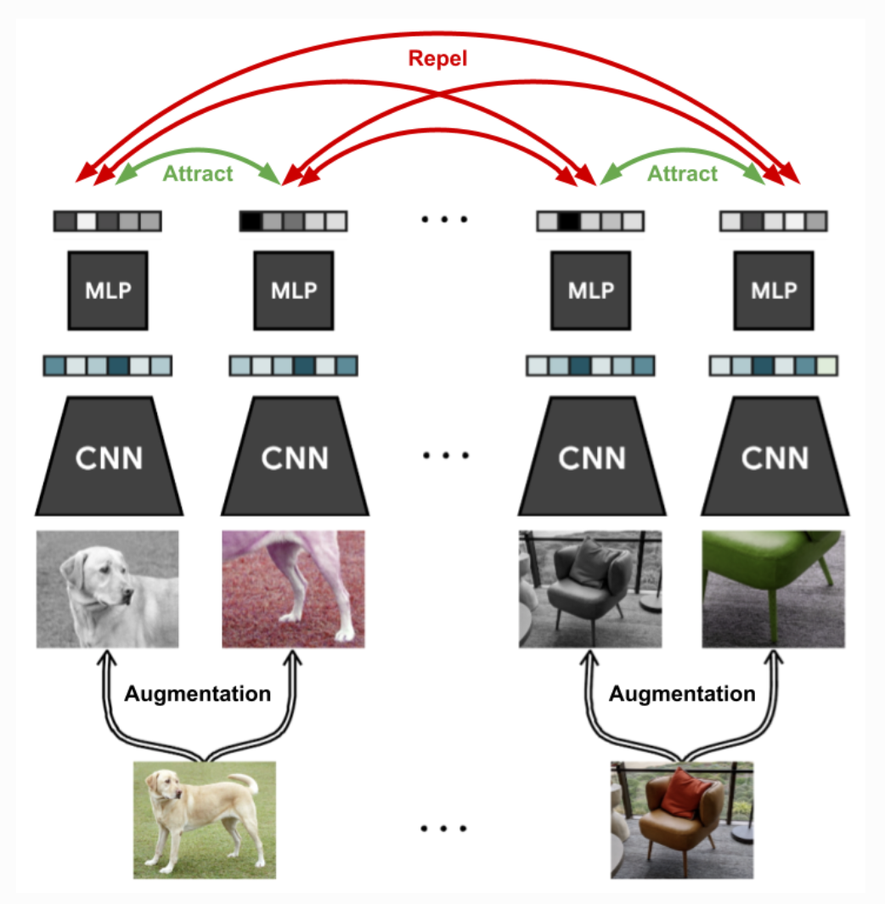

# Contrastive Learning

- Contrastive Learning is when models learn to differentiate between similar and dissimilar data points in an unsupervised manner. 
- This "differentiation" is expressed by learning how to embed data points. 
- Such embeddings are useful for downstream tasks like classification. 
- SimCLR
  - [Source](https://simclr.github.io)
  - Loss:
    - Info-NCE: $
\ell_{i,j}=-\log \frac{\exp(\text{sim}(z_i,z_j)/\tau)}{\sum_{k=1}^{2N}\mathbb{1}_{[k\neq i]}\exp(\text{sim}(z_i,z_k)/\tau)}
$
    - A similarity metric like cosine similarity can be used.
  - Data Augmentation
    - Crop-and-resize, and color distortion are particularly useful especially when used together. 
    - The former without the latter may allow the model to simply pick up non-subject matter details only relevant to a particular image.
- Contrastive Language-Image Pre-training (CLIP)
  - CLIP uses a ViT model for its image encoder and a transformer model similar to GPT-2 for its text encoder
  - Dataset consists of image-text pairs
  - Contrastive Learning Objective
    - Image classifier objective suffers from needing to pre-specify a list of classes
    - Language model objective suffers possibly because many possible text can accompany an image
    - The contrastive learning objective maximizes the similarity between paired image-text combinations, and minimizes the similarity between unpaired image-text combinations.
- Contrastive Language-Audio Pretraining (CLAP) and MuLan
  - Similar to CLIP