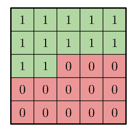
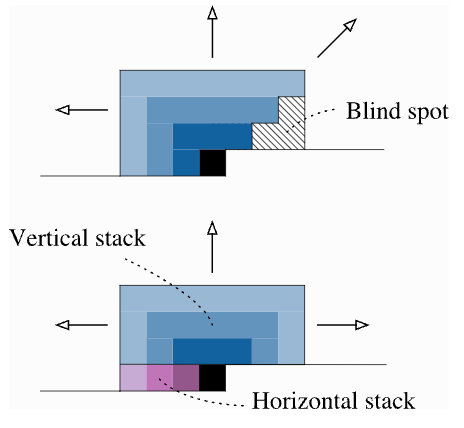
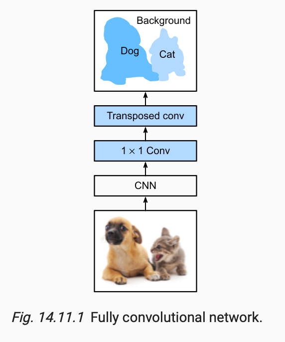
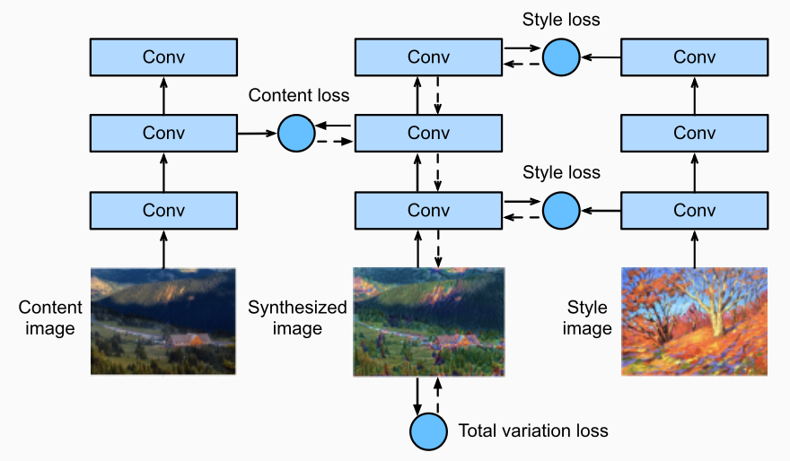

# Computer Vision

## Autoregressive Image Modeling

- For autoregressive image modeling, we predict pixel by pixel in raster scan order. 
- Let's study the PixelCNN Model
- To prevent looking ahead, we use masked convolution kernels
  - [Source](https://arxiv.org/pdf/1606.05328)
  - However, these introduce blind spots, and so we instead use horizontal and vertical convolutions
    - [Source](https://arxiv.org/pdf/1606.05328)
    - Additional explanation
      - Blind spots for 3x3 masked filters: for every feature map (not on the boundary) at position (i,j) does not depend feature maps on (i-1,j+2) in the previous layer.
      - Horizontal stacks look left only, including current spot.
      - Vertical stacks look at all rows at/above the current spot.
        - Note that causality within the same row for vertical stack is not ensured
      - The trick to ensure overall causality is that i-th row in vertical stack will only be used in the computation of (i+1)-th row in horizontal stack.
- Loss Function
  - In PixelCNN, for each pixel, we output 256 logits for each possible pixel value, then compute cross entropy loss.
    - This is costly in terms of memory.
    - In addition, the model doesn't know that pixel value $x$ is close to $x-1$. 
  - In PixelCNN++, we instead assume that the output is a mixture of logistic distributions
    - $P(x \mid \pi, \mu, s)=\sum_{i=1}^K \pi_i\left[\sigma\left(\left(x+0.5-\mu_i\right) / s_i\right)-\sigma\left(\left(x-0.5-\mu_i\right) / s_i\right)\right]$
    - The model then tries to learn the mean and scale parameters for each mixture.

## Vision Transformers 

- Classification:
  - [Lippe's implementation](https://github.com/phlippe/uvadlc_notebooks/blob/master/docs/tutorial_notebooks/tutorial15/Vision_Transformer.ipynb):
    - Split an image up into a sequence of $L$ image patches, each image patch is now a "token", where its embedding is a flattened vector of its pixel values. 
    - Add an additional classification token to each sequence, which is initialized with noise. The final embedding for this token is used for classification. 
    - We learn positional encodings which has $L \times Cp_Hp_W$ parameters. Comparing rows dictate the relationship between patches and comparing columns dictate hte relationship between pixels of the same patch. 
      - Convolutional kernels is the normal way we learn these relationships, although these have more restrictions (but are probably easier to learn).
- Generation
  - See [Diffusion](../10_diffusion/notes.md)

## Object Detection

- Rectangular boxes
  - Single Shot Multibox Detection (one stage)
    - Reuse a base network, and use multiscale feature maps to draw anchor boxes of different resolutions. 
    - For each of these anchor boxes, we make a prediction of the class of the encapsulated object and the offset to best encapsulate this object. 
    - To obtain the target class and offset, we [use the IOU metric](http://d2l.ai/chapter_computer-vision/anchor.html)
    - The loss we minimize has two parts
      - The predicted class
      - The l1 localization loss for the offset
    - Inference
      - We run the model to get candidate anchor boxes with associated predictions.
      - We use Non-Maximum Suppression to reduce the number of anchor boxes
        - Iteratively keep the box with the highest predicted probability
        - Remove any box that predicts the same class, that overlaps heavily (IOU) with the selected box
  - YOLO (one stage)
    - Splits image into $S \times S$ cells. 
    - For each cell, we predict $B$ bounding boxes of the same class and its confidence for each of the $C$ classes.
    - The output of YOLO is a tensor of $S \times S \times (B\times 5+C)$.
    - This can be followed by NMS to remove duplicate detections.
  - R-CNN and friends (two stage)
    - R-CNN
      - Extracts many region proposals from the input image, uses a CNN to perform forward propagation on each region proposal to extract its features, then uses these features to predict the class and bounding box of this region proposal.
    - Fast R-CNN
      - CNN forward propagation is only performed on the entire image. 
      - Introduces the region of interest pooling layer, so that features of the same shape can be further extracted for regions of interest that have different shapes.
    - Faster R-CNN
      - Replaces the selective search used in the fast R-CNN with a jointly trained region proposal network, requiring fewer region proposals
    - Mask R-CNN 
      - Introduces an additional fully convolutional network to leverage pixel-level labels to further improve the accuracy of object detection.
- Semantic segmentation
  - Labels semantic regions on a pixel level.
  - Fully convolutional networks are useful here
    - [Source](http://d2l.ai/chapter_computer-vision/fcn.html)
    - One channel per class

## Neural Style Transfer

- Leveraging pretrained networks
  - [Source](http://d2l.ai/chapter_computer-vision/neural-style.html)
  - Use pre-trained networks to: 
    - Extract content and style from reference images
      - In general, 
        - The closer to the input layer, the easier to extract details of the image (style).
        - The further from the input layer, the easier to extract the global information of the image.
    - Initialize the new generative network
  - Loss
    - Content loss + Style loss + Variation loss
    - We tend to use a gram matrix for style loss because it calculates correlations across features, focusing on the overall distribution of features rather than their exact locations.