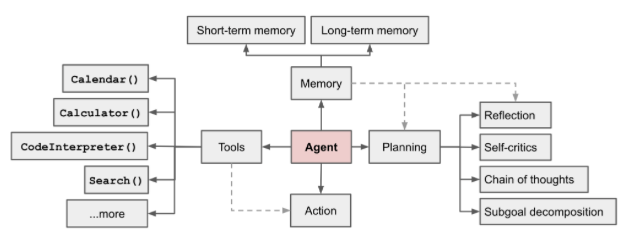

# Agents

- An agent is a system that uses an LLM as its engine, and it has access to functions called tools.
- It usually has these components:
  - An LLM to power your agent
  - A system prompt (planning): What the LLM engine will be prompted with to generate its output
    - This forms the template for how the LLM approaches a problem
  - Memory: Short-term (in-context) + Long-term (vector store + fast retrieval)
  - A toolbox from which the agent pick tools to execute. 
    - A tool consists of an input schema, and a function to run, e.g. a Python function.
  - [Source](https://lilianweng.github.io/posts/2023-06-23-agent/)
- Multi-agents, where having agents with separate tool sets and memories allows us to achieve efficient specialization.