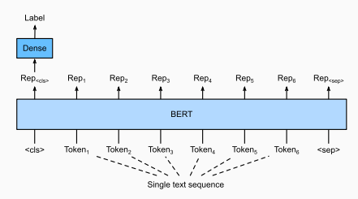
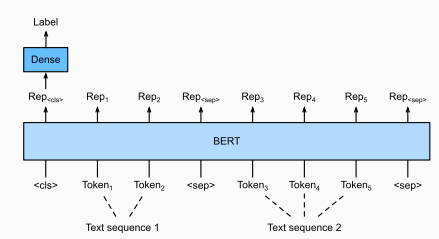
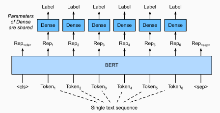
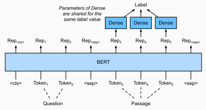

# Post Training

## Fine-Tuning
- Pretrained LLMs allow us to tackle a wide range of NLP tasks with minimal architectural changes and fine-tuning. 
- Encoder Only
  - BERT
    - Single Text Classification
      - [Source](http://d2l.ai/chapter_natural-language-processing-applications/finetuning-bert.html)
    - Text Pair Classification or Regression
      - [Source](http://d2l.ai/chapter_natural-language-processing-applications/finetuning-bert.html)
    - Text Tagging
      - [Source](http://d2l.ai/chapter_natural-language-processing-applications/finetuning-bert.html)
    - Question Answering
      - [Source](http://d2l.ai/chapter_natural-language-processing-applications/finetuning-bert.html)
      - For the Stanford Question Answering Dataset, the answer to every question is a text span from the input passage.
      - The goal is to predict the start and end of the text span.
- Encoder-Decoder
  - T5
    - "Task description" tokens can be added to input
    - Can already generate sequences with arbitrary length
    - No additional layers are needed.
- Decoder Only
  - InstructGPT/ChatGPT used RLHF to generate "human-like" responses

## Reinforcement Learning with Human Feedback (RLHF)

- See more in [Post-Training](../20_post_training/notes.md).
- Anthropic has a [paper](../21_safety/03_alignment.md) where they do this with an AI.

## LoRA

## RAG
    
## Task-specific Architectures

- The ability of pretrained LLMs to tackle a wide range of NLP tasks with minimal architectural changes largely reduces the need for crafting task-specific architectures. 
- With space and time constraints, however, one may still consider building task-specific architectures on top of pre-trained, "frozen" embeddings. For example,
  - Sentiment analysis
    - Use a [bidirectional RNN + GloVe embeddings](http://d2l.ai/chapter_natural-language-processing-applications/sentiment-analysis-rnn.html)
    - Use a [textCNN + GloVe embeddings](http://d2l.ai/chapter_natural-language-processing-applications/sentiment-analysis-cnn.html)
      - 1D Convolutions capture sequential information
  - Natural Language Inference 
    - Use an [attention-based model + GloVe embeddings](http://d2l.ai/chapter_natural-language-processing-applications/natural-language-inference-attention.html)