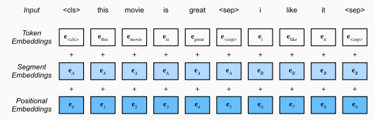

# Pre Training

## Tokenization
- Tokenization is breaking down a big chunk of text into smaller chunks. 
  - Examples of tokens are:
    - Words
    - Characters
  - In embedding, we form a vectorized representation of these tokens.
- Stemming 
  - Stemming is converting words to their stem word.
  - However, these "stems" may not be actual words
- Lemmatization 
  - Lemmatization is mapping different variants of words to its root format, where a root is an actual word.
- Subword tokens
  - fastText
    - Here, we have an embedding of all 3-6 character $n$-grams
    - A word is the sum of the embeddings of all its constituent subword embeddings
  - Byte Pair Encoding
    - fastText have subwords of a specified length, and variable vocabulary size
    - BPE starts from symbols of length 1, and iteratively merges the most frequent pair of consecutive symbols until our desired vocabulary size.
      - Allows for variable subwords
      - Fixed vocabulary size
    - Avoids out-of-vocabulary words
- In the rest of this document, we use "word" to mean "token"

## Context Independent Embeddings

- Context independent embeddings mean that each word is mapped to an embedding, regardless of its context.
- One-hot encoding
  - Doesn't encapsulate semantics / similarities between words.
- Skip-Gram
  - Predicts surrounding words based on a center word
    - Suppose we have a sequence $\{w^{(1)}, \ldots, w^{(T)}\}$
    - The likelihood is $\prod_{t=1}^T\prod_{j = -r, j\neq0}^{r} P(w^{(t+j)} \mid w^{(t)})$
      - $P(y \mid c) = \frac{\exp(\mathbf{u}_y^\top\mathbf{v}_c)}{\sum_{i \in \mathcal{V}}\exp(\mathbf{u}_i^\top\mathbf{v}_c)}$
    - Minimizing the log likelihood with gradient descent unfortunately needs us to calculate $\sum_{i \in \mathcal{V}}\exp(\mathbf{u}_i^\top\mathbf{v}_c)$ for every center word $c$.
    - Uses center word vectors $\mathbf{v}_c$ as embeddings. 
- CBOW
  - Predicts center word based on surrounding words
    - The likelihood is $\prod_{t=1}^TP(w^{(t)} \mid w^{(t-r)}, \ldots, w^{(t-1)}, w^{(t+1)}, \ldots, w^{(t+r)})$
      - $P(c \mid c_1, \ldots, c_{2r}) = \frac{\exp(\mathbf{u}_c^\top\mathbf{v}_{c'})}{\sum_{i \in \mathcal{V}}\exp(\mathbf{u}_i^\top\mathbf{v}_{c'})}$
      - $\mathbf{v}_{c'} = \frac{1}{2r}\sum_{i=1}^{2r}\mathbf{v}_{c_i}$
    - Minimizing the log likelihood with gradient descent is also computationally expensive.
    - Uses context word vectors $\mathbf{v}_c$ as embeddings. 
- Negative Sampling
  - Idea is to approximate $P(y \mid c)$ or $P(c \mid c_1, \ldots, c_{2r})$ with negative samples instead
  - This reduces computational complexity of log likelihood
  - Skip-Gram
    - $P(y \mid c) = \sigma(\mathbf{u}_y^\top\mathbf{v}_c)\prod_{k=1}^K(1 - \sigma(\mathbf{u}_{i_k}^\top\mathbf{v}_c))$, where words $i_k$ are drawn from a predefined distribution, excluding words in $c$'s context window
- GloVe
  - Adjusts for frequency of each word
  - Loss function is $\sum_{i, j \in \mathcal{V}} \left[h(x_{ij})(\mathbf{u}_j^\top\mathbf{v}_i + b_i + c_j - \log x_{ij})\right]$
    - $x_{ij}$ is the number of times $j$ appears in the context window with $i$ at the center. 
    - $h(x) = \min(1, \left(\frac{x}{c}\right)^{0.75})$
    - Intuition:
      - When $i$ and $j$ co-occur frequently, $\log x_{ij}$ is larger, we want $\mathbf{u}_j^\top\mathbf{v}_i$ to be larger, we want $\mathbf{u}_j$ to be similar to $\mathbf{v}_i$
      - $b_i$ and $c_j$ adjusts our loss function such that $\mathbf{u}_j$ and $\mathbf{v}_i$ are "invariant" to the frequency of $j$ and $i$ respectively. 
      - $h(x)$ ensures that we place more weight on more frequent co-occurrences (and also handles the $x_{ij} = 0$ scenario).
  - While the loss function is symmetric, the center word vector and context word vector are mathematically equivalent. 
    - In practice, they can be different due to different initialization values, and GloVe sums them up as the output vector

## Context Dependent Embeddings
- Context dependent embeddings allow each word's representation to be adjusted based on its context
- ELMo
  - Uses intermediate layer representations from a pretrained bidrectional LSTM
- BERT
  - Uses attention (encoder-only)
  - Task agnostic: The _same_ model can be finetuned for various tasks (need to process inputs appropriately)
  - Inputs
    - 
    - \<cls\> token prepended to input (helpful for classification tasks)
    - \<sep\> token and segment embeddings allow for paired inputs (helpful for natural language inference / question answering tasks)
  - Training
    - Masked Language Modeling
      - Loss is calculated on pre-selcted positions
      - The inputs in those positions will be replaced with:
        - A special "\<mask>" token 80% of the time: Model should infer token from only context. 
        - A random token for 10% of the time: Model should be robust to erroneous input token (in prediction, there's also no "\<mask>" token)
        - The unchanged label for 10% of the time: Model should be robust to erroneous context (alternatively, model still needs to be sensitive to original embedding)
    - Next Sentence Prediction
      - Inputs are either consecutive or non-consecutive sentences. Model needs to predict True or False
  - Additional details
    - Positional embeddings are learnt
    - Next Sentence Prediction was less useful when pretraining RoBERTa

## Model Trends
- Encoder Only
  - BERT
  - ALBERT (enforced parameter sharing)
  - SpanBERT (representing and predicting spans of text)
  - DistilBERT (lightweight via knowledge distillation) 
  - ELECTRA (replaced token detection)
- Encoder-Decoder
  - BART
  - T5
    - Pretraining T5 by predicting consecutive spans. 
    - The original sentence is “I”, “love”, “this”, “red”, “car”
    - Input is masked to “I”, “<X>”, “this”, “<Y>”
    - Target sequence is “<X>”, “love”, “<Y>”, “red”, “car”, “<Z>”
- Decoder Only
  - GPT-2
    - Pre-Layer Normalization (See [Transformer Notes](../08_attention_transformers/notes.md))
    - Intialization