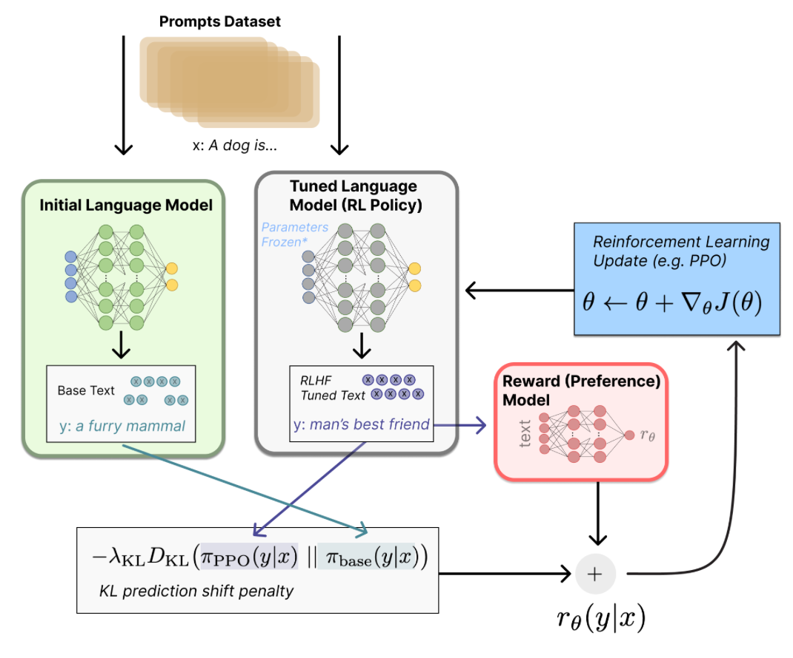

# Post Training

## Finetuning
- Encoder Only
  - BERT
    - Pretrained with tokens prepended with a "<cls" token
    - Fine-tuned with additional layers that act on "cls" token
- Encoder-Decoder
  - T5
    - "Task description" tokens can be added to input
    - Can already generate sequences with arbitrary length
    - No additional layers are needed.
- Decoder Only
  - InstructGPT/ChatGPT used RLHF to generate "human-like" responses

## RLHF

- In pretraining process, it is hard to incorporate additional (human) preferences
- 3 steps
  - Pretraining a language model (LM)
  - Gathering data and training a reward model
    - Gather data
      - Prompt LMs with prompts $x$
      - Gather responses $y$
      - Get human rankings
    - Train a reward model
      - Can be any model
      - Why do we need this? Ideally in the next step, we can have a reward/rank for any $y \mid x$, but that's prohibitively expensive.
  - Fine-tuning the LM with reinforcement learning
    - [Source](https://huggingface.co/blog/rlhf)
    - Some parameters of the LM are frozen because fine-tuning an entire 10B or 100B+ parameter model is prohibitively expensive
    - State: $x$
    - Action: $y$
    - Policy: $\pi_{PPO}(y \mid x)$
    - Why is this RL? 
      - If we have a dataset of $(y,x)$ pairs, this can be couched as supervised learning.
      - The key here is that the model itself generates $y \mid x$. 
        - We then also need the KL divergence term to prevent the model from just generating gibberish that just tricks the imperfect reward model. 

## LoRA

## RAG
    