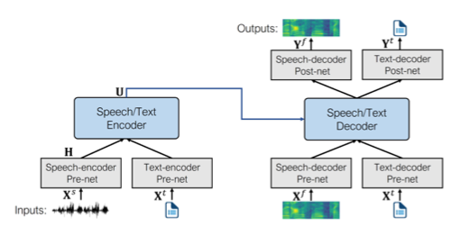
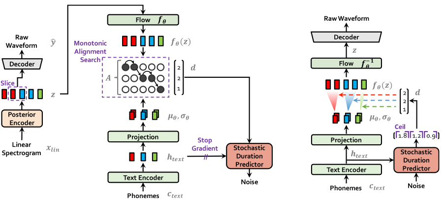
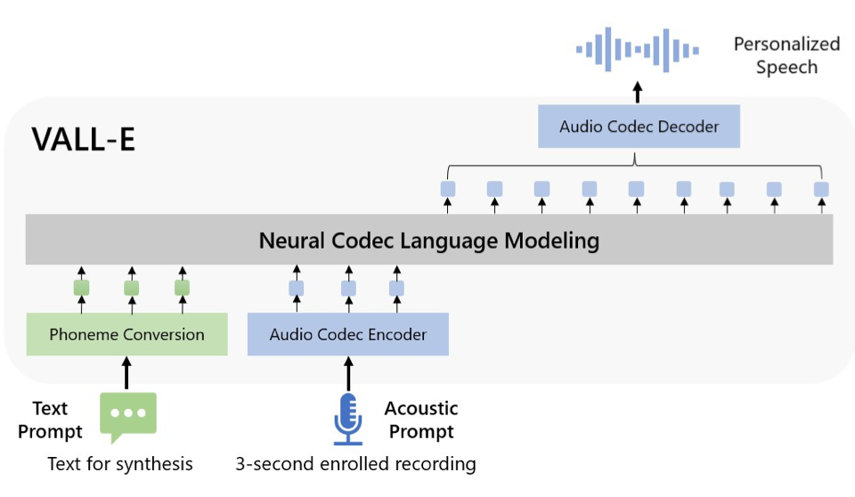

# Audio

## Forms
- Waveform: Amplitudes over time, high sampling rate
- Spectrogram (via Short Time Fourier Transform): Amplitudes, frequency on y-axis, time on x-axis
  - Mel-spectrogram: Non-linear frequency scaling (somewhat log)
  - Log-mel spectrogram: Decibels (log)

## Streaming
- Audio datasets are large
- Streaming allows us to load the data progressively as we iterate over the dataset. 
- Advantages:
  - Disk space: No requirements
  - Download and processing time: can start using the dataset as soon as the first example is ready
  - Easy experimentation: you can experiment on a handful of examples within the dataset

## Applications
- Audio classification
- Automatic speech recognition (ASR)
  - Speech to text
- Speaker diarization (identify speaker)
  - Classifying speakers
- Text to speech (TTS)

## Transformer Architectures
- Connectionist Temporal Classification (CTC)
  - Encoder-only transformer models with a CTC head for ASR 
  - Examples: Wav2Vec2, HuBERT and M-CTC-T
  - Map each segment of audio to a character
  - CTC algorithm uses a blank token, which serves as a hard boundary between groups of characters. We dedup each group to get text. 
- Seq2Seq
  - Encoder-decoder model for STT or TTS
  - Examples: Whisper (STT)
  - For TTS, predicts both spectrogram and stop probability  
- ViT
  - Classification
  - Examples: Audio Spectrogram Transformer

## Pre-Trained Models
- Audio classification
  - XLS-R (encoder-only), Audio Spectrogram Transformer, Whisper, pyannote
  - pyannote
    - Does speaker diarization by first doing local speaker segmentation, then local speaker embedding, and agglomerative clustering.
  - Zero-shot audio classification: classify new examples from previously unseen classes, e.g. CLAP
- ASR
  - Wav2Vec2, Whisper
- TTS
  - SpeechT5 (encoder-decoder), Bark, Massive Multilingual Speech (MMS) (VAEs + NF), Vall-E (decoder)
  - SpeechT5
    - [Source](https://arxiv.org/pdf/2110.07205)
    - Pre-train with unlabelled audio data
    - Post-train for each individual task
  - Bark
    - Leverages Encodec, which can reconstruct audio from codebooks. Bark generates codebooks from text.
    - `BarkSemanticModel` (text model) takes tokenized text and predicts semantic text tokens
    - `BarkCoarseModel` takes semantic text tokens and predicts the first two audio codebooks necessary for EnCodec
    - `BarkFineModel` iteratively predicts the last codebooks based on the sum of the previous codebooks embeddings
  - MMS
    - [Source](https://arxiv.org/pdf/2106.06103)
  - Vall-E
    - [Source](https://arxiv.org/pdf/2301.02111)