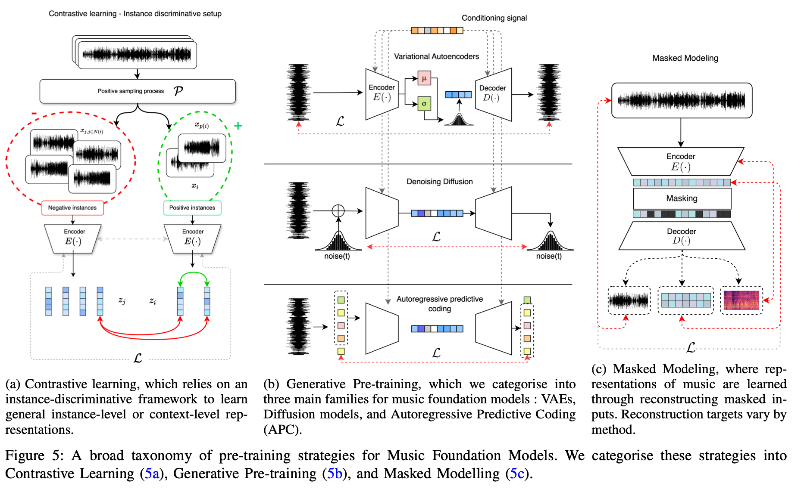
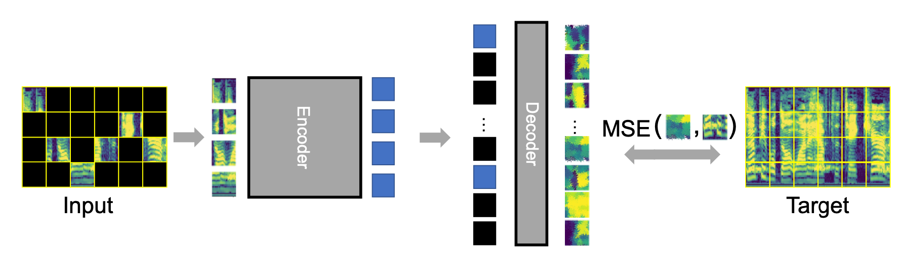
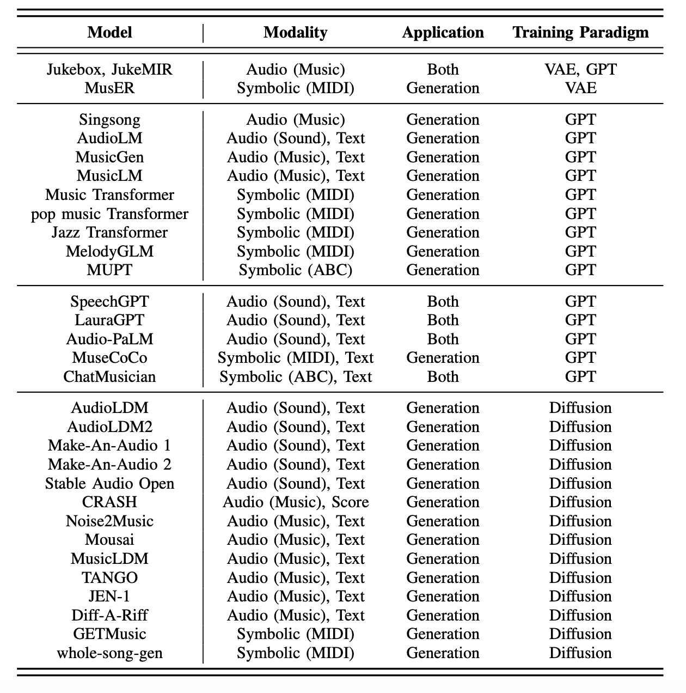
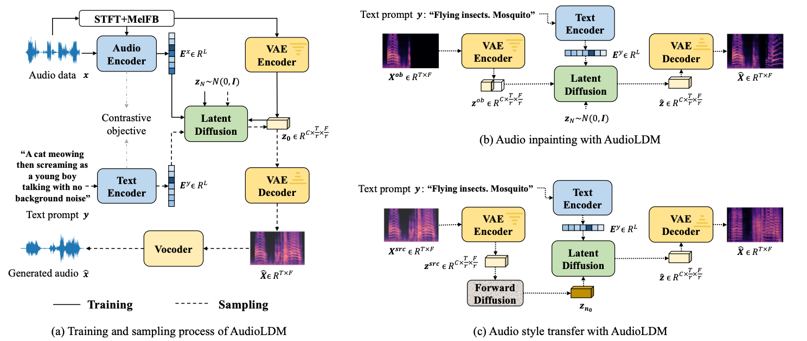
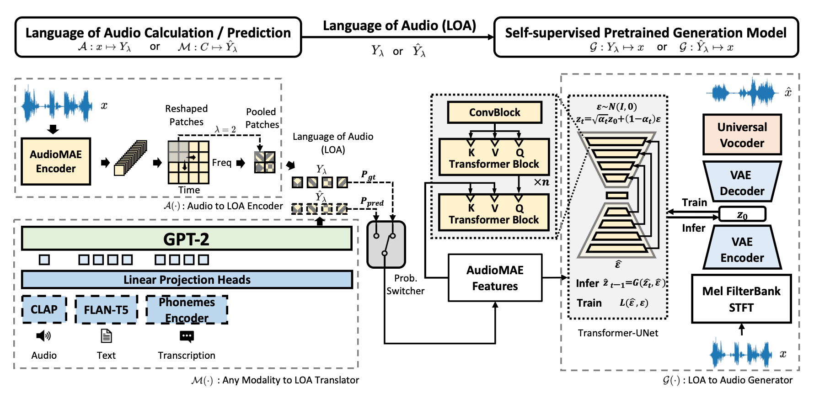
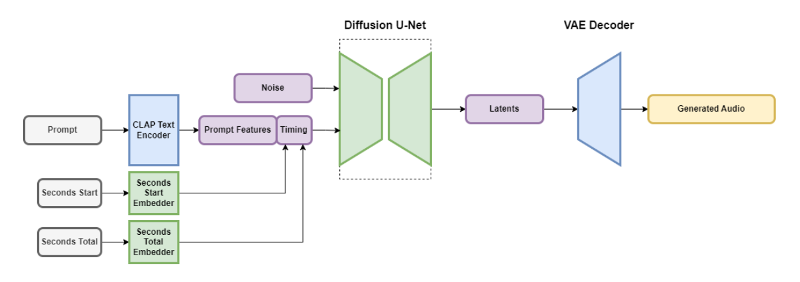
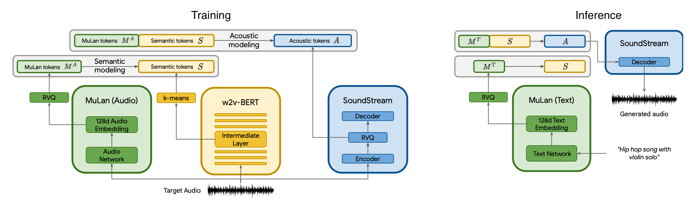
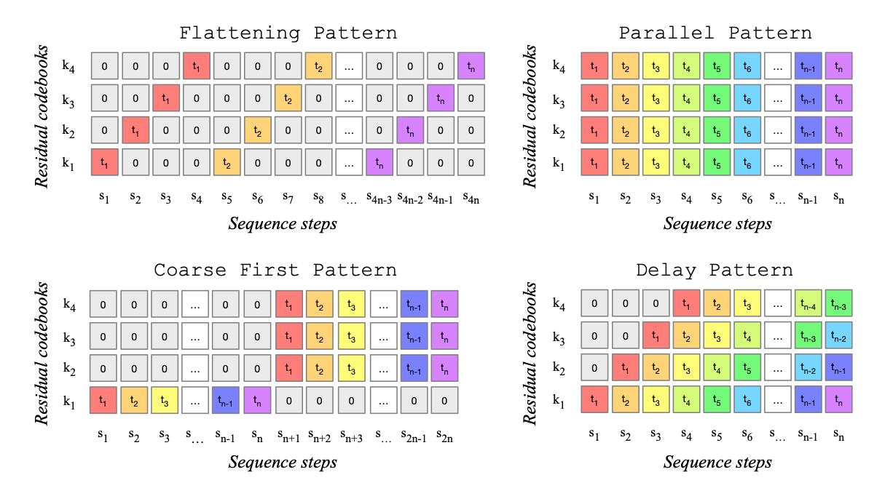

# Music 

- I have found [Foundation Models for Music: A Survey](https://arxiv.org/pdf/2408.14340) to be very helpful in understanding this space.

## Tokenizers

- Hand-crafted: Spectrogram
  - We use a vocoder (e.g. HiFi-GAN) to convert spectrograms back into audio
  - A chromagram is also sometimes used, although this causes a loss in information
- Continuous Audio Tokens
  - Commonly used for audio understanding and diffusion model-based audio generation tasks
  - CLAP, Wav2Vec
  - AudioMAE
- Discrete Audio Tokens
  - Commonly used for language model-based audio generation tasks
  - SoundStream, Encodec

## Pre-Training Strategies

- [Source](https://arxiv.org/pdf/2408.14340)
- Contrastive Learning
  - Models like CLAP, MusCALL, and MuLan jointly embed audio and text, training the model with a [contrastive learning](../15_contrastive_learning/notes.md) objective. 
  - CLAP slices data to deal with variable length audio
- Masked Modeling
  - This is also used to enhance our understanding of audio.
  - AudioMAE
    - 
  - MERT
- Generative Models
  - [Source](https://arxiv.org/pdf/2408.14340)
  - Autoencoders
    - Neural audio codecs use [VQ-VAEs](../09_autoencoders/notes.md) to learn a codebook of discrete audio tokens that can efficiently represent audio signals
    - EnCodec, SoundStream, Descript Audio Codec
  - Diffusion
    - AudioLDM
      - 
      - Outside of the audio-specific STFT/MelFB/Vocoder components, this is very similar to LDMs 
      - Note, however, that an important difference is the additional conditional of audio encoding $E^{\mathbf{x}}$, which is used to compensate for the lack of captioned audio data (versus that of images)
    - MusicLDM
      - Retrain CLAP on music data
      - Proposes a mixup strategy to enhance diversity and novelty in output generations
        - The work also demonstrates that mixing up in a beat-synchronous manner (either in the input or latent space) yields superior results
      - Admittedly the choice to only use audio encodings $E^{\mathbf{x}}$ in AudioLDM seems arbitrary
        - MusicLDM tried using just text, or audio which is then fine-tuned on text.
        - These performed similarly / worse than just using audio per AudioLDM.
    - Moûsai
      - Uses a diffusion autoencoder to better capture long range context and create high-quality 48kHz music.
        - Autoencoder: auto-encode magnitude spectrogram into a latent representation
        - Diffusion: 
          - We corrupt the original audio with a random amount of noise, and train our 1D U-Net to remove that noise.
          - During the noise removal process, we condition the U-Net on the noise level and the compressed latent, which can have access to a reduced version of the non-noisy audio.
        - Also uses an efficient and enriched 1D U-Net
    - AudioLDM2
      - 
      - In training, we replace the audio encodings $E^{\mathbf{x}}$ in AudioLDM with AudioMAE Features
        - These capture semantic information, unlike the acoustic tokens in the VAE. 
      - Text
        - Previously, we used CLAP embeddings, which allow us to pass in text during sampling. 
        - However, we have now replaced our audio embeddings with AudioMAE. 
        - Therefore, we need to map text to the same embedding space.
        - AudioLDM2 does this by fine-tuning a GPT2 model, conditioned on text, audio or phoneme data, to predict the sequential output of an AudioMAE encoder. 
        - This shared sequential conditioning space is dubbed the ”Language of Audio”, which again we can think of as semantic audio tokens.
    - Stable Audio
      - Diffusion models are usually trained to generate a fixed-size output
      - [Source](https://stability.ai/research/stable-audio-efficient-timing-latent-diffusion)
      - This is similar to AudioLDM but instead of using audio encoding $E^{\mathbf{x}}$ they use text encodings. Per MusicLDM this should be worse, but this may be dependent on model/data. 
      - Conditions on music start time and duration
    - Stable Audio 2
      - Upscales stable audio by using a Diffusion Transformer instead ot the U-Net
  - Autoregressive Predictive Coding
    - AudioLM
      - Soundstream encoder to extract acoustic tokens
        - The Soundstream encoder and decoder serves the same function as the VAE in AudioLDM. 
      - k-means-clustered w2v-BERT to extract semantic tokens
        - Paper has some analysis for why the tokens are "categorized" as such
      - Cascades three autoregressive transformer models
        - First predict semantic tokens, then coarse acoustic tokens, then finegrained tokens (See MusicLM for diagram)
      - In inference, we pass in semantic tokens which can either be sample unconditionally or extracted from a test sample. 
    - MusicLM
      - [Source](https://arxiv.org/pdf/2301.11325)
      - Similar to AudioLM, but with possible text/melody conditioning using MuLan
      - Melody conditioning is done by training an additional melody embedding model that concatenates melody embeddings with those from the MuLan encoder
        - This is trained with a contrastive objective using a dataset of paired audio datapoints, derived from musical covers
        - The paper doesn't cover how the model learns to use these embeddings, I suspect this is either done in pre or post-training and omitted in the paper. 
        - As to why we cannot feed this in directly into MuLan, I suspect that doing so may cause the model to copy more than the melody (see MusicGen)
    - Jukebox
      - Trains 3 VQ-VAE models separately on 3 temporal resolutions of music
      - Three autoregressive transformers are used to model these sequences, each conditioned on tokens from the one-level-coarser transformer model.
    - MusicGen 
      - [Source](https://hackernoon.com/musicgen-from-meta-ai-understanding-model-architecture-vector-quantization-and-model-conditioning)
      - Trained to model sequences of Encodec tokens 
      - Conditioning
        - Text: Experimented with T5 encoder, FLAN-T5, and CLAP.
        - Melody: Took audio, decomposed into drums, bass, vocals, and other, removed drums and bass, quantized to chromagram, and took dominant time-frequency bin in each time step (to prevent overfitting).
      - Token interleaving patterns to alleviate the computational costs of generating multiple codebook streams.
        - [Source](https://arxiv.org/pdf/2306.05284)
        - Codebooks allow us to encode more information for a fixed number of code books.
        - However, for each codebook, we now need to predict its contribution at multiple timesteps. 
        - Typically, we would do this sequentially (flattening), but we could trade off accuracy for efficiency by predicting these in parallel. 

## Music Domain Adaptation for Foundation Models

- There has been applications of PEFT like LoRA/prefix/prompt tuning, adaptors and full-tuning, instruction tuning, etc. in the music domain.

## Interpretability & Controllability on Music Generation

- Learn a latent space of implicit music concepts
  - [PianoTree VAE](https://arxiv.org/pdf/2008.07118) finds that 
    - Notes order themselves in a helix according to pitch
    - Different durations of the same note form a fractal parallelogram
    - 12 major chords arrange themselves in 4 clusters, where each cluster is formed of 3 chords a major third apart. 
    - The 7 triad chords of a key are arranged in a ring structure where moving counter-clockwise moves us up by thirds.
  - [Wei](https://arxiv.org/pdf/2410.00872) finds evidence that Jukebox and MusicGen's latent representations contain rich information about notes, intervals, scales, chords, chord progressions, tempos, and time signatures (in that a classifier built on these latents can accurately predict properties of the encoded music)
  - Potential for future interpretability work:
    - [Lin et al. (2021)](https://arxiv.org/pdf/2108.03456) separates pitch and timbre, although they do not investigate what these latent features look like. 
    - MusicLM and MusicGen allow for melodic conditioning. Investigating this latent space for tunes with similar/dissimilar melodies might be interesting.
- Controllability
  - In general, the models described above have detailed ways that we can condition our music generation with text, transcription, or audio. 
  - This section can be considered an extension, where we focus on a specific musical quality we want to imbue in our generation. 
  - MusicLM and MusicGen, as described above, allows us to pass in melodies. 
  - MusicControlNet allows for time-varying rhythm, melody dynamics, and textual cues to generate music.
    - To allow for ease of training, it seems like we can only control for things we can easily extract, e.g. dynamics is the energy of the waveform.
  - AIRGen and CocoMulla show that we can condition on drum tracks, chord progressions and piano rolls (MIDI).
    - One difference is that AIRGen first converts all conditioners to audio and adds them to input audio, while CocoMulla conditions using embedding.

## Foundation Models as Music Agents

- MusicAgent
- AudioGPT additionally enables audio input
- Loop Copilot features a conversational interface for dynamic, iterative music editing, and a global attribute table to ensure consistency throughout the creation process.
  - It also allows for fine-grained musical edits, including adding or removing tracks and making localised adjustments to modes and tempos.
- Audio-Agent decomposes prompts into atomic instructions with a focus on specifying temporal details for the generator
- ComposerX
  - Pre-generates prompts that provide the model musical knowledge a user may not provide
  - Multi-agent specialization and refinement
- ByteComposer
  - 4 steps: Conception analysis, draft composition, self-evaluation and modification, aesthetic selection
  - Music-theory related prompts
  - Multi-module: Expert, Generator, Voter, Memory

## Challenges

- Domain Knowledge
  - Input modification
    - The music transformer uses relative positional self attention, although RoPE somewhat achieves this. 
    - [Guo](https://arxiv.org/pdf/2212.00973) uses embeddings that influenced by relative pitch and duration, and positional embeddings that account for absolute offset (default doesn't) and beat.
  - Layer modification
    - [Scale-invariant convolutions](https://arxiv.org/pdf/2102.02282) are useful for downbeat tracking.
- Long Sequence Modeling
  - I see this as an opportunity for more domain knowledge
  - We can break a song into subsections and model those hierarchically ([idea](../26_personal_projects/music_hierarchical_subsections/notes.md)).

## Research Ideas

- I have used [this folder](../26_personal_projects) as a "scratchpad" for some research directions I'm interested in. 