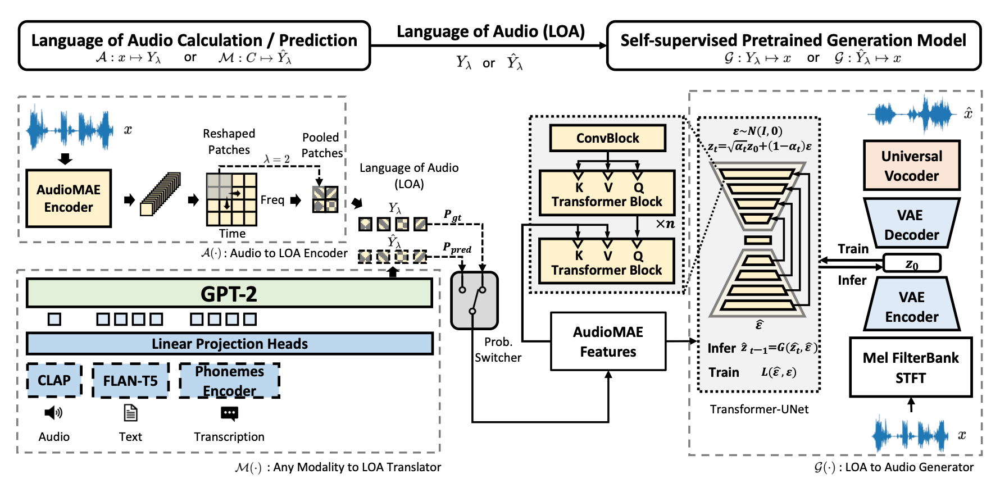
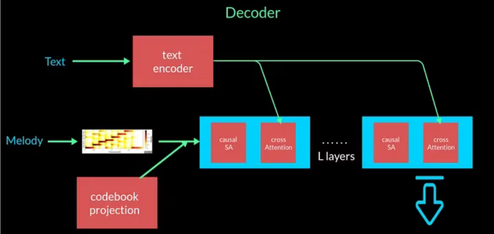

# Audio 

- Due to personal interest, this section will have a heavy tilt toward generative music.
- I have found [Foundation Models for Music: A Survey](https://arxiv.org/pdf/2408.14340) to be very helpful in understanding this space.
- Most of the time, we decompose audio into a spectrogram and treat it like an image. 
  - We use a vocoder to convert spectrograms back into audio
  - A chromagram is also sometimes used, although this causes a loss in information

## Pre-Training Strategies

- [Source](https://arxiv.org/pdf/2408.14340)
- Contrastive Learning
  - Models like CLAP, MusCALL, and MuLan jointly embed audio and text, training the model with a [contrastive learning](../15_contrastive_learning/notes.md) objective. 
  - CLAP slices data to deal with variable length audio
- Generative Models
  - [Source](https://arxiv.org/pdf/2408.14340)
  - Autoencoders
    - Neural audio codecs use [VQ-VAEs](../09_autoencoders/notes.md) to learn a codebook of discrete audio tokens that can efficiently represent audio signals
    - EnCodec, SoundStream, Descript Audio Codec
  - Diffusion
    - AudioLDM
      - 
      - Outside of the audio-specific STFT/MelFB/Vocoder components, this is very similar to LDMs 
      - Note, however, that an important difference is the additional condition of audio encoding $E^{\mathbf{x}}$, which is used to compensate for the lack of captioned audio data (versus that of images)
    - MusicLDM
      - Retrain CLAP on music data
      - Proposes a beat-synchronous mixup strategy to enhance diversity and novelty in output generations.
    - AudioLDM2
      - 
      - We replace the audio and text encodings $E^{\mathbf{x}}$ and $E^{\mathbf{y}}$ with AudioMAE Features
      - By finetuning a GPT2 model to predict the sequential output of an AudioMAE encoder conditioned on text, audio or phoneme data, AudioLDM2 creates a shared sequential conditioning space dubbed ”Language of Audio”
      - Self-supervision?
    - Stable Audio
      - Diffusion models are usually trained to generate a fixed-size output
      - [Source](https://stability.ai/research/stable-audio-efficient-timing-latent-diffusion)
      - Conditions on music start time and duration
      - Uses a memory-efficient attention implementation
    - Stable Audio 2
      - Upscales stable audio 1 by using a Diffusion Transformer Architecture
  - Autoregressive Predictive Coding
    - AudioLM
      - Soundstream encoder to extract acoustic tokens
      - k-means-clustered w2v-BERT to extract semantic tokens
      - Cascades three autoregressive transformer models
        - First predict semantic tokens, then coarse acoustic tokens, then finegrained tokens
    - MusicLM
      - Similar, but with possible text conditioning using MuLan
    - s
    - Jukebox
      - Trains 3 VQ-VQE models on 3 temporal resolutions of music
      - Three autoregressive transformers are used to model these sequences, each conditioned on upsampled tokens from the one-level-coarser transformer model.
    - MusicGen 
      - [Source](https://hackernoon.com/musicgen-from-meta-ai-understanding-model-architecture-vector-quantization-and-model-conditioning)
      - Trained to model sequences of Encodec tokens 
      - Token interleaving patterns to alleviate the computational costs of generating multiple codebook streams.
    - MusicLM
      - 
  - Masked Modeling
    - This is also used to enhance our understanding of audio.
    - MERT
      - s

## Music Domain Adaptation for Foundation Models

- There has been applications of prefix/prompt tuning, adaptors and full-tuning, instruction tuning, etc. in the music domain.

## Audio Tokenizers

- Hand-crafted: Spectrogram
- Continuous Audio Tokens
  - Usually used for audio understanding and diffusion model-based audio generation tasks
  - Wav2Vec
  - AudioMAE
- Discrete Audio Tokens
  - Commonly used for language model-based audio generation tasks
  - SoundStream, Encodec

## Interpretability & Controllability on Music Generation

- Use representation learning models to learn a latent space of implicit music concepts, such as pitch contour, accompaniment texture ("Structured Representation Learning for Polyphonic Music") and timbre ("A uni- fied model for zero-shot music source separation, transcription and synthesis.")
- CocoMulla and AirGen focus on generating music from chords, drums, piano rolls, and text inputs. 
- MusicControlNet considers rhythm, melody dynamics, and textual cues to generate music.
- DO MUSIC GENERATION MODELS ENCODE MUSIC THEORY?: https://arxiv.org/pdf/2410.00872
- Scale-invariant convolutions: https://arxiv.org/pdf/2102.02282
- Steerable https://arxiv.org/pdf/2402.09508

## Foundation Models as Music Agents

- MusicAgent integrates diverse models and an autonomous workflow to address various music tasks like generation, transcription, and conversion. It simplifies the complex process for professionals and amateurs by analyzing requests, decomposing them into subtasks, and invoking external tools to fulfil these tasks.
- AudioGPT focuses on audio modality and leverages a large language model to process different audio modalities (speech, music, sound) and handle dif- ferent audio understanding and generation tasks. For music tasks, it supports singing voice synthesis by calling external music models.
- Loop Copilot introduces an innovative system combining large language models with specialised AI music models to streamline the collaborative creation of music loops. This system utilises a conversational interface for dynamic, iterative music editing, and a global attribute table to ensure consistency throughout the creation process. Besides, it is not limited to creating music based on vague text inputs but allows for fine- grained musical edits, including adding or removing tracks and making localised adjustments to modes and tempos. This capability enhances the system’s utility in detailed music production tasks.
- ComposerX introduces a novel multi-agent framework for polyphonic notated music composition, utilising the reasoning power of large-scale language models as well as extensive knowledge of music history and theory. This approach produces high-quality, coherent compositions better than traditional single-agent systems, and requires no specialised training or services, making it a cost-effective alternative.
- ByteComposer pioneers a human-like melodic composition process using a four-step agentic framework: conceptual analysis, draft composition, self-assessment, and aesthetic selection. ByteComposer combines the interactive and knowledge-understanding capabilities of LLMs with symbolic music modelling to achieve perfor- mance comparable to that of a human composer and is extensively validated through professional feedback.
- Audio-Agent

## Challenges

- Domain Knowledge
  - Input modification
    - pitch interval, duration and onset - " A domain- knowledge-inspired music embedding space and a novel at- tention mechanism for symbolic music modeling."
    - Bars "Project magenta: Generating long-term structure in songs and stories, 2016"
    - Relative positional encoding "Music transformer" - Huang
- Long Sequence Modeling
  - I see this as an opportunity for more domain knowledge
  - We can break a song into subsections and model those hierarchically. 

https://www.assemblyai.com/blog/recent-developments-in-generative-ai-for-audio/