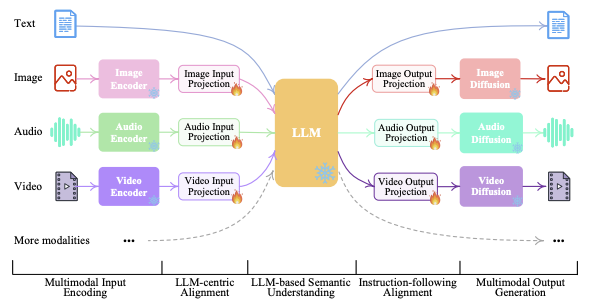

# Multimodality

- Multimodal can mean one or more of the following:
  - Input and output are of different modalities (e.g. text-to-image, image-to-text)
  - Inputs are multimodal (e.g. a system that can process both text and images)
  - Outputs are multimodal (e.g. a system that can generate both text and images)
- In general, this repo mainly contains notes about image and language processing. As such, this document will also serve to store notes regarding other modes like audio and video, which I envision would have their own dedicated sections in the future. 

## Multimodal Input to Multimodal Output
- Today, many LMMs support multimodal input to multimodal output processes. 
- NExT-GPT 
  - [Source](https://arxiv.org/pdf/2309.05519)
  - Provides a hint as to how LMMs support any-to-any processes. 
    - Encoder: Encodes multimodal inputs into the same embedding space
    - Transformer: Produces output embedding
    - Decoder: Decodes output embedding into multimodal outputs

### Encoders

- CLIP
- CLAP
- ImageBind

### Transformer 

- Can output
  - Multimodal tokens
  - Intermediate representation, e.g. text, which form "instructions" for decoders

### Decoders

- Stable Diffusion
- Zeroscope
- Audio LDM

### Training

- Each separate "component" can be pretrained with their own training algorithm, which we detail in prior sections. 
- For the full model, we now have to define a objective to allow us to train these components together.

## Audio

- Music Generation
  - Most of the papers I've read here use a [diffusion](../10_diffusion/notes.md) model to generate music from noise.
  - [MusicGen](https://arxiv.org/pdf/2306.05284) does so with a "pure" transformer architecture
    - [Source](https://hackernoon.com/musicgen-from-meta-ai-understanding-model-architecture-vector-quantization-and-model-conditioning)