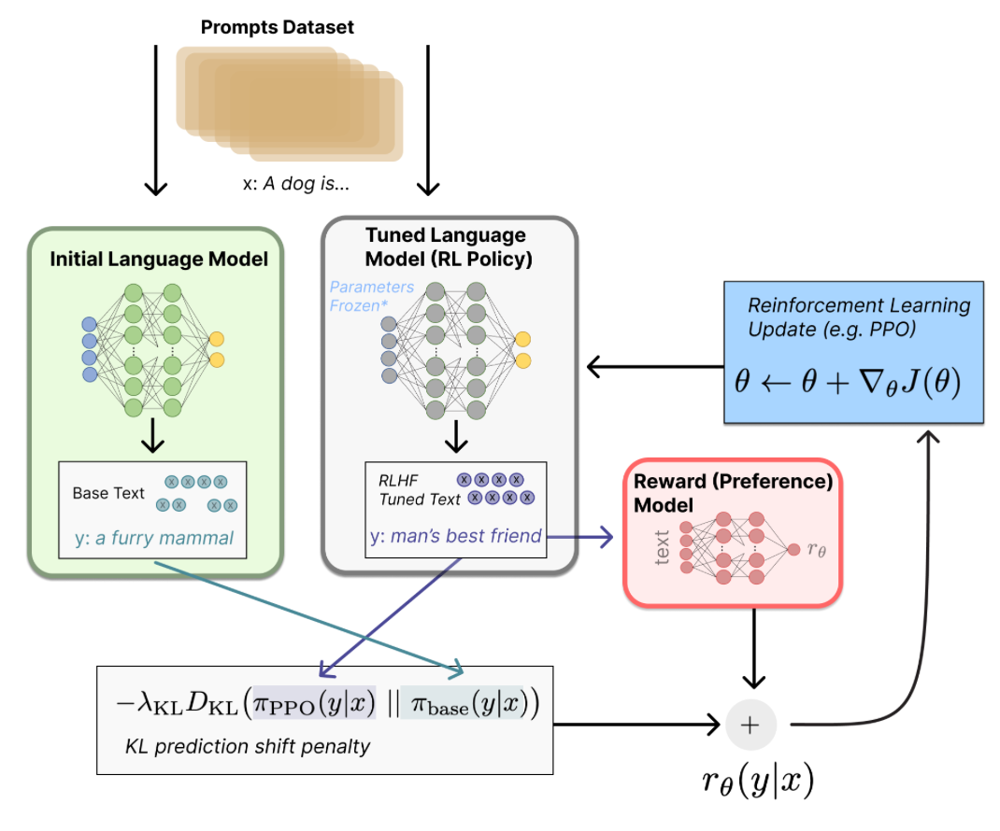

# Post-Training

- Post-Training  is a set of processes and techniques that refine and optimize a machine learning model after it's been trained.

## Model Optimization

- Quantization
  - Quantization is a technique to reduce the computational and memory costs of running inference by representing the weights and activations with lower-precision data types.
    - Quantization-aware Training (QAT) is a way of training that simulates quantization whilst training
    - Also see [Mixed Precision Training](../23_compuational_performance/notes.md)
  - Double quantization is when we quantize the scaling factors from the first quantization.
    - QLoRA combines double quantization with LoRA.
- Pruning
  - Pruning is a technique that removes less important connections, neurons, or structures from a trained model 

## Guidance

- Take an existing model and steer the generation process at inference time for additional control.
  - It's important to remember that we're _not_ changing the model internals. 
    - For example, the model already has the ability to generate the conditioned outputs, we're instead restricting the inputs to guide this generation process. 
- (input) -> (output) -> (compute loss of output against objective), then backpropagate.
- Soft-prompting (typically classified in parameter efficient fine-tuning, but I think it fits better here)
  - "Prompting" is discrete because changing a prompt represents a discrete "jump" from embedded vectors to another
  - Soft-prompting is then editing (e.g. concatenating) an input with a continuous vector that we can edit in backpropagation
  - Prompt-Tuning: Concatenate prefix vector only to input embedding
  - P-Tuning: Inserts vector anywhere, only to input embedding
  - Prefix-Tuning: Concatenate prefix vector for each transformer block
- See more specific examples in [Diffusion](../10_diffusion/notes.md). 

## Fine-Tuning

- Re-train existing models on new data to change the type of output they produce.
- This usually involves one of the following options:
  - Adding/Replacing a few output layers
  - Freezing a portion of weights (Parameter Efficient Fine-Tuning)
- Parameter Efficient Fine-Tuning (PEFT)
  - Adapters: Adding layers after FFN layers in a transformer block.
  - LoRA
    - Suppose we only finetune our linear layers, excluding bias terms, converting weight $W \in \mathbb{R}^{a \times b}$ to $W'$
    - We can reparameterize $W'$ as $W + \Delta W$
    - LoRA is a low rank approximation of $\Delta W = AB$, $A \in \mathbb{R}^{a \times r}, B \in \mathbb{R}^{r \times b}$
    - We can then freeze our original model, and focus on training $A$ and $B$ matrices for each of our linear layers.
    - LoRA does not increase inference latency because weights can be merged with the base model. 
  - IA3
    - Rescales (element-wise) activations of key vectors, query vectors and MLP hidden activations.
- See examples in [Diffusion](../10_diffusion/notes.md), [NLP](../17_nlp/post_training.md), and [CV](../16_computer_vision/notes.md).

## Reinforcement Learning with Human Feedback (RLHF)

- In pretraining process, it is hard to incorporate additional (human) preferences
- 3 steps
  - Pretraining a language model (LM)
  - Gathering data and training a reward model
    - Gather data
      - Prompt LMs with prompts $x$
      - Gather responses $y$
      - Get human rankings
    - Train a reward model
      - Can be any model
      - Why do we need this? Ideally in the next step, we can have a reward/rank for any $y \mid x$, but that's prohibitively expensive.
  - Fine-tuning the LM with reinforcement learning
    - [Source](https://huggingface.co/blog/rlhf)
    - Some parameters of the LM are frozen because fine-tuning an entire 10B or 100B+ parameter model is prohibitively expensive
    - State: $x$
    - Action: $y$
    - Policy: $\pi_{PPO}(y \mid x)$
    - Why is this RL? 
      - If we have a dataset of $(y,x)$ pairs, this can be couched as supervised learning.
      - The key here is that the model itself generates $y \mid x$. 
        - We then also need the KL divergence term to prevent the model from just generating gibberish that just tricks the imperfect reward model. 

## Retrieval-Augmented Generation (RAG)