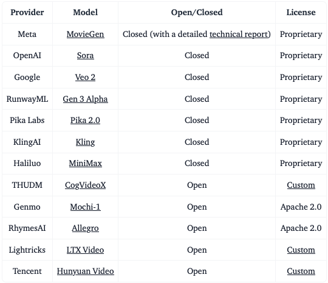

# Video

- Vs Image
  - Video generation is more complex because of the added dimension of time and the requirement for motion to be consistent over time. 
  - In generation, video models either condition each frame on previous ones, or generate a sequence as a whole, incorporating the dynamics of movement and change acros time. 
  - 3D convolutional kernels are commonly used
- Encoding
  - [Flamingo](https://arxiv.org/pdf/2204.14198) samples frames and encodes them independently to which learned temporal embeddings are added. 
- Decoding
  - $\mathbf{v}$-parameterization
    - $q\left(\mathbf{z}_t \mid \mathbf{x}\right)=\mathcal{N}\left(\mathbf{z}_t ; \alpha_t \mathbf{x}, \sigma_t^2 \mathbf{I}\right)$
    - $\mathbf{z}_\phi=\cos \phi \mathbf{x}+\sin \phi \pmb{\epsilon}$, for a variance preserving process where we sub $\alpha_\phi=\cos \phi, \sigma_t=\sin \phi$
    - $\mathbf{v}_\phi=\nabla_\phi \mathbf{z}_\phi=\frac{d \cos \phi}{d \phi} \mathbf{x}+\frac{d \sin \phi}{d \phi} \pmb{\epsilon}=\cos \phi \pmb{\epsilon}-\sin \phi \mathbf{x}$
    - We can rewrite the DDIM sampling equation as:
      - $\mathbf{z}_{\phi_s}=\cos \left(\phi_s-\phi_t\right) \mathbf{z}_{\phi_t}+\sin \left(\phi_s-\phi_t\right) \hat{\mathbf{v}}_\theta\left(\mathbf{z}_{\phi_t}\right)$
  - Video Diffusion Models
    - We want to sample a second video $\mathbf{x}^b$ conditioned on the first $\mathbf{x}^a, \mathbf{x}^b \sim p_\theta(\mathbf{x}^b \mid \mathbf{x}^a)$, where $\mathbf{x}^b$ might be an autoregressive extension of $\mathbf{x}^a$ or be the missing frames in-between for a video $\mathbf{x}^a$ at a low frame rate.
    - Reconstruction guidance:
      - $\tilde{\mathbf{x}}_\theta^b\left(\mathbf{z}_t\right)=\hat{\mathbf{x}}_\theta^b\left(\mathbf{z}_t\right)-\frac{w_r \alpha_t}{2} \nabla_{\mathbf{z}_t^b}\left\|\mathbf{x}^a-\hat{\mathbf{x}}_\theta^a\left(\mathbf{z}_t\right)\right\|_2^2$
        - Instead of $\mathbb{E}_q\left[\mathbf{x}^b \mid \mathbf{z}_t\right],$ we want $\mathbb{E}_q\left[\mathbf{x}_b \mid \mathbf{z}_t, \mathbf{x}^a\right]=\mathbb{E}_q\left[\mathbf{x}^b \mid \mathbf{z}_t\right]+\frac{\sigma_t^2}{\alpha_t} \nabla_{\mathbf{z}_t^b} \log q\left(\mathbf{x}^a \mid \mathbf{z}_t\right)$ for temporal consistency.
        - We assume $q\left(\mathbf{x}^a \mid \mathbf{z}_t\right) \approx \mathcal{N}\left[\hat{\mathbf{x}}_\theta^a\left(\mathbf{z}_t\right), \frac{\sigma_t^2}{\alpha_t^2} \mathbf{I}\right]$
      - Note that it is also possible to simultaneously condition on low resolution videos to extend samples to be at the high resolution using the same reconstruction guidance method.
    - VDM extends the 2D U-net to work for 3D data, factorizing it over space and time
      - Space: Each old 2D convolution layer as in the 2D U-net is extended to be space-only 3D convolution; precisely, 3x3 convolutions become 1x3x3 convolutions.
      - Time: A temporal attention block is added after each spatial attention block. It performs attention over the frame axis and treats spatial axes as the batch dimension. The relative position embedding is used for tracking the order of frames.
  - Here are some popular video models:
    - [Source](https://huggingface.co/blog/video_gen)
  - It is relatively straightforward to generate models with Hugging Face ([guide](https://huggingface.co/docs/diffusers/en/using-diffusers/text-img2vid)).