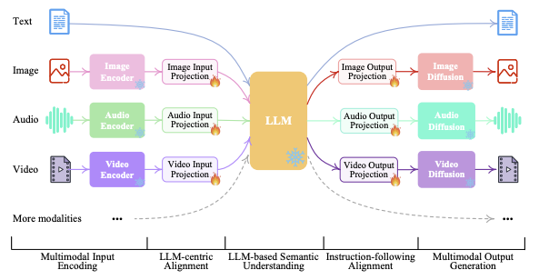

# Multimodality

- Multimodal can mean one or more of the following:
  - Input and output are of different modalities (e.g. text-to-image, image-to-text)
  - Inputs are multimodal (e.g. a system that can process both text and images)
  - Outputs are multimodal (e.g. a system that can generate both text and images)

## Multimodal Input to Multimodal Output
- Today, many LMMs support multimodal input to multimodal output processes. 
- Case Study: NExT-GPT 
  - [Source](https://arxiv.org/pdf/2309.05519)
  - Provides a hint as to how LMMs support any-to-any processes. 
    - Rough architecture
      - Encoder: Encodes multimodal inputs into the same embedding space
      - LLM: Produces "next token" embedding
      - Decoder: Decodes output embedding into multimodal outputs
    - Training
      - All at once
        - Much like a text-to-text transformer, one can think of the model as taking in multimodal tokens as input and multimodal tokens as output. 
        - Mathematically, I envision the loss function here to just be the usual cross-entropy loss in next token prediction. 
        - I don't know if this is being done or if it is too difficult (some explanation in CLIP below)
      - Decompose and link
        - Another method is to train each component (encoder, LLM, decoder) separately, and then "link" them together, such that the output of one component aligns with the input of another. 
        - While this introduces more moving parts, it probably is easier to understand model failure and makes the overall model more controllable. 
        - As done in NExT-GPT, this also allows us to leverage pretrained models for each section.
        - Loss Function:
          - If we're training all components:
            - $L(Overall) = L(Encoder) + L(LLM) + L(Decoder) + L(Encoder-LLM) + L(LLM-Decoder) + L(Encoder-Decoder)$
          - If we're freezing parameters for pretrained components:
            - $L(Overall) = L(Encoder-LLM) + L(LLM-Decoder) + L(Encoder-Decoder)$
            - We also have to introduce layers to link these components together as per NExT-GPT. 
          - Something in between

### $L(Encoder)$

- Typically uses [contrastive learning](../15_contrastive_learning/notes.md) to learn embeddings.
- [CLIP/CLAP](../15_contrastive_learning/notes.md)
- ImageBind
  - ImageBind uses a similar contrastive learning objective, using images as the common binding modality
  - It presents a joint embedding over 6 different modalities: images, text, audio, depth, thermal, and IMU data.

### $L(Decoder)$

- Any model that permits conditional generation of data from the desired modality is suitable. 
- [Diffusion models](../10_diffusion/notes.md) are suitable
  - NExT-GPT uses the following options:
    - Image: [Stable Diffusion](../10_diffusion/notes.md)
    - Video: Zeroscope
    - Audio: [AudioLDM](../10_diffusion/notes.md)

### $L(Encoder-LLM)$

- In NExT-GPT
  - We use text-$M$ pairs for training
  - $M$ is passed into the encoder, and LLM outputs are compared against text (cross-entropy loss)

### $L(LLM-Decoder)$

- In NExT-GPT
  - We use text-$M$ pairs for training
  - Each pretrained diffusion model has its own text encoder
  - The loss has 3 components
    - The negative log-likelihood of producing mode tokens
    - The caption alignment loss: $L_2$ loss between transformed LLM output and the text encodings derived from the text encoders from each diffusion model. 
    - Conditional latent denoising loss: Think of this as a "reconstruction" loss, except we use [LDM](https://arxiv.org/pdf/2112.10752) terminology.

### $L(Encoder-Decoder)$

- Important for alignment - similar to LLMs, we have not ensured that our model will generate outputs that we desire.
- In NExT-GPT
  - Uses LoRA fine-tuning
  - Combines $L(Encoder-LLM)$ and $L(LLM-Decoder)$:
    - Cross entropy between LLM output and target text
    - Generation loss between diffusion model output and target signals