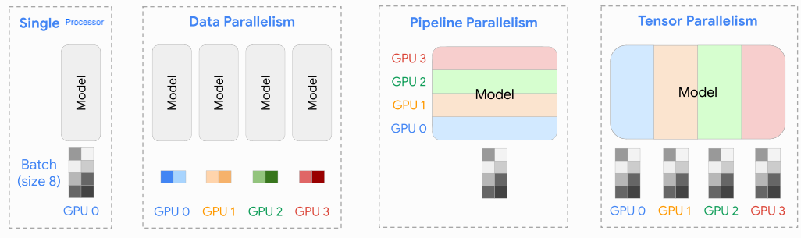
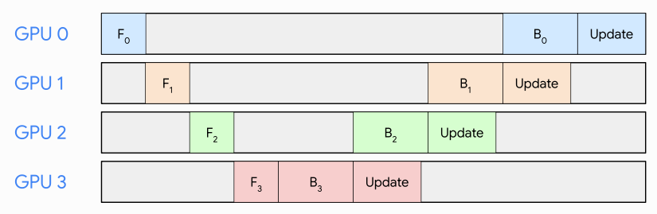
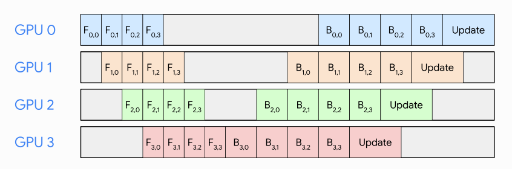
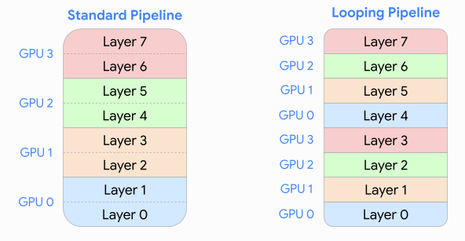
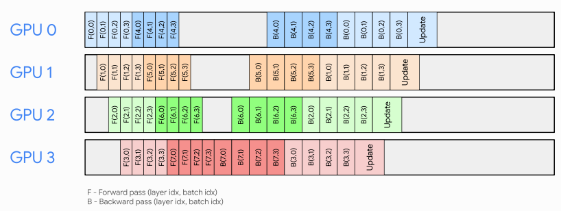
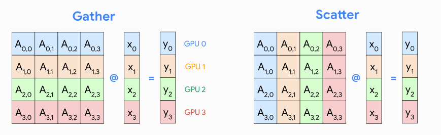
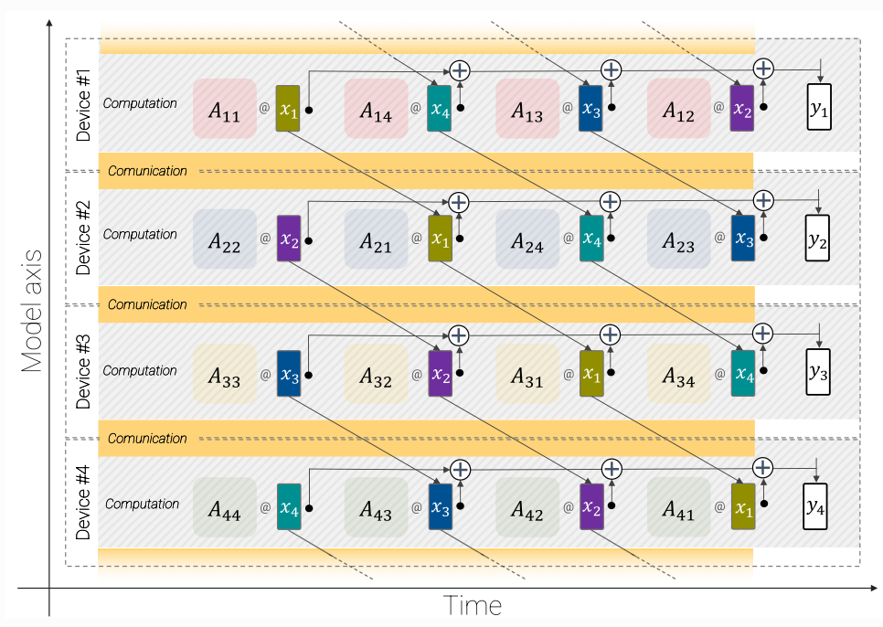
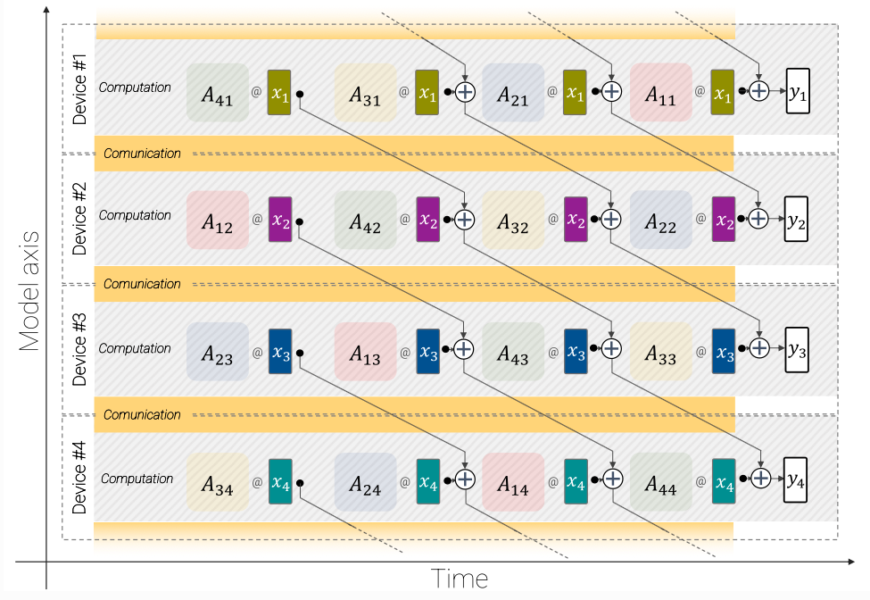
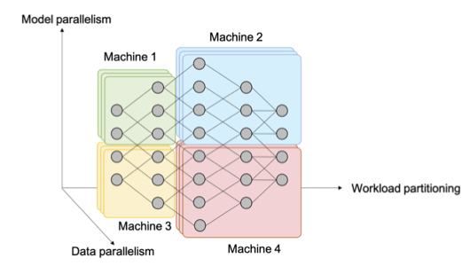

# Computational Performance

As models and data scale in size, optimizing for more efficient processes becomes more and more imperative. This section will cover non-algorithmic ways we may do so, drawing heavily from [Lippe's notes](https://uvadlc-notebooks.readthedocs.io/en/latest/tutorial_notebooks/scaling/JAX/overview.html) on this topic.

(Adapted from [Lippe](https://uvadlc-notebooks.readthedocs.io/en/latest/tutorial_notebooks/scaling/JAX/overview.html))

## Single Processor

- CPU vs GPU
  - CPUs and GPUs are processors
  - GPUs have many smaller, more specialized cores, which make it suited for parallel processing, e.g. tensor cores which compute matrix-matrix multiplications quickly.
  - Terminology differences
    - A GPU is formed by multiple units named SM (Streaming Multiprocessors), these function like CPU cores.
    - Each SM can execute many threads concurrently.
    - Threads are grouped into warps, a basic execution unit, where each warp contains 32 threads. 
    - While CPU threads can each execute different tasks at the same time, all GPU threads in a single warp can only execute one same task. 
    - A threadblock is a collection of warps. The threads in the same thread block run on the same SM. 
  - PyTorch (amongst other libraries) allow us to use these tensor cores for training DL models. 
- Multithreading vs Multiprocessing
  - Multithreading (`threading`) is the ability of a processor to execute multiple threads concurrently, where each thread runs a process.
    - Useful in I/O with a lot of latency - one thread can wait while the other reads. 
    - Threads run in the same memory space
    - Precautions have to be taken in case threads write to the same memory at the same time
    - The Global Interpreter Lock (GIL) synchronizes the execution of threads
    - In CPython, this means that only one thread can execute at a time
  - Multiprocessing (`multiprocessing`) is the ability of a system to run multiple processors in parallel
    - Processes have separate memory
    - Harder to share objects between processes
- Row-major vs Column-major
  - Row/column-major means that consecutive elements in a row/column are stored next to each other in memory. 
  - NumPy/PyTorch/CSV are row-major, Parquet is column-major. 
  - In a sample $\times$ feature matrix, it is faster to access samples/features in row/column-major formats.
- Vectorization
  - Vectorization refers to single instruction, multiple data (SIMD) operations. 
    - I.e. One instruction carries our the same operation on a number of operands in parallel.
  - NumPy enables vectorization when we write code in a way that operates on entire arrays rather than looping through individual elements. 
- Imperative vs Symbolic programming
  - Imperative programming makes it easy to design new models since it is possible to write code with control flow and the ability to use a large amount of the Python software ecosystem.
  - Symbolic programming requires that we specify the program and compile it before executing it. The benefit is improved performance.
- Asynchronous Computation
  - For PyTorch, by default, GPU operations are asynchronous.
  - Broadly speaking, PyTorch has a frontend for direct interaction with the users, e.g., via Python, as well as a backend, e.g. via C++, used by the system to perform the computation.
  - Thus, there is little impact on the program’s overall performance, regardless of Python’s performance.
  - Conversions to NumPy are blocking because NumPy has no notion of asynchrony.
- JAX
  - JAX is a numerical computing library that has various desirable characteristics for the computations done in DL. 
    - Provides a unified NumPy-like interface to computations that run on CPU, GPU, or TPU, in local or distributed settings
    - Features Just-In-Time (JIT) compilation via Open XLA
      - A JIT-compiler compiles code at runtime into a fast executable
      - XLA significantly increases execution speed and lowers memory usage by fusing low-level operations
      - Warning: The intermediate `jaxpr` representation is specialized to the shapes of input arguments 
        - Hence, running a jitted function with different input shapes requires multiple recompilations. 
        - We can use padding to prevent re-compilations, but when this needs to be done extensively (e.g. NLP with many different sentence lengths), the overhead could outweigh the benefits.
      - While compilation time could be a significant bottleneck, we can use the `scan` transformation to write a for-loop with a single compilation of the inner step.
    - Efficiently evaluates gradients via its automatic differentiation transformations
      - `jaxpr` representations give us analytical forms of gradients
      - Allows us to efficiently compute higher-order gradients
    - Supports automatic vectorization of functions
      - Allows for vectorization of functions not written in "vectorized forms".
      - It also allows us to support additional batch dimensions.
    - A note: JAX is designed to be functional. 
      - Writing code with side effects is dangerous because an error will _not_ be thrown and JAX will just ignore such instructions.
- What are we bounded by?
  - [He's article](https://horace.io/brrr_intro.html)
  - Memory
    - Size of DRAM
      - Solution: See below
  - Bandwidth
    - Time spent transferring tensors within a GPU
      - Solution: Operator fusion
  - Compute (on SRAM)
    - Time spent on your GPU computing actual floating point operations (FLOPS)
      - Solution: More tensor cores
  - Overhead
    - Everything else
      - Solution: Asynchronous computation
- Memory reduction
  - Memory vs compute
    - We discuss methods to reduce this memory constraints (sometimes at the cost of increased computational cost)
  - Mixed Precision Training
    - Use 32-bit floating-point numbers for weight updates and final loss computation
    - Use 16-bit floating-point numbers for most computations
      - Loss scaling may be needed because `float16` may induce underflow/overflow issues
      - `bfloat16` has a larger range but lower precision, and is an alternative to avoid loss scaling
  - Gradient Checkpointing / Activation Recomputation
    - Trade compute for memory by recomputing activations during the backward pass.  
  - Gradient Accumulation
    - We can accumulate gradients over batches and take steps once every few batches.
    - This to me doesn't feel like it "speeds up" a forward pass. Rather, it just remedies the instability induced by memory limitations that force smaller batch sizes than we would like.
  - Donating buffers (JAX-specific)
    - Since JAX employs functional programming, we cannot modify variables in place.
    - If we don't need our input variables, JAX provides a mechanism to donate buffers, which allows us to reuse the memory of the input arguments for the output arguments.

## Multiple Processors

- Parallel Computation and Communication
  - In PyTorch, functions like `to()` and `copy_()` admit an explicit `non_blocking` argument. 
  - We can also do this in JAX

### Data Parallelism

- Overview
  - Each device will hold the same model and parameters, and process a different batch of data in parallel.
  - After obtaining the gradients for each batch, we aggregate the gradients over the devices and update our model. 
    - This is synchronous SGD, but this may be slowed down due to communication overhead.
    - Asynchronous SGD can be used, although there may be gradient staleness. However, when weight matrices are large, most updates are sparse and gradient staleness may be ok.
    - `DP` has all communication go through a master process, which is slower than `DDP`, which uses Ring-AllReduce. 
- Parameter Sharding (Fully-sharded data parallelism)
  - Storing _all_ of a model's data (optimizer state, gradients, parameters) can be costly in terms of memory
  - Each device can instead store a portion of parameters
  - Before executing a layer, a device can then communicate with other devices to receive the parameters it needs

### Pipeline Parallelism

- Overview
  - Pipeline parallelism splits the model across devices, whilst introducing minimal communication across devices, although also facing the pipeline bubble issue. 
  - [Source](https://uvadlc-notebooks.readthedocs.io/en/latest/tutorial_notebooks/scaling/JAX/pipeline_parallel_simple.html)
- Micro-Batching
  - Micro-Batching mitigates the pipeline bubble issue.
  - [Source](https://uvadlc-notebooks.readthedocs.io/en/latest/tutorial_notebooks/scaling/JAX/pipeline_parallel_simple.html)
- Looping Pipelines
  - Looping mitigrates the pipeline bubble issue further.
  - [Source](https://uvadlc-notebooks.readthedocs.io/en/latest/tutorial_notebooks/scaling/JAX/pipeline_parallel_looping.html)
  - We can process mini-batches breadth-first (each GPU processes a batch fully before moving on to the next) or depth-first (process a mini-batch the moment it is ready)
  - [Poirier](https://arxiv.org/pdf/2211.05953) argues that when combining data parallelism and pipeline parallelism, because the former requires us to communicate and sum across devices, breadth-first pipeline parallelism is faster since we can start this communication earlier. 

### Tensor Parallelism

- Overview
  - Tensor parallelism splits the model across the feature dimension. 
  - It does not face the pipeline bubble issue, but requires more communication across devices.
  - Gather vs Scatter
    - [Source](https://uvadlc-notebooks.readthedocs.io/en/latest/tutorial_notebooks/scaling/JAX/tensor_parallel_simple.html)
    - Note that here we reverse the order of our activations ($p \times n$ rather than $n \times p$)
    - To reduce both the communication needed (?) and the amount of data stored on each device, gather/scatter is more suitable when $\mathbf{x}$ has fewer/more features than $\mathbf{y}$.
- Asynchronous layers
  - In the gather strategy, we first need to communicate all the features of $\mathbf{x}$ before we can compute the output. 
  - In the scatter strategy, need to compute the output on all devices before we can communicate results and sum them. 
  - Asynchronous layers allow us to overlap communication with computation and reduce downtime. 
  - Gather
    - [Source](https://arxiv.org/pdf/2302.05442)
  - Scatter
    - [Source](https://arxiv.org/pdf/2302.05442)

### 3D Parallelism

- We can combine all the 3 parallelism types for increased computational gains.
  - [Source](http://web.ecs.baylor.edu/faculty/dong/elc5396_DeepLearning/DeepLearningSignalProcessingH3.pdf)
  - [DeepSpeed](https://www.microsoft.com/en-us/research/blog/deepspeed-extreme-scale-model-training-for-everyone/)

## Inference

- We can break down LLM inference into two stages: prefill and decode.
- With sliding window attention, we can chunk and parallelize the prefill process.
- For long prompts, [disaggregated serving](https://docs.vllm.ai/en/latest/features/disagg_prefill.html) may be helpful because the prefill process can be compute bound while the decode process is bandwidth bound.
  - Why are we in different regimes? In decoding, we move the same number of weights per token as we do for the entire prompt for prefill. 
  - What is an example of something that we want to change? Batch size. 
    - This [cursor blogpost](https://www.cursor.com/blog/llama-inference) explains this more
      - For example, if we're bandwidth-bound in decoding, we can freely increase our batch size without incurring too much additional latency (memory requirements are dominated by model parameters over KV cache)
      - However, increasing batch size when we're compute-bound would increase latency linearly, and increase our time to first token, for example. 
      - The article also mentions different cost-dynamics
        - When using open/closed source models, we pay per second/token. 
        - Due to the different "regimes", it is cheaper to use open/closed source models when we're compute/memory bound 
        - This means that open/closed source models are better for prompt-heavy/completion-heavy tasks like classification/qna.