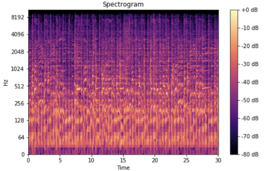

# Interpretability and Music 

## Hypothesis

This work hypothesizes that conducting interpretability research on transformer-based models that are trained on modern pop music could help achieve the following goals:
- Understand [induction heads](https://transformer-circuits.pub/2022/in-context-learning-and-induction-heads/index.html) better, especially those that form over multiple attention layers. 
- Test the [universality](https://distill.pub/2020/circuits/zoom-in/#claim-3) claim of mechanistic interpretability in audio, e.g. do [polysemantic neurons](https://transformer-circuits.pub/2022/toy_model/index.html) also exist?
- Enhance our controllability or the quality of generated music.  

In particular, I believe that modern pop music is a good alternative to textual data due to the following properties it has: 
- Frequency properties of common 12-tone music allows for a natural "alphabet" that is possibly detectable, tractable in vocabulary size, and common over different datapoints.
- Natural periodicity of modern pop music would allow us to better understand induction heads that form over multiple attention layers. 
- The abundance of data that is available or that could be generated would be sufficient for training, at different levels of "difficulty". 
- Despite the additional structure of (1) and (2), the variability of audio data (noise, timbre, etc.) would prevent the model from overfitting, allowing us to draw conclusions that would generalize to other data modes. 

## Additional Information

- Tokenization
  - One form of tokenization is to encode an audio file as a spectrogram, with frequency on the y-axis and time on the x-axis.
    - 
      - [Image Source](https://medium.com/analytics-vidhya/understanding-the-mel-spectrogram-fca2afa2ce53)
  - For reasons we explain in the next subsection, suppose our y-axis is on a log scale for now. 
- Frequency properties of common 12-tone music
  - Most modern pop music today is written with 12-tones. 
  - In particular, the tones are spaced evenly apart on the logarithmic scale ([equal temperament tuning](https://en.wikipedia.org/wiki/12_equal_temperament))
  - This even spacing permits for translation invariance in a spectrogram, and certain kernels could potentially allow us to learn a common "alphabet" that's applicable to different songs. 
    - To illustrate this translation invariance, the same melody in two keys would look the same on a spectrogram, but have a constant vertical displacement.
  - One example of such an alphabet is [chords](https://en.wikipedia.org/wiki/Chord_(music)). 
    - Chords are the building blocks of harmony and many modern pop songs are based on the same chords. 
    - A series of chords is called a chord progression. 
    - If we [modulate](https://en.wikipedia.org/wiki/Modulation_(music)) (translate) our songs to a base [key](https://en.wikipedia.org/wiki/Key_(music)), and voice our [triads](https://en.wikipedia.org/wiki/Root_position) in their [root position](https://en.wikipedia.org/wiki/Root_position), we can express a [1564 chord progression](https://en.wikipedia.org/wiki/I–V–vi–IV_progression) with the following tokens:
      - $\left\{\left(\begin{array}{l}0 \\ 4 \\ 7\end{array}\right),\left(\begin{array}{c}7 \\ 11 \\ 14\end{array}\right), \left(\begin{array}{c}9 \\ 12 \\ 16\end{array}\right), \left(\begin{array}{c}5 \\ 9 \\ 12\end{array}\right)\right\}$, where values indicate vertical displacement on the spectrogram.
      - An alternate representation is $\left\{\left(\begin{array}{l}0 \\ 0\end{array}\right),\left(\begin{array}{c}7 \\ 0\end{array}\right), \left(\begin{array}{c}9 \\ 1\end{array}\right), \left(\begin{array}{c}5 \\ 0\end{array}\right)\right\}$, where the second value of each token embedding encodes the [chord type](https://en.wikipedia.org/wiki/List_of_chords).
      - While this sounds like an oversimplification, the reader should be made aware that there are very limited chord types and chord progressions. Check out [this video](https://www.youtube.com/watch?v=5pidokakU4I) where the Axis of Awesome plays many pop songs that use the 1564 chord progression (with some that use the 6415). 
    - Works like [Nicole et al.](https://static1.squarespace.com/static/545183b3e4b0f4d5bea12a07/t/65f5a10e913fd3573c476b80/1710596374217/Musicological_Interpretability_in_Generative_Transformers.pdf) demonstrate the ability of generative transformer-based models to learn basic chord progressions and I believe that this is implied by the coherence of music created by generative music companies. 
- Induction Heads
  - [A Mathematical Framework for Transformer Circuits](https://transformer-circuits.pub/2021/framework/index.html) found the presence of the induction head, a circuit whose function is to look back over the sequence for previous instances of the current token (call it `A`), find the token that came after it last time (call it `B`), and then predict that the same completion will occur again (e.g. forming the sequence `[A][B] … [A] → [B]`).
- Periodicity of modern pop music
  - Continuing our example of chords as our alphabet,
    - Most modern pop songs use chord progressions that exhibit cycles of period 4. 
    - In particular, most subsections of a song (e.g. verse, chorus, etc.) typically repeat the same progression multiple times without interruption (1,5,6,4,1,5,6,4,1,...). 
    - [A Mathematical Framework for Transformer Circuits](https://transformer-circuits.pub/2021/framework/index.html) shows that at least two attention layers are needed to do `[A][B] … [A] → [B]`, and assuming that modern music generation models have the ability to do `[A][B][A][C] … [A][B][A] → [C]`, I believe that studying these models would be fruitful in learning how induction heads form over additional layers. 
      - This might be easier to study in music than in text because of the more extensive repetition that exists in music.
      - If this is successful, I will note that many mandarin pop songs instead use progressions with period 8, and provides a natural test of any hypotheses being developed.
  - Periodicity exists in other forms:
    - Melodic [motifs](https://en.wikipedia.org/wiki/Motif_(music)) are often repeated throughout a song. 
    - Song structure usually uses repetitions, e.g. {Verse - Prechorus - Chorus - Verse - Prechorus - Chorus - Bridge - Chorus}
      - I'm particularly interested to know if we can determine the number of layers needed to learn song structure.
- Difficulty and Availability
  - We need to be careful about how "difficult" our dataset is. 
    - Too simplified - the model may overfit and patterns observed may not be universally translatable.
    - Too difficult - it may complicate our ability to detect patterns. 
  - I believe that music as a medium is useful due to our ability to obtain sufficient data at different levels of data complexity. In decreasing order or complexity, for example, we can use:
    - Live music
    - Produced music 
    - Produced pop music (simpler chord structure)
    - Produced pop instrumental music (simpler audio timbre)
    - [MIDI](https://en.wikipedia.org/wiki/MIDI) music
    - MIDI short phrases
      - [Wei et al.](https://arxiv.org/pdf/2410.00872), for example, created a synthetic dataset consisting of various musical concepts. To illustrate the flexibility of music as a medium, they were able to voice the same MIDI through 92 distinct instruments. 
      - I believe that our ability to flexibly modulate the difficulty of this medium would be very useful for interpretability research.
        - I am excited by the prospect of testing a hypothesis "level by level", which may yield further insights, e.g. at what level might we begin observing polysemanticity?
        - In contrast, I might assert that it is harder to flexibly modulate the difficulty of text, in the "mid-level" difficulty range. 