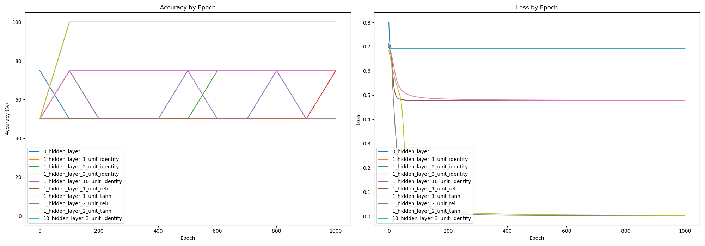
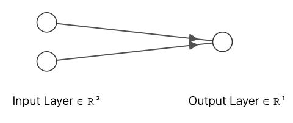
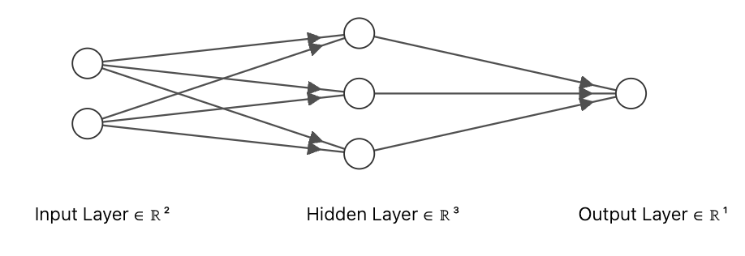
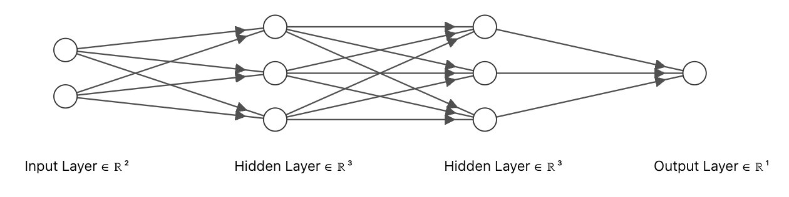
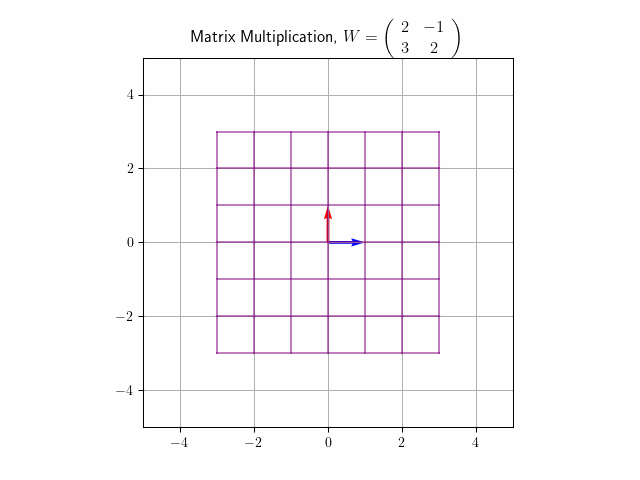
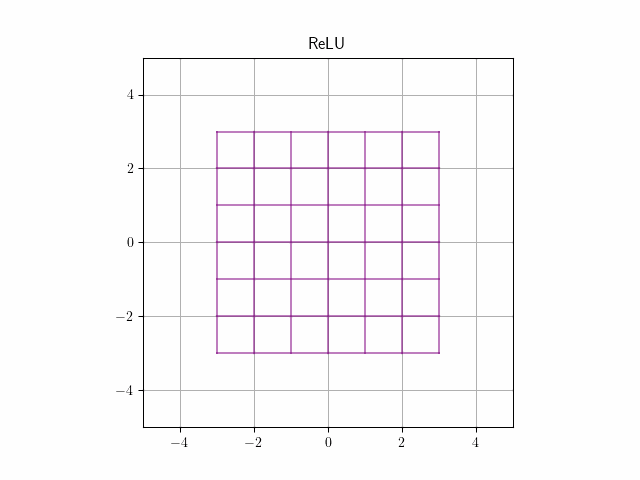
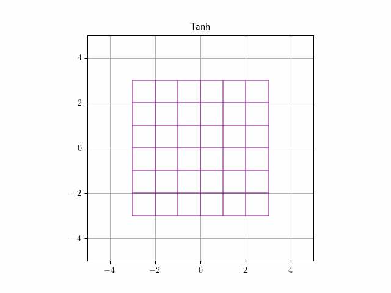
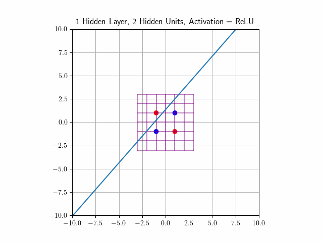
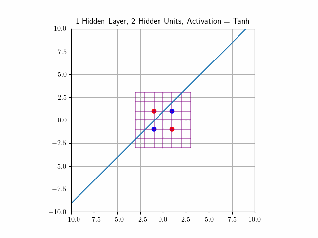

# Understanding MLPs with XOR Dataset

- In [Goodfellow's Deep Learning Book](https://www.deeplearningbook.org/contents/mlp.html), he talks about the XOR dataset and how we need nonlinearities to separate the dataset.
- In [Neural Networks, Manifolds, and Topology](https://colah.github.io/posts/2014-03-NN-Manifolds-Topology/), Chris Olah discusses more about the geometric intuition behind MLPs. Namely, he mentions that:
    - A tanh layer $\tanh(Wx + b)$ can be viewed as a continuous transformation in space.
    - Classification with a sigmoid unit or a softmax layer is equivalent to trying to find a hyperplane to separate points in two classes.
    - Sometimes, we can predict the number of hidden units needed to separate a dataset
- Unfortunately, immediately after reading both sources, I did not have a clear understanding of the topics discussed (and it seemed like others had similar questions). This notebook will serve as a supplemental to Olah's blog post, using the XOR dataset to provide a geometric understanding of binary classification for small MLP models.
- Code to generate the results and plots in this document can be found in the accompanying [notebook](./code.ipynb).

## Empirical Results

- We start by training multilayer perceptrons (MLPs) of different architectures and summarize our results below

| Number of hidden Layers | Number of hidden units per layer | Activation Function | Final Accuracy (%) |
|-------------------------|----------------------------------|---------------------|--------------------|
| 0                       | NA                               | NA                  | 50                 |
| 1                       | 1                                | Identity            | 50                 |
| 1                       | 2                                | Identity            | 75                 |
| 1                       | 3                                | Identity            | 75                 |
| 1                       | 10                               | Identity            | 50                 |
| 1                       | 1                                | ReLU                | 75                 |
| 1                       | 1                                | Tanh                | 75                 |
| 1                       | 2                                | ReLU                | 100                |
| 1                       | 2                                | Tanh                | 100                |
| 10                      | 3                                | Identity            | 50                 |

These results indicate that:
* Nonlinear activation functions are required to separate the XOR dataset, as Goodfellow indicates.
* With the introduction of nonlinearities, 1 hidden unit is insufficient, and 2 hidden units are sufficient to separate the XOR dataset.

The remainder of this document will discuss why this is the case. 

## Model Specification
- For input $x \in \mathbb{R}^2$, we let the output of our MLP model be $f(x)$. Since we use a sigmoid activation layer for our binary classification task, we are classifying $x$ to be in class 1 if $f(x) > 0$, and class 0 if $f(x) \leq 0$.
- 0 hidden layers: $f(x) = W_0x + b_0, W_0 \in \mathbb{R}^{1 \times 2}, b_0 \in \mathbb{R}$

- 1 hidden layer with $p$ hidden units: $f(x) = W_0g_1(W_1x + b_1) + b_0,$ where $g_1$ is our activation function, $W_0 \in \mathbb{R}^{1 \times p}, b_0 \in \mathbb{R}, W_1 \in \mathbb{R}^{p \times 2}, b_1 \in \mathbb{R^p}$.
    - Here, we plot with $p = 3$.

- 2 hidden layers: $f(x) = W_0g_1(W_1g_2(W_2x + b_2) + b_1) + b_0$

Figure credit: https://alexlenail.me/NN-SVG/index.html

## Number of Hidden Units and Dimension

- Our input $x \in R^2$ is represented by the two nodes in the input layer.
    - An input of $[1,0]^\top$, would have $1$ in the first node and $0$ in the second.
- For $W_0 \in R^{1 \times p},$ the previous layers of the network project each input point $x$ to a point in $p$-dimensional space, $x'$. _How_ we do so will be covered later. 

## The "Hyperplane"
- Let's focus on the final layer $W_0x' + b_0, W_0 \in \mathbb{R}^{1 \times p}, x' \in \mathbb{R}^p, b_0 \in \mathbb{R}$
- We notice that $W_0x' + b_0 = 0$ is the exact equation of a [hyperplane](https://en.wikipedia.org/wiki/Hyperplane). Geometrically, 
    - Let us denote $W_0 = (w_{01}, \ldots, w_{0p})$ and $x' = (x_{1}', \ldots, x_{p}')^\top$.
    - $W_0x' = 0$ is the equation of a hyperplane that goes through the origin.
        - It is a "plane" because the equation $\sum_i^p (w_{0i}x'_i) = 0$ has $p-1$ degrees of freedom.
        - The normal vector to this hyperplane is $W_0^\top$: Any vector $v$ along the plane satisfies the equation $W_0v = 0$.
    - $W_0x' + b_0 = 0$ describes a hyperplane with the same normal vector $W_0^\top$, shifted such that it doesn't pass through the origin.
        -  In particular, it "cuts" the $i^{th}$ intercept at $-\frac{b_{0i}}{w_{0i}}$.
- Since we classify points based on whether $W_0x' + b_0 > 0,$ we're geometrically: 
    - Drawing a hyperplane in the $p$-dimensional space, then
    - Classifying all points on one side of the hyperplane as 1, and classifying all others as 0.
- If any of this is confusing, it is a lot easier to think about this for $p = 3$, where our hyperplane is just a conventional plane.
- Note, this is how the [SVM](../../../classical/08_svms/notes.md) classifies data too!

## Geometry of $g(Wx + b)$
- To understand what the function $g(Wx + b)$ is doing geometrically, it is useful to think in 2D space, and reason how the basis vectors $[1,0]^\top$  and $[0,1]^\top$ move.
    - Plotting this for every point $[a,b]^\top = a[1,0]^\top + b[0,1]^\top$ then tells us _exactly_ how each layer moves our input in space
- $Wx$
    - Conducting the matrix multiplication, we see that the $i^{th}$ standard basis vector is mapped to the $i^{th}$ column of $W$!
    - For more geometric intuition, when $W$ is square, we can envision it as "rotating" space 
    - 
      - Note how $[1,0]^\top$ and $[0,1]^\top$ gets mapped to $[2,3]^\top$ and $[-1,2]^\top$ respectively.
    - If a reader needs more clarification, I like [Khan's video](https://www.youtube.com/watch?v=kYB8IZa5AuE) about this topic.
- $+ b$ "translates" each point by vector $b$
- $g$ "stretches and squishes space" in a way that "never cuts, breaks, or folds it" (if it is a homeomorphism) ([Olah](https://colah.github.io/posts/2014-03-NN-Manifolds-Topology/))
    -   
- We plot the combination of these effects in the next section. 

## Putting It All Together
- Why can we separate the XOR dataset with 1 hidden layer, 2 hidden units, and nonlinearities?
    -   
    - We plot the transformation of datapoints for the final weights of the models that were able to separate the XOR dataset. 
    - Let's now discuss why all the other model architectures were unable to separate the data. 
- Why can't we separate the XOR dataset with 0 hidden layers?
    - For 0 hidden layers, we skip straight to drawing a hyperplane, i.e. a line in 2D space. 
    - The XOR dataset is not linearly separable in 2D.
- Why can't we separate the XOR dataset with 1 hidden layer and 1 hidden unit?
    - $W_1x + b_1$
      - For the first layer, pre-activation, this is mathematically equivalent to the 0 hidden layer case. 
        - Geometrically, we're projecting each point onto the normal vector to $W_1x + b_1$.
        - The fact that the XOR data is not linearly separable in 2D is equivalent to saying that for this projection, the two points on the extreme ends are of the same class, regardless of the choice of hyperplane $W_1x + b_1$. 
    - $g(W_1x + b_1)$
      - Since the activation functions we chose are monotone, the points maintain their relative ordering.
    - $W_0g(W_1x + b_1) + b_0$
      - $W_0$ optionally flips points around the origin, and then scales the distance from the origin. This does not change the relative ordering. 
      - $b_0$ shifts all points along the line the same amount. This too does not change the relative ordering. 
      - Ultimately, the points remain unseparable.
- Why can't we separate the XOR dataset without nonlinearities?
    - If all $W_i \in \mathbb{R}^{2 \times 2}$, intuitively, continually rotating and translating space would not allow the points to become linearly separable.
    - Let's now apply more rigor, which applies to higher dimensions:
        - Suppose that separation without nonlinearities was possible.
        - Label our points $x^{(1)} = [-1, -1]^\top, x^{(2)} = [1, -1]^\top, x^{(3)} = [-1, 1]^\top, x^{(4)} = [1, 1]^\top$
          - $y^{(1)} = y^{(4)} = 1, y^{(2)} = y^{(3)} = -1$
        - Note that $x^{(4)} = x^{(2)} + (x^{(3)} - x^{(1)})$ (bracketing indicates how we can geometrically think of this as adding two vectors)
        - Due to our discussion of how basis vectors are transformed in affine transformations $Wx + b$, we have that $f(x^{(4)}) = f(x^{(2)}) + f(x^{(3)} - x^{(1)}) = f(x^{(2)}) + f(x^{(3)}) - f(x^{(1)})$ for affine $f$. 
        - Now if all points were correctly classified, $f(x^{(2)}), f(x^{(3)}), - f(x^{(1)}) \leq 0$, but $f(x^{(4)}) > 0$, and we have a contradiction.
        - Geometrically, $f(x^{(2)})$ is on the "negative" side of the hyperplane, and $f(x^{(3)} - x^{(1)})$ is a vector that is pointing in the "negative" direction, so it's impossible for $f(x^{(4)})$ to be positive.

## Some Additional Thoughts
- Technically, the sigmoid function says that the probability that an input $x$ is of class 1 is somewhat proportional to the exponential distance between $f(x)$ and the hyperplane. I wonder if there's use in this exponential function, or if higher temperature settings are more appropriate (and when that is the case).
- Multi-class classification:
    - We can interpret multi-class classification as drawing $n$ hyperplanes (where $n$ is the number of classes), and assigning probabilities based on how far each point is to the hyperplane.
    -  This is an oversimplification because:
        - The columns of $W_0$ are not normalized (so we need to scale the distance)
        - We need to exponentiate the distance
    - Again, I wonder if there's a "right" way to formulate the final layer / loss.