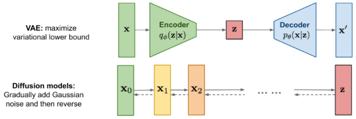
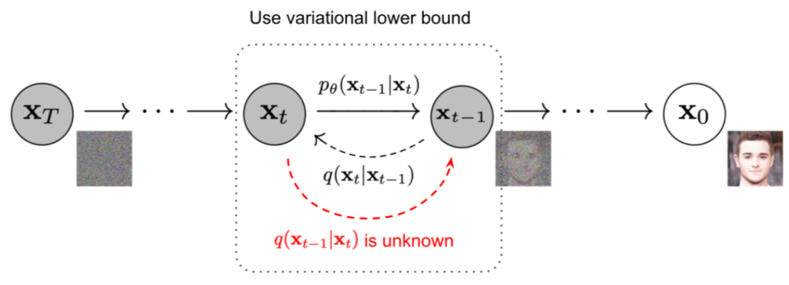
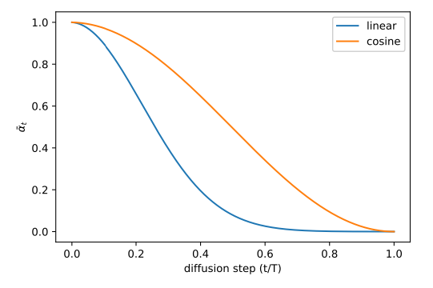
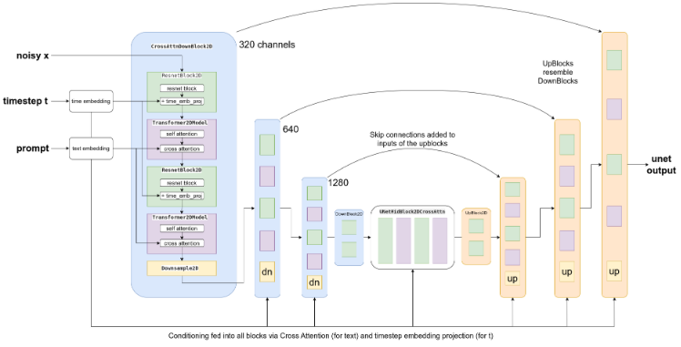
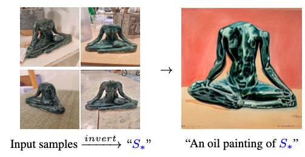
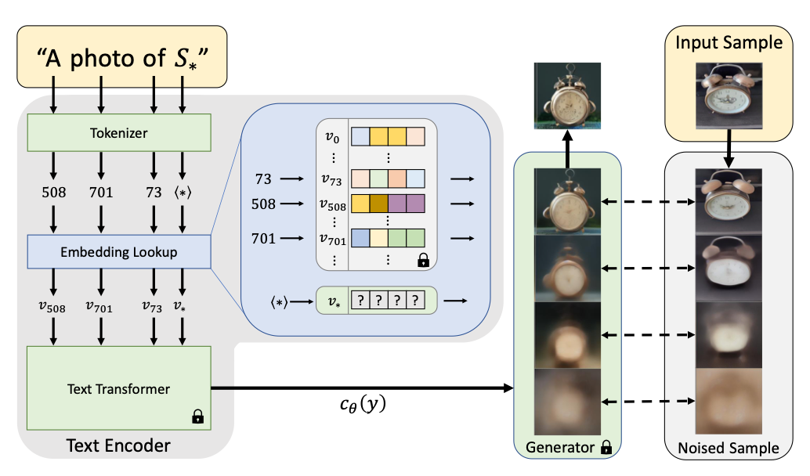
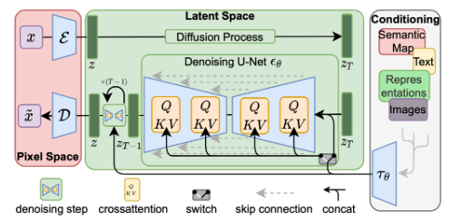

# Diffusion

- Much like VAEs, Diffusion models are another type of generative model. 
- [Source](https://lilianweng.github.io/posts/2021-07-11-diffusion-models/)
- There are a few ways that diffusion is different from VAEs
  - $\mathbf{z}$ has same dimension as $\mathbf{x}_0$
  - The forward process (encoding) is done not by a neural network, but by simply adding Gaussian noise. 
  - The backward process (decoding) is still achieved by a neural network, but instead of predicting the image $\mathbf{x}_0$, we predict the noise $`\pmb\epsilon_t`$ that was mixed in to produce $`\mathbf{x}_t`$ (note $`\pmb\epsilon_t = (\mathbf{x}_t - \sqrt{\bar{\alpha}_t}\mathbf{x}_0)/\sqrt{1-\bar{\alpha}_t}`$, not simply $`\mathbf{x}_t - \mathbf{x}_0`$ — both terms are rescaled). 
- Theoretical Details:
  - [Source](https://lilianweng.github.io/posts/2021-07-11-diffusion-models/)
  - Data points are assumed to come from a real data distribution $\mathbf{x}_0 \sim q(\mathbf{x})$
    - $`q`$ is otherwise arbitrary — no density, smoothness or support assumption is needed anywhere below. But there is one **implicit second-moment assumption**, worth flagging because it is easy to miss: DDPM's $`\sigma^2_t = \beta_t`$ bound is stated "for data with coordinatewise **unit variance**" ([DDPM](https://arxiv.org/pdf/2006.11239) §3.2, crediting [Sohl-Dickstein et al.](https://arxiv.org/pdf/1503.03585)). See the $`\sigma_t`$ discussion below for what actually breaks without it.
      - **Real image data does not satisfy this.** DDPM scales pixels to $`[-1,1]`$, but note that scaling to $`[-1,1]`$ bounds the data but it does not standardize it. [EDM](https://arxiv.org/pdf/2206.00364) measures the actual figure and fixes $`\sigma_{\text{data}} = 0.5`$ for CIFAR-10 / ImageNet (Table 1), i.e. variance $`\approx 0.25`$, off by a factor of 4.
      - Later work handles this explicitly. [LDM](https://arxiv.org/pdf/2112.10752) rescales its KL-regularized latent by the component-wise standard deviation "such that the rescaled latent has unit standard deviation" (App. G), notes the VQ latent "has a variance close to 1, such that it does not have to be rescaled", and shows the induced SNR $`\mathrm{Var}(z)/\sigma_t^2`$ visibly changes how detail is allocated over the reverse process (App. D.1). EDM instead threads $`\sigma_{\text{data}}`$ through its preconditioning ($`c_{\text{in}}, c_{\text{out}}, c_{\text{skip}}`$ are all functions of it) instead of assuming it is $`1`$.
  - We define a forward diffusion process in which we add small amount of Gaussian noise to the sample in $`T`$ steps, producing a sequence of noisy samples $`\mathbf{x}_1, \ldots, \mathbf{x}_T`$. The step sizes are controlled by a variance schedule $`\{\beta_t \in (0,1)\}_{t=1}^T`$. 
    - $`\displaystyle q\left(\mathbf{x}_t \mid \mathbf{x}_{t-1}\right) \sim \mathcal{N}\left(\mathbf{x}_t ; \sqrt{1-\beta_t} \mathbf{x}_{t-1}, \beta_t \mathbf{I}\right)`$ 
      - The $`\sqrt{1-\beta_t}`$ shrink is what makes this **variance-preserving**: if $`\mathrm{Var}(\mathbf{x}_{t-1}) = \mathbf{I}`$ then $`\mathrm{Var}(\mathbf{x}_t) = (1-\beta_t)\mathbf{I} + \beta_t \mathbf{I} = \mathbf{I}`$.
    - $`\displaystyle q\left(\mathbf{x}_{1: T} \mid \mathbf{x}_0\right)=\prod_{t=1}^T q\left(\mathbf{x}_t \mid \mathbf{x}_{t-1}\right)`$
    - Note that this implies $`q\left(\mathbf{x}_t \mid \mathbf{x}_0\right) \sim\mathcal{N}\left(\mathbf{x}_t ; \sqrt{\bar{\alpha}_t} \mathbf{x}_0,\left(1-\bar{\alpha}_t\right) \mathbf{I}\right)`$, where $`\bar{\alpha}_t = \prod_{i=1}^t (1 - \beta_i)`$
      - This permits us to sample from $`\mathbf{x}_t`$ directly given $`\mathbf{x}_0`$
      - In addition, we can reparameterize $`\mathbf{x}_t \mid \mathbf{x}_0`$ = $`\sqrt{\bar{\alpha}_t} \mathbf{x}_0+\sqrt{1-\bar{\alpha}_t} \pmb{\epsilon}_t`$ for $`\pmb{\epsilon}_t \sim \mathcal{N}(\mathbf{0}, \mathbf{I})`$
        - $`\pmb\epsilon_t`$ is the _total_ noise in $`\mathbf{x}_t`$ relative to $`\mathbf{x}_0`$, not the per-step $`\sqrt{\beta_t}`$ noise added at step $`t`$. Each is marginally $`\mathcal{N}(\mathbf{0}, \mathbf{I})`$, but along a single trajectory they are correlated across $`t`$, not i.i.d.
        - We drop the subscript in the training objective below because each sample touches a single $`t`$: there we draw $`\pmb\epsilon`$ first and let it _define_ $`\mathbf{x}_t`$.
  - If we can sample from $q(\mathbf{x}_{t-1} \mid \mathbf{x}_t)$, **we can recreate the true sample from a Gaussian noise input**, $\mathbf{x}_t \sim \mathcal{N}(\mathbf{0, I})$.
    - But we can't! So we use a neural network to model $`p_\theta,`$ where we choose
      - $`\displaystyle p_\theta\left(\mathbf{x}_{0: T}\right)=p\left(\mathbf{x}_T\right) \prod_{t=1}^T p_\theta\left(\mathbf{x}_{t-1} \mid \mathbf{x}_t\right)`$
      - $`\displaystyle p_\theta\left(\mathbf{x}_{t-1} \mid \mathbf{x}_t\right) \sim \mathcal{N}\left(\mathbf{x}_{t-1} ; \pmb{\mu}_\theta\left(\mathbf{x}_t, t\right), \mathbf{\Sigma}_\theta\left(\mathbf{x}_t, t\right)\right)`$
    - What is a good $`p_\theta`$? One that maximizes $`p_\theta(\mathbf{x}_0)`$.
      - But there are too many possible paths.
      - Instead, we instead maximize the variational lower bound (pick a path and minimize distance to that)
        - $`\displaystyle \log p_\theta(\mathbf{x}_0) \geq \log p_\theta(\mathbf{x}_0) - D_{\mathrm{KL}}\left(q\left(\mathbf{x}_{1: T} \mid \mathbf{x}_0\right) \| p_\theta\left(\mathbf{x}_{1: T} \mid \mathbf{x}_0\right)\right)`$, which expands to 
        - $`-\mathbb{E}_q[\underbrace{D_{\mathrm{KL}}\left(q\left(\mathbf{x}_T \mid \mathbf{x}_0\right) \| p\left(\mathbf{x}_T\right)\right)}_{L_T}+\sum_{t>1} \underbrace{D_{\mathrm{KL}}\left(q\left(\mathbf{x}_{t-1} \mid \mathbf{x}_t, \mathbf{x}_0\right) \| p_\theta\left(\mathbf{x}_{t-1} \mid \mathbf{x}_t\right)\right)}_{L_{t-1}} \underbrace{-\log p_\theta\left(\mathbf{x}_0 \mid \mathbf{x}_1\right)}_{L_0}]`$ [Source, Appendix A](https://arxiv.org/pdf/2006.11239)
        - This form is nice because:
          - $`L_1, \ldots, L_T`$ compares two Gaussian distributions and therefore they can be computed in closed form.
          - $`L_T`$ is constant and can be ignored during training because $`q`$ has no learnable parameters and $`\mathbf{x}_T`$ is a Gaussian noise
          - [Ho et al. 2020](https://arxiv.org/pdf/2006.11239) models $`L_0`$ using a separate discrete decoder (Section 3.3).
          - Hence, moving forward, we focus on $`L_1, \ldots, L_{T-1}`$. 
        - Minimizing $`L_{t-1}`$ 
          - Returning to $`\displaystyle p_\theta\left(\mathbf{x}_{t-1} \mid \mathbf{x}_t\right) \sim \mathcal{N}\left(\mathbf{x}_{t-1} ; \pmb{\mu}_\theta\left(\mathbf{x}_t, t\right), \mathbf{\Sigma}_\theta\left(\mathbf{x}_t, t\right)\right)`$,
            - We wish to minimize the KL divergence with $`q\left(\mathbf{x}_{t-1} \mid \mathbf{x}_t, \mathbf{x}_0\right)=\mathcal{N}\left(\mathbf{x}_{t-1} ; \tilde{\pmb{\mu}}_t\left(\mathbf{x}_t, \mathbf{x}_0\right), \tilde{\beta}_t \mathbf{I}\right)`$, where we can show
              - $`\quad \tilde{\pmb{\mu}}_t\left(\mathbf{x}_t, \mathbf{x}_0\right):=\frac{\sqrt{\bar{\alpha}_{t-1}} \beta_t}{1-\bar{\alpha}_t} \mathbf{x}_0+\frac{\sqrt{\alpha_t}\left(1-\bar{\alpha}_{t-1}\right)}{1-\bar{\alpha}_t} \mathbf{x}_t \quad`$ and $`\quad \tilde{\beta}_t:=\frac{1-\bar{\alpha}_{t-1}}{1-\bar{\alpha}_t} \beta_t`$
            - Unlike VAEs, where we optimize for both mean and covariance, we instead _set_ $`\mathbf{\Sigma}_\theta`$ and focus on optimizing for $`\pmb{\mu}_\theta`$ ([Details, Section 3.2](https://arxiv.org/pdf/2006.11239))
          - Using the reparameterization of $`\mathbf{x}_t \mid \mathbf{x}_0`$, we find that $`L_{t-1}`$ is minimized when 
          - $`\displaystyle \pmb\mu_\theta(\mathbf{x}_t, t) = \frac{1}{\sqrt{1 - \beta_t}}\left(\mathbf{x}_t-\frac{\beta_t}{\sqrt{1-\bar{\alpha}_t}} \pmb{\epsilon}_t\right)`$
            - In other words, having $`\pmb\epsilon_\theta`$, a function approximator intended to predict $`\pmb\epsilon_t`$ from $`\mathbf{x}_t`$, is equivalent to having $`\pmb\mu_\theta`$. 
            - **Why regress on $`\pmb\epsilon_t`$ and not $`\mathbf{x}_0`$?**. The DDPM paper had better success predicting noise. Also note that the $`\mathbf{x}_0`$ parameterization _is_ a loss weighting. Since $`\mathbf{x}_0 - \hat{\mathbf{x}}_0 = -\sqrt{(1-\bar{\alpha}_t)/\bar{\alpha}_t}\,(\pmb\epsilon_t - \pmb\epsilon_\theta)`$:
              - $`\displaystyle \|\mathbf{x}_0 - \hat{\mathbf{x}}_0\|^2 = \frac{1}{\mathrm{SNR}(t)}\|\pmb\epsilon_t - \pmb\epsilon_\theta\|^2`$, so uniformly-weighted $`\mathbf{x}_0`$-prediction _is_ $`\pmb\epsilon`$-prediction weighted by $`1/\mathrm{SNR}(t)`$ — a factor spanning $`10^{-4}`$ to $`2.5\times10^4`$ on the linear schedule. It dumps nearly all the loss at large $`t`$, where $`\mathbf{x}_0`$ is barely recoverable.
              - **The parameterization decides what "unweighted" means.** This is what the ablation shows: on the true bound with fixed $`\mathbf{\Sigma}`$, $`\tilde{\pmb\mu}`$-prediction (FID 13.22) and $`\pmb\epsilon`$-prediction (13.51) are a wash — $`\pmb\epsilon`$ only wins once paired with $`L_\text{simple}`$ (3.17), and $`\tilde{\pmb\mu}`$-prediction with an unweighted MSE diverges.
              - But weighting is not the only thing the choice moves. Each target also **degenerates at one end of the schedule**, and no reweighting repairs that:
                - $`\pmb\epsilon`$ — at the noise end. As $`\bar{\alpha}_t \to 0`$, $`\mathbf{x}_t \approx \pmb\epsilon`$: echoing the input is near-optimal, and $`\hat{\mathbf{x}}_0 = (\mathbf{x}_t - \sqrt{1-\bar{\alpha}_t}\,\hat{\pmb\epsilon})/\sqrt{\bar{\alpha}_t}`$ divides by zero. So an $`\pmb\epsilon`$-model cannot use a schedule that reaches pure noise; SD 1.x stops short, and its samples sit at medium brightness ([Lin et al.](https://arxiv.org/pdf/2305.08891)).
                - $`\mathbf{x}_0`$ — at the data end. As $`\bar{\alpha}_t \to 1`$, $`\mathbf{x}_t \approx \mathbf{x}_0`$: echoing the input is optimal, and the $`1/\mathrm{SNR}`$ weight above sends nearly all capacity to high noise, where $`\mathbf{x}_0`$ is an unrecoverable blur.
                - [v-prediction](https://arxiv.org/pdf/2202.00512), $`\mathbf{v}_t := \sqrt{\bar{\alpha}_t}\pmb\epsilon_t - \sqrt{1-\bar{\alpha}_t}\mathbf{x}_0`$ — nowhere. It is $`\approx \pmb\epsilon`$ near data and $`\approx -\mathbf{x}_0`$ near noise: **it always asks for the component you can't read off the input.** Unit variance at every $`t`$, and recovery $`\hat{\mathbf{x}}_0 = \sqrt{\bar{\alpha}_t}\mathbf{x}_t - \sqrt{1-\bar{\alpha}_t}\hat{\mathbf{v}}`$ divides by nothing. Standard for distillation and for schedules that reach pure noise.
                - Rectified-flow velocity $`\pmb\epsilon - \mathbf{x}_0`$ — bounded everywhere but _easy_ at both ends (best guess $`-\mathbf{x}_t`$ at $`t=0`$, $`\mathbf{x}_t - \mathbb{E}[\mathbf{x}_0]`$ at $`t=1`$); fixed by sampling $`t`$ logit-normally. See [Video](../20_video/notes.md).
              - **So the choice moves two things: the implicit weight, which any reweighting can reproduce, and endpoint conditioning, which none can.** That second effect is why $`\mathbf{v}`$ beats every reweighted $`\pmb\epsilon`$ for distillation and for zero-terminal-SNR schedules.
              - [EDM](https://arxiv.org/pdf/2206.00364) generalizes this as "preconditioning": scale inputs/outputs so the target is unit-variance at every level.
          - Training
            - Reparameterizing $`\pmb\mu_\theta`$ with $`\pmb\epsilon_\theta`$, we find that we can rewrite our loss as: 
            - $`\displaystyle \mathbb{E}_{\mathbf{x}_0, \pmb{\epsilon}}\left[\frac{\beta_t^2}{2 \sigma_t^2 \alpha_t\left(1-\bar{\alpha}_t\right)}\left\|\pmb{\epsilon}-\pmb{\epsilon}_\theta\left(\sqrt{\bar{\alpha}_t} \mathbf{x}_0+\sqrt{1-\bar{\alpha}_t} \pmb{\epsilon}, t\right)\right\|^2\right]`$
            - **That's it!** All this really is saying is that for each noised sample $`\sqrt{\bar{\alpha}_t}\mathbf{x}_0 + \sqrt{1-\bar{\alpha}_t}\pmb\epsilon`$, we want to predict the noise that was added to $`\mathbf{x}_0`$, and weight the squared loss as a function of $`t`$. 
            - Note that many $`(\mathbf{x}_0, \pmb\epsilon)`$ pairs produce the same $`\mathbf{x}_t`$. As with any squared loss, the minimizer over functions of $`\mathbf{x}_t`$ is the conditional mean, $`\pmb\epsilon_\theta^*(\mathbf{x}_t) = \mathbb{E}[\pmb\epsilon \mid \mathbf{x}_t]`$ — an _average_ over everything that could have produced it.
              - By Tweedie's formula, $`\mathbb{E}[\mathbf{x}_0 \mid \mathbf{x}_t] = \frac{1}{\sqrt{\bar{\alpha}_t}}\left(\mathbf{x}_t + (1-\bar{\alpha}_t)\nabla_{\mathbf{x}_t}\log q(\mathbf{x}_t)\right)`$, and substituting into $`\pmb\epsilon = (\mathbf{x}_t - \sqrt{\bar{\alpha}_t}\mathbf{x}_0)/\sqrt{1-\bar{\alpha}_t}`$ gives $`\quad \mathbb{E}[\pmb\epsilon \mid \mathbf{x}_t] = -\sqrt{1-\bar{\alpha}_t}\,\nabla_{\mathbf{x}_t}\log q(\mathbf{x}_t)`$.
                - $`\nabla_{\mathbf{x}_t} \log q(\mathbf{x}_t)`$ is a vector with the same dimensions as the image. At any point in image space it answers: which direction should I nudge this noisy image to make it a more probable noisy image _at this level_? 
                - We can almost think of $q(\mathbf{x}_t)$ as a mixture of $N$ Gaussian blobs, and we're pulling from the current $\mathbf{x}_t$ to it. 
                - At high $t$, we weight each training sample roughly equally, at low $t$, we weight closer samples more strongly.
              - **So "predict the noise" and "estimate the score" are the same thing — but only at the optimum.** Note this is the score of the _marginal_ $`q(\mathbf{x}_t)`$, which has no closed form.
              - It also explains why $`\hat{\mathbf{x}}_0`$ is blurry at large $`t`$ — it is an average over every image consistent with $`\mathbf{x}_t`$, not a sample from them.
            - As it turns out, the authors found it beneficial to instead train on the following simpler variant:
              - $`\displaystyle L_{\text {simple }}(\theta):=\mathbb{E}_{t, \mathbf{x}_0, \pmb{\epsilon}}\left[\left\|\pmb{\epsilon}-\pmb{\epsilon}_\theta\left(\sqrt{\bar{\alpha}_t} \mathbf{x}_0+\sqrt{1-\bar{\alpha}_t} \pmb{\epsilon}, t\right)\right\|^2\right]`$
              - In general, however, this underweights/overweights small/big $t$ relative to the loss function above, which motivates other variance schedules.
          - Sampling
            - Given our trained $`\pmb\epsilon_\theta`$, we can start with noise $`\mathbf{x}_T \sim \mathcal{N}(\mathbf{0, I})`$ and iteratively sample:
            - $`\displaystyle \mathbf{x}_{t-1}=\frac{1}{\sqrt{\alpha_t}}\left(\mathbf{x}_t-\frac{1-\alpha_t}{\sqrt{1-\bar{\alpha}_t}} \pmb{\epsilon}_\theta\left(\mathbf{x}_t, t\right)\right)+\sigma_t \mathbf{z}`$
            - We can think of this as removing our best guess of noise, and adding back some noise such that we're at the "appropriate" noise-level for $t-1$. More on this later.
- Implementation
  - Timesteps $t$ are sampled from a uniform distribution from 1 to $T$. 
  - $\beta_t$ is scaled linearly from $\beta_1 = 10^{-4}$ to $\beta_T = 0.02$
    - Other variance schedules have also been suggested since:
      - [Nichol and Dhariwal](https://arxiv.org/pdf/2102.09672) argue that in linear, the training steps with large $`t`$ is irrelevant. The propose cosine instead.
      - "The choice of the scheduling function can be arbitrary, as long as it provides a near-linear drop in the middle of the training process and subtle changes around $`t=0`$ and $`t=T`$" [Source](https://lilianweng.github.io/posts/2021-07-11-diffusion-models/) (ToDo: To understand)
  - $`\mathbf{\Sigma}_\theta(\mathbf{x}_t, t) = \sigma^2_t\mathbf{I},`$ where both $`\sigma^2_t = \beta_t`$ and $`\sigma^2_t = \tilde\beta_t := \frac{1-\bar{\alpha}_{t-1}}{1-\bar{\alpha}_t}\beta_t`$ (the forward-posterior variance of $`q(\mathbf{x}_{t-1} \mid \mathbf{x}_t, \mathbf{x}_0)`$ from above) were tried
    - $`\sigma_t`$ is ours to pick — $`p_\theta`$ is _our_ model, so nothing forces its covariance. But these two choices aren't arbitrary:

      - $`\sigma^2_t = \tilde\beta_t`$ is optimal if $`\mathbf{x}_0`$ is a single fixed point. **This floor needs no assumption on the data**.
      - $`\sigma^2_t = \beta_t`$ is optimal if $`\mathbf{x}_0 \sim \mathcal{N}(\mathbf{0}, \mathbf{I})`$.
      - Both come from one identity: $`\tilde{\pmb\mu}_t`$ is linear in $`\mathbf{x}_0`$, so plugging in $`\hat{\mathbf{x}}_0`$ gives the exact mean, and uncertainty only adds variance, $`\tilde\beta_t + c_0^2\,\mathrm{Var}(\mathbf{x}_0 \mid \mathbf{x}_t)`$ ($`c_0`$ = the $`\mathbf{x}_0`$ coefficient in $`\tilde{\pmb\mu}_t`$; posterior variance $`0 \to \tilde\beta_t`$, $`1-\bar{\alpha}_t \to \beta_t`$). **So the sampler never weights the model by confidence — uncertainty lives in $`\sigma_t`$.**
      - Real data is neither, so the optimum sits between — hence trying both. Note $`\tilde\beta_t \leq \beta_t`$ always, and they only differ early: $`\tilde\beta_t/\beta_t`$ is $`0.455`$ at $`t=2`$ but within $`1\%`$ of $`1`$ past $`t \approx 167`$. With $`T=1000`$ the two give similar results.
    - **The choice doesn't affect training at all.** $`\sigma_t`$ appears _only_ in the ELBO weight above, which $`L_\text{simple}`$ drops — so the trained $`\pmb\epsilon_\theta`$ is independent of it and $`\sigma_t`$ is purely a sampling-time knob, picked after the fact. This is exactly the "any choice of $`\sigma_t`$" claim in the DDIM section below.
      - One real constraint: $`\sigma_t > 0`$ is required of the _model_ (a delta has $`-\infty`$ log-density under the bound), but $`\sigma_t = 0`$ is fine for the _sampler_ — which is DDIM.
    - Why fixed rather than learned? Learning $`\mathbf{\Sigma}_\theta`$ was unstable, and fixing it collapses the Gaussian KL to a clean $`\|\pmb\epsilon - \pmb\epsilon_\theta\|^2`$ (a learned $`\mathbf{\Sigma}`$ adds log-det terms).
      - [Nichol and Dhariwal](https://arxiv.org/pdf/2102.09672) do learn it, as a log-space interpolation between exactly these two bounds: $`\mathbf{\Sigma}_\theta = \exp(v \log \beta_t + (1-v)\log\tilde\beta_t)`$ with $`v`$ from the network. They must train on $`L_\text{hybrid} = L_\text{simple} + \lambda L_\text{vlb}`$, since $`L_\text{simple}`$ gives _zero_ gradient to $`\mathbf{\Sigma}`$. The payoff is few-step sampling: at $`T=1000`$ the variance barely matters, but at ~50 steps each step is large and getting $`\mathbf{\Sigma}`$ right is what preserves quality.
  - We model $L_0$ using a separate discrete decoder ([Section 3.3](https://arxiv.org/pdf/2006.11239))
- Faster Sampling
  - We could use a [strided sampling schedule](https://arxiv.org/pdf/2102.09672) to reduce the number of steps we take.  
  - [DDIM](https://arxiv.org/pdf/2010.02502) combines the idea of an accelerated trajectory with $\sigma_t = 0$ (deterministic)
    - The paper generalizes the DDPM sampling equation to
      - $`\displaystyle \mathbf{x}_{t-1}=\sqrt{\bar{\alpha}_{t-1}} \underbrace{\left(\frac{\mathbf{x}_t-\sqrt{1-\bar{\alpha}_t} \epsilon_\theta^{(t)}\left(\mathbf{x}_t\right)}{\sqrt{\bar{\alpha}_t}}\right)}_{\text {" predicted } \mathbf{x}_0 "}+\underbrace{\sqrt{1-\bar{\alpha}_{t-1}-\sigma_t^2} \cdot \epsilon_\theta^{(t)}\left(\mathbf{x}_t\right)}_{\text {"direction pointing to } \mathbf{x}_t "}+\underbrace{\sigma_t \mathbf{z}}_{\text {random noise }}`$
        - Let $`\sigma_t^2 = \eta\tilde{\beta}_t`$. Setting $`\eta = 1`$ gives us a DDPM reverse process. 
        - $`\sigma_t = 0`$ gives a result that is deterministic, and is known as DDIM.
        - **The two noise terms share a fixed quota.** For $`\mathbf{x}_{t-1}`$ to sit at the right noise level it needs $`(1-\bar{\alpha}_{t-1}-\sigma_t^2) + \sigma_t^2 = 1-\bar{\alpha}_{t-1}`$ of noise variance. The total is fixed; $`\eta`$ only picks how much is paid by the _predicted_ direction $`\pmb\epsilon_\theta`$ versus _fresh random_ $`\mathbf{z}`$. This is the exact version of the intuition above.
          - $`\eta=1`$ lands on $`\tilde\beta_t`$, the _floor_ of the $`[\tilde\beta_t, \beta_t]`$ bracket, and $`\eta`$ runs downward from there to 0 — so DDIM sits _below_ the bracket entirely. Hence the variational argument can't reach it, and the non-Markovian construction was needed.
    - The crux of the DDIM paper is arguing that the training objective for DDPM is appropriate for: 
      - Any choice of $`\sigma_t`$
      - A strided sampling schedule
      - Details
        - Earlier, recall that we simplified the modeling process and reduced the search space by defining a path (forward markovian) and minimizing distance to that, but we're technically free to pick anything. 
        - Instead of defining a Markovian forward process, we instead define a family of distributions indexed by $`\sigma`$
          - $`\displaystyle q_\sigma\left(\mathbf{x}_{1: T} \mid \mathbf{x}_0\right)=q_\sigma\left(\mathbf{x}_T \mid \mathbf{x}_0\right) \prod_{t=2}^T q_\sigma\left(\mathbf{x}_{t-1} \mid \mathbf{x}_t, \mathbf{x}_0\right)`$
            - This is non-Markovian because $`\mathbf{x}_{t-1}`$ now depends on $`\mathbf{x}_t, \mathbf{x}_0`$
            - We choose parameters such that $`q_\sigma(\mathbf{x}_t \mid \mathbf{x}_0) \sim\mathcal{N}\left(\sqrt{\bar{\alpha}_t} \mathbf{x}_0,\left(1-\bar{\alpha}_t\right) \mathbf{I}\right)`$ as before.
          - We then define a generative process where we first predict $`\hat{\mathbf{x}}_0`$, and then sample $`\mathbf{x}_{t-1} \sim q_\sigma(\mathbf{x}_{t-1} \mid \hat{\mathbf{x}}_0, \mathbf{x}_{t})`$ (this is the interpretation of the DDIM sampling equation quoted above)
          - One can then show that the variational inference objective for maximizing $`\log p_\theta(\mathbf{x}_0)`$ is equivalent in form to the DDPM variational inference objective, subject to a certain weighting of each $`L_{t-1}`$ term.
          - The authors argue that if the parameters of the noise model are not shared across timesteps, then the parameters are invariant to the weighting scheme and the original training objective is then appropriate. 
            - This is not true, but the model works empirically. 
          - For an accelerated forward process, we can now similarly define a factorization of the inference process as above such that the "marginals" match. 
          - Again, we can show that the variational inference objective under this factorization also takes the "$`L_\gamma`$ form", and apply a similar reasoning for us not to change the training objective.
          - We can then reformat the sampling equation appropriately to allow us to sample from this accelerated schedule. Empirically, $`\eta = 0`$ yields higher quality samples under this accelerated schedule than $`\eta = 1`$.
  - Distillation
    - The ‘student’ model is initialized from the weights of the ‘teacher’ model. 
    - During training, the teacher model performs two sampling steps and the student model tries to match the resulting prediction in a single step. 
    - This process can be repeated multiple times.
- Continuous-time view (SDEs and ODEs)
  - Everything above is discrete. Taking $`T \to \infty`$, $`\beta_t \to 0`$ turns the chain into an SDE — a second, independent derivation of the same algorithms ([Song et al.](https://arxiv.org/pdf/2011.13456)), reached from score matching rather than the variational bound. Not needed for anything above, but it explains two things the discrete view doesn't"
  - **Why $`\eta = 0`$ unlocks few-step sampling.** In this limit $`\eta > 0`$ integrates an SDE, while $`\eta = 0`$ integrates the _probability flow ODE_ — same marginals at every level, no randomness. (Its score coefficient is half the SDE's, since half of it was counteracting the noise now removed.)
    - DDIM is only the _first-order_ solver for that ODE. [DPM-Solver](https://arxiv.org/pdf/2206.00927) and the 2nd-order Heun scheme in [EDM](https://arxiv.org/pdf/2206.00364) reach the same accuracy in far fewer steps — this is where 10–20 step sampling comes from. SDE discretization error behaves worse under large steps, so $`\eta > 0`$ can't be accelerated the same way.
  - A Langevin step $`\mathbf{x} \leftarrow \mathbf{x} + \tfrac{\delta}{2}\nabla\log p(\mathbf{x}) + \sqrt{\delta}\,\mathbf{z}`$ has $`p`$ as its stationary distribution — the noise spreads mass at exactly the rate the drift concentrates it — so it pulls a slightly-off distribution back toward $`p`$.
    - Forward step + reverse step = one Langevin step on $`q(\mathbf{x}_t)`$ with $`\delta = 2\beta_t`$, which is why the reverse step exactly undoes the forward one ([ICLR 2026 blog post](https://iclr-blogposts.github.io/2026/blog/2026/rethinking-diffusion-langevin/)).
  - **SDE sampling self-corrects, the ODE doesn't.** The SDE step's implicit Langevin component shrinks errors from earlier steps; the ODE step is invertible, so it carries them forward unchanged ([EDM](https://arxiv.org/pdf/2206.00364) §4). Too much stochasticity loses detail, though, and the benefit shrinks as the model improves — EDM's own CIFAR-10 model was best fully deterministic.
  - **Predictor–corrector** makes the correction explicit: after each ordinary step, run $`M`$ (usually 1) Langevin steps at the _new_ level, using $`\nabla\log q(\mathbf{x}_t) = -\pmb\epsilon_\theta/\sqrt{1-\bar{\alpha}_t}`$ and step size $`\delta(1-\bar{\alpha}_t)`$:
    - $`\displaystyle \mathbf{x}_t \leftarrow \mathbf{x}_t - \tfrac{1}{2}\delta\sqrt{1-\bar{\alpha}_t}\,\pmb\epsilon_\theta(\mathbf{x}_t) + \sqrt{\delta}\sqrt{1-\bar{\alpha}_t}\,\mathbf{z}'`$
    - It runs at _fixed_ $`t`$ and never produces $`\mathbf{x}_{t-1}`$. **It's a consistency check against the current level's score**: it fixes samples that look atypical at this level.
- Knobs
  - **Training only fits $`\pmb\epsilon_\theta`$ to the score of $`q(\mathbf{x}_t)`$ at each noise level.** Sampling is the separate problem of walking through that field, which is why half the table below is free _after_ training.

  | Knob | Binds at | Where |
  |---|---|---|
  | Noise schedule $`\bar{\alpha}_t`$, equivalently the log-SNR $`\lambda_t`$ | train | Implementation |
  | Variance-preserving vs variance-exploding ($`\mathbf{x}_t = \mathbf{x}_0 + \sigma_t\pmb\epsilon`$, no shrinking) | train | _not covered_ |
  | What $`\mathbf{x}_0`$ _is_ — pixels or latents | train | Latent Diffusion |
  | Loss weighting $`w(t)`$ $`\times`$ timestep distribution $`p(t)`$ | train | $`L_\text{simple}`$ |
  | Parameterization: $`\pmb\epsilon`$ / $`\mathbf{x}_0`$ / $`\mathbf{v}`$ | train | Minimizing $`L_{t-1}`$ |
  | $`\sigma_t`$, the reverse-step variance | **sample** | Implementation |
  | Trajectory: number of steps, striding | **sample** | Faster Sampling |
  | Sampler family: ancestral / DDIM / predictor-corrector / ODE | **sample** | Faster Sampling, Continuous-time view |
  | Guidance strength | **sample** | Conditional Generation |

  - The whole "sample" half is free because of the DDIM argument above — the training objective is appropriate for any $`\sigma_t`$ and any strided schedule.
  - Two rows are secretly the same knob:
    - $`p(t)`$ and $`w(t)`$ are one degree of freedom, not two: only the product $`p(t)w(t)`$ affects the expected gradient. They differ in _variance_, which is why [Nichol and Dhariwal](https://arxiv.org/pdf/2102.09672) importance-sample $`t`$ and divide the weight back out.
    - Parameterization is weighting in disguise. Since $`\|\mathbf{x}_0 - \hat{\mathbf{x}}_0\|^2 = \frac{1}{\mathrm{SNR}(t)}\|\pmb\epsilon - \pmb\epsilon_\theta\|^2`$, uniformly-weighted $`\mathbf{x}_0`$-prediction _is_ $`\pmb\epsilon`$-prediction weighted by $`1/\mathrm{SNR}(t)`$ — a factor running from $`10^{-4}`$ to $`2.5\times10^4`$ across the linear schedule. Same minimizer, very different optimization problem.

- Conditional Generation
  - Additional conditional information can be passed in with:
    - Embedding and concatenation, e.g. passing in an additional channel 
    - Embedding and adding, similar to how timestep conditioning is handled 
    - Adding cross-attention layers that can ‘attend’ to a (text) sequence passed in as conditioning
      - [Source](https://wandb.ai/johnowhitaker/midu-guidance/reports/Mid-U-Guidance-Fast-Classifier-Guidance-for-Latent-Diffusion-Models--VmlldzozMjg0NzA1)
  - Classifier-free Guidance
    - Here, we create two predictions at inference time: One with conditioning and one without. 
    - We then use the two to push even further in the direction indicated by the text-conditioned prediction.
  - Textual conditioning
    - Suppose we have a text/image embedding model (e.g. [CLIP](../15_contrastive_learning/notes.md))
      - Guidance
        - Generate images
        - Embed query text and generated images
        - Compute loss in embeddings space
        - Update noise that we start generation process with
  - Image + Text conditioning
    - [Source](https://arxiv.org/pdf/2208.01618)
    - Requires Training
      - Textual inversion
        - Learn a textual representation of input image.
        - [Source](https://arxiv.org/pdf/2208.01618)
      - [DreamBooth](https://arxiv.org/pdf/2208.12242)
        - Leverages semantic prior
        - Authors label all input images of the subject "a [identifer][class]"
        - The model is then finetuned with both "a [identifer][class]" (to predict input images) and "a [class]" (to predict images produced from the original model), the latter corresponding to prior preservation loss.
        - The finetuned model is then applied to new contexts
    - Doesn't require training
      - img2img
        - Add noise to original image and denoise with new prompt
      - DDIM Inversion
        - We invert the sampling process to get a noisy latent which, if used as the starting point for our usual sampling procedure, results in the original image being generated.
        - If we do this inversion with a prompt, the hope is that changing the prompt would give us the ability to condition our image generation.
  - Control
    - Masking
      - In-painting can be done by drawing a segmentation mask and tasking the model to recreate the masked region. 
      - [SmartBrush](https://arxiv.org/pdf/2212.05034) conditions the denoising process with the clean background information, mask information and corresponding class text label. 
        - It additionally uses masks with different precision, and a loss that requires the model to predict the accurate mask, to allow users to provide coarse masks (on top of accurate ones).
    - Cross-attention control 
- Latent Diffusion
  - Since attention grows quadratically with input size, large images are expensive to generate.
  - Latent Diffusion uses a VAE to compress images, and we run diffusion in the latent space.
  - [Source](https://arxiv.org/pdf/2112.10752)
- Other modes
  - [Video](../20_video/notes.md)
  - [Audio](../19_audio/music.md)
- Rough notes on the stable diffusion U-Net
    - Uses Group Norm - Reshape to [N, G, C // G, H, W], and take norm across last 3 dimensions
      - Layer norm takes across the last 3 dims (C, H, W) of an [N, C, H, W] tensor; taking only the last 2 (H, W) is instance norm
      - Batch norm takes across 0, -2, -1
    - Time-steps first go through sinusoidal embedding, and then some linear layers
    - As we go down the U-Net, the number of channels increase, and the image size decreases
    - Each level is composed of multiple Res blocks, which are optionally followed by a spatial attention block
        - Spatial attention blocks treat pixels as tokens, channels as embed dim
        - First Res block is responsible for increasing/decreasing the number of channels
        - Res blocks incorporate time dimension through addition
        - Attention blocks do {self-attention, cross-attention with conditioner, ffn}
    - Downsampling is carried out with Conv2d, Upsampling is carried out with Interpolate

