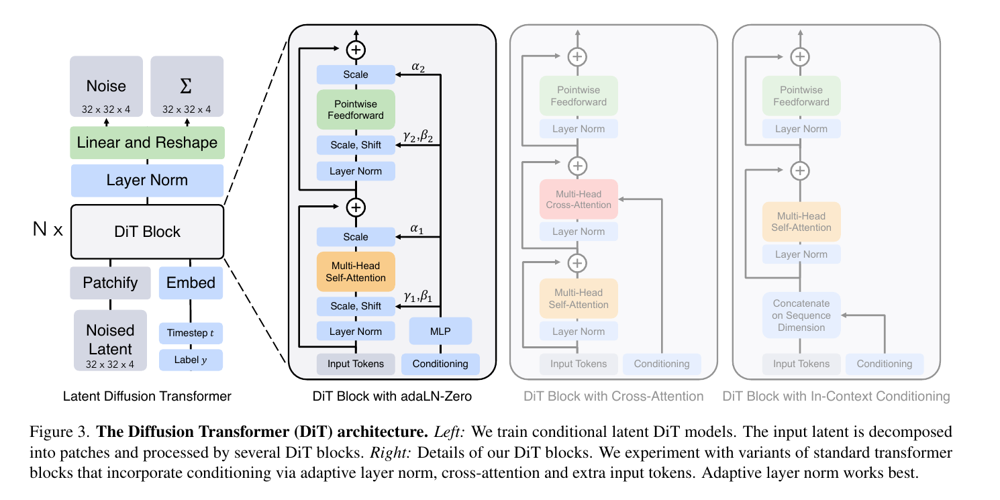
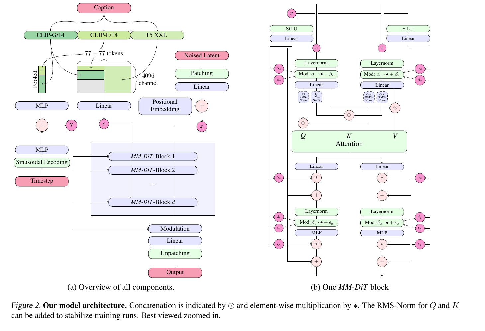

# Video Gen

- Vs Image
  - Time is an added dimension, and motion must be consistent across frames.
  - Two families: generate the video clip jointly (this note), or condition each frame on previous ones (autoregressive). Frontier models do the former, then extend.
  - Encoding video for understanding is a separate problem: [Flamingo](https://arxiv.org/pdf/2204.14198) samples frames, encodes each independently and adds learned temporal embeddings.
- What changes when $`\mathbf{x}_0`$ is a clip
  - **Nothing in the diffusion math.** $`\mathbf{x}_0`$ is a vector. Everything in [Diffusion](../10_diffusion/notes.md) — forward process, ELBO, $`L_\text{simple}`$, samplers, knobs — carries over verbatim.
  - The data point is the whole clip, at one noise level:
    - $`\mathbf{x}_0 \in \mathbb{R}^{F \times H \times W \times 3}`$, one $`t \sim U\{1..T\}`$, $`\pmb\epsilon`$ of the same shape, $`\mathbf{x}_t = \sqrt{\bar{\alpha}_t}\mathbf{x}_0 + \sqrt{1-\bar{\alpha}_t}\pmb\epsilon`$, loss $`\|\pmb\epsilon - \pmb\epsilon_\theta(\mathbf{x}_t, t)\|^2`$ over all $`3FHW`$ values.
    - **Every frame at the same noise level.** Noising frames independently would train an image model: the loss would never require two frames to agree. Coherence is not supervised — it is the cheapest way to predict noise across nearly identical frames.
    - Per-frame $`t`$ is a later, different choice ([Diffusion Forcing](https://arxiv.org/pdf/2407.01392)); not used here.
  - Cost: a clip is $`F\times`$ an image. $`16 \times 64 \times 64 \times 3 = 196{,}608`$ values against $`12{,}288`$. Hence short, low-resolution base models plus cascades.
  - What does change: the shape of $`\mathbf{x}_0`$, and therefore the architecture — something must move information across frames.
- Continuous-time notation
  - VDM, SD3 and Seedance write diffusion in continuous time over $`[0,1]`$, which relabels the DDPM notes. Translating:
    - $`\mathbf{z}_t \equiv \mathbf{x}_t`$, $`\mathbf{x} \equiv \mathbf{x}_0`$; larger $`t`$ is noisier; steps are $`(s,t)`$ pairs with $`s < t`$ rather than adjacent integers.
    - $`\alpha_t \equiv \sqrt{\bar{\alpha}_t}`$ and $`\sigma_t \equiv \sqrt{1-\bar{\alpha}_t}`$, so $`\alpha_t^2 + \sigma_t^2 = 1`$ is variance preservation. **Two traps**: their $`\alpha_t`$ is _not_ our $`1-\beta_t`$, and their $`\sigma_t`$ is the _forward_ noise scale, not our reverse-step $`\sigma_t`$ (that one is their $`\tilde\sigma_{s|t}`$).
    - $`\sigma^2_{t|s} \equiv \beta_t`$, $`\tilde\sigma^2_{s|t} \equiv \tilde\beta_t`$, $`\hat{\mathbf{x}}_\theta(\mathbf{z}_t) = (\mathbf{z}_t - \sigma_t\pmb\epsilon_\theta)/\alpha_t`$ is $`\mathbf{x}_0`$-prediction, and $`\lambda_t = \log(\alpha_t^2/\sigma_t^2)`$ is the log-SNR.
    - The identity $`1 - e^{\lambda_t - \lambda_s} = \frac{\beta_t}{1-\bar{\alpha}_t}`$ turns their reverse posterior into our $`\tilde{\pmb\mu}_t, \tilde\beta_t`$.
  - **Velocity prediction** (rectified flow, [SD3](https://arxiv.org/pdf/2403.03206)) — what Seedance trains on:
    - Straight path $`\mathbf{z}_t = (1-t)\mathbf{x}_0 + t\pmb\epsilon`$; target is its derivative, $`\mathbf{v} = \frac{d\mathbf{z}_t}{dt} = \pmb\epsilon - \mathbf{x}_0`$; loss $`\|\mathbf{v}_\theta(\mathbf{z}_t, t) - (\pmb\epsilon - \mathbf{x}_0)\|^2`$.
    - Same construction as $`\mathbf{v}`$-prediction on the cosine arc, $`\frac{d}{d\phi}[\cos\phi\,\mathbf{x}_0 + \sin\phi\,\pmb\epsilon] = \cos\phi\,\pmb\epsilon - \sin\phi\,\mathbf{x}_0`$: the target is always the tangent of the interpolation path. Rectified flow's is constant because the path is straight.
    - Straight path $`\Rightarrow`$ nearly straight sampling ODE $`\Rightarrow`$ few-step sampling. Price: $`\|\mathbf{z}_t\|^2 = (1-t)^2 + t^2`$ dips to $`0.5`$ at $`t = \tfrac12`$; not variance preserving.
    - Timestep sampling: $`u \sim \mathcal{N}(m, s)`$, $`t = \sigma(u)`$ (logit-normal); SD3's best is $`(m,s) = (0,1)`$. Intuition: $`\pmb\epsilon - \mathbf{x}_0`$ is trivial at both ends (at $`t=0`$ predict the mean of the noise, at $`t=1`$ the mean of the data) and hard in the middle. Equivalent to a loss weight $`t/\pi(t)`$ — the $`p(t)w(t)`$ knob from the Diffusion notes.
- Architecture I: factorize the U-Net over space and time ([VDM](https://arxiv.org/pdf/2204.03458))
  - Tensor $`[B, F, H, W, C]`$. Two changes to the image U-Net, nothing else:
    - $`3\times3`$ conv $`\to`$ $`1\times3\times3`$. Kernel depth $`1`$ along $`F`$ means the 2D conv applied to each frame. Parameters $`9\,C_\text{in}C_\text{out}`$ either way, so **image weights load directly**. A full $`3\times3\times3`$ would be $`27\,C_\text{in}C_\text{out}`$ and incompatible.
    - Insert a temporal attention block after every spatial attention block.
  - "Treats the spatial axes as batch axes" is a literal reshape:

  | block | reshape | sequence | batch |
  |---|---|---|---|
  | spatial attention | $`[BF,\ HW,\ C]`$ | $`HW`$ pixels | $`BF`$ |
  | temporal attention | $`[BHW,\ F,\ C]`$ (permute first) | $`F`$ frames | $`BHW`$ |
  | $`1\times3\times3`$ conv | none | — | — |

  - Only temporal attention crosses the frame axis. Relative position embeddings give frame ordering without absolute time, and nothing hard-codes $`F`$.
  - Cost, with $`S = HW`$: joint spatiotemporal attention is $`(FS)^2`$; factorized is $`FS^2 + SF^2`$. Ratio $`\frac{FS}{S+F} \to F`$ when $`S \gg F`$. At $`16\times64\times64`$: $`15.94\times`$. **Factorizing buys back exactly the number of frames.**
  - Payoff: delete the temporal blocks and what remains _is_ an image model on $`BF`$ frames. So initialize from image weights, and train jointly on images by appending them as 1-frame clips with temporal attention masked.
  - $`F`$ never changes size: downsampling is spatial only.
- Architecture II: DiT ([Peebles & Xie](https://arxiv.org/pdf/2212.09748))
  - [Source](https://arxiv.org/pdf/2212.09748)
  - Replace the U-Net with a plain ViT over VAE latents.
  - Receive a noised latent and predict noise (diffusion), but with a transformer architecture.
  - Patchify: latent $`I \times I \times C`$ with patch size $`p`$ gives $`(I/p)^2`$ tokens of dimension $`p^2C`$, linearly embedded. $`32\times32\times4`$ with $`p=2`$ gives $`256`$ tokens; halving $`p`$ quadruples tokens and compute.
  - Standard transformer blocks. Conditioning on $`t`$ and $`c`$ by **adaLN-Zero**: an MLP maps $`\text{emb}(t) + \text{emb}(c)`$ to a per-block scale and shift $`(\gamma, \beta)`$ for each LayerNorm, plus a gate $`\alpha`$ on each residual branch, initialized to $`0`$ so every block starts as the identity.
    - Intuition: the U-Net injects the timestep by _adding_ into every ResBlock; DiT injects it by _rescaling_ every normalization.
  - Output: linear per token to $`p \times p \times 2C`$ (noise and covariance), then unpatchify.
  - Why it won: FID tracks Gflops almost regardless of how they are spent (depth, width, smaller $`p`$), no convolutional inductive bias is needed at scale, and one sequence model serves every modality.
  - Video DiT: tokens are 3D patches over $`(F, H, W)`$. Seedance's **decoupled spatial and temporal layers** — spatial layers attend within a frame, temporal layers across frames with a window partition within each frame — is VDM's factorization inside a transformer.
- Architecture III: MMDiT ([SD3](https://arxiv.org/pdf/2403.03206))
  - [Source](https://arxiv.org/pdf/2403.03206)
  - Problem: text and image tokens have very different statistics; one weight set serves both poorly.
  - **Separate weights, joint attention.** Each modality gets its own adaLN, QKV projection and MLP. Both modalities' $`Q, K, V`$ are concatenated, one attention runs over the joint sequence, then the streams split back. $`Q`$ and $`K`$ are normalized before the attention matrix, for stability.
  - Conditioning: $`t`$ and the pooled text vector via modulation, as in DiT; the text token sequence via the joint attention.
  - In Seedance: MMDiT only in the spatial layers; temporal layers are self-attention over visual tokens alone, so text never enters the temporal path. Positions: 3D RoPE on visual tokens, 1D on text (MM-RoPE); interleaving text and visual tokens supports multi-shot clips with one caption per shot.
- Training a video model end to end ([Seedance 1.0](https://arxiv.org/pdf/2506.09113))
  - Latent space: a temporally causal VAE (MAGVIT-style), compression $`(r_t, r_h, r_w) = (4, 16, 16)`$ with $`C = 48`$. Pixels $`(T'+1, H', W', 3) \to`$ latents $`(T+1, H, W, 48)`$; the causal $`+1`$ frame means an image is the $`T = 0`$ case, so one VAE serves both. Compression ratio $`\frac{48}{3 \cdot 4 \cdot 16 \cdot 16} \approx \frac{1}{64}`$. No patchify on the DiT side. Losses: L1, KL, LPIPS, adversarial.
  - Objective: velocity prediction with logit-normal $`t`$, plus a **resolution-aware timestep shift** — higher resolution and longer clips need more noise to destroy the same signal, so $`t`$ is pushed toward the noisy end for them.
  - **One formulation for every conditional task.** Concatenate along channels: $`[\text{noisy latent};\ \text{clean-or-zero frames};\ \text{binary mask}]`$, the mask marking which frames are given.

  | task | given frames | mask |
  |---|---|---|
  | text-to-video | none (zeros) | all $`0`$ |
  | image-to-video | frame $`0`$ | $`1`$ on frame $`0`$ |
  | extension | frames $`0..k-1`$ | $`1`$ on $`0..k-1`$ |

  - Same network; the task mix is set by which frames are supplied. The conditional model VDM avoided training is now just training data.
  - Upsampling: a cascaded refiner, 480p $`\to`$ 720p/1080p, initialized from the base model; the low-resolution video is upsampled and channel-concatenated with the noise.
  - Progressive pre-training: text-to-image at 256px $`\to`$ image–video joint at 256px (3–12 s, 12 fps) $`\to`$ 640px $`\to`$ 24 fps. A small text-to-image share is retained for semantic alignment; image-to-video is 20% of the mix.
  - Post-training:
    - Continue training: image-to-video raised to 40%; higher-quality data (aesthetic and optical-flow scorers); a second caption type describing motion only, since the first frame already carries the static content.
    - SFT: a curated set; several models trained on subsets, then **merged**; early stopping to protect text controllability.
    - RLHF: three reward models — foundational (a VLM, for alignment and structure), motion, aesthetic (keyframes). Simulate the inference pipeline, predict $`\mathbf{x}_0`$, and directly maximize the composite reward; they report this beat DPO/PPO/GRPO. Iterated over multiple rounds. The refiner is aligned the same way.
    - Distillation: TSCD segments the trajectory and enforces consistency within each segment ($`4\times`$), plus RayFlow score distillation; with system optimizations, $`\sim10\times`$ end to end — 5 s of 1080p in 41.4 s on one L20.
  - Prompt engineering: a fine-tuned Qwen2.5-14B (SFT then DPO) rewrites user prompts into the dense-caption format the DiT was trained on.
- Training-free conditioning ([VDM](https://arxiv.org/pdf/2204.03458), §3.1) — superseded, but the diagnosis is instructive
  - Sample $`\mathbf{x}^b \mid \mathbf{x}^a`$ from an unconditional model over $`[\mathbf{x}^a, \mathbf{x}^b]`$. Shapes are fixed: partition the $`F`$ slots.
  - Replacement: each step, overwrite $`\mathbf{z}^a_t`$ with a fresh re-noising of $`\mathbf{x}^a`$ and update $`\mathbf{z}^b_t`$ normally. **Fails**: the update follows $`\mathbb{E}[\mathbf{x}^b \mid \mathbf{z}_t]`$ but needs $`\mathbb{E}[\mathbf{x}^b \mid \mathbf{z}_t, \mathbf{x}^a]`$. The clean frames reach the model only through the noised $`\mathbf{z}^a_t`$, which is uninformative at high $`t`$ — exactly where global structure is decided.
  - The exact gap, by Tweedie twice. $`\mathbb{E}[\mathbf{x} \mid \mathbf{z}_t] = (\mathbf{z}_t + \sigma_t^2\nabla\log q(\mathbf{z}_t))/\alpha_t`$; condition on $`\mathbf{x}^a`$ and use $`q(\mathbf{z}_t \mid \mathbf{x}^a) \propto q(\mathbf{z}_t)\,q(\mathbf{x}^a \mid \mathbf{z}_t)`$, so the log splits into two gradients:
    - $`\displaystyle \mathbb{E}[\mathbf{x}^b \mid \mathbf{z}_t, \mathbf{x}^a] = \mathbb{E}[\mathbf{x}^b \mid \mathbf{z}_t] + \frac{\sigma_t^2}{\alpha_t}\nabla_{\mathbf{z}^b_t}\log q(\mathbf{x}^a \mid \mathbf{z}_t)`$
  - Approximate $`q(\mathbf{x}^a \mid \mathbf{z}_t) \approx \mathcal{N}\!\left(\hat{\mathbf{x}}^a_\theta(\mathbf{z}_t), \tfrac{\sigma_t^2}{\alpha_t^2}\mathbf{I}\right)`$ — the model's own reconstruction of the known frames, with spread $`1/\sqrt{\text{SNR}}`$. The $`\sigma_t^2`$ cancels:
    - $`\displaystyle \tilde{\mathbf{x}}^b_\theta(\mathbf{z}_t) = \hat{\mathbf{x}}^b_\theta(\mathbf{z}_t) - \frac{w_r\alpha_t}{2}\nabla_{\mathbf{z}^b_t}\left\|\mathbf{x}^a - \hat{\mathbf{x}}^a_\theta(\mathbf{z}_t)\right\|^2`$
    - $`\mathbf{z}_t`$ is all $`F`$ frames; the gradient is taken only with respect to the generated slots. It adjusts the _prediction_ at each sampling step. Weights are frozen. With a differentiable downsampler in place of the slice, the same equation does super-resolution.
  - Downsides: an extra backward pass per step ($`\approx 3\times`$), a Gaussian approximation, and a bespoke loss per task — against channel-concat plus mask, which is exact and unified. Still the standard tool for inpainting and editing when retraining is off the table.
