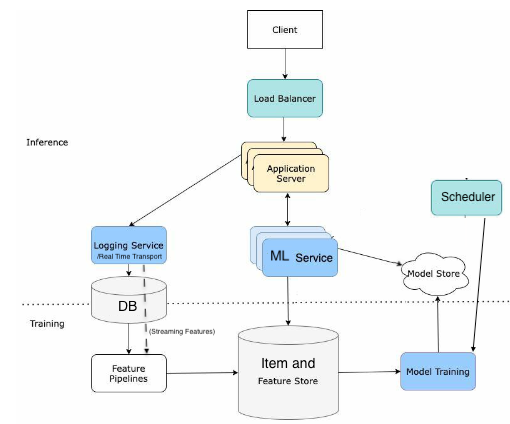

# System Design

## Software Engineering SD
- Framework
  - Understand the problem and establish scope and requirements
    - Problem:
      - Why do we want to build this feature? What business value would this bring?
      - What feature do we want to build?
    - Requirements
      - Functional
        - Identify main objects and relationships
        - Consider mutability
      - Non-functional
        - Performance (latency)
        - Availability (downtime)
        - Throughput (num users)
        - Additional restrictions (compute)
        - Security
    - Categorize needs
      - Structured or unstructured data
      - Read-heavy or write-heavy?
      - Check in on whether we want to estimate for throughput/storage requirements.
  - Propose a high-level design and get buy in
    - Data storage
    - Key microservices
  - Identify key issues and redesign 
    - Load balancing, caches, horizontal scaling, message queues
  - Recap
- Template Design
  - [Source](https://github.com/donnemartin/system-design-primer?tab=readme-ov-file#push-cdns)
- Concepts
  - User gets the IP address of the load balancer from DNS.
  - API:
    - REST
      - HTTP verbs (GET/PUT/POST/PATCH/DELETE) are performed wherever possible. Note that HTTP is just a common implementation of REST.
      - Pros: Structured way of getting information from DB
      - Cons: Requires requests for each type of entity in DB. Less space efficient as RPC.
    - Remote Procedure Call (RPC, family style)
      - Allows the execution of a procedure or command in a remote machine. You can write code that executes on another computer internally the same way you write code that runs on a current machine. 
      - Pros: More space efficient, makes development easier.
      - Cons: It can only be used for internal communication.
    - GraphQL
      - You structure the data in graphs. It enables building a request to fetch all the data you need in one call.
      - Pros: Works well for customer-facing web and mobile applications. Frontend devs can craft their own requests to get and modify information without needing backend devs to build more routes.
      - Cons: Upfront work, less friendly for external users, and not suitable when data needs to be aggregated on the backend.
  - Load balancer: evenly distributes incoming traffic among web servers.
  - Database replication
    - Usually master/slave relationship
    - A master generally only supports writes and a slave gets copies from the master and only supports reads.
    - One may have more masters for reliability, but trade off some consistency.
  - Cache
    - Cache aside pattern - check cache first, then DB if needed.
    - Write throught / write behind - App writes to cache, cache writes to DB. 
    - Tradeoffs between consistency and availability
  - Content Delivery Network (CDN)
    - A network of geographically dispersed servers used to deliver static content like images, videos, JavaScript files, etc.
    - Imo, functions as a cache
  - Stateless architecture: 
    - State data (e.g. session data) is stored in a shared data store and kept out of web servers. 
    - This is more scalable but may hinder performance in scenarios requiring frequent state retrieval.
  - Data Center
    - Each (geo-located) data center has its own servers, databases, and caches.
  - Brokers
    - Real-time transport are in-memory storage that passes data to servers, supporting asynchronous communication. 
    - This generally increases reliability too by "checkpointing". Expensive code can be held in queues while previous messages are being processed.
    - Two types
      - Pub-sub: Servers publish and subscribe to different topics.
      - Message queue: Event has an intended consumer and the message queue ensures that a message gets to the right consumer.
  - Scaling
    - Vertical
      - Adding more power to the existing machine. This is used when its more efficient to keep certain processes together, e.g. due to geographical restrictions.
    - Horizontal
      - Add more servers
      - Shard databases
        - Vertical: By feature
        - Key-based
        - Directory-based: Need to maintain a lookup table
      - Normalization
        - Reduces redundancy but slows down joins
  - Databases (SQL vs NoSQL)
    - SQL: relational database that is composed of tables where each row reflects a data entity and each column defines specific information about the field.
      - Pros: Querying, ACID (Atomicity, Consisttency, Isolation, Durability)
      - Cons: Slower to write to (Use of B-Trees necessitates rewriting), Does not work well for mixed schema data
    - NoSQL: Nested Key-Value store, document databases, columnar databases (when search for value), graph databases. 
      - Pros: Faster writes. Managed NoSQL services come with sharding and scaling out the box.
      - Cons: Limited in the types of efficient queries that can be done. Less suitable where strong consistency is required.
    - ACID properties
      - Atomicity: Transactions are either all or nothing, if a transaction fails, the entire transaction is rolled back.
      - Consistency: Transactions bring the database from one valid state to another, adhering to all predefined rules and constraints. I.e. any transaction that breaks such constraints would fail and be rolled back.
      - Isolation: Transactions run independently, and concurrent transactions occur as though they were occurring sequentially. 
      - Durability: Committed transactions are permanently recorded in the database, even after system failure
    - CAP Theorem
      - A distributed data store can only provide two of the following three guarantees
        - Consistency: Every read receives the most recent write or an error. Alternatively, all nodes will give the same response to a given request.
        - Availability: Every request receives a non-error response, even when nodes are down or unavailable
        - Partition tolerance: The system continues to operate even if there is a communication break between two nodes
      - Note: The consistency here is _different_ from the consistency in ACID!
  - MapReduce
    - Specifies logic to hash requests and therefore parallelize them.
  - Web Authentication
    - Salt and hash password on signup.
    - Per session, we use session tokens for additional authentication.
  - Consistent hashing
    - Hash our nodes on a ring - allows for easy reallocation. 

## Machine Learning SD
- While ML SD questions may involve the SWE SD topics above, there seems to be a greater focus on modeling.
- Template Design (Adapted from [Pham](https://www.amazon.com/Machine-Learning-Design-Interview-System/dp/B09YQWX59Z))
  - 
  - Here, the ML Service can be a few components, e.g. both a Candidate and Ranking service for a recommendation system. 
  - The item and feature store is used as a lookup table for faster inference.
- Framework
  - Understand the problem and establish scope and requirements
    - Problem
      - Why do we want to build this feature? What business value would this bring?
      - Why do we need an ML solution?
      - What is the (geographical) scope? 
      - What are the data sources? How large is the dataset? Is it labelled? 
    - Requirements
      - Accuracy 
      - Performance (latency), batch or online predictions
      - Throughput (num users)
      - Compute (cloud or device)
      - Retraining frequency
      - Privacy
      - Availability (downtime)
  - Design deep dive (look for specific guides here). 
    - Frame the problem
      - Input and output
      - Offline and online metrics (see [Testing and Metrics](../../classical/04_testing_and_metrics/notes.md))
        - Convert business objective to appropriate online metric
        - Convert online metric to offline metric
        - Offline metric and ml training loss can be different too
        - Should metrics be weighted? Ads by revenue per click, or harmfull posts by number of impressions.
    - Data
      - Data collection
      - Handling data imbalance
      - Split data
      - Handling missing values or outliers
      - Feature engineering
    - Model development
      - Establish a baseline
      - Start with a simple model and go from there
      - Regularization
    - Deployment design (figures)
      - Batch or online predictions? Latency?
      - Serving scalability and reliability
      - Retraining
      - Monitoring
      - Infrastructure
      - Privacy
  - Recap

## Third-Party Resources
- Load Balancer: AWS Elastic Load Balancing
- DBs
  - Relational: Amazon RDS, MySQL, PostgreSQL
  - NoSQL:
    - Key/Value: Redis, DynamoDB
    - Column-based: Cassandra, HBase
    - Graph: Neo4J
    - Document: MongoDB, CouchDB
- Servers: AWS, Azure, GCP
- CDNs: Akamai, AWS, Azure, Google Cloud
- Service: Kubernetes can auto-scale the number of pods
- Data Processing / Feature Pipelines
  - Batch computation engines: Apache Spark, MapReduce
  - Streaming computation engines: Apache Flink, KSQL, Spark Streaming.
- Feature / Index Stores
  - Realtime approximate nearest neighbors systems - Annoy, Faiss, ScaNN
  - Text indexing systems (Lucene, Elasticsearch)
  - AWS Dynamo provides key-value storage with high availability
- Brokers
  - Google DataFlow
  - Pub-sub: Apache Kafka, Amazon Kinesis
  - Message Queues: Apache RocketMQ, RabbitMQ
- Distributing Model Training: Tensorflow's YARN
- Deployment service: AWS SageMaker, GCP Vertex AI, Azure Azure ML, Alibaba Machine Learning Studio
- Model Repos: S3
- Schedulers: Slurm, Google Borg
- Orchesterators: K8, HashiCorp Nomad, Airflow 
- Workflow management tools: Airflow, Argo, Prefect, Kubeflow, MLFlow, TFX
- Encoders:
  - Words - GLoVe
  - Text - DistilmBERT
  - Image - CLIP, SimCLR
  - Video - VideoMoCo