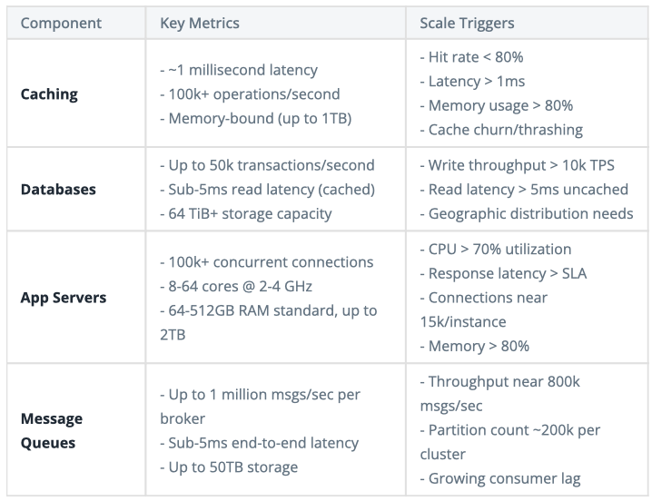

# System Design

## Software Engineering SD
- Framework
  - Understand the problem and establish scope and requirements
    - Problem:
      - Why do we want to build this feature? What business value would this bring?
      - What feature do we want to build?
    - Requirements
      - Functional
        - Users/Clients should be able to...
      - Non-functional
        - Above the line
          - Availability vs consistency (for which parts?)
          - Scalability: DAU, throughput. Read or write heavy?
          - Latency: 200ms is human reaction time
        - Below the line
          - Constraints (compute, environment)
          - Durability
          - Security
          - Fault Tolerance
          - Compliance
  - Propose a high-level design
    - Core Entities 
    - API or System Interface
    - (Optional) Data Flow
    - High Level Design for Functional Requirements
  - Deep Dives
    - Non-functional Requirements
      - Back of the Envelope calculations
- Template Design
  - [Source](https://github.com/donnemartin/system-design-primer?tab=readme-ov-file#push-cdns)
- Numbers to Know Cheat Sheet
  - [Source](https://www.hellointerview.com/learn/system-design/deep-dives/numbers-to-know)
- Components
  - DNS: Resolves domain name. User gets the IP address of the load balancer.
  - Networking: Layer 4 is the transport layer. TCP Handshake and Teardown is carried out before and after data is sent to and from servers.
  - Load balancer: 
    - Functionality: Evenly distributes incoming traffic among servers. 
    - Appropriate both before and after API Gateway.
    - Persistent connections (websockets): L4 load balancer. Otherwise, L7 load balancer offers great flexibility in routing traffic to different services while minimizing the connection load downstream.
    - Options: 
      - Algorithms: Round Robin or Least Connections
      - L4 or L7?
        - Layer 4 load balancers operate at the transport layer (TCP/UDP). They make routing decisions based on network information like IP addresses and ports, without looking at the actual content of the packets.
          - They maintain persistent TCP connections between client and server, i.e. the same server will handle all subsequent requests within that TCP session.
        - Layer 7 load balancers operate at the application layer, understanding protocols like HTTP. They can examine the actual content of each request and make more intelligent routing decisions.
      - Technologies: AWS Elastic Load Balancer, NGINX, HAProxy
  - API Gateway:
    - Functionality
      - Validate the request
      - Run middleware (auth, rate limiting)
      - Routing (different backend servers listen on different ports)
      - Request processing (transform to appropriate protocol used by backend services)
      - Serializes response from backend and returns it to client
      - (Optional) Cache response for future requests
    - APIs
      - REST, RPC, GraphQL
    - Options
      - Managed Services: AWS API Gateway, Azure API Management, Google Cloud Endpoints
      - Open Source: Kong, Tyk, Express Gateway
  - Queue
    - Functionality:
      - Supports asynchronous communication 
      - Needs in order processing
      - Decouples producers and consumers, allowing for independent scaling
      - Buffer for bursty traffic
      - Distributes work amongst consumers
    - Details to bring up
      - Message ordering
      - Retry mechanisms
      - Dead letter queues
      - What is the partition?
      - Backpressure
    - Options
      - Kafka (does not support retries), SQS (supports retries, delayed message delivery, quicker retries through visibility), RabbitMQ
    - Note: It is an anti-pattern to store the raw HTML in the queue itself. Queues are not optimized for large payloads and it would be expensive to store the HTML in the queue. 
  - Streams / Event Sourcing
    - Unlike message queues: 
      - Consumers read messages from the stream and then process them, but they don't acknowledge that they have processed the message. This allows for more complex processing of the data.
      - Streams can retain data for a configurable period of time, allowing consumers to read and re-read messages from the same position or from a specified time in the past
    - Functionality
      - Process large amounts of data in real-time
      - Need a chronological record of events (banks)
      - Support multiple consumers reading from the same stream (pub-sub, chat systems)
    - Options: Kafka, Flink, Kinesis
  - Distributed Lock
    - Options: Redis, Zookeeper
  - Distributed Cache
    - Details to bring up
      - Eviction Policy: LRU, FIFO, LFU
      - Cache Invalidation Strategy 
      - Cache Write Strategy
        - Write-Through: Write data to both cache and database simultaneously. Consistent but slower.
        - Write-Around: Writes data directly to database. Slower for reads.
        - Write-Back: Writes data to cache, async write to datastore. Can lead to data loss if cache is not persisted to disk.
    - Options: Redis (supports more data structures), Memcached, DAX for DynamoDB, Elasticsearch has built-in caching capabilities
  - Content Delivery Network (CDN)
    - Functionality: Uses geographically distributed servers to cache content closer to users
    - Most used for static assets, but can be used to cache dynamic content too 
    - Can be used to cache API responses
    - Options: Cloudfare, Akamai, Amazon CloudFront 
  - Database
    - Relational
      - Advantages
        - Complex querying
        - ACID - tends to be more consistent, but some NoSQL DBs also support strong consistency
        - Fast reads through indexing (support for many, multi-column, and specialized indexes)
      - Options: Postgres (strongly consistent, complex queries, supports text and geospatial search, compatible with Elasticsearch), MySQL
    - NoSQL
      - Key-value, document, columnar (when search for value), graph
      - Advantages
        - Flexible data model 
        - Scalability to multiple servers
        - Can handle high amounts of data
        - Faster writes
      - Options: DynamoDB (Can enable strong consistency, DAX Cache, DynamoStreams enables Elasticsearch), Cassandra (good for write-heavy workloads due to append-only storage model), MongoDB
  - Blob Storage
    - Functionality: Cheap, and can store unstructured data
    - Options: Amazon S3, GCS, Azure Blob
  - Search Optimized Database
    - Functionality: full-text search, vector search, fuzzy search
    - Inverted indexes are used for text search
    - Options:
      - Text: Elasticsearch (Postgres has GIN), Redis
      - Geospatial: Elasticsearch, Postgres has PostGIS
      - Realtime approximate nearest neighbors systems - Elasticsearch, Annoy, Faiss, ScaNN
    - Elasticsearch is compatible with DynamoDB and Postgres via Change Data Capture (CDC)
    - Elasticsearch has built-in caching capabilities
  - Data Centers
    - Each (geo-located) data center has its own servers, databases, and caches.

## Machine Learning SD
- While ML SD questions may involve the SWE SD topics above, there seems to be a greater focus on modeling. 
- Template Design (Adapted from [Pham](https://www.amazon.com/Machine-Learning-Design-Interview-System/dp/B09YQWX59Z))
  - 
  - Here, the ML Service can be a few components, e.g. both a Candidate and Ranking service for a recommendation system. 
  - The item and feature store is used as a lookup table for faster inference.
- Framework
  - Understand the problem and establish scope and requirements
    - Problem
      - Why do we want to build this feature? What business value would this bring?
      - Why do we need an ML solution?
      - What is the (geographical) scope? 
      - What are the data sources? How large is the dataset? Is it labelled? 
    - Requirements
      - Accuracy 
      - Performance (latency), batch or online predictions
      - Throughput (num users)
      - Compute (cloud or device)
      - Retraining frequency
      - Privacy
      - Availability (downtime)
  - Design deep dive (look for specific guides here). 
    - Frame the problem
      - Input and output
      - Offline and online metrics (see [Testing and Metrics](../../classical/04_testing_and_metrics/notes.md))
        - Convert business objective to appropriate online metric
        - Convert online metric to offline metric
        - Offline metric and ml training loss can be different too
        - Should metrics be weighted? Ads by revenue per click, or harmfull posts by number of impressions.
    - Data
      - Data collection
      - Handling data imbalance
      - Split data
      - Handling missing values or outliers
      - Feature engineering
    - Model development
      - Establish a baseline
      - Start with a simple model and go from there
      - Regularization
    - Deployment design (figures)
      - Batch or online predictions? Latency?
      - Serving scalability and reliability
      - Retraining
      - Monitoring
      - Infrastructure
      - Privacy
  - Recap