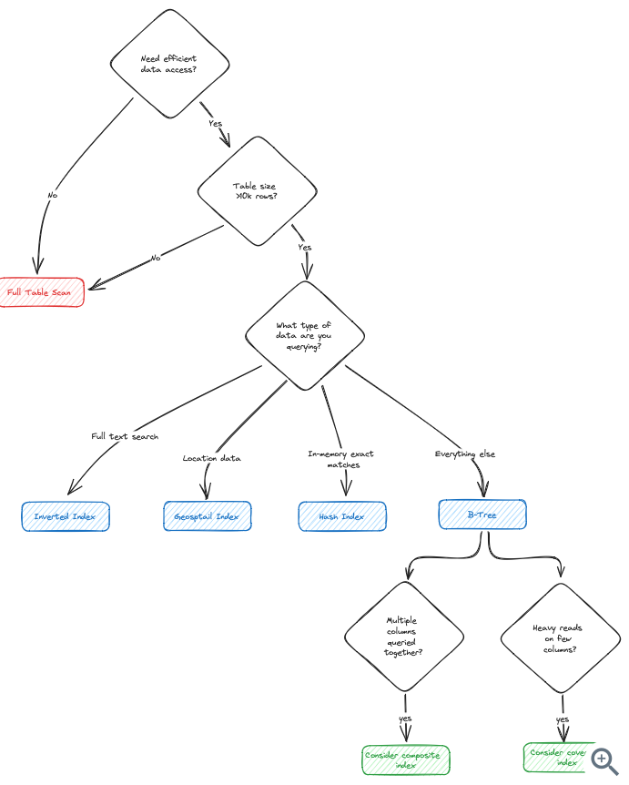
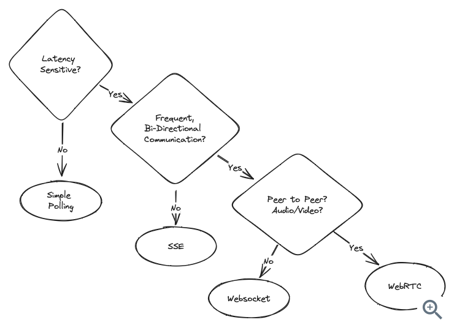
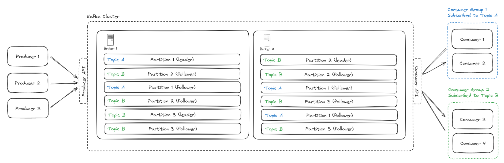

# Deep Dives

## Concepts

- APIs
  - REST
    - HTTP verbs (GET/PUT/POST/PATCH/DELETE) are performed wherever possible. Note that HTTP is just a common implementation of REST.
    - Pros: Structured way of getting information from DB
    - Cons: Requires requests for each type of entity in DB. Less space efficient as RPC.
  - Remote Procedure Call (RPC, family style)
    - Allows the execution of a procedure or command in a remote machine. You can write code that executes on another computer internally the same way you write code that runs on a current machine. 
    - Pros: More space efficient, makes development easier.
    - Cons: Less uniform - not suitable for broad client compatibility.
  - GraphQL
    - You structure the data in graphs. It enables building a request to fetch exactly the data you need in one call.
    - Pros: Works well for customer-facing web and mobile applications. Frontend devs can craft their own requests to get and modify information without needing backend devs to build more routes.
    - Cons: Upfront work, less friendly for external users, and not suitable when data needs to be aggregated on the backend.
- Stateless architecture: 
  - State data (e.g. session data) is stored in a shared data store (message broker or database) and kept out of web servers. 
  - This allows for more horizontal scaling while maintaining stateful communication, but may hinder performance in scenarios requiring frequent state retrieval.
- Scaling
  - Vertical
    - Adding more power to the existing machine. This is used when its more efficient to keep certain processes together, e.g. due to geographical restrictions.
  - Horizontal
    - (Work) Add more servers
    - (Data) Shard databases
      - Vertical: By feature
      - Key-based
      - Directory-based: Need to maintain a lookup table
    - Normalization
      - Reduces redundancy but slows down joins
- Databases (SQL vs NoSQL)
  - SQL: relational database that is composed of tables where each row reflects a data entity and each column defines specific information about the field.
    - Pros: Querying, ACID (Atomicity, Consistency, Isolation, Durability)
    - Cons: Slower to write to (Use of B-Trees necessitates rewriting). Schema needs to be known ahead of time / Does not work well for mixed schema data.
  - NoSQL: Nested Key-Value store, document databases, columnar databases (when search for value), graph databases. 
    - Pros: Faster writes. Managed NoSQL services come with sharding and scaling out the box. Flexible for when schema changes rapidly e.g. startup.
    - Cons: Limited in the types of efficient queries that can be done. Less suitable where strong consistency is required.
  - ACID properties
    - Atomicity: Transactions are either all or nothing, if a transaction fails, the entire transaction is rolled back.
    - Consistency: Transactions bring the database from one valid state to another, adhering to all predefined rules and constraints. I.e. any transaction that breaks such constraints would fail and be rolled back.
    - Isolation: Transactions run independently, and concurrent transactions occur as though they were occurring sequentially. 
    - Durability: Committed transactions are permanently recorded in the database, even after system failure
  - CAP Theorem
    - A distributed data store can only provide two of the following three guarantees
      - Consistency: Every read receives the most recent write or an error. Alternatively, all nodes will give the same response to a given request.
      - Availability: Every request receives a non-error response, even when nodes are down or unavailable
      - Partition tolerance: The system continues to operate even if there is a communication break between two nodes
    - Note: The consistency here is _different_ from the consistency in ACID!
- Database replication
  - Usually master/slave relationship
  - A master generally only supports writes and a slave gets copies from the master and only supports reads.
  - One may have more masters for reliability, but trade off some consistency.
- Database Indexing
  - [Source](https://www.hellointerview.com/learn/system-design/deep-dives/db-indexing)
  - B-Tree Indexes
    - Balanced tree that maintains sorted data
  - Hash Indexes
    - Speed
    - Don't need range queries
    - Have more memory
  - Geospatial Indexes
    - Geohash (hash a grid)
    - Quadtree (recursively subdivide grid)
    - R-Tree (flexible, overlapping rectangles)
  - Inverted Indexes
- Consistent hashing
  - Hash our nodes on a ring - allows for easy reallocation. 
  - Virtual nodes to "even out" load
- MapReduce
  - Specifies logic to hash requests and therefore parallelize them.
- Communication protocols for real-time client updates:
  - [Source](https://www.hellointerview.com/learn/system-design/deep-dives/realtime-updates)
  - Simple polling: Client makes request at regular intervals
  - Long polling: Server holds request open until it has new data. Client makes request again the moment it receives a response. 
  - Server Sent Events (SSE): Allows the server to push updates to the client, via a single, long-lived HTTP connection. Not supporting client-to-server message makes SSE simpler to implement and integrate into existing HTTP infrastructure, such as load balancers and firewalls, without the need for special handling.
  - Websockets: realtime, bidrectional communication. A common pattern is to use a message broker to handle communication between the client and server, and for backend services to communicate with this message broker.
  - WebRTC: enables direct peer-to-peer communication between browsers, perfect for video/audio calls and some data sharing like document editors
- Security
  - Authentication / Authorization: API Gateway
  - Encryption: Protocol encryption (data in transit) and storage encryption (data at rest)
    - HTTPS is the SSL/TLS protocol that encrypts data in transit
    - Use a database that supports encryption or encrypt it yourself before storing
  - Data Protection
    - Rate limiting or request throttling
- Monitoring
  - Infrastructure: CPU usage, memory usage, disk usage, network usage: Datadog or New Relic
  - Service-level: Request latency, error rates, throughput
  - Application-level: Number of users, number of active sessions, number of active connections: Google Analytics or Mixpanel

## Additional Examples
- Servers: AWS, Azure, GCP
- Service: Kubernetes can auto-scale the number of pods
- Data Processing / Feature Pipelines
  - Batch computation engines: Apache Spark, MapReduce
  - Streaming computation engines: Apache Flink, KSQL, Spark Streaming.
- Distributing Model Training: Tensorflow's YARN
- Deployment service: AWS SageMaker, GCP Vertex AI, Azure Azure ML, Alibaba Machine Learning Studio
- Model Repos: S3
- Schedulers: Slurm, Google Borg
- Orchestrators: K8, HashiCorp Nomad, Airflow 
  - If schedulers are concerned with when to run jobs and what resources are needed to run those jobs, orchestrators are concerned with where to get those resources.
- Workflow management tools: Airflow, Argo, Prefect, Kubeflow, MLFlow, TFX
- Encoders:
  - Words - GLoVe
  - Text - DistilmBERT
  - Image - CLIP, SimCLR
  - Video - VideoMoCo

## Deep Dives

### K8s
- Background
  - Containers: lightweight, portable box that holds everything needed to run a software application (code, runtime, libraries, etc.). Containers ensure that your app runs the same way, no matter where it’s deployed. Common tools for creating containers are Docker or Podman
  - Clusters: A cluster is a group of machines (servers) that work together. 
    - The control plane is the brain of the cluster. It has components like an API Server, Scheduler, Controller Manager, and etcd. 
    - Worker nodes. Each node are machines where applications (containers) run 
      - Kubelet, container runtime, kube proxy 
    - All nodes in the cluster are connected via a network, allowing pods on different nodes to communicate seamlessly. 
    - In practice, most companies start with a single Kubernetes cluster. As the organization grows or as the app’s needs become more complex (e.g., multi-region, high security), there’s a shift towards using multiple clusters. Kubernetes provides the tools and flexibility to scale from a single cluster to multiple clusters as your needs evolve (Federation).
- Why use K8s? 
  - Automated Scaling 
  - Self-Healing: If a container crashes, k8s can automatically detect it and restart it. If a machine (server) in the cluster goes down, k8s can move your containers to other machines in the cluster 
  - Load Balancing 
  - Easy Deployment and Rollbacks 
  - Resource Efficiency 
  - Declarative Configuration 
  - Multi-Cloud and Hybrid Support
- How k8s works 
  - Containers: You containerize your app. A container runs a single process. 
  - Pod: k8s groups one or more containers into a Pod, the smallest unit in k8s which represents a single instance of your app. All containers within a pod share the same network namespace, which facilitates communication. Containers in the same pod are always scheduled together on the same node (machine) in the cluster. 
  - Deployment: You specify how many pods you want running, etc. K8s will manage pods based on your specifications 
  - Service: You expose your pods to the outside world using a Service, which acts as a load balancer to route traffic to the correct pod. 
  - K8s scheduler: It decides which machine (from the cluster) will run your pods, based on available resources 

### Kafka
- When to use
  - Message queue or stream
- Need to know
  - Kafka is thought of as always available, sometimes consistent
  - Kafka does not support retries for consumers out of box (AWS SQS does). 
    - Common pattern is set up a "Retry" topic and then a "DLQ" (Dead Letter Queue) Topic
  - You should specify your partition key
  - Open-Source
- Good to know
  - [Source](https://www.hellointerview.com/learn/system-design/deep-dives/kafka#a-motivating-example)
  - A Kafka cluster is made up of multiple **brokers**. These are just individual servers.
  - Each broker has a number of **partitions**. Each partition is an ordered, immutable sequence of messages that is continually appended to.
  - A **topic** is just a logical grouping of partitions. Topics are the way you publish and subscribe to data in Kafka. When you publish a message, you publish it to a (partition in a) topic, and when you consume a message, you consume it from a topic.
  - A **consumer group** is a group of consumers. Each consumer group subscribes to one topic. Each event is processed by only one consumer in a group.
  - Fault tolerance / Durability
    - Offset management: Consumers commit their offsets to Kafka after they process a message. When a consumer restarts, it reads its last committed offset from Kafka and resumes processing from there, ensuring no messages are missed or duplicated.

### AWS SQS
- When to use
  - ToDo
- Need to know
  - AWS SQS supports retries for consumers out of box
  - SQS supports delayed message delivery
- Good to know
  - Durability through visibility: When a worker receives a message from the queue, SQS automatically makes that message invisible to other workers for a configurable period. The worker processes the message and deletes it upon successful completion. If the worker crashes or fails to process the message within the visibility timeout period, SQS automatically makes the message visible again for other workers to process.
    - To optimize for quick failure recovery while still supporting longer-running jobs, we can set a relatively short visibility timeout (e.g. 30 seconds) and have workers periodically "heartbeat" by calling the ChangeMessageVisibility API to extend the timeout.

### Redis
- When to use
  - Cache
  - Lock: atomic increment with a TTL
  - Rate Limiting: fixed-window rate limiter
  - Leaderboards: Supports sorted sets
  - Proximity Search: Supports geospatial indexes
  - Event Sourcing: Append-only log allows for streams
- Need to know:
  - In-memory, single-threaded key-value store
  - Fast and flexible, but not as durable as MemoryDB

### PostgreSQL
- Need to know:
  - Advantages
    - Provides strong ACID guarantees while still scaling effectively with replication and partitioning 
    - Rich querying capabilities
    - Strong consistency guarantees 
    - Handles both structured and unstructured data through JSONB support 
    - Includes built-in solutions for common needs like full-text search and geospatial queries
  - Disadvantages
    - Can't handle extreme write throughput (consider Cassandra, DynamoDB)
    - Global Multi-Region Requirements: Master-slave and synchronous replication leads to substantial latency
    - Overkill for key-value access patterns
- Good to know:
  - Changes are first written to the Write-Ahead Log (WAL) on disk. The WAL is critical for durability - once changes are written here, the transaction is considered durable because even if the server crashes, PostgreSQL can recover the changes from the WAL.

### DynamoDB
- Need to know:
  - Key-value
  - Built-in support for Change Data Capture (CDC) through DynamoDB Streams. DynamoDB Streams can be used to keep an **Elasticsearch** index in sync with a DynamoDB table.
  - Dynamo comes with a built-in, in-memory cache called DynamoDB Accelerator (DAX).
  - DynamoDB can be configured to support strong consistency.
  - Disadvantages:
    - Cost: DynamoDB's pricing model is based on read and write operations plus stored data, which can get expensive with high-volume workloads.
    - Complex query patterns
- Good to know:
  - Primary Key = {Partition Key}:{Optional Sort Key}
  - Global Secondary Index (GSI) - An index with a partition key and optional sort key that differs from the table's partition key. GSIs allow you to query items based on attributes other than the table's partition key. Since GSIs use a different partition key, the data is stored on entirely different physical partitions from the base table and is replicated separately.
  - Local Secondary Index (LSI) - An index with the same partition key as the table's primary key but a different sort key. LSIs enable range queries and sorting within a partition. Since LSIs use the same partition key as the base table, they are stored on the same physical partitions as the items they're indexing.

### Cassandra
- Need to know:
  - Good choice for systems with high write throughput, given its write-optimized storage layer based on LSM tree indexing
  - Open-source
  - Column-based
  - More limited in functionality vs DynamoDB
  - Isn't good for designs that prioritize strict consistency, given it's heavy bias towards availability

### Elasticsearch
- Need to know
  - Not good idea to use as a database. Use Change Data Capture
  - Designed for read-heavy workflows
  - Eventual consistency
  - Elasticsearch supports text, geospatial and vector search
  - Elasticsearch has built-in caching capabilities
- Good to know
  - Elasticsearch can be thought of as a high-level orchestration framework for Apache Lucene, the highly optimized low-level search library. Elasticsearch handles the distributed systems aspects: cluster coordination, APIs, aggregations, and real-time capabilities while the "heart" of the search functionality is handled by Lucene.
  - Elasticsearch is a distributed search engine. When you spin up an Elasticsearch cluster, you're actually spinning up multiple nodes.
  - Lucene indexes are made up of segments, the base unit of our search engine. Segments are immutable containers of indexed data. 
  - Lucene segments are based on inverted indexes and doc values (columnar format to store data)
