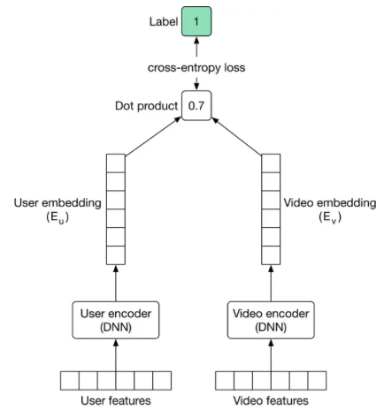

# Recommendation Systems

## Examples
- Traditional
  - Video/event recommendation system
  - Linkedin/Instagram feeds
  - Ad click prediction
- Session-Based
  - People you may know
  - Airbnb similar listings / Instagram explore / Pinterest ads / Doordash store feed / Tiktok reels / Amazon products / Expedia experiences 

## Traditional 
- Clarifying Requirements
  - Num users: 300M daily active users on FB
  - Num items: 10B videos on YouTube, 1B users on FB
  - Throughput: 
  - Latency: ~200ms
- Frame the problem
  - Input: User
  - Output: Ranked list of videos sorted by relevance scores
    - Output may be multivariable if we value different types of impressions differently
  - Online metrics
    - CTR, the number of opened videos from homepage (but what if clickbait?)
    - Total watch time per session (first is still useful cos users can be restricted by time constraints). But what if model just recommends long videos, vs short models that get users hooked?
    - The number of completed (>80%) videos
    - Explicit feedback e.g. likes, comments
  - Offline metrics
    - Precision@k
    - mAP
- Modeling
  - Data (Remember to be flexible and **not formulaic** here)
    - User (request)
      - Categorical embedding: Id, country, city, language, time zone, location, previous searches, previous impressions, previous watches
      - Categorical one-hot: Gender, device, day of week, time of day
      - Numerical: Age
    - Item 
      - Categorical embedding: Id (can be multiple, advertiser, ad group, campaign), title (BERT), description (BERT), category (CBOW), subcategory/tags (CBOW), language
      - Categorical one-hot:
      - Numerical: Length, likes, views, time since release
    - Interaction
      - Categorical embedding: time
      - Numerical/Boolean: location, social, graph distance/num_paths
      - Consider feature crosses!
  - Collaborative filtering vs content-based models
    - Personally, I find the distinction between the two blurry. Here are some rough distinctions. 
    - Collaborative filtering uses user-user similarity or item-item similarity, content-based does not. 
      - Most explicit when some sort of nearest neighbor + graph-based approach is taken. 
      - Matrix factorization is categorized here, although I don't see how this is qualitatively different from the latent variables that are probably picked up in content-based methods.
      - There's some confusion about whether CF can handle the cold start problem, which I think is due to people equating CF to matrix factorization. In [YouTube's paper](https://static.googleusercontent.com/media/research.google.com/en//pubs/archive/45530.pdf), they explicitly mention the ability to "propagate (new content)... to others via CF".
    - Content-based filtering uses _more_ item-based features.
      - The canonical CF method, matrix factorization, only uses item ID. **This, in my opinion, is the key distinguishing factor.**
      - In content-based methods, we explicitly model the features we believe to be relevant.
  - Most recommendation systems take a three-step approach: candidate generation (From 1e9 to 1e3), ranking (Top 1e2), and re-ranking. 
  - Candidate Generation
    - Only needed if you have many items. Consider using simple user/request-based filtering if this is not the case!
    - Usually CF-based approach. Priority is speed and function is to reduce the order of candidates to ~1000. 
    - This usually works by projecting user and item matrices to a lower $k$-dimensional space and then conducting nearest neighbor searches.
      - Approximate nearest neighbor services are relevant here.
    - We can use multiple candidate generation models: Relevant, Trending, (Popular). For now we focus on relevancy. 
    - Matrix Factorization
      - With a user-item matrix $A \in \mathbb{R}^{n \times m}$, we decompose it into $A \approx UV^{\top},$ where $U \in \mathbb{R}^{n \times k}, V \in \mathbb{R}^{m \times k}$
        - Unobserved entries are treated to be negative, due to the sparsity of this matrix we usually need to weight positive entries more. 
          - Loss: $\sum_{(i, j) \in o b s}\left(A_{i j}-U_i \cdot V_j\right)^2+W \sum_{(i, j) \notin o b s}\left(A_{i j}-U_i \cdot V_j\right)^2$
        - Optimization is usually done via Weighted Alternating Least Squares (alternating between fixing $U$ and $V$), or SGD. WALS is usually converges faster and is parallelizable.
    - Two Tower
      - [Source](https://bytebytego.com/courses/machine-learning-system-design-interview/video-recommendation-system)
      - In CG, rather than using all item features we usually just embed item ID. 
      - [Source](https://static.googleusercontent.com/media/research.google.com/en//pubs/archive/45530.pdf)
  - Ranking
    - There are multiple Learning To Rank (LTR) algorithms: Pointwise, Pairwise (RankNet, LambdaRank, LambdaMART) and Listwise (SoftRank, ListNet, AdaRank). We focus on the pointwise method for now. 
    - LR is a good baseline, but
      - Simple - linear relationships
      - Doesn't consider feature crosses unless explicitly modelled
    - GBDT
      - Hard to finetune
      - Cannot train embedding layers
    - GBDT for feature selection, then LR
    - NNs
      - Two Tower (see above)
      - Joint Modeling
        - [Source](https://static.googleusercontent.com/media/research.google.com/en//pubs/archive/45530.pdf)
    - DCNs and DeepFMs
  - Re-Ranking
    - Region-restricted videos
    - Restricted content (misinformation, harm detection)
    - Fairness and bias
    - Video freshness (both new-ness and whether user has wathced before)
    - Duplicate or near-duplicate videos

## Session-Based
- Session-based vs traditional
  - Context
    - Traditional: user interest is context-independent and won't change that fast
    - Session-based: user interest is dynamic and evolves fast
  - Model training
    - In a word2vec framework, we just embed items and find the most similar item to the most recently viewed item
      - Embeddings can be trained using co-occurences
        - [Source](https://bytebytego.com/courses/machine-learning-system-design-interview/similar-listings-on-vacation-rental-platforms)
        - Loss = $\sum_{(c, p) \in D_p} \log \frac{1}{1+e^{-E_c \cdot E_p}}+\sum_{(c, n) \in D_n} \log \frac{1}{1+e^{E_c \cdot E_n}}+\sum_{(c, b) \in D_{\text {booked }}} \log \frac{1}{1+e^{-E_c \cdot E_b}}+\sum_{(c, n) \in D_{\text {hard }}} \log \frac{1}{1+e^{E_c \cdot E_n}}$
      - I don't see why we can't use above techniques for embeddings
        - Perhaps privacy/anonymization reasons prevent us from storing user-specific details.
    - To leverage a sequence, we can instead use an "autocomplete" framework to solve for the next recommendation
- Offline metric
  - We may incorporate the last booking as both a training metric and a offline overall metric (e.g. average rank of final booking). 