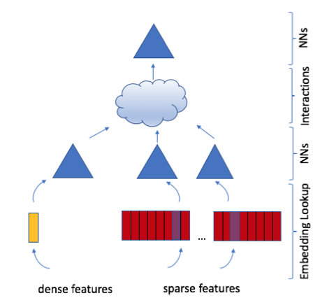

# Recommendation Systems

## Examples
- Traditional
  - Video/event recommendation system
  - Linkedin/Instagram feeds
  - Ad click prediction
- Session-Based
  - People you may know
  - Airbnb similar listings / Instagram explore / Pinterest ads / Doordash store feed / Tiktok reels / Amazon products / Expedia experiences 

## Traditional 
- Clarifying Requirements
  - Num users: 300M daily active users on FB
  - Num items: 10B videos on YouTube, 1B users on FB
  - Throughput: 
  - Latency: ~200ms
- Frame the problem
  - Input: User
  - Output: Ranked list of videos sorted by relevance scores
    - Output may be multivariable if we value different types of impressions differently
  - Online metrics
    - CTR, the number of opened videos from homepage (but what if clickbait?)
    - Total watch time per session (first is still useful cos users can be restricted by time constraints). But what if model just recommends long videos, vs short models that get users hooked?
    - The number of completed (>80%) videos
    - Explicit feedback e.g. likes, comments
  - Offline metrics
    - Precision@k
    - mAP
- Modeling
  - Data (Remember to be flexible and **not formulaic** here)
    - User (request)
      - Categorical embedding: Id, country, city, language, time zone, location, previous searches, previous impressions, previous watches
      - Categorical one-hot: Gender, device, day of week, time of day
      - Numerical: Age
    - Item 
      - Categorical embedding: Id (can be multiple, advertiser, ad group, campaign), title (BERT), description (BERT), category (CBOW), subcategory/tags (CBOW), language
      - Categorical one-hot:
      - Numerical: Length, likes, views, time since release
    - Interaction
      - Categorical embedding: time
      - Numerical/Boolean: location, social, graph distance/num_paths
      - Consider feature crosses!
  - Most recommendation systems take a three-step approach: candidate generation (From 1e9 to 1e3), ranking (Top 1e2), and re-ranking. 
  - Candidate Generation
    - Only needed if you have many items, and we want to reduce the order of candidates to ~1000. Consider using simple user/request-based filtering if this is not the case!
    - This usually works by projecting user and/or item matrices to a lower $k$-dimensional space and then conducting nearest neighbor searches.
      - Approximate nearest neighbor services are relevant here.
      - The key here is speed - we can do the embedding asynchronously and only need to find nearest neighbors at inference time
      - We can go 1 of 3 ways (usually suggest (1), but maybe (2) in certain situations):
        - Embed user and items into the same space: For a given user, find items closest to it. 
        - Embed items into the same space: For a given user, find items closest to the past items a user has interacted with.
        - Embed users into the same space: For a given user, find users closest to it and recommend things that close users like. 
        - Why (1) 
          - (1) achieves (2) and (3) but not the reverse
          - (1) can ensure that both similar users are close to each other, and similar items are close to each other
        - Why not (1)
          - We have limited amounts of information we can use, (2) and (3) can use more relevant information
          - Susceptible to cold start problem
      - Folks like to call methods "CF-based" (see below), but I don't fully agree with this categorization. 
    - We can use multiple candidate generation models: Relevant, Trending, (Popular). For now, we focus on relevancy.
    - Matrix Factorization: Optimizing for _both_ user and item embeddings
      - With a user-item matrix $A \in \mathbb{R}^{n \times m}$, we decompose it into $A \approx UV^{\top},$ where $U \in \mathbb{R}^{n \times k}, V \in \mathbb{R}^{m \times k}$
          - Loss: 
            - Unobserved entries are treated to be negative, due to the sparsity of this matrix we usually need to weight positive entries more. 
            - Loss = $\sum_{(i, j) \in o b s}\left(A_{i j}-U_i \cdot V_j\right)^2+W \sum_{(i, j) \notin o b s}\left(A_{i j}-U_i \cdot V_j\right)^2$ + $\lambda(||U||_F^2 + ||V||_F^2)$
            - Simpler:
              - Just care about implicit vs explicit, ensure that observed > unobserved. 
              - Loss = $\ln \sigma(\hat{y}_{ui} - \hat{y}_{uj})$ (BPR-esque, Bayesian Personalized Ranking)
              - Can also use hinge loss: $\max(margin - \hat{y}_{ui} + \hat{y}_{uj}, 0)$
        - Optimization is usually done via Weighted Alternating Least Squares (alternating between fixing $U$ and $V$), or SGD. WALS is usually converges faster and is parallelizable.
    - Two Tower: 
      - In CG, rather than using all item features, we usually just embed item ID. 
      - [Source](https://static.googleusercontent.com/media/research.google.com/en//pubs/archive/45530.pdf)
  - Ranking
    - There are multiple Learning To Rank (LTR) algorithms: Pointwise, Pairwise (RankNet, LambdaRank, LambdaMART) and Listwise (SoftRank, ListNet, AdaRank). We focus on the pointwise method for now. 
    - Linear Regression is a good baseline, but
      - Simple - linear relationships
      - Doesn't consider feature crosses unless explicitly modelled
    - Gradient Boosted Decision Trees
      - Hard to finetune
      - Cannot train embedding layers
    - Gradient Boosted Decision Trees for feature selection, then LR
    - Neural Nets
      - Two Tower (see above)
        - Idea is that taking the similarity between embeddings is sufficient.
      - Joint Modeling
        - We do something more complicated than embedding similarity
        - Deep network
          - [Source](https://static.googleusercontent.com/media/research.google.com/en//pubs/archive/45530.pdf)
        - Can extend to Wide+Deep, and Deep FM (see below) if appropriate.  
  - Re-Ranking
    - Region-restricted videos
    - Restricted content (misinformation, harm detection)
    - Fairness and bias
    - Video freshness (both new-ness and whether user has wathced before)
    - Duplicate or near-duplicate videos

## Session-Based
- Session-based vs traditional
  - Context
    - Traditional: user interest is context-independent and won't change that fast
    - Session-based: user interest is dynamic and evolves fast
    - Intuition: 
      - We probably want to give more weight to the session details, rather than what we would typically recommend for a user. 
      - If so, we probably want to use item embeddings to recommend an item most similar to the most recently viewed item(s)
  - Model training
    - See below ("Embed items into the same space")
- Offline metric
  - We may incorporate the last booking as both a training metric and a offline overall metric (e.g. average rank of final booking). 

## Additional Models

- Collaborative filtering vs content-based models
    - Personally, I find the distinction between the two blurry. Here are some rough distinctions. 
    - Collaborative filtering uses user-user similarity or item-item similarity, content-based does not. 
      - Most explicit when some sort of nearest neighbor + graph-based approach is taken. 
      - Matrix factorization tends to be categorized here, although I don't see how this is qualitatively different from the latent variables that are probably picked up in content-based methods.
      - There's some confusion about whether CF can handle the cold start problem, which I think is due to people equating CF to matrix factorization. In [YouTube's paper](https://static.googleusercontent.com/media/research.google.com/en//pubs/archive/45530.pdf), they explicitly mention the ability to "propagate (new content)... to others via CF".
    - Content-based filtering uses _more_ item-based features.
      - The canonical CF method, matrix factorization, only uses item ID. **This, in my opinion, is the key distinguishing factor.**
      - In content-based methods, we explicitly model the features we believe to be relevant.
- CG: Learning embeddings
  - We describe the models used to embed users and items. These can take 3 forms:
    - Embed user and items into the same space: For a given user, find items closest to it. 
    - Embed items into the same space: For a given user, find items closest to the past items a user has interacted with.
    - Embed users into the same space: For a given user, find users closest to it and recommend things that close users like. 
    - Recognize that doing (1) also does (2) and (3), but the reverse is not true. 
  - Embed user and items into the same space
    - User-item matrix, WALS
      - When we fix either $U$ or $V$, there's a [closed form solution](https://blog.insightdatascience.com/explicit-matrix-factorization-als-sgd-and-all-that-jazz-b00e4d9b21ea) for the other matrix. 
    - User-item matrix, SGD
    - Enrich user embeddings with item embeddings
      - Train user embeddings with item embeddings for items a user has interacted with in the past. 
      - We can even train with sequential information, where we treat the sequence as an "image" and use convolutions ([Caser](https://arxiv.org/pdf/1809.07426)).
        - A more "modern" approach would probably be something that incorporates attention.
  - Embed items into the same space
    - Use session data to group items in the same session / within a certain radius of each other together
      - [Source](https://bytebytego.com/courses/machine-learning-system-design-interview/similar-listings-on-vacation-rental-platforms)
        - Info-NCE Loss = $\sum_{(c, p) \in D_p} \log \frac{1}{1+e^{-E_c \cdot E_p}}+\sum_{(c, n) \in D_n} \log \frac{1}{1+e^{E_c \cdot E_n}}+\sum_{(c, b) \in D_{\text {booked }}} \log \frac{1}{1+e^{-E_c \cdot E_b}}+\sum_{(c, n) \in D_{\text {hard }}} \log \frac{1}{1+e^{E_c \cdot E_n}}$
    - Use session + sequential data: self-attention.
    - AutoRec
      - Instead of embedding both users and items, we either embed users or items. 
      - We also incorporate some non-linearity. 
      - Details: Letting $A_j \in \mathbb{R}^{n}$ be the $j^{th}$ colunmn of $A$, 
        - We predict $\hat{A}_j = f(W\cdot g(VA_j + \mu) + b)$, where $VA_j \in \mathbb{R}^{k}$ is our embedding of item $j$.
  - Embed users into the same space
    - AutoRec
- Ranking: Joint Modeling
  - Here, we focus on methods that do something more complicated than just taking the dot product of embeddings.
  - [A Tour of the Recommender System Model Zoo](https://mlfrontiers.substack.com/p/a-tour-of-the-recommender-system) covers popular architectures. 
  - NeuMF
    - We use 2 user embedding matrices and 2 item embedding matrices
      - [Source](http://d2l.ai/chapter_recommender-systems/neumf.html)
      - We do generic MF on the left, and add a deep network on the right. 
  - Wide and Deep
    - Use "wide" features made from crossing features
    - Use a normal deep network from features
    - Join the two branches at the end for prediction
  - Deep Cross Network
    - Instead of having to manually cross features, the DCN does it for you, and the number of layers determines the degree of the polynomial. 
  - Factorization Machine
    - In the FM, instead of keeping features in their original representation, we embed them before "crossing" (taking a dot product).
    - Due to the complexity of this, we reduce the degree to two-way interactions. 
  - Deep FM
    - Similar to the DCN, except that we replace the Cross network with an FM. 
  - DLRM (Deep Learning for Recommender Systems)
    - 
    - Gets rid of the deep part entirely and just focuses on interactions
  - DHEN (Deep Hierarchical Ensemble Network)
    - Increased the complexity of interactions (dot product, self-attention, convolution, linear, cross module), and the degree of interaction (3)