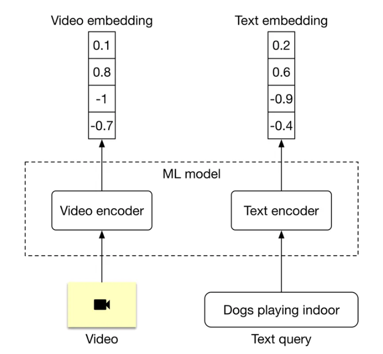

# Search

## Examples
- Youtube video search, Airbnb booking search, Google search
- Intuition: Search feels like recommendation to me, where we now have additional query context. 

## Approach
- Just query or recommendation+query
  - We can view search as adding additional query context to a recommendation problem, in which case I may vote for using a recommendation framework.
  - It is important to check with the interviewer regarding whether personalization is desired. 
  - For the latter, we focus on the query -> item prediction problem, which is the focus on this document.
- [Source](https://bytebytego.com/courses/machine-learning-system-design-interview/youtube-video-search)
  - For the item encoder, we should encode all the items we talked about in [Recommendation systems](./03_recommendation_system.md)
- Training
  - Contrastive learning is useful, where we mark items not selected as negative samples.
- Metrics
  - In recommendation, one user can have multiple items they clicked on. 
  - In search, this could be the case. In the event that we typically see one query mapping to one item, we can consider using MRR over mAP.