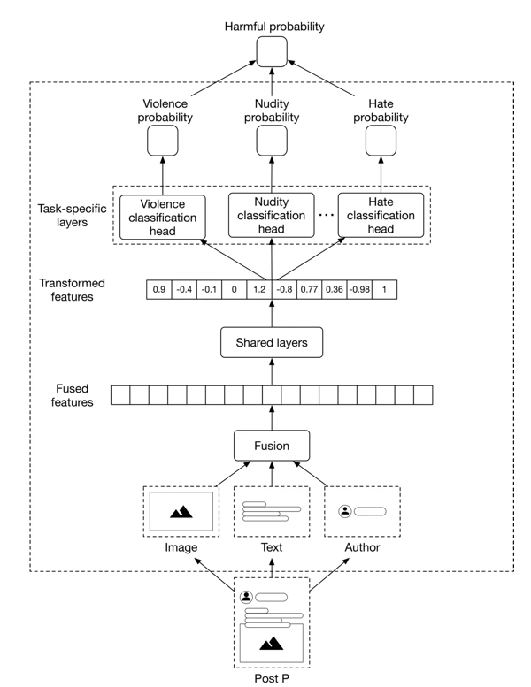

# Detection

## Examples
- Harmful content detection
  - Posts that contain violence, nudity, self-harm, hate speech, misinformation
- Bad acts/actors
  - Fake accounts, spam, phishing, organized unethical activities
- Fusion methods
  - Late - easier to train, but may have lower recall as each component is benign on their own
  - Early - harder to train
- Classifier options
  - Single binary classifier
    - Hard to understand what's not going well
    - Cannot give reason for taking down
  - One classifier per class, no shared layers - training models separately is expensive
  - Multi-label classifier - lacks specialization 
  - Multi-task classifier
    - [Source](https://bytebytego.com/courses/machine-learning-system-design-interview/harmful-content-detection)
- Metrics
  - Prevalence = $\frac{NumUnpreventedHarmfulPosts}{TotalPosts}$
  - Harmful impressions
  - Valid appeals = $\frac{NumReversals}{NumPredictedHarmfulPosts}$
  - Proactive rate = $\frac{NumHarmfulPosts}{NumHarmfulPosts + ReportedByUsers}$
- Possible actions
  - Demoting service
  - Violation enforcement
