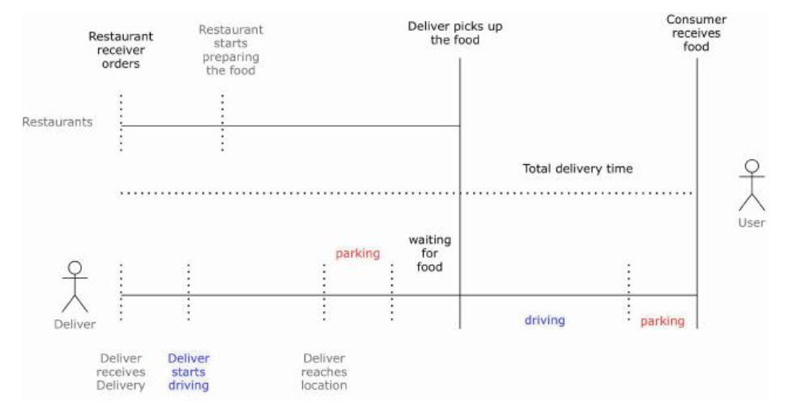

# ETA

## Examples
- Uber/Doordash ETA

## Details
- ETA is complicated and we have to think of multiple parties
  - [Source](https://www.amazon.com/Machine-Learning-Design-Interview-System/dp/B09YQWX59Z)
- Loss
  - Asymmetric RMSE
  - Quantile regression where you specify a percentage of predictions within interval
  - (ToDo: Read more into specific case studies closer to interview)
- Inference
  - Pushing framework is useful to both send notifications to users and to update model inputs.
  - Use a broker / real-time transport to allow services to communicate to each other. 