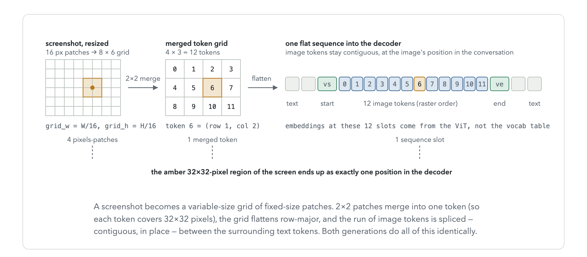
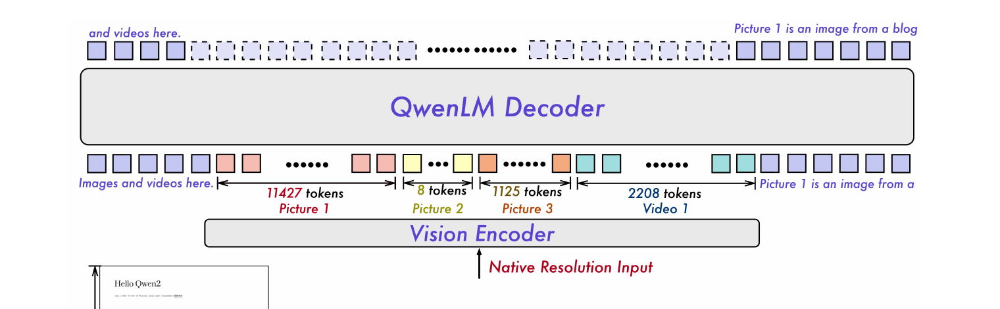
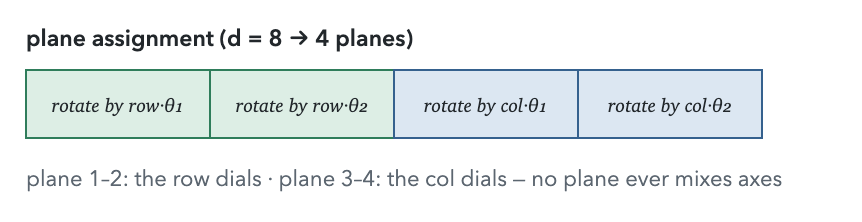
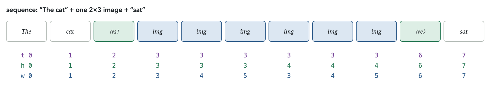
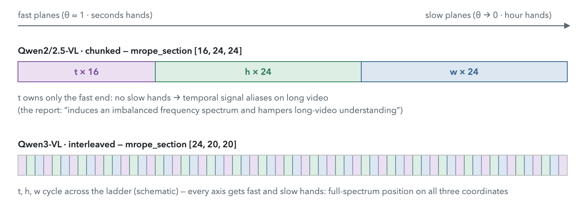

# Multimodal LLMs

## Two architecture families 

Source: [Understanding Multimodal LLMs (Raschka)](https://magazine.sebastianraschka.com/p/understanding-multimodal-llms)

- Unified Embedding-Decoder architecture
  - Project image patches into the same embedding space as text tokens; a single decoder consumes the interleaved sequence
  - Examples: Qwen2-VL, Emu 3
- Cross-modality Attention architecture
  - Keep a separate vision encoder; inject visual features via cross-attention layers in the LLM
  - Example: Llama 3.2-V

## Qwen2.5-VL and Qwen3-VL 

Sources: [Qwen2-VL paper](https://arxiv.org/pdf/2409.12191), [Qwen3-VL technical report](https://arxiv.org/pdf/2511.21631)

### ViT + decoder: the flow

- Unified embedding-decoder family: a ViT "tokenizes" pixels the way the embedding table tokenizes text, and one causal decoder consumes the interleaved sequence
  - Smart-resize (aspect preserved, dims rounded to multiples of 32) → cut into fixed **16×16 px patches** (so patch _count_ scales with resolution; 14 px in Qwen2/2.5-VL) → stride-16 conv projects each patch to an embedding
  - ViT runs **once per image**, independently per image (patches from multiple images are packed into one varlen sequence with block-diagonal attention — mathematically separate per image), bidirectional attention within an image
  - 2×2 neighboring patch features → MLP merger → one token per 32×32 px, projected into the **decoder's hidden dimension**
  - 
- Post-ViT image tokens live in the _same embedding space_ as text tokens post-embedding-layer
  - The chat template emits `<|vision_start|><|image_pad|>…<|vision_end|>`; at forward time the pad positions' embeddings are overwritten (`masked_scatter`) with the ViT outputs — the decoder can't architecturally tell a vision token from a text token
  - Each image's tokens stay contiguous and _in place_ at the image's position in the conversation; token count per image is variable (native resolution)
  - [Source](https://arxiv.org/pdf/2409.12191)
- The encoders share no lineage across generations: Qwen2.5-VL used an in-house ~670M ViT (patch 14, windowed attention, 2D RoPE only, trained from scratch); Qwen3-VL switched to **SigLIP2** (SO-400M; Large for 2B/4B), initialized from official checkpoints then continue-trained end-to-end — its interpolated 48×48 position table ships as an ordinary weight (`visual.pos_embed`)

### 2D RoPE, M-RoPE, interleaved M-RoPE

- 1D RoPE mechanics (rotation pairs, frequency ladder $`\theta_i`$, relative-position property, wavelength/context analysis) live in [Attention & Transformers](../../fundamentals/dl/08_attention_transformers/notes.md)
- **2D RoPE** (inside the ViT): a patch's position is (row, col); split the planes into two halves — the first half rotates by $`\text{row}\cdot\theta`$, the second by $`\text{col}\cdot\theta`$, each half with its own copy of the frequency ladder
  - 
  - Dot products then depend on $`(\Delta \text{row}, \Delta \text{col})`$: attention can key on relative 2D displacement ("3 columns left, 1 row up")
  - Axis-separable — no plane mixes the two axes; diagonal structure is composed from the halves
- **M-RoPE** (inside the decoder): same trick with three coordinates $`(t, h, w)`$ per token, budgeted across the rotation pairs by `mrope_section`
  - Text token: $`t = h = w`$ = running counter → on pure text all components rotate identically and M-RoPE **degenerates exactly to 1D RoPE** (preserves the base LLM's behavior)
  - Image token: $`t`$ constant (the image's slot), $`h, w`$ = merged-grid row/col; text resumes at max position + 1
  - 
  - Distinct from the ViT's 2D RoPE: different network, different granularity (merged tokens vs patches), positions span the whole multimodal sequence, causal attention
- **Interleaved M-RoPE** (Qwen3-VL): Qwen2/2.5's `mrope_section` [16, 24, 24] is _chunked_ — each axis owns one contiguous band of the frequency ladder, so e.g. $`t`$ got only the fastest frequencies (no slow "hour hand" → poor long-video range; the report: "induces an imbalanced frequency spectrum and hampers long-video understanding")
  - Qwen3-VL interleaves instead ([24, 20, 20], round-robin across the ladder) so every axis gets low _and_ high frequencies
  - 
  - Contrast with 2D RoPE: chunking does **not** "reset" the $`\theta`$ count per axis — it slices the _single_ pretrained 1D ladder into contiguous bands ($`t`$ → fastest 16, $`w`$ → slowest 24), whereas the ViT's 2D RoPE restarts a full fast→slow ladder within each half
    - Partitioning the original ladder is what lets text ($`t=h=w`$) reproduce the base LLM's 1D RoPE bit-exactly; interleaving is just a smarter partition — same text guarantee, full spectrum per axis

### Normalized coordinates (Qwen3-VL)

- Qwen3-VL moved grounding from absolute pixel coordinates (Qwen2.5-VL, in the resized-input frame) to **normalized coordinates in [0, 1000]**
  - Report's stated rationale: "improves robustness to variations in image resolution and aspect ratio … while also simplifying post-processing" — every resolution's training data supervises the same dense 0–999 label bins
- Position also enters as _content_ now: a fixed **48×48 table of learned position embeddings** (2304 entries, from the SigLIP2 checkpoint) is stretched over whatever patch grid the image has by **bilinear interpolation**, then added elementwise to each patch embedding once, before the first ViT block
  - Effect: normalized coordinate information ("I'm at 83% of the width", at any resolution) gets added to each patch embedding
  - Qwen2/2.5-VL had removed the ViT's additive position embeddings entirely (2D RoPE only) — no positional signal as content anywhere in that stack
- The absolute channels still survive in Qwen3-VL (ViT rotary + decoder M-RoPE integer indices are untouched)