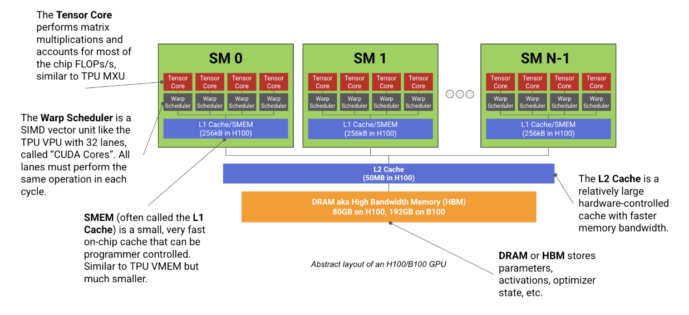
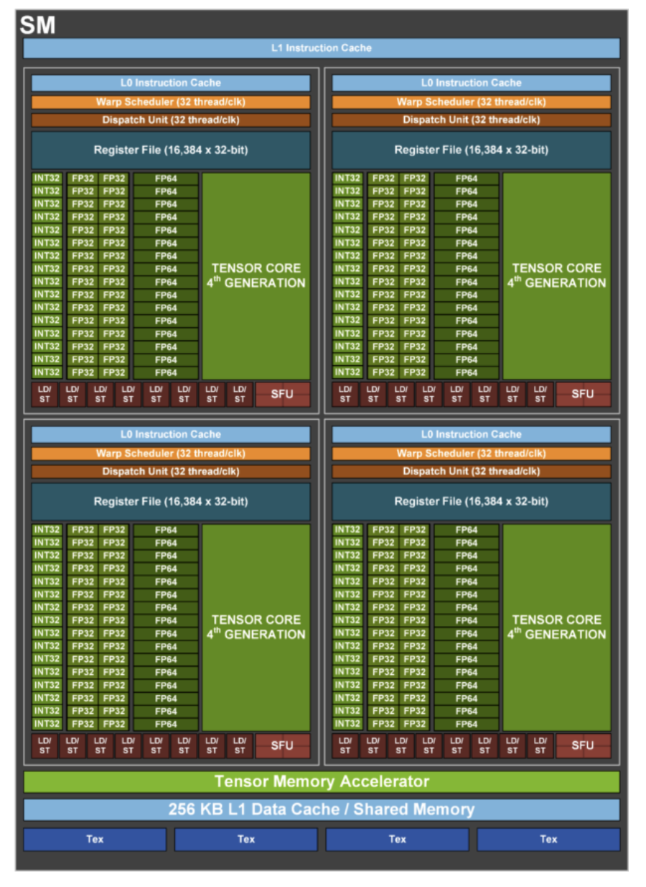
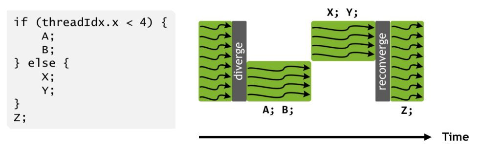
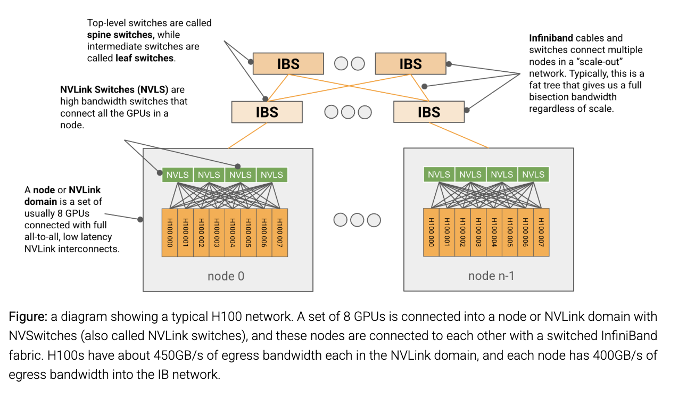

# GPUs

Primary sources: [scaling book — GPUs](https://jax-ml.github.io/scaling-book/gpus/) for the architecture and networking, [Aleksa Gordić's matmul deep-dive](https://www.aleksagordic.com/blog/matmul) for the CUDA execution model. TPU counterpart: [TPUs](tpus.md). What the network lets each parallelism strategy do — collective costs over NVLink/InfiniBand and the batch-size thresholds — lives in [Parallelism §The collectives and their costs](parallelism.md#the-collectives-and-their-costs), TPU and GPU side by side.

## The chip: SMs + HBM

- A modern ML GPU (H100, B200) is basically a bunch of compute cores that specialize in matmul — **Streaming Multiprocessors (SMs)** — connected to a stick of fast memory (**HBM**)
  - [Source](https://jax-ml.github.io/scaling-book/gpus/)
- Each SM, like a TPU TensorCore, has a dedicated matmul unit (confusingly _also_ called a **Tensor Core**), a vector arithmetic unit (the **Warp Scheduler**), and a fast on-chip cache (**SMEM**)
- **The structural difference from a TPU**: a TPU has at most 2 independent TensorCores; an H100 has **132 SMs** (B200: 148). Each SM is much less powerful than a TPU TensorCore, but each is more or less totally independent, so a GPU can run hundreds of separate tasks at once — less raw per-core power, more flexibility
  - Caveat from the book's footnotes: the SMs are independent, but they all share one capacity-limited L2 cache, which in practice forces the programmer to run them in a fairly coordinated way for peak performance
- CPU analogy (Gordić): an SM ≈ a CPU core; a **warp** (32 threads) ≈ a CPU thread, except all 32 threads in a warp execute the same instruction; a **thread block** = a group of warps (≤ 1024 threads) guaranteed to be co-scheduled on one SM, sharing SMEM and able to synchronize

### Inside an SM

- [Source](https://jax-ml.github.io/scaling-book/gpus/) (NVIDIA Hopper whitepaper) — an H100 SM
- An SM is 4 identical quadrants ("SM subpartitions"), each containing a Tensor Core, a 16,384 × 32-bit register file, and a SIMD/SIMT vector unit called a Warp Scheduler whose lanes (ALUs) NVIDIA calls **CUDA Cores**
  - **CUDA Cores**: the ALUs, ~1 arithmetic op per cycle each (e.g. `f32.add`). 32 fp32 cores per subpartition (plus a smaller number of int32 and fp64 cores), all executing the same instruction each cycle. Like the TPU's VPU they do ReLUs, pointwise ops, and reductions. Historically (pre-Tensor-Core) these _were_ the compute
  - **Tensor Core (TC)**: one per subpartition, the dedicated matmul unit like a TPU MXU — the vast majority of the chip's FLOPs/s. On Ampere a single warp could feed it; on Hopper it takes a full SM (a warpgroup)
  - Also visible in the diagram: LD/ST units, an SFU (transcendentals), and Hopper's Tensor Memory Accelerator (async bulk HBM → SMEM copies)
- Peak throughput = max clock × number of Tensor Cores × FLOPs per Tensor Core per cycle — but the actual clock varies under power/thermal throttling
- Headline numbers: H100 ≈ 990 TFLOP/s bf16 dense, B200 ≈ 2.3 PFLOP/s. The 990e12 is the $`C`$ in every GPU threshold in [Parallelism's α table](parallelism.md#arithmetic-intensity)

### SIMT vs SIMD: why CUDA cores are more flexible than a VPU

- Within a subpartition all CUDA cores must execute the same op in each cycle (if one core is adding two floats, every other core in the subpartition is too) — that's the SIMD part, same as VPU ALUs
- But (since V100) each CUDA core — a "thread" in the CUDA model — has its own instruction pointer and can be programmed independently — the **SIMT** (Single Instruction Multiple _Threads_) part. When two threads in the same warp are told to do different things, the hardware effectively does _both_, masking out the cores that don't need the divergent branch
  - [Source](https://jax-ml.github.io/scaling-book/gpus/)
  - Flexible programming at the thread level, at the cost of **silently degraded performance if warps diverge too often**
- Memory access is also more flexible: the VPU only operates on contiguous blocks, whereas CUDA cores can access individual floats in shared registers and keep per-thread state
- Scheduling is more flexible too — SMs run a bit like multithreaded CPUs:
  - An SM can _host_ many warps concurrently (up to **64 resident warps**, i.e. 2048 threads), but each Warp Scheduler only _issues_ one warp instruction per clock — so at most 4 warps (128 threads) issue per cycle per SM
  - The Warp Scheduler automatically switches between active warps to hide I/O like memory loads — hardware-managed latency hiding. A TPU is single-threaded by comparison and relies on the compiler to overlap DMAs with MXU work
- Registers per thread are compiler-determined, up to 255, private to the thread until its block finishes

## Memory hierarchy

| Level | H100 | Notes |
|---|---|---|
| Registers | 16,384 × 32-bit per subpartition (64 KiB); 256 KiB per SM | Per-thread private state. Fastest, smallest |
| SMEM / L1 | 256 KB per SM | Programmer-controlled "shared memory" _or_ hardware L1 — the same SRAM. Holds activations and matmul inputs for the Tensor Cores. TPU analogue: VMEM, but much smaller. Hopper adds DSMEM: SMs in a cluster can read each other's SMEM |
| L2 | ~50 MB, shared by all SMs | Hardware-managed, cuts HBM traffic. Physically two 25 MB halves, each serving half the SMs |
| HBM (GMEM) | 80 GB at 3.35 TB/s (B200: 192 GB at 8 TB/s) | Weights, gradients, activations, optimizer state. "HBM bandwidth" / "memory bandwidth" = HBM → Tensor Core |

- The register budget is the occupancy knob: 64 resident warps per SM is only reachable at ≤ 32 registers/thread ($`65{,}536 / 2{,}048`$); at the 256-register maximum only 8 warps fit ($`256 \cdot 1024 / (4 \cdot 32 \cdot 256)`$). See [occupancy](#three-resources-limit-concurrency-occupancy) below
- Beyond the chip: CPU RAM holds the dataset / dataloader workers, disk holds the full dataset and checkpoints

## GPU ↔ TPU glossary

| GPU | TPU | What is it? |
|---|---|---|
| Streaming Multiprocessor (SM) | TensorCore | Core "cell" that contains the other units |
| Warp Scheduler | VPU | SIMD vector arithmetic unit |
| CUDA Core | VPU ALU | SIMD ALU (one lane) |
| SMEM (L1 cache) | VMEM | Fast on-chip cache memory |
| Tensor Core | MXU | Matrix multiplication unit |
| HBM (aka GMEM) | HBM | High-bandwidth, high-capacity memory |

## Networking

- **Where GPUs and TPUs differ most.** TPUs sit in a 2D/3D torus where each chip only talks to its neighbours: a message between two TPUs passes through every intervening chip, and we're forced into uniform communication patterns over the mesh ([TPUs](tpus.md)). GPUs use a traditional hierarchical, **switched tree**
- **Node (NVLink domain)**: 8 GPUs (up to 72 for GB200 NVL72) connected within 1 hop of each other by NVLink through **NVSwitches** — full all-to-all connectivity, low latency. Egress per GPU: **450 GB/s on H100**, 900 GB/s on B200
- **Scale-out**: each GPU has a NIC (400 Gbps on H100 → **400 GB/s egress per node**) into an InfiniBand or Ethernet fabric. **Leaf switches** join 32 nodes into a **Scalable Unit (SU)**; **spine switches** join SUs. Typically a fat tree, so there's full bisection bandwidth regardless of scale — the cross-node cost is set by the node's egress, not by distance
  - [Source](https://jax-ml.github.io/scaling-book/gpus/)
- Per-GPU bandwidths to keep in your head, H100: HBM 3.35 TB/s → NVLink 450 GB/s → InfiniBand 50 GB/s (400/8). Roughly 7.5× and 9× drops at each level — the same shape as HBM → ICI → DCN on a TPU
- What this buys: within a node every GPU can egress at full bandwidth to any other, so ring costs simplify and an AllToAll is a direct send; across nodes, reductions go tree-wise (node → leaf → spine). Formulas, and the DP/TP/EP/PP batch-size thresholds they imply: [Parallelism §The collectives and their costs](parallelism.md#the-collectives-and-their-costs)

## Three resources limit concurrency (occupancy)

- Registers
  - Suppose we use thread blocks of 1024 threads, each thread has 32 registers; then since each SM has 65,536 registers, we can support 2 blocks per SM.
- Shared memory (SMEM)
  - System-level overhead of 1 KiB per block, on top of the kernel's own usage. (An A100 has up to 164 KB SMEM/SM: a kernel using $`S`$ bytes/block supports $`\lfloor 164\text{KB}/(S + 1\text{KiB}) \rfloor`$ blocks, further capped by the 32-blocks/SM architectural limit.)
- Threads/warps
  - Max number of threads per SM is 2048. With 1024 threads per block, we also have 2 blocks.
