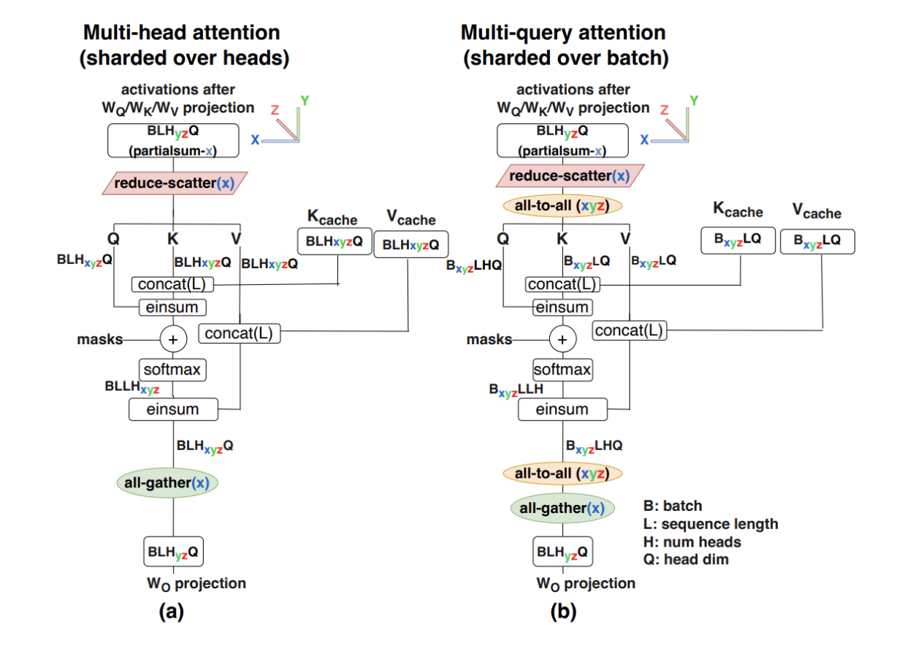

# Inference

LLM serving. The prefill/decode roofline, inference memory, and how to shard each phase are written up here from the scaling book's [inference chapter](https://jax-ml.github.io/scaling-book/inference/); the general cost model (FLOPs, roofline, KV-cache size) and the batch-size trade-off live in [Basics §Training vs Inference](basics.md#training-vs-inference) and [§Batch Size](basics.md#batch-size). See also [GPUs](gpus.md) for the hardware model, [TPUs](tpus.md) for the chip numbers used below, and [Parallelism](parallelism.md) for sharding notation and collectives.

Notation (the book's, not the lowercase one in Basics): $`B`$ batch, $`T`$ query tokens, $`S`$ KV length, $`D = d_{model}`$, $`F = d_{ff}`$, $`K`$ KV heads, $`H`$ head dim.

## Serving Engines

- Tensor-RT
  - TensorRT works by taking a model description, such as an ONNX file, and compiling the model to run more efficiently on a given GPU (optimized runtime engines).
  - As opposed to the more general `torch.compile`, it is optimized specifically for NVIDIA hardware. 
    - `torch.compile` does allow us to specify the Tensor-RT backend.
  - See `bloom_tensorrt_llm.ipynb` in this folder for a hands-on TensorRT-LLM walkthrough.
- vLLM
  - Tailored for efficient LLM inference, while Tensor-RT supports a broader range of model types.
  - Designed to be more flexible in terms of hardware, while Tensor-RT is optimized specifically for NVIDIA GPUs.
  - See [vLLM Internals](#vllm-internals) below.

## Arithmetic intensity

Source: [scaling book — inference](https://jax-ml.github.io/scaling-book/inference/). Prefill and generation run the same forward pass but land on opposite sides of the roofline.

- Recall the MLP result from [Basics §Arithmetic intensity](basics.md#basics), for $`X[B,D] \cdot W[D,F]`$ in bf16: 

  $`\displaystyle \frac{2BDF}{2BD + 2DF + 2BF} \approx \frac{2BDF}{2DF} = B \;\ge\; \frac{\text{Accelerator FLOPs/s}}{\text{Bandwidth Bytes/s}} \overset{\text{TPU v5e}}{=} \frac{1.97 \times 10^{14}}{8.20 \times 10^{11}} \implies B \ge 240 = B_{crit}`$ 

  - $`B`$ is in **tokens** per forward pass — that's what each weight read gets amortized over
- **Prefill** inherits this for free: prompts are hundreds if not thousands of tokens, so a single sequence longer than 240 tokens is already compute-bound on a v5e (dense model, bf16). Shorter prompts _can_ be batched together for utilization, but it's typically not necessary
- **Generation** can't: the sequential dependency between steps means each request contributes 1 token per forward pass. The only (easy) way to reach $`B_{crit}`$ is to batch requests — **≥ 240 sequences in flight** on a v5e before the MLPs are compute-bound
- Attention is a different story. Per layer, with Flash Attention, bf16:
  1. Read the $`Q`$ activations, $`\text{bf16}[B, T, D]`$, from HBM
  2. Read the KV cache, a pair of $`\text{bf16}[B, S, D]`$ tensors
  3. $`2BSTD`$ FLOPs in the $`QK^\top`$ matmul — with Flash Attention the $`\text{bf16}[B, S, T]`$ score matrix never goes back to HBM
  4. $`2BSTD`$ FLOPs in the $`AV`$ matmul
  5. Write the result, $`\text{bf16}[B, T, D]`$, back to HBM
  - Putting it together: 

    $`\displaystyle \text{Intensity(attention)} = \frac{4BSTD}{4BSD + 4BTD} = \frac{ST}{S + T}`$ 

  - Prefill: $`S = T`$ (self-attention) → $`T^2 / 2T = T/2`$, i.e. **attention intensity is $`\Theta(T)`$ during prefill** — compute-bound as soon as the sequence is moderately long
  - Generation: $`T = 1 \ll S`$ → $`ST/(S+T) \approx 1`$. $`B`$ and $`D`$ cancelled, so **no knob improves it** — a tiny number of FLOPs against a massive KV-cache read. **Attention during generation is always memory-bandwidth-bound**
- Why batching helps one and not the other: the parameters (the bandwidth-heavy part of the linear layers) are _reused_ across every batch item; every batch item brings its _own_ KV cache, so attention bytes grow with $`B`$ exactly as fast as attention FLOPs do
  - Corollary: throughput gains from batch size **diminish once total KV-cache memory ($`B \times`$ per-sequence cache) is comparable to parameter memory** — the same knee as caveat 1 in [Basics §Batch Size](basics.md#batch-size)
- Both parts together — theoretical per-step time for generation: 

  $`\displaystyle T_{step} = \underbrace{\frac{B \times \text{KV cache size}}{\text{Total memory bandwidth}}}_{\text{attention: always bandwidth-bound}} + \underbrace{\max\left(\frac{2 \times B \times \text{Param count}}{\text{Total FLOPs/s}},\ \frac{\text{Param size}}{\text{Total memory bandwidth}}\right)}_{\text{MLP: can be compute-bound}}`$ 

  - "KV cache size" is per sequence. The first term is linear in $`B`$ from the start; the second is flat until $`B_{crit}`$ (weight read dominates) and linear after it (FLOPs dominate)

## Memory

- Unlike training there's no optimizer state and no gradients — one copy of the parameters, and those can be quantized
- Activations are negligible in both prefill and generation: nothing is checkpointed for a backward pass, and Flash Attention never materializes the $`S \times T`$ attention matrix (the book's footnote: an 8k-token activation is ~80 MB)
- So the KV cache is the main cost (per-token size: [Basics §Training vs Inference](basics.md#training-vs-inference)). The strategy is to **grow the batch until memory runs out**, amortizing the fixed cost of streaming the weights over as many sequences as fit

## Sharding for inference

Source: [scaling book — inference](https://jax-ml.github.io/scaling-book/inference/). The ICI-bound threshold below is the one derived in [Parallelism §Tensor parallelism](parallelism.md#tensor-parallelism), $`Y < M_Y \cdot F / \alpha`$ with $`\alpha = C / W_{ici}`$. That section uses $`\alpha = 2550`$ (TPU v5p); the inference chapter quotes $`F/2200`$ because it's on a v5e ($`1.97 \times 10^{14} / 9 \times 10^{10} \approx 2190`$).

### Prefill

- General rule: prefill is a training forward pass, so **almost any sharding that works in training works here**. For a single sequence (no batch dim):
  1. **Model (Megatron) sharding first**, up to the point we go ICI-bound — $`F/2200`$ per axis, usually 4–8-way
  2. **Context parallelism** beyond that — like data parallelism but along the sequence dimension ([Parallelism §CP](parallelism.md#context-parallelism-cp)). It adds some communication in attention (the KV exchange), but that's small at long context

### Generation

1. **FSDP is impossible**: we're already memory-bound streaming params + KV cache from HBM to the MXU; moving them over ICI instead can only make that worse (the book says ICI is "orders of magnitude" slower than HBM; per ICI axis on a v5e it's ~9×, $`8.2 \times 10^{11}`$ vs $`9 \times 10^{10}`$ B/s — the point stands). Move the small activations, not the weights — recall **FSDP moves weights, TP moves activations** ([Parallelism](parallelism.md#tensor-parallelism)). Anything FSDP-shaped is unviable for generation
   - Plain DP doesn't help either — it replicates the very weights we're bandwidth-bound on. Scale-out replicas are a serving-layer concern (see [Executor](#uniprocexecutor-to-multiprocexecutor) below)
2. **No context parallelism**: we decode one token at a time, so there's no sequence axis to shard
3. **Model parallelism — how many ways depends on the batch**
   - Large batch (compute-bound MLPs): TP up to the same FLOPs–ICI bound as prefill, ~$`F/2200`$ per axis
   - Small batch: we're bandwidth-bound, not compute-bound, so the FLOPs–ICI bound isn't what binds. **Sharding more ways keeps cutting latency** — each chip streams $`1/Y`$ of the weights — at minimal throughput cost, since the TP comms are activations of size $`\propto B`$, which is small
4. **KV cache sharding**: to cut attention latency too, Megatron-shard the KVs along the head dimension. That's limited to $`K`$-way ($`K`$ = number of KV heads, small under MQA/GQA), so for models with few heads we shard heads as far as they go and then **shard along the batch dimension** as well, i.e. $`KV[2, B_Z, S, K_Y, H]`$ — the KV cache is then completely distributed, no chip holds a replica
   - [Source](https://jax-ml.github.io/scaling-book/inference/) (originally [ESTI, Pope et al. 2022](https://arxiv.org/abs/2211.05102)): (a) multi-head attention sharded over heads vs (b) multi-query attention sharded over batch
   - The price in (b) is visible in the figure: the projections stay head-sharded, so $`Q`$ has to be resharded head→batch with an AllToAll before attention and batch→head after it. Cheap relative to replicating the KV cache — an AllToAll is ¼ of an AllGather ([collectives](parallelism.md#the-collectives-and-their-costs))

5. **Which axes, in what order** — the training [recipe](parallelism.md#recipe) doesn't transfer. Decode is bandwidth-bound, so the question becomes: which axis cuts the bytes each device streams per step, and what does it cost on the critical path?
   - **TP within the node**: divides the weight bytes per device by $`Y`$, and all $`Y`$ devices stream at once → latency ÷ $`Y`$. Its comms are tiny at decode but sit on the critical path twice per layer, so across InfiniBand the per-collective latency × ~160 collectives per token adds milliseconds to time-per-output-token — hence never TP across nodes
   - **PP only to fit**: stages run in series, so PP doesn't cut latency at all. It exists for models that exceed one node's HBM (405B in bf16 = 810 GB > 8 × 80 GB), and its one hand-off per stage tolerates the slow link. Throughput needs ≥ $`N_{stages}`$ microbatches in flight (vLLM's virtual engines), which shrinks each one's arithmetic intensity
   - **MoE: EP first**: the only way to spread the expert weights without slicing small-$`F`$ experts, and at decode it plays TP's role — each device streams only its $`E/Z`$ experts per step. Wide EP needs a huge aggregate batch (each device sees $`Bk/Z`$ tokens per step) and load balancing (redundant copies of hot experts). Attention runs DP or a small TP — under MLA the KV latent has effectively one head, so head-sharded TP runs out immediately (point 4) and attention goes data-parallel. DeepSeek-V3 serving: prefill TP4 (+SP) attention × DP8 with EP32 for the experts; decode TP4 attention × DP80 with EP320 over 40 nodes ([arXiv 2412.19437](https://arxiv.org/abs/2412.19437) §3.4 — verify against source)
   - **Then DP replicas** behind a load balancer for scale-out

## vLLM Internals

[Aleksa Gordić's vLLM deep-dive](https://www.aleksagordic.com/blog/vllm)

### Continuous Batching

- Put all requests into one sequence and process all at once

### Paged attention

- KV caches in paged memory
- Ease of retrieval - think continuous batching! 

### Chunked prefill 

- Chunks prefill and computes KV cache for each (so long sequences don't slow down everyone)

### Prefix Caching

- Hashes each prefill chunk

### Guided decoding 

- Masking logics

### Speculative Decoding

- Small model drafts k tokens
- Run forward pass for large model over prompt tokens + k tokens and do accept/reject
- The idea is to additionally have the large LLM validate the drafts - if it accepts the drafts then throughput is increased.
  - The idea hinges on the fact that decoding tends to be memory bound ([Arithmetic intensity](#arithmetic-intensity) above): below $`B_{crit}`$ a step costs the weight read whether it scores 1 token or $`k{+}1`$, so verifying the drafts is ~free
  - Hence, we can parallelize $`f(x_1)`$ and $`f(\hat{x}_2) = f(f^*(x_1))`$. If $`f(x_1) \approx x_2`$, we can output 2 tokens, and if not we simply output 1. 
  - Rejection sampling keeps the output distribution exactly the target's — the win is purely tokens-per-step
- Where the drafts come from:
  - **n-gram / prompt lookup**: no draft model at all — match the last few tokens against the prompt and copy what followed. Free, works when the output quotes the input (code edits, summaries, RAG)
  - **Draft model**: a separate small LM sharing the tokenizer
  - **Medusa** ([Cai et al. 2024](https://arxiv.org/abs/2401.10774)): bolt $`k`$ shallow MLP heads onto the _same_ target feature $`h_t`$; head $`i`$ predicts position $`t{+}i`$ directly (head 1 → "am", head 2 → "very", head 3 → "glad"). The heads are independent — the guess for $`t{+}3`$ never sees the guess for $`t{+}1`$ — so accuracy falls off fast with distance. Top-few per head are combined into a candidate tree, which the target verifies in one pass (tree attention mask)
  - **EAGLE** ([Li et al. 2024](https://arxiv.org/abs/2401.15077)): a lightweight _feature_-draft network — one FC layer + one small decoder block — that autoregresses in feature space: input = target embedding of the chosen token $`t{+}1`$ + $`h_t`$ → predict $`\hat h_{t+1}`$ → run the _original_ LM head to sample $`t{+}2`$ → feed $`\hat h_{t+1}`$ + $`t{+}2`$ back in → $`\hat h_{t+2}`$ → … Build the candidate tree, target verifies. The target model is untouched; the draft path just rolls features forward cheaply

### Disaggregated P/D
  - Prefill workers write KV to a dedicated KV-cache service; decode workers read from it. This isolates long, bursty prefill from steady, latency-sensitive decode.

### UniProcExecutor to MultiProcExecutor
  - TP within a node, PP across nodes, then DP to scale out — see [Parallelism §Recipe](parallelism.md#recipe).