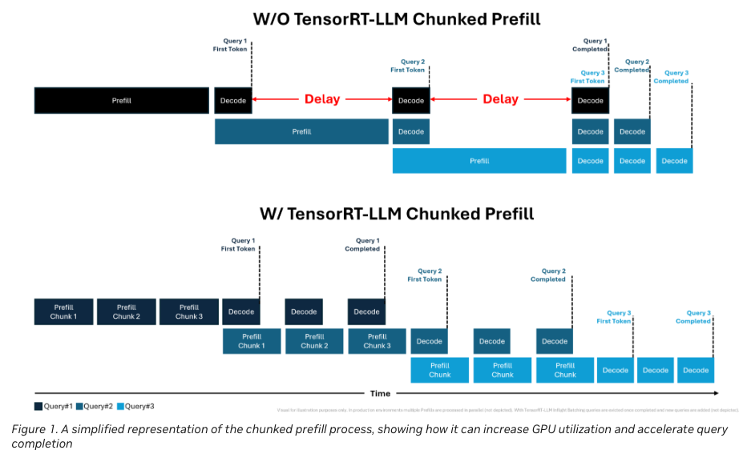

# Inference

LLM serving: prefill/decode characteristics, batching, and serving-system internals. See also [GPUs](gpus.md) for the hardware model and [Parallelism](parallelism.md) for sharding.

## Prefill and Decode

- We can break down LLM inference into two stages: prefill and decoding.
  - Terminology
    - For pre-fill, we are concerned with the **time to first token (TFT)**, or **latency**.
      - Human visual reaction time is around **200ms**, so [Baseten recommends](https://www.baseten.co/blog/understanding-performance-benchmarks-for-llm-inference/) <200ms latency.
    - For decoding, we are concerned with the **time per output token**, or **tokens per second (TPS)**, or **throughput**.
      - Reading time averages between 3-5 words per second. 
      - For most LLMs, 4 tokens approximately equals 3 words. 
      - [Baseten recommends](https://www.baseten.co/blog/understanding-performance-benchmarks-for-llm-inference/) around 30 tokens per second. 
  - Quick math (based on [Cursor's article](https://www.cursor.com/blog/llama-inference#prompt-processing-is-really-cheap) of serving Llama-2-70B)
    - Compute
      - FLOPS per token $`\approx`$ 2*70B
        - We technically also have attention calculations, which scale linearly with sequence length $`N`$, but this is small for large models (70B) with relatively short sequences (8k). I have not checked what this means for longer context lengths. 
        - Compute therefore **scales linearly** with $`N`$
    - Memory
      - Storing model params $`\approx`$ 140GB
      - Storing kv cache $`\approx 4BNn_gn_ld_{head} \approx 320BN`$ KB. 
    - Memory bandwidth
      - Key: Every parameter is passed from HBM to SRAM around once (especially with flash attention), so this is usually **the same** as memory (per second)
      - All model params needs to be passed only once for prefill, but **once per token** for decoding
        - For prefill, bandwidth is **generally constant** wrt $`N`$.
      - If memory is mostly dominated by model params / kv cache, we would expect memory bandwidth to be mostly dominated by model params / kv cache.
  - Inference characteristic differences
    - Since model params needs to be passed only once for prefill, but one per token for decoding,
      - Pre-fill tends to be compute bound (for $`N > 156`$ on an A100, per [Cursor's calculations](https://www.cursor.com/blog/llama-inference#prompt-processing-is-really-cheap)).
      - Decoding tends to be bandwidth bound.
      - Costs:
        - When using open-sourced models, we pay **per second**, and when using closed-sourced models, we pay **per token**.
        - Due to the different bounds for pre-fill/decoding, Cursor found it cheaper to use open-sourced models for prompt processing and closed-sourced models for completion-heavy tasks.
  - Levers
    - Increasing Batch Size
      - Increasing batch size will increase compute linearly, but bandwidth sublinearly (only KV cache part). This can increase throughput. 
      - Batch size is upper bounded by GPU memory, since KV cache memory grows linearly with batch size.
      - Increasing compute worsens latency
        - [Disaggregated serving](https://docs.vllm.ai/en/latest/features/disagg_prefill.html) is helpful because of the different characteristics of prefill and decoding.
      - So far, we've been focusing on total TPS. Perceived TPS considers what an individual user sees. Increasing batch size, generally decreases perceived TPS, and we're lower bounded by non-functional requirements.
      - Increasing batch size is sometimes not feasible for startups with "bursty" request profiles. 
    - Number of GPUs
      - If we increase the number of GPUs, we can shard model weights, and therefore increase our batch size limit. 
      - It is important to note that parallelism is therefore not only done out of necessity, but **useful** in increasing throughput. 
      - Additional parallelism also incurs communication cost, however.

## Serving Engines

- Tensor-RT
  - TensorRT works by taking a model description, such as an ONNX file, and compiling the model to run more efficiently on a given GPU (optimized runtime engines).
  - As opposed to the more general `torch.compile`, it is optimized specifically for NVIDIA hardware. 
    - `torch.compile` does allow us to specify the Tensor-RT backend.
  - See `bloom_tensorrt_llm.ipynb` in this folder for a hands-on TensorRT-LLM walkthrough.
- vLLM
  - Tailored for efficient LLM inference, while Tensor-RT supports a broader range of model types.
  - Designed to be more flexible in terms of hardware, while Tensor-RT is optimized specifically for NVIDIA GPUs.
  - See [vLLM Internals](#vllm-internals) below.

## Batching

- No batching: each request is processed one at a time.
- Static batching: requests are placed in batches that are run when full.
- Dynamic batching: requests are placed in batches as they’re received and batches run once full or once enough time has elapsed since the first request.
  - Dynamic batching is great for live traffic on models like Stable Diffusion XL, where each inference request takes about the same amount of time. 
  - For LLMs, however, output sequences will vary in length. If you use a dynamic batching approach, each batch of requests is going to need to wait for the longest output to finish before the next batch can begin.
- Continuous (in-flight) batching: requests are processed token-by-token, with new requests getting processed as older requests finish and free up space on the GPU.
  - Model servers like TGI and VLLM offer continuous batching, while TensorRT-LLM uses “in-flight batching” to essentially the same effect.
  - This, however, increases TFT
    - Since the prefill phase takes compute and has a different computational pattern than generation, it cannot be easily batched with the generation of tokens — see [Chunked Prefill](#chunked-prefill)

## Speculative Decoding

- The process of coordinating a large LLM (the target model) and a smaller LLM (the draft model) on the same GPU to combine the quality of the large model with the speed of the small model. Some ways of creating draft models are: 
  - Using a single model for both draft and target, and training the model from the start.
  - Letting the draft model use part of the target model, and training the draft model.
  - Distilling the knowledge from the target model into the draft model.
- The idea is to additionally have the large LLM validate the drafts - if it accepts the drafts then throughput is increased.
  - The idea hinges on the fact that decoding tends to be memory bound. 
  - Hence, we can parallelize $`f(x_1)`$ and $`f(\hat{x}_2) = f(f^*(x_1))`$. If $`f(x_1) \approx x_2`$, we can output 2 tokens, and if not we simply output 1. 

## Chunked Prefill

- Continuous batching can introduce latency as the decode phases are delayed until the prefill requests are completed.
- [Source](https://developer.nvidia.com/blog/streamlining-ai-inference-performance-and-deployment-with-nvidia-tensorrt-llm-chunked-prefill/)
- Chunked prefill prevents the prefill phase from becoming a bottleneck, enables more parallelization with decode phase tokens, and increases GPU utilization.
- Using prefill chunks also decouples memory consumption from the context length of incoming requests
- With sliding window attention, we can chunk and parallelize the prefill process.

## vLLM Internals

> Draft — seeded from reading notes ([Aleksa Gordić's vLLM deep-dive](https://www.aleksagordic.com/blog/vllm)), to expand.

- Continuous batching
  - Put everything into one sequence
- Paged attention
  - KV caches in paged memory
  - Ease of retrieval — think continuous batching!
- Chunked prefill
  - Chunks prefill and computes KV cache for each (so long sequences don't slow down everyone)
- Prefix caching
  - Hashes each prefill chunk
- Guided decoding
  - Masking logits
- Speculative decoding
  - Small model drafts k tokens
  - Run forward pass for large model over prompt tokens + k tokens and do accept/reject
  - n-gram, EAGLE, Medusa
- Disaggregated P/D
  - Prefill workers write KV to a dedicated KV-cache service; decode workers read from it. This isolates long, bursty prefill from steady, latency-sensitive decode.
- UniProcExecutor to MultiProcExecutor
  - TP within a node, PP across nodes, then DP to scale out — see [Parallelism](parallelism.md#placement-tp-within-a-node-pp-across-nodes).

## Benchmarks: latency vs throughput

> Draft — seeded from reading notes ([source](https://www.aleksagordic.com/blog/vllm)), to expand. *[figure from source — re-add]*

- As batch size $`B \downarrow`$ toward 1, inter-token latency (ITL) drops: there's less work per step and the token isn't "competing" with others. As $`B \uparrow`$ toward infinity, ITL rises because we do more FLOPs per step — but throughput improves (until we hit peak perf) because weight I/O is amortized across more tokens.
- Below a saturation batch $`B_{sat}`$, the step time is dominated by HBM bandwidth (streaming weights layer-by-layer into on-chip memory), so step latency is nearly flat — computing 1 vs 10 tokens can take a similar time. Beyond $`B_{sat}`$, the kernels become compute-bound and step time grows roughly with $`B`$; each extra token adds to ITL.
