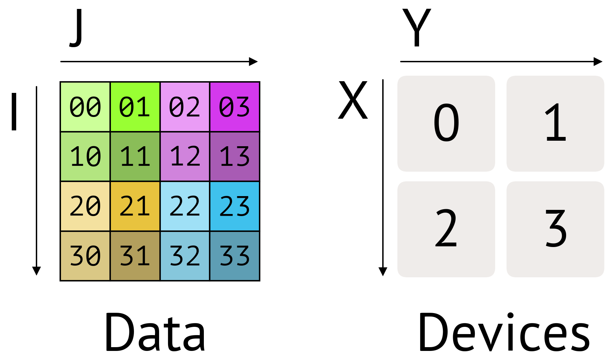
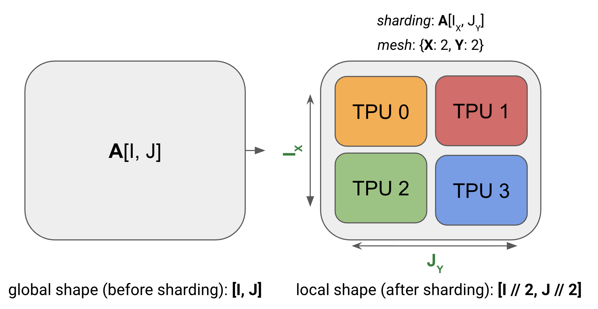

# Parallelism

Training and serving across multiple devices. Primary source: the JAX scaling book — [sharding](https://jax-ml.github.io/scaling-book/sharding/), [training](https://jax-ml.github.io/scaling-book/training/), [applied training](https://jax-ml.github.io/scaling-book/applied-training/). Also some from [Lippe's notes](https://uvadlc-notebooks.readthedocs.io/en/latest/tutorial_notebooks/scaling/JAX/overview.html). See also [Basics](basics.md), [Inference](inference.md), [TPUs & Rooflines](tpus.md).

> **Skeleton status.** Section scaffolding + scope hints below; existing Lippe-derived content is kept in place and marked _(existing)_. Redundancy watch is at the bottom — things to delete once the scaling-book notes land.
>
> Note on the [transformers chapter](https://jax-ml.github.io/scaling-book/transformers/): its params/FLOPs accounting (6ND, per-layer FLOPs table, attention share) is already written up in [Basics §Training vs Inference](basics.md#training-vs-inference). The part still needed *here* is the per-layer weight/activation **shapes**, since those set the communication volumes below.

## Sharding and collectives

_From [sharding](https://jax-ml.github.io/scaling-book/sharding/). This is the primitives layer — everything in §Strategies is an application of it._

### Notation

- **Mesh**: the device mesh `Mesh(devices=((0, 1), (2, 3)), axis_names=('X', 'Y'))` tells us we have 4 TPUs in a 2×2 grid, with axis names $`X`$ and $`Y`$
- **Sharding**: $`A[I_X, J_Y]`$ tells us to shard the first axis $`I`$ along the mesh axis $`X`$, and the second axis $`J`$ along the mesh axis $`Y`$. This sharding tells us that each shard holds $`1/(|X| \cdot |Y|)`$ of the array
- [Source](https://jax-ml.github.io/scaling-book/sharding/)
- Global shape (before sharding) vs local shape (after sharding, i.e. what each device actually holds):
  - [Source](https://jax-ml.github.io/scaling-book/sharding/)

### Which sharding needs which collective

- **Case 1**: neither input is sharded along the contracting dimension. We can multiply local shards without any communication
  - $`A[I_X, J] \cdot B[J, K_Y] \to C[I_X, K_Y]`$
- **Case 2**: one input has a sharded contracting dimension. We typically "AllGather" the sharded input along the contracting dimension
  - $`A[I, J_X] \cdot B[J, K] \to C[I, K]`$
  - $`\textbf{AllGather}_X[I, J_X] \to A[I, J]`$, then $`A[I, J] \cdot B[J, K] \to C[I, K]`$
- **Case 3**: both inputs are sharded along the contracting dimension. We can multiply the local shards, then "AllReduce" the result
  - $`A[I, J_X] \cdot_{\text{LOCAL}} B[J_X, K] \to C[I, K]\{U_X\}`$ — each device along the $`X`$ dimension will be left with different partial sums of this final desired product
  - $`\textbf{AllReduce}_X C[I, K]\{U_X\} \to C[I, K]`$
- **Case 4**: both inputs have a non-contracting dimension sharded along the same axis. We cannot proceed without AllGathering one of the two inputs first
  - $`A[I_X, J] \cdot B[J, K_X] \to C[I_X, K_X]`$ is not allowed — we need to AllGather one term first

### The collectives and their costs

- **AllGather** copies the shards spread across devices onto EACH device along that axis. In our notation, it removes the sharding along an axis (drops a subscript)
  - $`T_{total} = \max\left[\dfrac{T_{min} \cdot \sum_i |X_i|}{2}, \dfrac{V}{W_{ici} \cdot N_{axes}}\right]`$
  - The bandwidth term (second) doesn't depend on the number of shards $`|X|`$ — the more shards, the more hops, but the fewer bytes that need to move per hop
  - Or more simply, just $`T_{total} = \dfrac{V}{W_{ici}}`$
- **ReduceScatter** sums an unreduced/partially summed array, such that each device now has a shard of the fully summed array
- Generally, an **AllReduce** is twice as expensive as an AllGather. One way to see this is to note that an AllReduce can be expressed as a composition of two other primitives: a ReduceScatter and an AllGather
  - $`\textbf{ReduceScatter}_{Y,J} : A[I_X, J]\{U_Y\} \to A[I_X, J_Y]`$
  - $`\textbf{AllGather}_Y : A[I_X, J_Y] \to A[I_X, J]`$
- **AllToAll**: whereas the AllGather not only moves shards but ensures all devices have the full copy, the AllToAll ends with each device still holding a shard — so there is less work (no copy)
  - $`\textbf{AllToAll}_{X,J} A[I_X, J] \to A[I, J_X]`$
  - General cost: $`T_{\text{comms per AllToAll}} = \dfrac{V \cdot \max(A, B, C, \dots)}{4 \cdot N \cdot W_{ici}}`$. For a 1D mesh this reduces to $`V / (4 \cdot W_{ici})`$ — $`\frac14`$ the cost of an AllGather
  - **Why the factor of 4, from not needing a copy**: AllGather must *replicate* — every byte needs to reach all $`N`$ devices, which costs a path of length $`N`$. AllToAll only needs to *relocate* — each byte has exactly one destination, so it takes the shortest path on the bidirectional ring: at most $`N/2`$ (left or right), and the **mean** element travels half that, $`N/4`$.

| Operation | Description | Syntax | Runtime |
|---|---|---|---|
| **AllGather** | Gathers all the shards of a sharded array along an axis, removing a subscript. | $`[A_X, B] \to [A, B]`$ | bytes / (bidirectional ICI bandwidth * num_axes) |
| **ReduceScatter** | Sums a partially summed array along an axis and shards it along another axis (adding a subscript). | $`[A, B]\{U_X\} \to [A_X, B]`$ | Same as AllGather |
| **AllReduce** | Sums a partially summed array along an axis. Removes a $`\{U_X\}`$. Combines an AllGather and ReduceScatter. | $`[A_X, B]\{U_Y\} \to [A_X, B]`$ | 2 * AllGather |
| **AllToAll** | Gathers (replicates) an axis and shards a different dimension along the same axis. | $`[A, B_X] \to [A_X, B]`$ | AllGather / 4 for a bidirectional ring |

## Strategies

_From [training](https://jax-ml.github.io/scaling-book/training/). For each strategy the same three questions: **what is sharded**, **what is communicated per step**, **at what per-device batch size does it go bandwidth-bound**. Worth keeping the answers in that parallel shape so the summary table at the end writes itself._

For simplicity’s sake, we’ll approximate a Transformer as a stack of MLP blocks. 

### Reference: a single 2-matmul layer

The strategies below all shard this same toy layer — $`\text{In}[B,D] \to \text{Tmp}[B,F] \to \text{Out}[B,D]`$ — so its forward/backward can be checked against each strategy's sharded version.

- **Forward pass**: need to compute $`\text{Loss}[B]`$
  1. $`\text{Tmp}[B,F] = \text{In}[B,D] \cdot_D W_{in}[D,F]`$
  2. $`\text{Out}[B,D] = \text{Tmp}[B,F] \cdot_F W_{out}[F,D]`$
  3. $`\text{Loss}[B] = \dots`$
- **Backward pass**: need to compute $`dW_{out}[F,D], dW_{in}[D,F]`$ — each line below is one of the two general backward formulas from [FLOPs](#basics) ($`\partial L/\partial A = (\partial L/\partial C)B^\top`$, $`\partial L/\partial B = A^\top(\partial L/\partial C)`$), applied to the two forward matmuls in reverse order
  1. $`d\text{Out}[B,D] = \dots`$
  2. $`dW_{out}[F,D] = \text{Tmp}[B,F]^\top \cdot d\text{Out}[B,D]`$
  3. $`d\text{Tmp}[B,F] = d\text{Out}[B,D] \cdot W_{out}[F,D]^\top`$
  4. $`dW_{in}[D,F] = \text{In}[B,D]^\top \cdot d\text{Tmp}[B,F]`$
  5. $`d\text{In}[B,D] = d\text{Tmp}[B,F] \cdot W_{in}[D,F]^\top`$ (_needed for previous layers_)

### Summary

([scaling book](https://jax-ml.github.io/scaling-book/training/); CP/SP/EP per the [Megatron parallelisms guide](https://docs.nvidia.com/nemo/megatron-bridge/latest/parallelisms.html))

1. **Data parallelism**: _activations sharded along batch, parameters and optimizer state are replicated on each device. Communication only occurs during the backwards pass._
   $`\text{In}[B_X, D] \cdot_D W_{in}[D, F] \cdot_F W_{out}[F, D] \to \text{Out}[B_X, D]`$
2. **Fully-sharded data parallelism (FSDP or ZeRO-3)**: _activations sharded along batch (like pure data parallelism), parameters sharded along the same mesh axis and AllGathered just-in-time before use in the forward pass. Optimizer state also sharded along batch. Reduces duplicated memory._
   $`\text{In}[B_X, D] \cdot_D W_{in}[D_X, F] \cdot_F W_{out}[F, D_X] \to \text{Out}[B_X, D]`$
3. **Tensor parallelism (also called Megatron sharding or model parallelism)**: _activations sharded along $`D`$ ($`d_{model}`$), parameters sharded along $`F`$ ($`d_{ff}`$). AllGather and ReduceScatter activations before and after each block. Compatible with FSDP._
   $`\text{In}[B, D_Y] \cdot_D W_{in}[D, F_Y] \cdot_F W_{out}[F_Y, D] \to \text{Out}[B, D_Y]`$
   - **Important intuition**: FSDP moves **weights**, TP moves **activations**.
4. **Sequence parallelism (SP)**: _extends tensor parallelism to shard the non-matmul ops (LayerNorm, dropout) along the sequence dimension too — only active when TP is, and covers exactly what plain TP leaves redundantly replicated._
5. **Context parallelism (CP)**: _shards activations along the sequence dimension across all layers (not just the ops SP covers) — the lever for long-context training, targeting attention's KV memory specifically._
6. **Pipeline parallelism**: _weights sharded along the layer dimension, activations microbatched and rolled along the layer dimension. Communication between pipeline stages is minimal (just moving activations over a single hop)._
7. **Expert parallelism (EP)**: _shards a MoE model's experts (not activations or a dense weight) across devices; routing tokens to their expert requires an AllToAll rather than an AllGather/ReduceScatter._

### Data parallelism

Source: [scaling book](https://jax-ml.github.io/scaling-book/training/)

- Syntax: $`\text{In}[B_X, D] \cdot_D W_{in}[D, F] \cdot_F W_{out}[F, D] \to \text{Out}[B_X, D]`$
- Activations sharded along batch dimension, weights fully replicated
- Forward pass is normal — weights are replicated, so each device just runs the reference layer's forward pass on its own batch shard, no communication needed
- Backward pass: each device computes a **local, unreduced** gradient from its own batch shard (the $`\{U_X\}`$ tag), then AllReduces it across the batch axis to get the true (summed) gradient
  1. $`d\text{Out}[B_X,D] = \dots`$
  2. $`dW_{out}[F,D]\{U_X\} = \text{Tmp}[B_X,F]^\top \cdot d\text{Out}[B_X,D]`$
  3. $`dW_{out}[F,D] = \textbf{AllReduce}_X\left(dW_{out}[F,D]\{U_X\}\right)`$ (_not on the critical path — can be done async_)
  4. $`d\text{Tmp}[B_X,F] = d\text{Out}[B_X,D] \cdot W_{out}[F,D]^\top`$
  5. $`dW_{in}[D,F]\{U_X\} = \text{In}[B_X,D]^\top \cdot d\text{Tmp}[B_X,F]`$
  6. $`dW_{in}[D,F] = \textbf{AllReduce}_X\left(dW_{in}[D,F]\{U_X\}\right)`$ (_not on the critical path — can be done async_)
  7. $`d\text{In}[B_X,D] = d\text{Tmp}[B_X,F] \cdot W_{in}[D,F]^\top`$ (_needed for previous layers_)
- **Not on the critical path**: each AllReduce can be performed whenever convenient and doesn't block subsequent ops — in particular it can overlap with the backward pass of earlier layers, which is why DP communication is so cheap to hide
- Communication cost, per layer: $`T_{comms} = \dfrac{2 \cdot 2 \cdot 2 \cdot DF}{W_{ici}}`$ — AllReduce is $`2\times`$ an AllGather, bf16 is 2 bytes/param, and there are 2 weight matrices ($`W_{in}, W_{out}`$), each $`DF`$ params
- Compute cost, per layer: $`T_{math} = \dfrac{4 \cdot 2(B/X)DF}{C}`$ — 4 matmuls in the backward pass ($`dW_{out}, d\text{Tmp}, dW_{in}, d\text{In}`$), each $`2(B/X)DF`$ FLOPs at per-chip batch size $`B/X`$
- **Compute-bound** when $`T_{math} > T_{comms}`$, i.e. per-chip batch size $`B/X > C/W_{ici}`$ (≈2550 tokens for TPU v5p)

### Fully-sharded data parallelism (FSDP / ZeRO-3)

- Syntax: $`\text{In}[B_X, D] \cdot_D W_{in}[D_X, F] \cdot_F W_{out}[F, D_X] \to \text{Out}[B_X, D]`$
- Practically, vanilla DP is rarely useful because our parameters + optimizer state don't fit in a single chip
- FSDP splits the model params and optimizer states across the data parallel shards and efficiently gathers and scatters them as needed
  - Recall: FSDP moves **weights**! 
- Forward pass, we AllGather the weights before matrix multiplication (not on critical path)
- Backward pass: need to compute $`dW_{out}[F,D_X], dW_{in}[D_X,F]`$ 
- Interesting bit, the process is the **same** as DP! Just split the AllReduce into a ReduceScatter + AllGather, and notice that the output of the ReduceScatter is what we're looking for.
- **Not on the critical path**: Similar to DP, comms are non-blocking.
- FLOPs : Comms ratio is the same as DP, and so ratios earlier apply. 
- If we're doing DP, there's no reason not to do FSDP! 

### Tensor parallelism

- Syntax: $`\text{In}[B, D_Y] \cdot_D W_{in}[D, F_Y] \cdot_F W_{out}[F_Y, D] \to \text{Out}[B, D_Y]`$
- Let's reconcile something: Most people also say that TP shards model weights, so why are we sharding activations here? 
- The equivalence is that by sharding weights in the contradicting dimension, we get partial sums post matrix multiplication, and we need to AllReduce = ReduceScatter + AllGather. If we _snapshot_ at the ReduceScatter step, then we get the syntax above.
- Forward pass. We have to AllGather activations first. Post matrix multiplication, we have a partial sum and have to ReduceScatter. These are both **on the critical path**. 
  - Recall: TP moves **activations**!
- Backward pass. We have to AllGather activations first. Post matrix multiplication, our derivative wrt the input activations is a partial sum, so we have to ReduceScatter again. These are both **on the critical path**. (Note that we also have to AllGather input activations too, but "this can be skipped by sharing with the Forward pass")
- Backward pass: need to compute $`dW_{out}[F_Y, D], dW_{in}[D, F_Y]`$ 
  1. $`d\text{Out}[B, D_Y] = \dots`$
  2. $`d\text{Out}[B, D] = \textbf{AllGather}_Y\left(d\text{Out}[B, D_Y]\right)`$ (_on critical path_)
  3. $`dW_{out}[F_Y, D] = \text{Tmp}[B, F_Y]^\top \cdot d\text{Out}[B, D]`$
  4. $`d\text{Tmp}[B, F_Y] = d\text{Out}[B, D] \cdot W_{out}[F_Y, D]^\top`$ (_can throw away $`d\text{Out}[B,D]`$ here_)
  5. $`\text{In}[B, D] = \textbf{AllGather}_Y\left(\text{In}[B, D_Y]\right)`$ (_this can be skipped by sharing with (1) from the forward pass_)
  6. $`dW_{in}[D, F_Y] = \text{In}[B, D]^\top \cdot d\text{Tmp}[B, F_Y]`$
  7. $`d\text{In}[B, D]\{U_Y\} = d\text{Tmp}[B, F_Y] \cdot W_{in}[D, F_Y]^\top`$ (_needed for previous layers_)
  8. $`d\text{In}[B, D_Y] = \textbf{ReduceScatter}_Y\left(d\text{In}[B, D]\{U_Y\}\right)`$ (_on critical path_)
- **Compute-bound** when $`F/Y > C/W_{ici}`$. Note that compared to DP, we only swap out $B$ for $F$, because for comms, we are moving **activations**! 
- $F/Y$ isn't the most interpretable. Rather, we should say that $Y<M_Y \cdot F/2550$ to remain compute bound, where $M_Y$ is the number of ICI axes.

### Combining FSDP and TP

- Syntax: $`\text{In}[B_X, D_Y] \cdot_D W_{in}[D_X, F_Y] \cdot_F W_{out}[F_Y, D_X] \to \text{Out}[B_X, D_Y]`$
- Because FSDP shards activations in the X axis, we reduce the size of activations needed to move in TP. 
  - Tensor parallelism performs $`\textbf{AllGather}_Y([B_X, D_Y])`$ which shrinks as $`X`$ grows
- Similarly, because TP shards weights in the Y axis, we reduce the size of weights needed to move in FSDP.
  - FSDP performs $`\textbf{AllGather}_X([D_X, F_Y])`$ which shrinks as $`Y`$ grows
- So by combining both we push the minimum batch size per replica down further. Let $`X`$ = chips on FSDP, $`Y`$ = chips on TP, $`N = XY`$, and $`M_X, M_Y`$ = the number of mesh axes given to each (these should roughly sum to 3)
  - FSDP comms grow with $`X`$ while TP comms shrink with $`X`$, so total comms $`\max(T_{\text{FSDP}}, T_{\text{TP}})`$ is minimised where the two are equal: $`X_{opt} = \sqrt{\dfrac{B}{F}\dfrac{M_X}{M_Y}N}`$
  - e.g. $`N{=}64`$ (a 4×4×4 array), $`B{=}48{,}000`$, $`F{=}32{,}768`$ → $`X \approx 13.9`$, so pick $`X{=}16, Y{=}4`$
- Compute-bound condition, with $`\alpha \equiv C/W_{ici}`$ (the ICI arithmetic intensity): $`\dfrac{B}{N} > \dfrac{\alpha^2}{M_X M_Y F}`$
  - Plugging in $`F{=}32{,}768`$, $`\alpha{=}2550`$, $`M_X M_Y = 2`$ (as it must be for a 3D mesh) gives $`B/N > 99`$, vs ~850 for the pure FSDP case — a factor of ~8
  - I.e. because the parallelism schemes are complementary, $`T_{comms}`$ decreases and we saturate the chips more easily
  - Note the scaling asymmetry driving this: compute time scales linearly with batch size, but comms time only as $`\sqrt{B}`$ — so $`T_{math}/T_{comms} = \sqrt{BF}\sqrt{M_X M_Y} / (\alpha\sqrt{N})`$ grows as $`\sqrt{B}`$

### Pipeline parallelism

- Note that we can _also_ combine pipeline parallelism! In the pseudocode above, TPU 0 is almost always idle.
- Pipeline parallelism splits the model across devices, whilst introducing minimal communication across devices, although also facing the pipeline bubble issue.
  - [Source](https://uvadlc-notebooks.readthedocs.io/en/latest/tutorial_notebooks/scaling/JAX/pipeline_parallel_simple.html)
- _(existing)_ Micro-Batching
  - Micro-Batching mitigates the pipeline bubble issue.
  - [Source](https://uvadlc-notebooks.readthedocs.io/en/latest/tutorial_notebooks/scaling/JAX/pipeline_parallel_simple.html)
- _(existing)_ Looping Pipelines
  - Looping mitigates the pipeline bubble issue further.
  - [Source](https://uvadlc-notebooks.readthedocs.io/en/latest/tutorial_notebooks/scaling/JAX/pipeline_parallel_looping.html)
- We can also, per DeepSeek v3, carefully overlap the forward and backward matmuls.

## Case study: LLaMA-3-70B on TPU v5p

Source: [scaling book](https://jax-ml.github.io/scaling-book/training/)

0. A TPU v5p pod has ~8,960 chips ("8k"). Suppose we want to train LLaMA-3 70B ($`F \approx 30{,}000`$) at $`BS = 2M`$ tokens
1. Typically, when scaling beyond a single pod, we do TP or FSDP within the ICI domain, and pure DP across multiple pods (over DCN)
   - To be **compute-bound** over DCN: $`B/\text{slice} > C/W_{dcn} \approx 73{,}440`$ for TPU v5p
2. If we did pure FSDP: $`B/N > 2550/M_X`$ (the ICI threshold from [Data parallelism](#data-parallelism) above). At $`BS{=}2M`$ and 3 axes of FSDP, we'd be able to use at most $`\approx 2{,}400`$ chips — past that we're **comms-bound**, and adding more chips won't help
3. If we combine FSDP + TP: $`B/N > 108`$ (the [mixed threshold](#combining-fsdp-and-tp) above, using LLaMA-3 70B's $`F \approx 30{,}000`$), which lets us scale to $`\approx 18{,}000`$ chips
4. But $`18{,}000 > 8{,}960`$, so a single pod isn't enough — we need to cross DCN, using 2 pods ($`N \approx 17{,}920`$). This is fine — still **compute-bound**, not DCN-bound — because the per-pod batch size $`= 1M > 73{,}440`$ ✓, giving a per-chip $`B/N \approx 111`$: efficient, if cutting it a bit close
- **Takeaway**: scaling across multiple TPU pods with pure data parallelism is fairly straightforward, so long as the per-pod batch size clears the DCN threshold (~73k tokens for v5p)

### Sequence parallelism (SP)

Source: [Megatron parallelisms guide](https://docs.nvidia.com/nemo/megatron-bridge/latest/parallelisms.html)

- Only active when TP is active (`tensor_model_parallel_size > 1`) — it's **TP extended to shard the non-matmul ops too** (LayerNorm, dropout) along the sequence dimension, which plain TP otherwise leaves redundantly replicated on every device
- Fills the gap TP leaves open: TP shards $`D`$ inside the matmuls, but the LayerNorm/dropout between blocks were still computed redundantly everywhere — SP shards those along sequence instead, removing the redundant compute at ~no extra communication (reuses the AllGather/ReduceScatter boundary TP already pays for at each block)

### Context parallelism (CP)

Source: [Megatron parallelisms guide](https://docs.nvidia.com/nemo/megatron-bridge/latest/parallelisms.html)

- Shards activations along the **sequence** dimension, across *all* layers (unlike SP, which only covers the specific ops TP leaves unsharded) — the lever for **long-context training**, where activation memory (the $`5as^2b`$ term — see [Basics](basics.md#training-vs-inference)) would otherwise dominate
- Targets attention specifically: each device holds only its sequence chunk's queries, plus only the K/V it needs; during the backward pass, missing KV pairs are exchanged via point-to-point sends around a ring (an AllGather/ReduceScatter reshaped into ring hops) rather than a single AllGather
- Composes with TP/PP/DP as another mesh axis: `data_parallel_size = world_size / (tensor_model_parallel_size × pipeline_model_parallel_size × context_parallel_size)`
- Two main implementations, differing in _how_ the missing KV reaches each device:
  - **Ring attention** (what the point-to-point description above is): each device keeps only its own KV chunk and passes it to the next device in a ring while computing partial attention on the chunk it currently holds (online-softmax accumulation, P2P — not a collective). Memory stays flat, and comms overlap with compute by construction, at the cost of $`P-1`$ sequential hops
  - **DeepSpeed-Ulysses**: reshard from "sequence-sharded, heads-complete" to "sequence-complete, heads-sharded" via an **AllToAll**, run ordinary (e.g. FlashAttention) attention on the now-complete sequence with a shard of the heads, then AllToAll back. Only 2 communication rounds (vs ring's $`P-1`$) and plays nicely with existing attention kernels, but the AllToAll sits on the critical path rather than overlapping with compute
  - (A third, simpler option — plain **AllGather-CP**: AllGather K/V across all CP devices, then compute locally — is the easiest to implement but briefly holds the *full* sequence's KV per device, undoing much of CP's memory win)

### Expert parallelism (EP)

Source: [Megatron parallelisms guide](https://docs.nvidia.com/nemo/megatron-bridge/latest/parallelisms.html)

- Shards a MoE model's **experts** (not activations, nor a single dense weight) across devices — `expert_model_parallel_size` must divide the total expert count (e.g. 8 experts ÷ EP=4 → 2 experts/device)
- In practice, EP is typically used in conjunction with other forms of parallelism, such as data parallelism. This is because EP only affects the MoE layers and doesn't shard activations. If used in isolation, our GPUs would be doing redundant computation for all the non-MoE blocks.
- Routing needs an **AllToAll**, not an AllGather/ReduceScatter: tokens are dispatched to whichever device holds their selected expert, computed there, then AllToAll'd back to their originating device — the "dispatch/combine" step, and literally the AllToAll primitive from [§The collectives and their costs](#the-collectives-and-their-costs) above
- Unlike DP/TP/PP/CP — which shard a fixed, static computation graph — EP's communication pattern is **data-dependent** (which experts a batch of tokens picks), which is why load balancing (token dropping via a capacity factor, aux-loss balancing) is a live concern here and isn't for the others

### 5D parallelism (Megatron)

_To cover: how DP/TP/PP/CP/EP combine into one 5D device mesh in practice — [Megatron parallelisms guide](https://docs.nvidia.com/nemo/megatron-bridge/latest/parallelisms.html) — mirroring [Combining FSDP and TP](#combining-fsdp-and-tp) above but for the full stack. Don't forget to come back to this._

## Placement on GPUs: TP within a node, PP across nodes

_(existing — from the [vLLM blog](https://www.aleksagordic.com/blog/vllm); complementary to the book, which is TPU/ICI-centric rather than node-centric.)_

- A node is a server that may contain one or multiple GPUs.
- If a model doesn't fit on one GPU, the first option is to shard it across multiple GPUs on the same node using tensor parallelism (e.g. TP=8). If the model still doesn't fit, the next step is pipeline parallelism across nodes.
- Intranode bandwidth is significantly higher than internode, which is why TP is generally preferred over PP (it is also true that PP communicates less data than TP):
  - Tensor Parallelism usually stays within a single node (intra-node communication) because it involves fine-grained operations with very high bandwidth and low-latency needs (like splitting matrix multiplications).
  - Pipeline Parallelism usually spans across nodes (inter-node communication) because it splits the model into larger chunks (layers or blocks), and the data passed between chunks is relatively smaller and less frequent, making it more tolerant to slower communication across nodes.
- The next step is to scale out: enable data parallelism (DP > 1) replicating the model across nodes, add a lightweight DP coordination layer, introduce load balancing across replicas, and place one or more API servers in front to handle incoming traffic.
