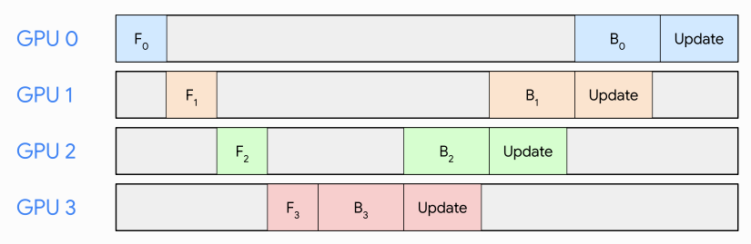
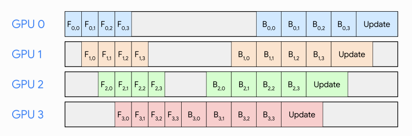
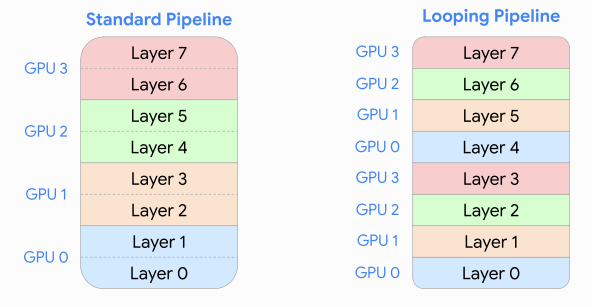
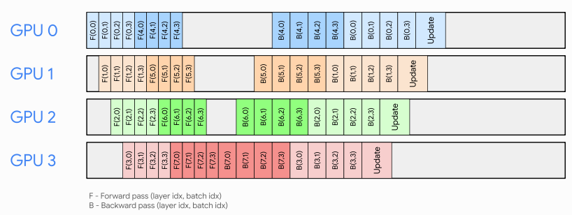
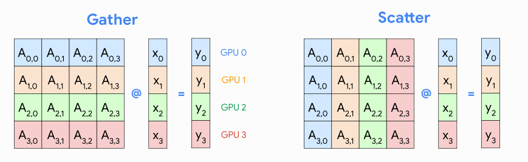
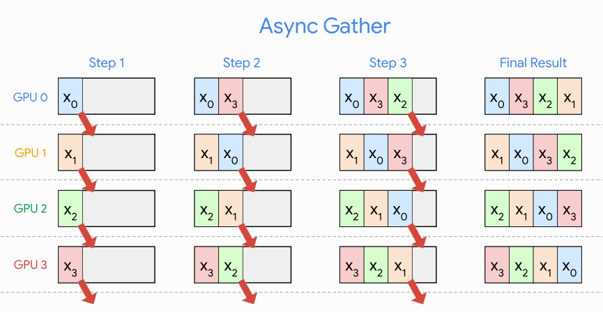
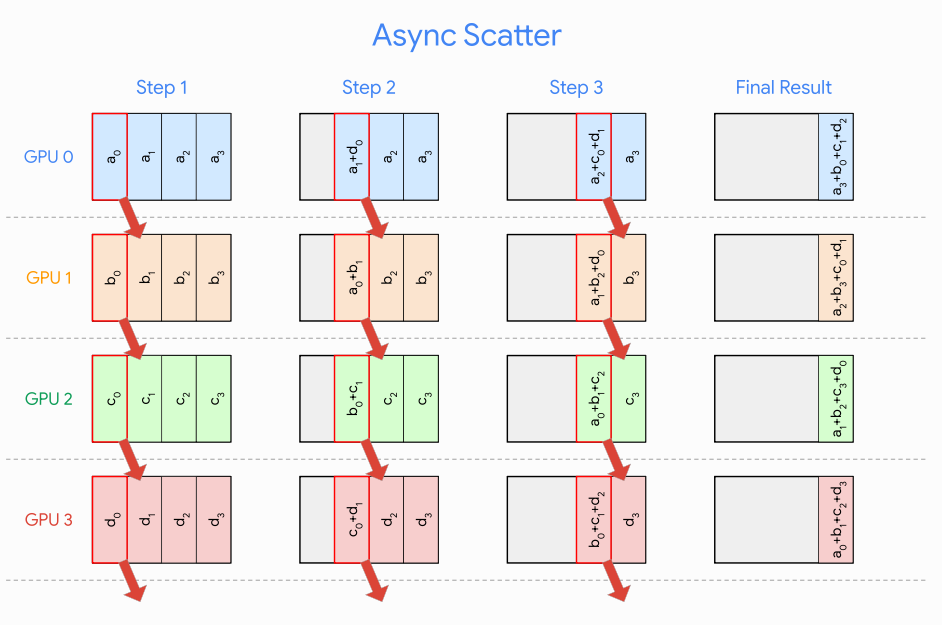
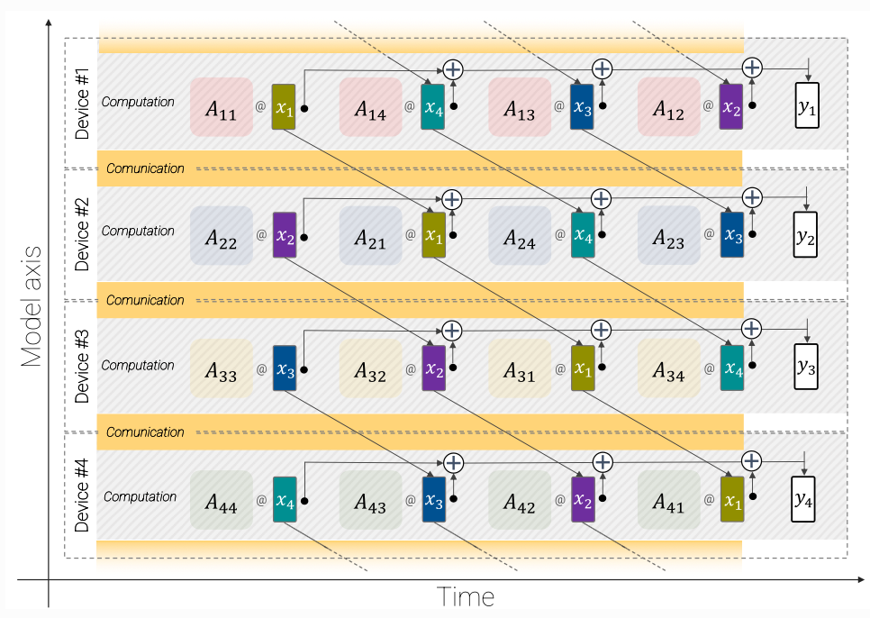
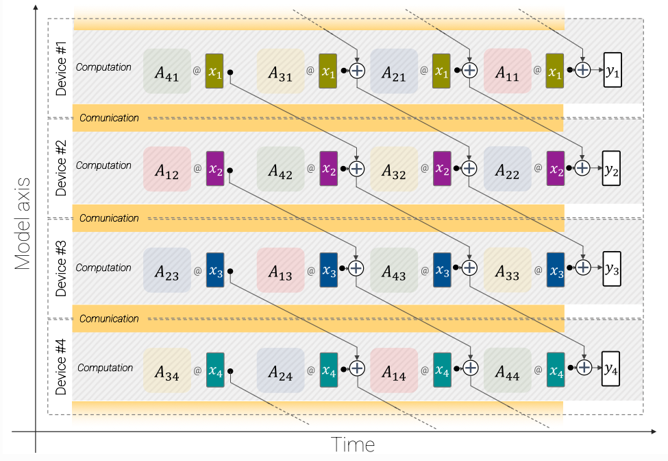
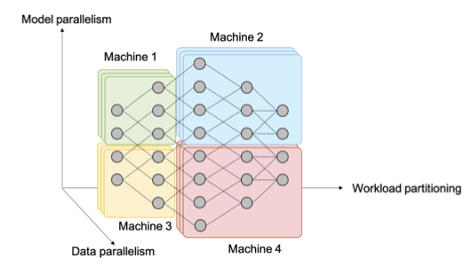

# Parallelism

Training and serving across multiple devices. Drawn heavily from [Lippe's notes](https://uvadlc-notebooks.readthedocs.io/en/latest/tutorial_notebooks/scaling/JAX/overview.html); companion notebooks in this folder (`02_data_parallelism.ipynb`, `03_pipeline_parallelism.ipynb`). See also [Basics](basics.md), [Inference](inference.md), [TPUs & Rooflines](tpus.md).

## Multiple Processors

- Parallel Computation and Communication
  - In PyTorch, functions like `to()` and `copy_()` admit an explicit `non_blocking` argument. 
  - We can also do this in JAX

## Data Parallelism

- Overview
  - Each device will hold the same model and parameters, and process a different batch of data in parallel.
  - After obtaining the gradients for each batch, we aggregate the gradients over the devices and update our model. 
    - This is synchronous SGD, but this may be slowed down due to communication overhead.
    - Asynchronous SGD can be used, although there may be gradient staleness. However, when weight matrices are large, most updates are sparse and gradient staleness may be ok.
    - `DP` has all communication go through a master process, which is slower than `DDP`, which uses Ring-AllReduce. 
- Parameter Sharding (Fully-sharded data parallelism)
  - Storing _all_ of a model's data (optimizer state, gradients, parameters) can be costly in terms of memory
  - Each device can instead store a portion of parameters
  - Before executing a layer, a device can then communicate with other devices to receive the parameters it needs

## Pipeline Parallelism

- Overview
  - Pipeline parallelism splits the model across devices, whilst introducing minimal communication across devices, although also facing the pipeline bubble issue. 
  - [Source](https://uvadlc-notebooks.readthedocs.io/en/latest/tutorial_notebooks/scaling/JAX/pipeline_parallel_simple.html)
- Micro-Batching
  - Micro-Batching mitigates the pipeline bubble issue.
  - [Source](https://uvadlc-notebooks.readthedocs.io/en/latest/tutorial_notebooks/scaling/JAX/pipeline_parallel_simple.html)
- Looping Pipelines
  - Looping mitigrates the pipeline bubble issue further.
  - [Source](https://uvadlc-notebooks.readthedocs.io/en/latest/tutorial_notebooks/scaling/JAX/pipeline_parallel_looping.html)
  - We can process mini-batches breadth-first (each GPU processes a batch fully before moving on to the next) or depth-first (process a mini-batch the moment it is ready)
  - [Poirier](https://arxiv.org/pdf/2211.05953) argues that when combining data parallelism and pipeline parallelism, because the former requires us to communicate and sum across devices, breadth-first pipeline parallelism is faster since we can start this communication earlier. 

## Tensor Parallelism

- Overview
  - Tensor parallelism splits the model across the feature dimension. 
  - It does not face the pipeline bubble issue, but requires more communication across devices.
  - Gather vs Scatter
    - Gather "gathers" data spread across multiple processors such that each processor has a copy. 
    - Scatter does not copy data, rather it transmits $`\frac{n-1}{n}`$ of its data to other devices. 
    - [Source](https://uvadlc-notebooks.readthedocs.io/en/latest/tutorial_notebooks/scaling/JAX/tensor_parallel_simple.html)
    - Note that here we reverse the order of our activations ($`p \times n`$ rather than $`n \times p`$)
    - To reduce both the communication needed (?) and the amount of data stored on each device, gather/scatter is more suitable when $`\mathbf{x}`$ has fewer/more features than $`\mathbf{y}`$.
- Asynchronous layers
  - In the gather strategy, we first need to communicate all the features of $`\mathbf{x}`$ before we can compute the output. 
    - [Source](https://uvadlc-notebooks.readthedocs.io/en/latest/tutorial_notebooks/scaling/JAX/tensor_parallel_async.html)
  - In the scatter strategy, need to compute the output on all devices before we can communicate results and sum them. 
    - [Source](https://uvadlc-notebooks.readthedocs.io/en/latest/tutorial_notebooks/scaling/JAX/tensor_parallel_async.html)
  - Asynchronous layers allow us to overlap communication with computation and reduce downtime. 
  - Gather
    - [Source](https://arxiv.org/pdf/2302.05442)
  - Scatter
    - [Source](https://arxiv.org/pdf/2302.05442)
  - If we want all nodes to contain all activations, consider Ring Allreduce, which uses the scatter-reduce above, and then an allgather. 
    - This sums individual arrays on all nodes, and eventually every node will have a copy of this sum.

## 3D Parallelism

- We can combine all the 3 parallelism types for increased computational gains.
  - [Source](http://web.ecs.baylor.edu/faculty/dong/elc5396_DeepLearning/DeepLearningSignalProcessingH3.pdf)
  - [DeepSpeed](https://www.microsoft.com/en-us/research/blog/deepspeed-extreme-scale-model-training-for-everyone/)

## Placement: TP within a node, PP across nodes

> Draft — seeded from reading notes ([vLLM blog](https://www.aleksagordic.com/blog/vllm)), to expand.

- A node is a server that may contain one or multiple GPUs.
- If a model doesn't fit on one GPU, the first option is to shard it across multiple GPUs on the same node using tensor parallelism (e.g. TP=8). If the model still doesn't fit, the next step is pipeline parallelism across nodes.
- Intranode bandwidth is significantly higher than internode, which is why TP is generally preferred over PP (it is also true that PP communicates less data than TP):
  - Tensor Parallelism usually stays within a single node (intra-node communication) because it involves fine-grained operations with very high bandwidth and low-latency needs (like splitting matrix multiplications).
  - Pipeline Parallelism usually spans across nodes (inter-node communication) because it splits the model into larger chunks (layers or blocks), and the data passed between chunks is relatively smaller and less frequent, making it more tolerant to slower communication across nodes.
- The next step is to scale out: enable data parallelism (DP > 1) replicating the model across nodes, add a lightweight DP coordination layer, introduce load balancing across replicas, and place one or more API servers in front to handle incoming traffic.
