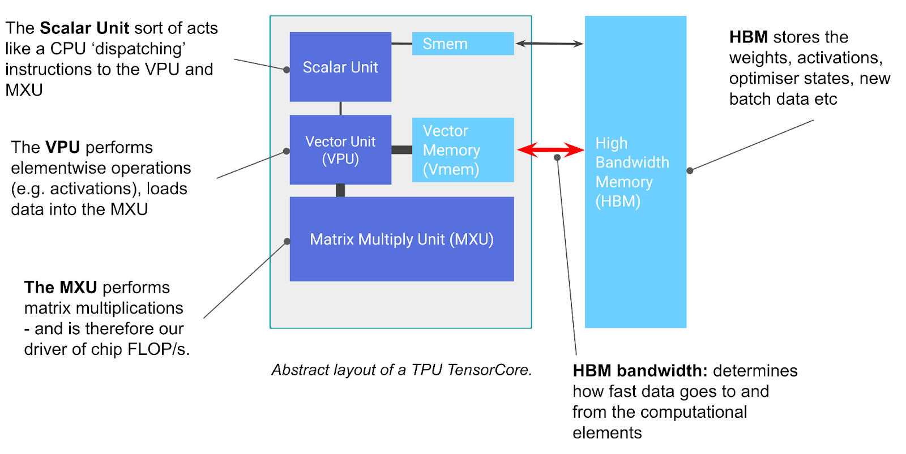
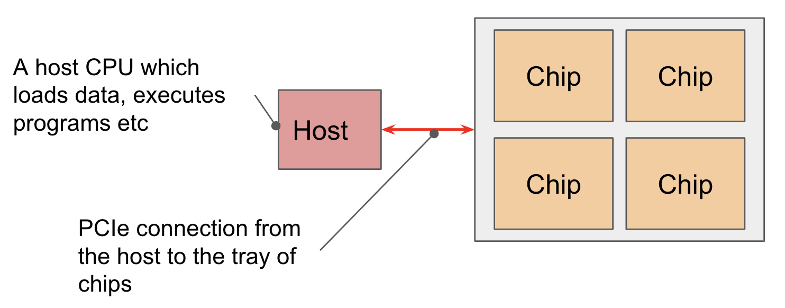
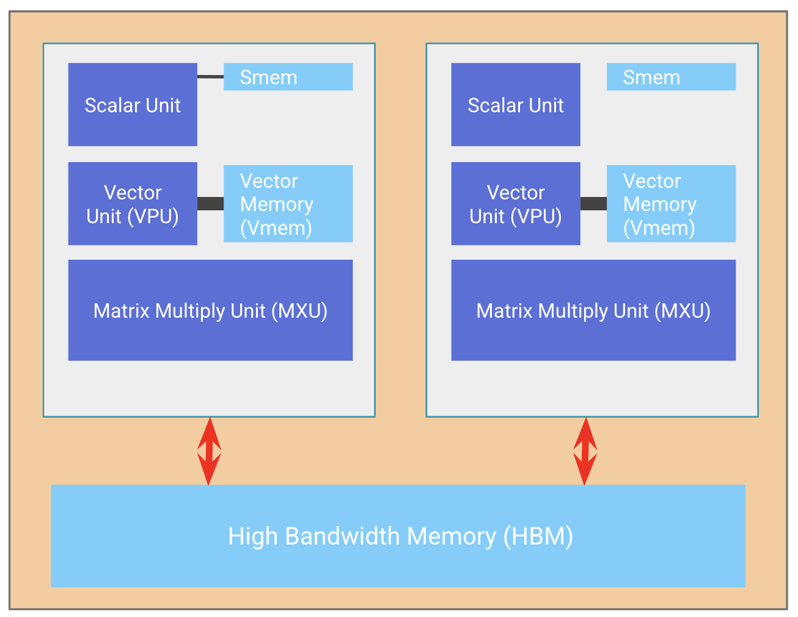

# TPUs 

Primary source: [How To Scale Your Model (JAX scaling book)](https://jax-ml.github.io/scaling-book/index).

## Chapter 2: TPUs

- Communication is limited by our various network bandwidths in order of speed:
  - HBM bandwidth: between a TensorCore and its associated HBM
    - [Source](https://jax-ml.github.io/scaling-book/tpus/)
  - ICI bandwidth: between a TPU chip and its nearest 4 or 6 neighbors
    - [Source](https://jax-ml.github.io/scaling-book/tpus/) — the wraparound links are what make it a torus (shaded chips = one 2×2 subslice)
  - PCIe bandwidth: between a CPU host and its associated tray(s) of chips
    - [Source](https://jax-ml.github.io/scaling-book/tpus/)
  - DCN bandwidth: between multiple CPU hosts, typically hosts not connected by ICI
- A TPU **core** (TensorCore): scalar unit dispatches instructions, VPU does elementwise work, MXU does the matmuls (so it sets chip FLOP/s); Vmem/Smem are the on-chip scratchpads, HBM holds weights/activations/optimiser states
- A TPU **chip** (often) consists of two TPU cores sharing HBM
  - [Source](https://jax-ml.github.io/scaling-book/tpus/)
- The MXU multiplies chunks of 8×128 and 128×128
  - The TPU MXU is a 128×128 systolic array. When fully saturated, it can perform one [8,128] @ [128,128] multiplication per 8 clock cycles.
  - Weights are passed down from above (RHS) while inputs are passed in from the left (LHS).
- Matmul is pipelined so the copies to/from VMEM are overlapped with MXU work
- A TPU (v4) typically consists of two TPU cores which share memory and can be thought of as one large accelerator with twice the FLOPs
  - Older TPU chips (v3) have separate memory and are regarded as two separate accelerators
  - Inference-optimized chips like the TPU v5e only have one TPU core per chip
- Chips are arranged in sets of 4 on a "tray" connected to a CPU host via the PCIe network
  - So users are used to being exposed to 8 cores
  - For TPU v5e, we have 2 trays per host
  - PCIe bandwidth is close to 100× slower than HBM
- Networking
  - Chips are connected to each other through the ICI network in a Pod. They are connected to their 4-6 nearest neighbors with edge links that form a torus.
    - The toroidal structure reduces the maximum distance between any two nodes from $`N`$ to $`N/2`$
  - Pod sizes can get very big (16×20×28) and are composed of reconfigurable cubes of 4×4×4 chips
  - GPUs, in contrast, are connected with a hierarchy of switches that approximate a point-to-point connection between every GPU
    - Typically, GPUs within a node (8 GPUs for H100 or as many as 72 for B200 NVL72) are directly connected, while larger topologies require O(log N) hops between GPUs
    - That means GPUs can send arbitrary data within a small number of hops
    - TPUs are dramatically cheaper (since NVLink switches are expensive), simpler to wire together, and can scale to much larger topologies because the number of links per device and the bandwidth per device is constant
  - ICI is fast relative to DCN, but slower than HBM bandwidth
    - A set of ICI-connected TPUs is called a slice. Different slices can be connected to each other using DCN
    - Slow path: DCN is host-to-host, so to transfer buffers from TPU to TPU over DCN, we first need to transfer over PCIe to the host, then egress over the network, then ingress over the target host network, then over PCIe into HBM
  - ICI bandwidth: unidirectional bandwidth is more true to the hardware but bidirectional bandwidth occurs more often in equations involving a full ring
  - ICI transfer time from neighboring chips to another chip in the slice is almost the same (overlap)
- "Host DRAM" == CPU == PCIe needed
- Say arrays are on CPU and you want to move them onto one chip
  - DCN → PCIe → HBM is slower than PCIe → ICI → HBM
  - Also consider "bottlenecks", i.e. TPU{0,0} only has 2 ports
- The VPU is of shape (8, 128) where the 128 dimension is referred to as the lane axis and the 8 dimension as the sublane axis
  - Each (lane, sublane) pair on v5 contains 4 standard floating-point ALUs which are independent of each other
  - All lanes and sublanes execute the same program every cycle in a pure SIMD manner, but each ALU can perform a different operation
- The scalar core is the control unit of the TPU. It fetches and dispatches all instructions and executes transfers from HBM into VMEM, and can be programmed to do scalar metadata work.
  - Because the scalar core is single-threaded, one side-effect is that each core of the TPU is only capable of creating one DMA request per cycle.
