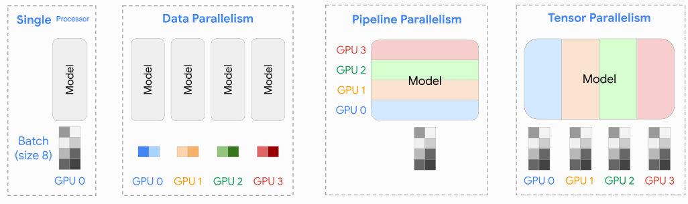

# Training Performance

As models and data scale in size, optimizing for more efficient processes becomes more and more imperative. This file covers single-device efficiency: what bounds us, memory reduction, and the practical speed checklist. It draws heavily from [Lippe's notes](https://uvadlc-notebooks.readthedocs.io/en/latest/tutorial_notebooks/scaling/JAX/overview.html). See also [Parallelism](parallelism.md), [Inference](inference.md), [GPUs](gpus.md), and [TPUs & Rooflines](tpus.md).

(Adapted from [Lippe](https://uvadlc-notebooks.readthedocs.io/en/latest/tutorial_notebooks/scaling/JAX/overview.html))

## Single Processor

- CPU vs GPU: see [GPUs](gpus.md) for the hardware model (SMs, warps, threadblocks, tensor cores, memory hierarchy).
- Row-major vs Column-major
  - Row/column-major means that consecutive elements in a row/column are stored next to each other in memory. 
  - NumPy/PyTorch/CSV are row-major, Parquet is column-major. 
  - In a sample $`\times`$ feature matrix, it is faster to access samples/features in row/column-major formats.
- Vectorization
  - Vectorization refers to single instruction, multiple data (SIMD) operations. 
    - I.e. One instruction carries our the same operation on a number of operands in parallel.
  - NumPy enables vectorization when we write code in a way that operates on entire arrays rather than looping through individual elements. 
- Imperative vs Symbolic programming
  - Imperative programming makes it easy to design new models since it is possible to write code with control flow and the ability to use a large amount of the Python software ecosystem.
  - Symbolic programming requires that we specify the program and compile it before executing it. The benefit is improved performance.
- Asynchronous Computation
  - For PyTorch, by default, GPU operations are asynchronous.
  - Broadly speaking, PyTorch has a frontend for direct interaction with the users, e.g., via Python, as well as a backend, e.g. via C++, used by the system to perform the computation.
  - Thus, there is little impact on the program’s overall performance, regardless of Python’s performance.
  - Conversions to NumPy are blocking because NumPy has no notion of asynchrony.
- `torch.compile` makes PyTorch code run faster by JIT-compiling PyTorch code into optimized kernels
  - A Just-In-Time (JIT) compiler compiles code at runtime into a fast executable
  - The `max-autotune` configuration with profile the model with different optimization configurations and generate optimized machine code for the model using the best found configuration
- JAX
  - JAX is a numerical computing library that has various desirable characteristics for the computations done in DL. 
    - Provides a unified NumPy-like interface to computations that run on CPU, GPU, or TPU, in local or distributed settings
    - Features Just-In-Time (JIT) compilation via Open XLA
      - XLA significantly increases execution speed and lowers memory usage by fusing low-level operations
      - Warning: The intermediate `jaxpr` representation is specialized to the shapes of input arguments 
        - Hence, running a jitted function with different input shapes requires multiple recompilations. 
        - We can use padding to prevent re-compilations, but when this needs to be done extensively (e.g. NLP with many different sentence lengths), the overhead could outweigh the benefits.
      - While compilation time could be a significant bottleneck, we can use the `scan` transformation to write a for-loop with a single compilation of the inner step.
    - Efficiently evaluates gradients via its automatic differentiation transformations
      - `jaxpr` representations give us analytical forms of gradients
      - Allows us to efficiently compute higher-order gradients
    - Supports automatic vectorization of functions
      - Allows for vectorization of functions not written in "vectorized forms".
      - It also allows us to support additional batch dimensions.
    - A note: JAX is designed to be functional. 
      - Writing code with side effects is dangerous because an error will _not_ be thrown and JAX will just ignore such instructions.
- What are we bounded by?
  - [He's article](https://horace.io/brrr_intro.html)
  - Memory
    - Size of DRAM
      - Solution: See below
  - Bandwidth
    - Time spent transferring tensors within a GPU
      - Solution: Operator fusion
  - Compute (on SRAM)
    - Time spent on your GPU computing actual floating point operations (FLOPS)
      - Solution: More tensor cores
  - Overhead
    - Everything else
      - Solution: Asynchronous computation
- Memory reduction
  - Memory vs compute
    - We discuss methods to reduce this memory constraints (sometimes at the cost of increased computational cost)
  - Mixed Precision Training
    - Use 32-bit floating-point numbers for weight updates and final loss computation
    - Use 16-bit floating-point numbers for most computations
      - Loss scaling may be needed because `float16` may induce underflow/overflow issues
      - `bfloat16` has a larger range but lower precision, and is an alternative to avoid loss scaling
    - This reduces both memory and compute costs
  - Quantization
    - We represent the weights and activations with lower-precision data types
    - Quantization-aware Training (QAT) is a way of training that simulates quantization whilst training
    - Double quantization is when we quantize the scaling factors from the first quantization.
      - QLoRA combines double quantization with [LoRA](../post_training/notes.md).
  - Gradient Checkpointing / Activation Recomputation
    - Trade compute for memory by recomputing activations during the backward pass.  
  - Gradient Accumulation
    - We can accumulate gradients over batches and take steps once every few batches.
    - This to me doesn't feel like it "speeds up" a forward pass. Rather, it just remedies the instability induced by memory limitations that force smaller batch sizes than we would like.
  - Pruning
    - Pruning is a technique that removes less important connections, neurons, or structures from a trained model 
  - Donating buffers (JAX-specific)
    - Since JAX employs functional programming, we cannot modify variables in place.
    - If we don't need our input variables, JAX provides a mechanism to donate buffers, which allows us to reuse the memory of the input arguments for the output arguments.

## Batch Size

> Draft — seeded from reading notes, to expand.

- Memory scales roughly linearly with batch size (activations are the main cost; model params and optimizer states are fixed)
- Compute scales linearly with batch size
- As batch size increases, GPU utilization improves
  - Saturates the GPU: more parallel work to fill all compute units
  - Amortizes fixed costs: kernel launch overhead, memory transfers, optimizer step
  - Better memory coalescing: larger contiguous memory accesses are more efficient on GPUs
- Small batch: easier to fit in memory, but worse hardware utilization
- Larger batch: faster tokens per second, but higher memory demand
- Rule of thumb: use the largest batch size that fits in memory — the only downside is learning dynamics (compensate by increasing the learning rate; see [Optimization](../optimization/notes.md))

## Training Speed Checklist

> Draft — seeded from reading notes, to expand.

- Create the causal mask on the fly (lower memory)
- Enable tensor cores: one tensor-core instruction computes a small matrix FMA — 64 FMAs/clock on Volta/Turing, ~256 on A100, ~512 on H100 — vs one scalar FMA per CUDA core
  - `torch.set_float32_matmul_precision('high')`
- `fused=True` on the AdamW optimizer
- `pin_memory=True` on the data loader
  - DataLoader has worker processes running on CPU. Their job is to read raw data from disk, tokenize/preprocess it, and produce a batch tensor. Where in CPU memory does that tensor end up?
    - `pin_memory=False`: tensor lands in normal pageable RAM
    - `pin_memory=True`: tensor lands in normal pageable RAM → DataLoader's pin_memory thread copies it to a pinned allocation before handing it to you
  - Who does the pageable→pinned copy matters: without pin_memory, CUDA does it synchronously at transfer time — the GPU launch stalls waiting
  - Downside: locked (non-pageable) memory
- `bfloat16` precision: halves memory and doubles throughput
- `torch.compile(model)`: JIT-compiles the model graph with the Inductor backend, generating optimized Triton/CUDA kernels
  - Operator fusion: identifies sequences of operations that can be fused into one kernel
  - Triton code generation: generates custom Triton GPU kernels for fused operations
  - Memory planning: optimizes tensor allocation and reuse patterns
  - Eliminates Python overhead: the forward and backward pass run as compiled code, bypassing Python's interpreter entirely
  - Compilation happens lazily — it traces, compiles, and caches kernels on first execution. After warmup, you're running optimized machine code
- Vocabulary padding: pad vocab size up to a multiple of the tile size, preventing tensor core hardware from needing to pad up to the tile boundary in registers (padding cost)
- Largest batch size that fits in memory (see [Batch Size](#batch-size) above)
