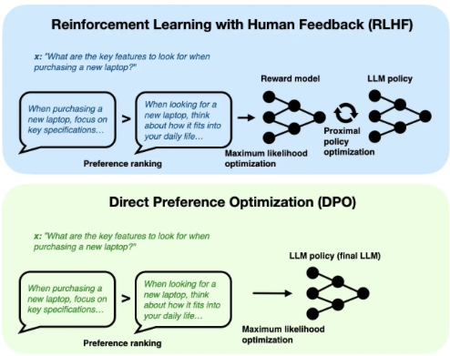

# Post-Training

- Post-Training  is a set of processes and techniques that refine and optimize a machine learning model after it's been trained.

## Model Optimization

- See [Computational Performance](../performance/training.md)

## Guidance

- Take an existing model and steer the generation process at inference time for additional control.
  - It's important to remember that we're _not_ changing the model internals. 
    - For example, the model already has the ability to generate the conditioned outputs, we're instead restricting the inputs to guide this generation process. 
- See more specific examples in [Diffusion](../../fundamentals/dl/10_diffusion/notes.md) and [NLP](../../fundamentals/dl/17_nlp/post_training.md). 

## Fine-Tuning

- Re-train existing models on new data to change the type of output they produce.
- This usually involves one of the following options:
  - Adding/Replacing a few output layers
  - Freezing a portion of weights (Parameter Efficient Fine-Tuning)
- Parameter Efficient Fine-Tuning (PEFT)
  - LoRA
    - Suppose we only finetune our linear layers, excluding bias terms, converting weight $`W \in \mathbb{R}^{a \times b}`$ to $`W'`$
    - We can reparameterize $`W'`$ as $`W + \Delta W`$
    - LoRA is a low rank approximation of $`\Delta W = AB`$, $`A \in \mathbb{R}^{a \times r}, B \in \mathbb{R}^{r \times b}`$
    - We can then freeze our original model, and focus on training $`A`$ and $`B`$ matrices for each of our linear layers.
    - LoRA does not increase inference latency because weights can be merged with the base model. 
- See examples in [Diffusion](../../fundamentals/dl/10_diffusion/notes.md), [NLP](../../fundamentals/dl/17_nlp/post_training.md), and [CV](../../fundamentals/dl/16_computer_vision/notes.md).

## Distillation

- There are [many ways](https://arxiv.org/pdf/2402.13116) to distill information from a larger model to a smaller one. 
  - One common way to do so for LLMs is SFT, or "Pseudo-Labelling"
    - $`\mathcal{L}_{\mathrm{SFT}}=\mathbb{E}_{x \sim \mathcal{X}, y \sim p_T(y \mid x)}\left[-\log p_S(y \mid x)\right]`$
  - Another way is to use $`KL(P_t \| P_s)`$
    - The *direction* of this KL matters a lot (mode-covering vs mode-seeking) — see [KL Divergence](../rl/kl_divergence.md) for how the order plays out in distillation, RLHF and SFT.
  - Or a combination of both ([Distil-Whisper](https://arxiv.org/pdf/2311.00430))
  - On-policy distillation (OPD/OPSD): sample from the *student* and have the teacher provide per-token supervision on those samples — ToDo: expand (sits between distillation and RL; cross-ref [KL Divergence](../rl/kl_divergence.md)).
- For smaller models, DeepSeek R1's paper indicated that distillation was more effective than RL.
  - To me, this feels like the important piece of the puzzle is _high quality data_.

## Reinforcement Learning with Human Feedback (RLHF)

- In pretraining process, it is hard to incorporate additional (human) preferences
- 4 steps
  - Pretraining a language model (LM)
  - Use human responses to fine-tune LM to follow instructions
  - Gathering data and training a reward model
    - Gather data
      - Prompt LMs with prompts $`x`$
      - Gather responses $`y`$
      - Get human rankings
    - Train a reward model
      - Loss is based on $`P(y_1 > y_2 \mid x) = \sigma(r(x,y_1) - r(x, y_2))`$
      - Can be any model
      - Why do we need this? Ideally in the next step, we can ask a human to generate a reward/rank for any $`y \mid x`$, but that's prohibitively expensive.
  - Fine-tuning the LM with reinforcement learning
    - [Source](https://huggingface.co/blog/rlhf)
    - Some parameters of the LM are frozen because fine-tuning an entire 10B or 100B+ parameter model is prohibitively expensive
    - State: $`x`$
    - Action: $`y`$
    - Policy: $`\pi_{PPO}(y \mid x)`$
    - Why is this RL? 
      - If we have a dataset of $`(y,x)`$ pairs, this can be couched as supervised learning.
      - The key here is that the model itself generates $`y \mid x`$. 
        - We then also need the KL divergence term to prevent the model from just generating gibberish that just tricks the imperfect reward model. 
    - Why is this not RL?
        - See "Reward Modeling" below. 

## Direct Preference Optimization (DPO)

- Similar to RLHF, but we skip generation of the reward model
  - [Source](https://github.com/rasbt/LLMs-from-scratch/blob/main/ch07/04_preference-tuning-with-dpo/dpo-from-scratch.ipynb)
- Loss is based on $P(y_1 > y_2 \mid x) = \sigma(\beta(\log\frac{\pi_{PPO}(y_1\mid x)}{\pi_{base}(y_1\mid x)} - \log\frac{\pi_{PPO}(y_2\mid x)}{\pi_{base}(y_2\mid x)}))$
  - $\beta$ is the KL-penalty coefficient inherited from the RLHF objective. Higher $\beta$ tethers the policy more strongly to the reference, so it moves *less* in response to rankings; lower $\beta$ lets preferences dominate (the overfitting direction).
  - Subbing this in, new loss function is then no longer dependent on $r:$ 
    - $`\mathcal{L}_{\mathrm{DPO}}\left(\pi_{PPO} ; \pi_{base}\right)=-\mathbb{E}_{\left(x, y_1, y_2\right) \sim \mathcal{D}}\left[\log \sigma\left(\beta \log \frac{\pi_{PPO}\left(y_1 \mid x\right)}{\pi_{base}\left(y_1 \mid x\right)}-\beta \log \frac{\pi_{PPO}\left(y_2 \mid x\right)}{\pi_{base}\left(y_2 \mid x\right)}\right)\right]`$
- The simplicity of not needing to model a reward model comes at the cost of DPO being more prone to overfitting to preferences and ending up generating nonsense.
  - While the loss above does have some flavor of minimizing the divergence between $`\pi_{PPO}`$ and $`\pi_{base}`$, we find that this KL-regularization is actually insignificant when preferences are very strong, which is exacerbated by our finite data regime (Section 4.2 of [$`\Psi`$PO paper](https://arxiv.org/pdf/2310.12036))
    - The paper argues that the reward model is useful as a regularizer because it underfits preferences, preventing this problem. 

## $`\Psi`$PO

- The objective $`\max _\pi \underset{\substack{x \sim \rho \\ y \sim \pi(. \mid x) \\ y^{\prime} \sim \mu(. \mid x)}}{\mathbb{E}}\left[\Psi\left(p^*\left(y \succ y^{\prime} \mid x\right)\right)\right]-\tau D_{\mathrm{KL}}\left(\pi \| \pi_{\mathrm{ref}}\right)`$ generalizes both RLHF's and DPO's objective functions. 
- DPO corresponds to when $\Psi(q) = \log(\frac{q}{1-q})$, and the unboundedness of this $\Psi$ causes DPO to overfit. 
- The [paper](https://arxiv.org/pdf/2310.12036) proposes taking $\Psi$ to be the identity, but unlike RLHF and like DPO, proposes an empirical solution for this optimization problem. 
  - Sampled IPO
    - We minimize $`\underset{\left(y_1, y_2, x\right) \sim D}{\mathbb{E}}\left(\log\frac{\pi_{PPO}(y_1\mid x)}{\pi_{base}(y_1\mid x)} - \log\frac{\pi_{PPO}(y_2\mid x)}{\pi_{base}(y_2\mid x)}-\frac{\tau^{-1}}{2}\right)^2`$, with the preferred completion first: $`y_1 = y_w`$ (winner), $`y_2 = y_l`$ (loser).
    - Intuitively, when the weight on the KL-divergence term $`\tau`$ is larger, we penalize deviations from our base model, which prevents overfitting.

## GRPO

- Moved to [RL / GRPO](../rl/grpo.md), which covers the objective, its relationship to PPO-based RLHF, and variants (DAPO, Dr. GRPO, TIS, DeepSeek V3.2).

## RLCAI

- Uses AI self-revision for SFT (rather than human-labelled answers)
- Uses AI to rank different outputs (RLAIF)

## SFT Data Generation

- RLHF uses human labelers to generate outputs to prompts, used for SFT.
- [RLCAI](../../fundamentals/dl/23_safety/03_alignment.md) uses AI to refine outputs, used for SFT. 
- DeepSeek R1 uses AI too, in a more complicated fashion. 
  - [Source](https://fireworks.ai/blog/deepseek-r1-deepdive)
- Skipping SFT/critique
  - When the objective of SFT is the same as reward modeling, as in RLCAI, some research may skip this step, i.e. create pairs from the helpful-only model and rank.
  - For reasoning tasks, one might think that we need data for SFT. Deepseek-R1 Zero showed that it was possible to train a base model to have reasoning capabilities just with RL (providing a reward for getting the answer and formatting right, rather than predicting next token).

## Reward Modeling

- RLHF uses human labels to generate preferences and model rewards.
- [RLAIF](../../fundamentals/dl/23_safety/03_alignment.md) uses AI to generate preferences and model rewards.
- [GenRM](https://arxiv.org/pdf/2410.12832) uses human labels with AI CoT reasoning to address short-comings
  - RLHF doesn't generalize to out of distribution data well
  - RLAIF may not capture human preferences accurately
- DeepSeek R1 uses:
  - Rule-based rewards (accuracy and formatting) for reasoning data.
  - Something else for general data (need to check DeepSeek V3's pipeline)
- Human ranking provides a poor proxy of the true objective function ([Karpathy](https://x.com/karpathy/status/1821277264996352246?lang=en)). I assume he would have similar thoughts regarding rule-based reward modeling.
- When the objective of SFT is the same as reward modeling, as in RLCAI, [DPF](https://arxiv.org/pdf/2402.07896) skips reward modeling and uses start and end points of SFT.

## STaR

- Self-Taught Reasoner asks the LLM to provide both a CoT rationale and final answer.
- We keep the samples where the model arrived at the correct answer and train the model to predict both the rationale and final answer.
- Post-rationalization is done for questions examples that a model initially fails to solve, where the correct answer is passed to a model and the model is asked to generate a rationale.  