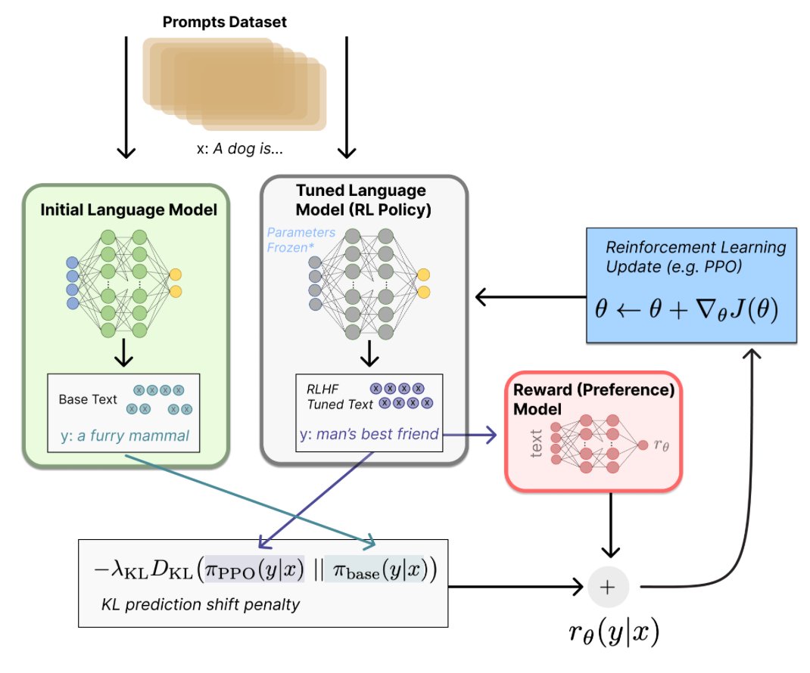
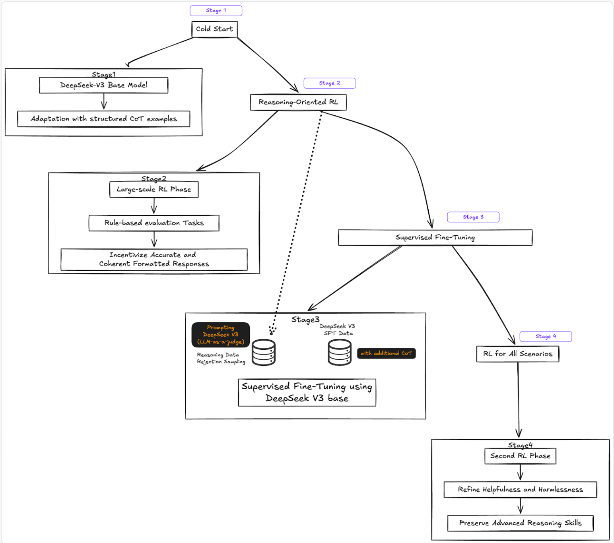
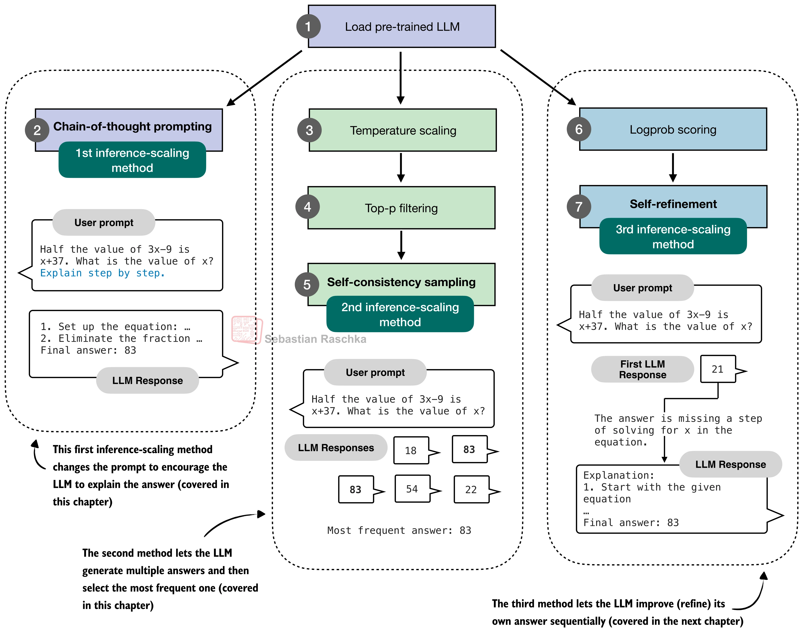

# Post-Training

- Post-Training  is a set of processes and techniques that refine and optimize a machine learning model after it's been trained.

## Model Optimization

- See [Computational Performance](../performance/basics.md)

## Guidance

- Take an existing model and steer the generation process at inference time for additional control.
  - It's important to remember that we're _not_ changing the model internals. 
    - For example, the model already has the ability to generate the conditioned outputs, we're instead restricting the inputs to guide this generation process. 
- See more specific examples in [Diffusion](../../fundamentals/dl/10_diffusion/notes.md) and [NLP](../../fundamentals/dl/17_nlp/post_training.md). 

## Fine-Tuning

- Re-train existing models on new data to change the type of output they produce.
- This usually involves one of the following options:
  - Adding/Replacing a few output layers
  - Freezing a portion of weights (Parameter Efficient Fine-Tuning)
- Parameter Efficient Fine-Tuning (PEFT)
  - LoRA
    - Suppose we only finetune our linear layers, excluding bias terms, converting weight $`W \in \mathbb{R}^{a \times b}`$ to $`W'`$
    - We can reparameterize $`W'`$ as $`W + \Delta W`$
    - LoRA is a low rank approximation of $`\Delta W = AB`$, $`A \in \mathbb{R}^{a \times r}, B \in \mathbb{R}^{r \times b}`$
    - We can then freeze our original model, and focus on training $`A`$ and $`B`$ matrices for each of our linear layers.
    - LoRA does not increase inference latency because weights can be merged with the base model. 
- See examples in [Diffusion](../../fundamentals/dl/10_diffusion/notes.md), [NLP](../../fundamentals/dl/17_nlp/post_training.md), and [CV](../../fundamentals/dl/16_computer_vision/notes.md).

## Hallucinations

- [Does Fine-Tuning LLMs on New Knowledge Encourage Hallucinations? (arXiv 2405.05904)](https://arxiv.org/pdf/2405.05904) — what happens when SFT examples introduce knowledge the model didn't acquire in pretraining:
  - (1) LLMs learn fine-tuning examples with new knowledge _slower_ than examples consistent with the model's pre-existing knowledge
  - (2) Once the examples with new knowledge are eventually learned, they _increase the model's tendency to hallucinate_
  - Implication: SFT is better at eliciting knowledge/behavior the model already has than at injecting new facts — and since new-knowledge examples are learned late, early stopping mitigates the hallucination cost

## Distillation

- For smaller models, DeepSeek R1's paper indicated that distillation was more effective than RL.
  - To me, this feels like the important piece of the puzzle is _high quality data_.

## Reinforcement Learning with Human Feedback (RLHF)

- In pretraining process, it is hard to incorporate additional (human) preferences
- 4 steps
  - Pretraining a language model (LM)
  - Use human responses to fine-tune LM to follow instructions
  - Gathering data and training a reward model
    - Gather data
      - Prompt LMs with prompts $`x`$
      - Gather responses $`y`$
      - Get human rankings
    - Train a reward model
      - Loss is based on $`P(y_1 > y_2 \mid x) = \sigma(r(x,y_1) - r(x, y_2))`$
      - Can be any model
      - Why do we need this? Ideally in the next step, we can ask a human to generate a reward/rank for any $`y \mid x`$, but that's prohibitively expensive.
  - Fine-tuning the LM with reinforcement learning
    - [Source](https://huggingface.co/blog/rlhf)
    - Some parameters of the LM are frozen because fine-tuning an entire 10B or 100B+ parameter model is prohibitively expensive
    - State: $`x`$
    - Action: $`y`$
    - Policy: $`\pi_{PPO}(y \mid x)`$
    - Why is this RL? 
      - If we have a dataset of $`(y,x)`$ pairs, this can be couched as supervised learning.
      - The key here is that the model itself generates $`y \mid x`$. 
        - We then also need the KL divergence term to prevent the model from just generating gibberish that just tricks the imperfect reward model. 
    - Why is this not RL?
        - See "Reward Modeling" below. 

## Direct Preference Optimization (DPO)

- Similar to RLHF, but we skip generation of the reward model
  - [Source](https://github.com/rasbt/LLMs-from-scratch/blob/main/ch07/04_preference-tuning-with-dpo/dpo-from-scratch.ipynb)
- Loss is based on $P(y_1 > y_2 \mid x) = \sigma(\beta(\log\frac{\pi_{PPO}(y_1\mid x)}{\pi_{base}(y_1\mid x)} - \log\frac{\pi_{PPO}(y_2\mid x)}{\pi_{base}(y_2\mid x)}))$
  - $\beta$ is the KL-penalty coefficient inherited from the RLHF objective. Higher $\beta$ tethers the policy more strongly to the reference, so it moves *less* in response to rankings; lower $\beta$ lets preferences dominate (the overfitting direction).
  - Subbing this in, new loss function is then no longer dependent on $r:$ 
    - $`\mathcal{L}_{\mathrm{DPO}}\left(\pi_{PPO} ; \pi_{base}\right)=-\mathbb{E}_{\left(x, y_1, y_2\right) \sim \mathcal{D}}\left[\log \sigma\left(\beta \log \frac{\pi_{PPO}\left(y_1 \mid x\right)}{\pi_{base}\left(y_1 \mid x\right)}-\beta \log \frac{\pi_{PPO}\left(y_2 \mid x\right)}{\pi_{base}\left(y_2 \mid x\right)}\right)\right]`$
- The simplicity of not needing to model a reward model comes at the cost of DPO being more prone to overfitting to preferences and ending up generating nonsense.
  - While the loss above does have some flavor of minimizing the divergence between $`\pi_{PPO}`$ and $`\pi_{base}`$, we find that this KL-regularization is actually insignificant when preferences are very strong, which is exacerbated by our finite data regime (Section 4.2 of [$`\Psi`$PO paper](https://arxiv.org/pdf/2310.12036))
    - The paper argues that the reward model is useful as a regularizer because it underfits preferences, preventing this problem. 

## GRPO

- Moved to [RL / GRPO](../rl/grpo.md), which covers the objective, its relationship to PPO-based RLHF, and variants (DAPO, Dr. GRPO, TIS, DeepSeek V3.2).

## RLCAI

- Uses AI self-revision for SFT (rather than human-labelled answers)
- Uses AI to rank different outputs (RLAIF)

## SFT Data Generation

- RLHF uses human labelers to generate outputs to prompts, used for SFT.
- [RLCAI](../../fundamentals/dl/23_safety/03_alignment.md) uses AI to refine outputs, used for SFT. 
- DeepSeek R1 uses AI too, in a more complicated fashion. 
  - [Source](https://fireworks.ai/blog/deepseek-r1-deepdive)
- Skipping SFT/critique
  - When the objective of SFT is the same as reward modeling, as in RLCAI, some research may skip this step, i.e. create pairs from the helpful-only model and rank.
  - For reasoning tasks, one might think that we need data for SFT. Deepseek-R1 Zero showed that it was possible to train a base model to have reasoning capabilities just with RL (providing a reward for getting the answer and formatting right, rather than predicting next token).

## Reward Modeling

- RLHF uses human labels to generate preferences and model rewards.
- [RLAIF](../../fundamentals/dl/23_safety/03_alignment.md) uses AI to generate preferences and model rewards.
- [GenRM](https://arxiv.org/pdf/2410.12832) uses human labels with AI CoT reasoning to address short-comings
  - RLHF doesn't generalize to out of distribution data well
  - RLAIF may not capture human preferences accurately
- DeepSeek R1 uses:
  - Rule-based rewards (accuracy and formatting) for reasoning data.
  - Something else for general data (need to check DeepSeek V3's pipeline)
- Human ranking provides a poor proxy of the true objective function ([Karpathy](https://x.com/karpathy/status/1821277264996352246?lang=en)). I assume he would have similar thoughts regarding rule-based reward modeling.
- When the objective of SFT is the same as reward modeling, as in RLCAI, [DPF](https://arxiv.org/pdf/2402.07896) skips reward modeling and uses start and end points of SFT.

## Reward Hacking

- The policy exploits the reward signal instead of improving the capability it proxies. In agentic RL this extends to _environment-level_ exploits: hardcoding expected test outputs, tool-call hacking (satisfying procedural checks without using tool outputs), sandbox edge cases.
- [GLM-5](https://arxiv.org/pdf/2602.15763) mitigates with a **hybrid reward system** — three signal types with complementary failure modes:
  - Rule-based rewards: precise and interpretable, but limited to aspects expressible as deterministic rules
  - Outcome reward models (ORMs): low-variance, training-efficient, but most susceptible to hacking ("the policy exploits superficial patterns rather than genuinely improving core capability")
  - Generative reward models (GRMs): an LM produces scalar/structured evaluations — more robust to exploitation, but higher variance
  - Blending the three balances precision, efficiency, and robustness
- Agentic GRM ([Kimi K3, arXiv 2607.24653](https://arxiv.org/abs/2607.24653)): for non-verifiable general tasks, the judge is itself an agent (can inspect/interact with the product rather than judge text alone), running tournament-style binary comparisons (as in K2.5) under a mandatory protocol: read the outcome/product → generate a rubric → score each candidate against it → record scores in a scorepad
  - Verbosity is the classic GRM exploit (judges drift toward longer outputs), so K3 adds budget-based verbosity control: exceed $`\sigma \cdot \ell_0`$ (a cold-start-estimated verbosity budget × multiplier) and the candidate automatically loses the comparison
- Meta-verifiers ([DeepSeekMath-V2](https://arxiv.org/abs/2511.22570)): when the verifier is itself trained (GRPO), it can be hacked too — it can earn full reward predicting correct scores while hallucinating non-existent issues
  - The meta-verifier scores the verifier's _critiques_ (are the flagged issues real and well-justified?), rewarding faithful self-critique; the verifier is then retrained on meta-verifier-approved signal
  - Verification compute can be scaled at inference to auto-label hard proofs → more verifier training data
  - Details in [LLM Evals](../evals/llm_evals.md)

## Inference-time scaling 

Motivation: a transformer's depth per forward pass is fixed, so a single pass caps how many sequential steps a computation can take (formally, fixed-depth transformers are constant-depth circuits — [Merrill & Sabharwal, arXiv 2207.00729](https://arxiv.org/abs/2207.00729)) — generating more tokens extends the serial computation graph, since each thinking token is another forward pass whose intermediate result gets cached and becomes attendable. CoT provably lifts this cap: [Li et al., "CoT Empowers Transformers to Solve Inherently Serial Problems" (arXiv 2402.12875)](https://arxiv.org/abs/2402.12875), [Merrill & Sabharwal (arXiv 2310.07923)](https://arxiv.org/abs/2310.07923). Looped/latent-reasoning architectures buy the same serial depth through weight reuse instead of token generation — see [LLM Architectures](../architecture/llm_architectures.md).

3 methods. Source: [Raschka — The State of LLM Reasoning Model Inference-Time Scaling](https://magazine.sebastianraschka.com/p/state-of-llm-reasoning-and-inference-scaling)

- Explain step by step (chain-of-thought prompting)
- Majority voting (self-consistency)
- Verification and sequential revision
  - In the revision setup, a logprob scorer can be used just to determine whether the revised answer is better
- [Source](https://github.com/rasbt/reasoning-from-scratch/blob/main/ch04/01_main-chapter-code/ch04_main.ipynb)

- The same survey (14 post-R1 papers) splits methods along a **sequential vs parallel** axis:
  - Sequential — one completion, made longer/better: CoT, "wait" tokens (s1), thought-switching penalty (discourage premature path changes), self-backtracking, latent reasoning (recurrent hidden iterations instead of visible tokens)
  - Parallel — many completions, aggregated: majority voting, beam-search variants, test-time preference optimization (reward model critiques/compares responses)
- Takeaways: no single technique wins across tasks; a small model + heavy inference scaling can match a bigger model (whether that's cheaper depends on query volume); provider "thinking on demand" toggles are likely dialed-back inference scaling, not different models

## Controlling reasoning effort

Source: [Raschka — Controlling Reasoning Effort in LLMs](https://magazine.sebastianraschka.com/p/controlling-reasoning-effort-in-llms)

- Three levels of control:
  - Prompt-level: effort labels in the system prompt ("Reasoning effort: low/medium/high") — gpt-oss, GPT-5.x
  - Train-time: SFT on effort-conditioned examples; RL with per-effort length penalties; multi-teacher distillation of effort specialists
  - Inference-time: hard/soft token budgets on the reasoning trace; empty `<think></think>` to toggle thinking off
- Named recipes:
  - DeepSeek V4: train separate effort specialists (non-think / think-high / think-max, each with its own context window and length penalty), then distill into one model
  - Nemotron 3 Ultra: learned modes + inference-time hard budgets — trains on randomly truncated traces so truncation is in-distribution
  - Kimi K2.5: alternate budgeted and unconstrained RL phases (~25–30% token reduction)
  - Qwen3: "Thinking Mode Fusion" — an SFT stage mixing thinking and non-thinking examples
  - Inkling: continuous effort conditioning (0.0–1.0) adjusting token penalties during RL
- Trade-off: effort ≈ tokens ≈ cost, with diminishing returns at the top settings; small-model-high-effort can match big-model-low-effort. Automatic effort selection is the open problem — manual control via system prompt remains standard  