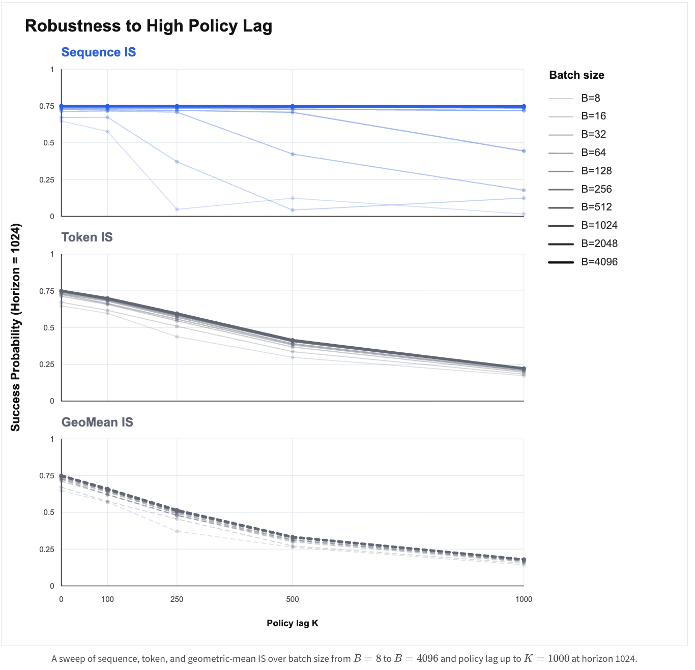
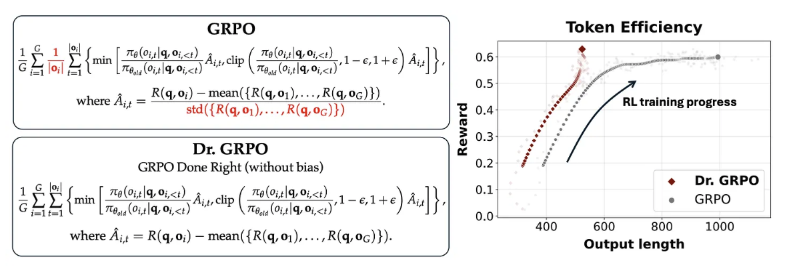

# RL for LLMs: Policy Gradients, PPO, GRPO and Friends

The main RL document. Primary source is Cameron Wolfe's [Reinforcement Learning for LLMs](https://cameronrwolfe.substack.com/p/llm-rl), with derivations filled in from [Spinning Up](https://spinningup.openai.com/en/latest/spinningup/rl_intro3.html) and the [TRPO paper](https://arxiv.org/pdf/1502.05477). The off-policy / async sections draw on [Is Frontier Asynchronous RL Solved?](https://luk-huang.github.io/personal-website/blog/is-frontier-asynchronous-rl-solved.html) and [Staleness in Fully Async RL](https://www.appliedcompute.com/research/staleness-in-fully-async-rl).

Related notes: classic RL (MDPs, value functions, TD vs MC, DQN) lives in [RL fundamentals](../../fundamentals/dl/18_rl/notes.md). KL estimators and the KL-as-reward vs KL-as-loss story live in [KL Divergence](kl_divergence.md). The engineering details of the PPO-based RLHF pipeline are in [RLHF with PPO](rlhf_ppo.md).

## Setup

- **The loop.** An agent with policy $`\pi_\theta`$ sees state $`s_t`$, samples action $`a_t \sim \pi_\theta(\cdot \mid s_t)`$, the environment transitions via $`P(s_{t+1} \mid s_t, a_t)`$ and emits reward $`r_t`$. A trajectory $`\tau = (s_0, a_0, r_0, \dots, s_T)`$ has probability <div align="center">
  $`\displaystyle p_\theta(\tau) = d_0(s_0) \prod_{t=0}^{T-1} \pi_\theta(a_t \mid s_t)\, P(s_{t+1} \mid s_t, a_t)`$ </div>
- **Return.** $`R(\tau) = \sum_{t=0}^{T} r_t`$, or discounted reward-to-go $`G_t = \sum_{t' \ge t} \gamma^{t'-t} r_{t'}`$. The objective is $`J(\theta) = \mathbb{E}_{\tau \sim \pi_\theta}[R(\tau)]`$, estimated by Monte Carlo over sampled trajectories.
- **Value functions.**
  - $`V^\pi(s) = \mathbb{E}[G_t \mid s_t = s]`$: expected return from $`s`$ following $`\pi`$
  - $`Q^\pi(s, a) = \mathbb{E}[G_t \mid s_t = s, a_t = a]`$: same, but forcing the first action
  - $`A^\pi(s, a) = Q^\pi(s, a) - V^\pi(s)`$: how much better than average this action is. **Every algorithm below is "increase log-prob of actions with positive advantage, decrease it for negative", and they differ in how they estimate $`A`$ and how far they let a single batch move the policy.**
  - Observed $`G_t`$ is a Monte Carlo estimate of $`Q(s_t, a_t)`$; a learned critic $`V_\phi(s_t)`$ gives $`A \approx G_t - V_\phi(s_t)`$.
- **Mapping to LLMs.** Policy = the LLM. Initial state = prompt $`x`$. State $`s_t`$ = prompt + tokens generated so far. Transition is deterministic (concatenate the token), so $`P`$ contributes nothing to the gradient. Two formulations:
  - **MDP (token-level):** each token is an action, $`p_\theta(\tau \mid x) = \prod_t \pi_\theta(y_t \mid x, y_{<t})`$. Supports per-token (process) rewards.
  - **Bandit (completion-level):** the whole completion $`y`$ is one action with $`\log \pi_\theta(y \mid x) = \sum_t \log \pi_\theta(y_t \mid x, y_{<t})`$. Natural when the reward arrives only at the end. It helps that the log-prob of the sequence is just the sum of token log-probs.
- **Rewards.**
  - *Outcome* rewards: one scalar per completion (sparse, harder credit assignment). *Process* rewards: per step (denser, need a PRM).
  - *RLHF*: preference data $`\to`$ reward model (LLM + regression head), then RL against it. *RLVR*: deterministic verifiers (string match, unit tests). 
  - Reward is usually regularized toward a frozen reference $`\pi_{\mathrm{ref}}`$ via a KL penalty, either folded into the reward or added to the loss. See [KL Divergence](kl_divergence.md); the choice and implementation details are non-trivial
- **On- vs off-policy.** On-policy: the samples come from the policy being differentiated, no correction needed (REINFORCE). Off-policy: samples from some other $`\mu`$ (a stale snapshot, a different inference engine, or the policy from a few gradient steps ago). Correct with importance sampling: <div align="center">
  $`\displaystyle \mathbb{E}_{x \sim f}[h(x)] = \mathbb{E}_{x \sim g}\!\left[h(x)\frac{f(x)}{g(x)}\right], \qquad r_t(\theta) = \frac{\pi_\theta(a_t \mid s_t)}{\pi_{\theta_{\mathrm{old}}}(a_t \mid s_t)}`$ </div>
  Large ratios blow up variance, so in practice the ratio is clipped/truncated/masked, trading bias for variance. 
- **The shape of every policy gradient.** <div align="center">
  $`\displaystyle \nabla_\theta J(\theta) \propto \mathbb{E}\!\left[\sum_{t=0}^{T} \nabla_\theta \log \pi_\theta(a_t \mid s_t)\, \Psi_t\right]`$ </div>
  $`\Psi_t > 0`$ raises the action's probability, $`\Psi_t < 0`$ lowers it, $`\Psi_t \approx 0`$ does nothing. As a PyTorch loss: $`\mathcal{L} = -\sum_t \log \pi_\theta(a_t \mid s_t) \cdot \mathrm{sg}[\Psi_t]`$ with $`\Psi_t`$ detached. Valid choices of $`\Psi_t`$ (same expectation, different variance): $`R(\tau)`$, reward-to-go $`G_t`$, $`G_t - b(s_t)`$, $`Q(s_t, a_t)`$, $`A(s_t, a_t)`$.

## Policy Gradients

### Vanilla Policy Gradient (VPG)

- **Derivation.** Use the log-derivative trick $`\nabla_\theta p_\theta = p_\theta \nabla_\theta \log p_\theta`$ to move the gradient inside the expectation: <div align="center">
  $`\displaystyle \begin{aligned} \nabla_\theta J(\theta) &= \nabla_\theta \int p_\theta(\tau) R(\tau)\, d\tau = \int \nabla_\theta p_\theta(\tau) R(\tau)\, d\tau \\ &= \int p_\theta(\tau) \nabla_\theta \log p_\theta(\tau) R(\tau)\, d\tau = \mathbb{E}_{\tau \sim \pi_\theta}\!\left[\nabla_\theta \log p_\theta(\tau)\, R(\tau)\right] \end{aligned}`$ </div>
  Expand the trajectory log-prob; only the policy terms depend on $`\theta`$: <div align="center">
  $`\displaystyle \log p_\theta(\tau) = \log d_0(s_0) + \sum_{t=0}^{T-1}\left[\log \pi_\theta(a_t \mid s_t) + \log P(s_{t+1} \mid s_t, a_t)\right] \;\Rightarrow\; \nabla_\theta \log p_\theta(\tau) = \sum_{t=0}^{T-1} \nabla_\theta \log \pi_\theta(a_t \mid s_t)`$ </div>
  So <div align="center">
  $`\displaystyle \nabla_\theta J(\theta) = \mathbb{E}_{\tau \sim \pi_\theta}\!\left[\sum_{t=0}^{T-1} \nabla_\theta \log \pi_\theta(a_t \mid s_t)\, R(\tau)\right]`$ </div>
- **EGLP lemma (expected grad-log-prob).** For any parameterized distribution, $`\mathbb{E}_{x \sim P_\theta}[\nabla_\theta \log P_\theta(x)] = 0`$. Proof ([Spinning Up](https://spinningup.openai.com/en/latest/spinningup/rl_intro3.html#expected-grad-log-prob-lemma)): differentiate the normalization constraint. <div align="center">
  $`\displaystyle 1 = \int P_\theta(x)\, dx \;\Rightarrow\; 0 = \nabla_\theta \int P_\theta(x)\, dx = \int \nabla_\theta P_\theta(x)\, dx = \int P_\theta(x) \nabla_\theta \log P_\theta(x)\, dx = \mathbb{E}_{x \sim P_\theta}[\nabla_\theta \log P_\theta(x)]`$ </div>
  **The score function has zero mean.** This makes intuitive sense. $\nabla_\theta \log P_\theta(x)$ measures how much $P_\theta(x)$ changes as $\theta$ changes. Since probability mass sums to 1 (fixed), this averages to 0 over the distribution as we vary $x$. 
  
  Two important consequences:
  - *Baselines are free.* For any $`b(s_t)`$ that doesn't depend on $`a_t`$, $`\mathbb{E}_{a_t \sim \pi_\theta}[\nabla_\theta \log \pi_\theta(a_t \mid s_t)\, b(s_t)] = b(s_t) \cdot 0 = 0`$. Subtracting a baseline leaves the expectation unchanged and (if $`b \approx V`$) reduces variance.
  - *Past rewards don't matter* ([proof](https://spinningup.openai.com/en/latest/spinningup/extra_pg_proof1.html)). For $`t' < t`$, $`r_{t'}`$ is fixed once $`s_t`$ is known, so it acts as a baseline for the score at step $`t`$ and integrates to zero. Hence we can replace $`R(\tau)`$ with the reward-to-go $`G_t = \sum_{t' \ge t} r_{t'}`$, which removes noise from rewards that $`a_t`$ couldn't have caused.
- **Why VPG is sample-inefficient.** The expectation is over $`\tau \sim \pi_\theta`$. After one gradient step, the rollouts are from $`\pi_{\theta_{\mathrm{old}}}`$, not $`\pi_\theta`$: recomputing log-probs under the new $`\theta`$ and stepping again is *not* a gradient of $`J(\theta)`$ (neither the states nor the actions were sampled from the right distribution). So we get one step per rollout, and we don't know how big that step can safely be. TRPO fixes both.

### REINFORCE

- **Definition.** REINFORCE is the Monte Carlo implementation of VPG: replace the expectation with a batch average over $`N`$ sampled trajectories, with a baseline. <div align="center">
  $`\displaystyle \widehat{\nabla_\theta J} = \frac{1}{N}\sum_{i=1}^{N} \sum_{t=0}^{T-1} \nabla_\theta \log \pi_\theta(a_t^{(i)} \mid s_t^{(i)})\, \big(G_t^{(i)} - b(s_t^{(i)})\big)`$ </div>
- **LLM version (bandit).** For prompt $`x`$ and completion $`y`$: <div align="center">
  $`\displaystyle \mathcal{L}_{\mathrm{REINFORCE}} = -\log \pi_\theta(y \mid x)\,\big(\hat R - b\big), \qquad \hat R = r(x, y) - \beta \sum_t \mathrm{sg}\!\left[\log \pi_\theta(y_t \mid s_t) - \log \pi_{\mathrm{ref}}(y_t \mid s_t)\right]`$ </div>
  with $`b`$ the batch (or group) mean of $`\hat R`$. 
- Here we add a KL term, which we choose to be $`k_1`$ estimator summed over the response, and it is **detached**: it enters as a reward, i.e. a constant coefficient on the score function. [KL Divergence](kl_divergence.md) shows this is exactly the gradient of the reverse KL $`D_{KL}(\pi_\theta \,\|\, \pi_{\mathrm{ref}})`$, so "k1 in reward" is the principled choice.
- **Token-level variant.** Give each token its reward-to-go $`G_t`$ (outcome reward at the last token, process rewards where they land) and mask prompt/padding tokens. With a single outcome reward and $`\gamma = 1`$ every token gets the same $`\Psi`$, which is the bandit form again.

### RLOO (REINFORCE leave-one-out)

- Sample $`K`$ completions per prompt and use the *other* $`K-1`$ as the baseline for each one: <div align="center">
  $`\displaystyle A(x, y_i) = R(x, y_i) - \frac{1}{K-1}\sum_{j \ne i} R(x, y_j) = \frac{K}{K-1}\left(R(x, y_i) - \frac{1}{K}\sum_{j=1}^{K} R(x, y_j)\right)`$ </div>
- The baseline excludes $`y_i`$, so it is action-independent and unbiased by EGLP. The second form says **subtracting the plain group mean (which includes $`R_i`$) is the same direction scaled by $`(K-1)/K`$**, so GRPO's mean-centering has identical dynamics to RLOO up to a learning-rate constant. See more in [Dr. GRPO](#dr-grpo).

### TRPO

The point of TRPO: in the on-policy setting we know the gradient *direction* but not the *step size*, and too large a step can make the true objective worse. TRPO tells us how far to step, and as a bonus lets us take several steps on the same rollout.

- **Step 1: express the new policy's return via advantages of the old one** (TRPO eqns 1–2, from Kakade & Langford). For any two policies, <div align="center">
  $`\displaystyle \eta(\tilde\pi) = \eta(\pi) + \mathbb{E}_{\tau \sim \tilde\pi}\!\left[\sum_{t=0}^{\infty} \gamma^t A^\pi(s_t, a_t)\right] = \eta(\pi) + \sum_s \rho_{\tilde\pi}(s) \sum_a \tilde\pi(a \mid s) A^\pi(s, a)`$ </div>
  where $`\rho_\pi(s) = \sum_t \gamma^t P(s_t = s \mid \pi)`$ is the discounted state visitation. Proof: $`A^\pi(s_t, a_t) = \mathbb{E}[r_t + \gamma V^\pi(s_{t+1}) - V^\pi(s_t)]`$, so the sum telescopes: <div align="center">
  $`\displaystyle \mathbb{E}_{\tau \sim \tilde\pi}\!\left[\sum_t \gamma^t \big(r_t + \gamma V^\pi(s_{t+1}) - V^\pi(s_t)\big)\right] = \mathbb{E}_{\tau \sim \tilde\pi}\!\left[-V^\pi(s_0) + \sum_t \gamma^t r_t\right] = -\eta(\pi) + \eta(\tilde\pi)`$ </div>
  This is exact, but the states are drawn from the *new* policy, which we haven't sampled from.
- **Step 2: swap the states to the old policy.** Define the local approximation (eqn 3) <div align="center">
  $`\displaystyle L_\pi(\tilde\pi) = \eta(\pi) + \sum_s \rho_{\pi}(s) \sum_a \tilde\pi(a \mid s) A^\pi(s, a)`$ </div>
  We can't really do this. What saves us (eqn 4) is that $`L`$ matches $`\eta`$ to first order at the old parameters: $`L_{\theta_{\mathrm{old}}}(\theta_{\mathrm{old}}) = \eta(\theta_{\mathrm{old}})`$ and $`\nabla_\theta L_{\theta_{\mathrm{old}}}|_{\theta_{\mathrm{old}}} = \nabla_\theta \eta|_{\theta_{\mathrm{old}}}`$. The gradient claim is just the policy gradient theorem: $`\nabla_\theta \eta = \sum_s \rho_\pi(s) \sum_a \nabla_\theta \pi_\theta(a \mid s)\, Q^\pi(s, a)`$, and swapping $`Q`$ for $`A`$ is free by EGLP. So a *tiny* step on $`L`$ improves $`\eta`$, but the moment we move, value and gradient stop matching and past some step size we have no guarantee the true return goes up. **Hence the state-swap is only acceptable inside a "trust region".**
- **Step 3: swap the actions to the old policy.** Importance sampling turns the sum over actions into an expectation over old-policy samples: <div align="center">
  $`\displaystyle \sum_a \tilde\pi(a \mid s) A^\pi(s, a) = \mathbb{E}_{a \sim \pi}\!\left[\frac{\tilde\pi(a \mid s)}{\pi(a \mid s)} A^\pi(s, a)\right] \;\Rightarrow\; L_{\theta_{\mathrm{old}}}(\theta) = \mathbb{E}_{s \sim \rho_{\mathrm{old}},\, a \sim \pi_{\mathrm{old}}}\!\left[\frac{\pi_\theta(a \mid s)}{\pi_{\theta_{\mathrm{old}}}(a \mid s)} A^{\pi_{\mathrm{old}}}(s, a)\right]`$ </div>
  This is the **surrogate objective** (which notably has a denominator and no $\log$ term in the REINFORCE loss). Unlike step 2 it is exact (no approximation), and at $`\theta = \theta_{\mathrm{old}}`$ it has the same value and gradient as the expected advantage. Taking its gradient: <div align="center">
  $`\displaystyle \nabla_\theta L = \mathbb{E}\!\left[\sum_t \frac{A_t}{\pi_{\mathrm{old}}(a_t \mid s_t)} \nabla_\theta \pi_\theta(a_t \mid s_t)\right] = \mathbb{E}\!\left[\sum_t \underbrace{\frac{\pi_\theta(a_t \mid s_t)}{\pi_{\mathrm{old}}(a_t \mid s_t)}}_{\text{importance ratio}} A_t \underbrace{\nabla_\theta \log \pi_\theta(a_t \mid s_t)}_{\text{policy gradient}}\right]`$ </div>
  At $`\theta = \theta_{\mathrm{old}}`$ the ratio is 1 and this is VPG. Away from it, the ratio reweights the stale samples, which is exactly what lets us **take multiple gradient steps on one rollout**. Note that, however, we still haven't answered how large we can step, or accounted for the damaging state density swap. 
- **Step 4: the trust region.** The theory (eqns 8–9) bounds the damage from the state-swap: <div align="center">
  $`\displaystyle \eta(\tilde\pi) \ge L_\pi(\tilde\pi) - C\, D_{KL}^{\max}(\pi, \tilde\pi), \qquad C = \frac{4\epsilon\gamma}{(1-\gamma)^2},\quad \epsilon = \max_{s,a}|A^\pi(s,a)|`$ </div>
  Maximizing the right-hand side each iteration guarantees monotonic improvement (it's an MM algorithm). But the penalty $`C`$ is enormous, giving tiny steps, so TRPO swaps the penalty for a hard constraint (eqn 11): maximize $`L`$ subject to $`D_{KL}^{\max}(\theta_{\mathrm{old}}, \theta) \le \delta`$. And $`D_{KL}^{\max}`$ (a max over *every* state) is both impractical to estimate and needlessly conservative, so we hand-wave to the **mean KL** (eqn 12): <div align="center">
  $`\displaystyle \max_\theta\; \mathbb{E}_{\tau \sim \pi_{\mathrm{old}}}\!\left[\sum_t \frac{\pi_\theta(a_t \mid s_t)}{\pi_{\theta_{\mathrm{old}}}(a_t \mid s_t)} A(s_t, a_t)\right] \quad \text{s.t.} \quad \mathbb{E}_{s \sim \rho_{\mathrm{old}}}\!\left[D_{KL}\big(\pi_{\theta_{\mathrm{old}}}(\cdot \mid s)\,\|\,\pi_\theta(\cdot \mid s)\big)\right] \le \delta`$ </div>
  Note the direction: $`D_{KL}(\pi_{\mathrm{old}} \| \pi_\theta)`$, expectation over the *old* policy's actions, because those are the samples we have. See [KL Divergence](kl_divergence.md) for why direction matters.
- **Another view: what penalty, in what geometry?** Both VPG and TRPO maximize the linearized surrogate $`g^\top(\theta - \theta_k)`$ with $`g = \nabla_\theta L|_{\theta_k}`$, and differ only in the penalty:
  - *Euclidean penalty in parameter space*: $`\max_\theta g^\top\Delta - \frac{1}{2\alpha}\|\Delta\|^2 \Rightarrow \Delta = \alpha g`$. This is plain SGD, i.e. VPG.
  - *KL penalty in distribution space*: $`\max_\theta g^\top\Delta`$ s.t. $`\bar D_{KL}(\theta_k \| \theta) \le \delta`$. Second-order Taylor of the KL around $`\theta_k`$ gives $`\bar D_{KL} \approx \frac12 \Delta^\top H \Delta`$ where $`H`$ is the Hessian of the mean KL, which equals the **Fisher information matrix**: <div align="center">
    $`\displaystyle F_k = \mathbb{E}_{s \sim \rho_{\pi_k},\, a \sim \pi_k}\!\left[\nabla_\theta \log \pi_k(a \mid s)\, \nabla_\theta \log \pi_k(a \mid s)^\top\right], \qquad \Delta\theta^\top F_k \Delta\theta \le 2\delta`$ </div>
    
  - Solve the quadratic program with a Lagrangian: $`\max_\Delta g^\top\Delta - \frac{\lambda}{2}\Delta^\top H \Delta \Rightarrow \Delta = \frac1\lambda H^{-1} g`$; plugging into the constraint $`\frac12 \Delta^\top H \Delta = \delta`$ gives $`\frac1\lambda = \sqrt{2\delta / (g^\top H^{-1} g)}`$, so <div align="center">
    $`\displaystyle \theta_{k+1} = \theta_k + \sqrt{\frac{2\delta}{g^\top H^{-1} g}}\; H^{-1} g`$ </div>
    This is the **natural policy gradient**. VPG regularizes in Euclidean parameter space, but *a change in this space does not map uniformly to a change in action space.* Conversely, Fisher is the "natural" metric because it measures distance in the geometry of the action probability distribution, not of the weights.
  - Even this is hard: $`H^{-1}g`$ is solved with conjugate gradient using Hessian-vector products $`Hx = \nabla_\theta\big((\nabla_\theta \bar D_{KL})^\top x\big)`$ (never form $`H`$), and because the Taylor expansions are approximate, a backtracking line search shrinks the step until the KL constraint holds and the surrogate actually improves ([Spinning Up TRPO](https://spinningup.openai.com/en/latest/algorithms/trpo.html)).
- **Summary of the hand-waves**, in order: penalty $`\to`$ constraint; $`D_{KL}^{\max} \to`$ mean KL; exact constraint $`\to`$ second-order Taylor; natural gradient $`\to`$ conjugate gradient + line search. So since we've already hand-waved this much, why not more?

### PPO

- **Motivation.** TRPO's optimization is annoying (second-order approximations, conjugate gradient, a line search every step). PPO keeps two important ideas:
  - The surrogate objective (so we can take multiple updates per rollout) and
  - "Don't move too far from $`\pi_{\mathrm{old}}`$", and enforces the second with clipping instead of a KL constraint.
- **Objective.** With policy ratio $`r_t(\theta) = \pi_\theta(a_t \mid s_t) / \pi_{\theta_{\mathrm{old}}}(a_t \mid s_t)`$ (the ratio to the policy *before* any updates on this batch): <div align="center">
  $`\displaystyle \max_\theta\; \mathbb{E}_{\tau \sim \pi_{\mathrm{old}}}\!\left[\sum_{t=0}^{T} \min\Big(r_t(\theta) A_t,\; \mathrm{clip}\big(r_t(\theta), 1-\epsilon, 1+\epsilon\big) A_t\Big)\right], \qquad \epsilon \approx 0.2`$ </div>
- **The four cases.** 

  | | $`A_t > 0`$ (reinforce) | $`A_t < 0`$ (suppress) |
  |---|---|---|
  | ratio inside $`[1-\epsilon, 1+\epsilon]`$ | normal PG step up | normal PG step down |
  | $`r_t > 1 + \epsilon`$ | **clipped**: already more likely than before, gradient is 0 | unclipped term is smaller, so it's used: still pushed down |
  | $`r_t < 1 - \epsilon`$ | unclipped term is smaller, so it's used: still pushed up | **clipped**: already less likely, gradient is 0 |

  - Clipping only ever removes the *incentive to keep going* in the direction the advantage already moved you. Moving the wrong way is never clipped, so the objective always pulls the ratio back toward the interval.
  - It is *not* a hard constraint: nothing stops $`r_t`$ from leaving the interval, the gradient just vanishes once it has. **A clipped token contributes nothing to the update.** This matters later (CISPO).
  - The upper bound is only active for positive advantages and the lower bound only for negative ones: the clipping is directional. That asymmetry is what DAPO's clip-higher and TIS's one-sided cap play with.
- **LLM implementation details** (the ones that interact with the rest of these notes; see [RLHF with PPO](rlhf_ppo.md) for the full list):
  - The reference-KL penalty goes into the **reward** using $`k_1`$, computed once from the old log-probs and held fixed (detached) across the epochs on this batch. So PPO has *two different KLs*: old $`\to`$ new (the trust region, enforced by clipping) and new $`\to`$ reference (regularizer, in the reward).
  - Ratios are computed in log space, $`r_t = \exp(\log \pi_\theta - \log \pi_{\mathrm{old}})`$, for numerical stability.
  - Advantages come from a critic via GAE, whitened; several epochs of minibatch updates per rollout batch (typically 2–4).

### GAE (Generalized Advantage Estimation)

- **TD residual.** With a critic $`V(s_t)`$ predicting the expected return from each prefix: <div align="center">
  $`\displaystyle \delta_t^V = r_t + \gamma V(s_{t+1}) - V(s_t)`$ </div>
  If $`V = V^\pi`$ exactly then $`\mathbb{E}[\delta_t] = A(s_t, a_t)`$, so $`\delta_t`$ is a 1-step advantage estimate: low variance (only one sampled reward), biased by however wrong $`V`$ is.
- **$`k`$-step estimators** trade the critic for more sampled rewards: <div align="center">
  $`\displaystyle \hat A_t^{(k)} = \sum_{l=0}^{k-1} \gamma^l r_{t+l} + \gamma^k V(s_{t+k}) - V(s_t) = \sum_{l=0}^{k-1} \gamma^l \delta_{t+l}^V`$ </div>
  The second equality is a telescoping sum (each $`\gamma^{l+1} V(s_{t+l+1})`$ cancels against the next term's $`-\gamma^{l+1} V(s_{t+l+1})`$). Small $`k`$: low variance, high bias. $`k \to \infty`$: the Monte Carlo return minus a baseline, unbiased, high variance.
- **GAE** is the exponentially weighted average of all $`k`$-step estimators: <div align="center">
  $`\displaystyle \hat A_t^{GAE(\gamma,\lambda)} = (1-\lambda)\big(\hat A_t^{(1)} + \lambda \hat A_t^{(2)} + \lambda^2 \hat A_t^{(3)} + \dots\big) = \sum_{l=0}^{\infty} (\gamma\lambda)^l \delta_{t+l}^V`$ </div>
- **$`\lambda`$ is the bias-variance knob.** $`\lambda = 0`$ is the TD residual; $`\lambda = 1`$ is Monte Carlo minus baseline. A common setting is $`\lambda = 0.95`$ (with $`\gamma = 1`$ for LLMs, as in [RLHF with PPO](rlhf_ppo.md)). If training is unstable, *decrease* $`\lambda`$ for lower-variance (higher bias) updates.
- **The critic** is trained by regression $`(V_\phi(s_t) - G_t)^2`$ alongside the policy. For an LLM that's a second model (or value head) with its own activations, gradients, optimizer state and forward/backward compute, which is the cost GRPO removes.

## GRPO

- **Motivation.** Training a critic roughly doubles the memory footprint and compute of PPO. GRPO ([DeepSeekMath](https://arxiv.org/abs/2402.03300)) replaces the learned baseline with statistics of a *group* of samples for the same prompt.
- **Group-relative advantage.** For prompt $`x \sim \mathcal{D}`$, sample $`G`$ outputs $`\{y_1, \dots, y_G\} \sim \pi_{\theta_{\mathrm{old}}}(\cdot \mid x)`$ and score them $`\mathbf{r} = \{r_1, \dots, r_G\}`$: <div align="center">
  $`\displaystyle \hat A_{i,t} = \frac{r_i - \mathrm{mean}(\mathbf{r})}{\mathrm{std}(\mathbf{r})}`$ </div>
  The same value for every token $`t`$ of output $`i`$. **GRPO mixes the bandit and MDP views**: the reward and advantage are computed at the sequence level, then broadcast to a token-level objective.
- **Objective.** <div align="center">
  $`\displaystyle J(\theta) = \frac{1}{G}\sum_{i=1}^{G} \frac{1}{|y_i|}\sum_{t=1}^{|y_i|} \Big(\min\big(r_{i,t}(\theta)\hat A_{i,t},\; \mathrm{clip}(r_{i,t}(\theta), 1-\epsilon, 1+\epsilon)\hat A_{i,t}\big) - \beta\, \mathbb{D}_{KL}[\pi_\theta \,\|\, \pi_{\mathrm{ref}}]\Big), \qquad r_{i,t}(\theta) = \frac{\pi_\theta(y_{i,t} \mid x, y_{i,<t})}{\pi_{\mathrm{old}}(y_{i,t} \mid x, y_{i,<t})}`$ </div>
  with the KL term estimated per token by Schulman's $`k_3`$: <div align="center">
  $`\displaystyle \mathbb{D}_{KL}[\pi_\theta \,\|\, \pi_{\mathrm{ref}}] = \frac{\pi_{\mathrm{ref}}(y_{i,t} \mid \cdot)}{\pi_\theta(y_{i,t} \mid \cdot)} - \log \frac{\pi_{\mathrm{ref}}(y_{i,t} \mid \cdot)}{\pi_\theta(y_{i,t} \mid \cdot)} - 1`$ </div>
- **KL in the loss, not the reward.** This another difference with PPO. In PPO the $`k_1`$ penalty is folded into the reward, computed once with the old log-probs and detached. In GRPO the $`k_3`$ term sits in the differentiable loss, is recomputed at every update, and gradients flow through it. The authors chose $`k_3`$ because it is non-negative for every sample and lower-variance than $`k_1`$ when the two policies are close. *
- **But it turns out that $`k_3`$ as a loss is not principled**. Its gradient is a first-order approximation of the true reverse-KL gradient, biased and asymmetric in the tails; the principled choices are $`k_1`$ in the reward or $`k_2`$ as a loss. Worked out in [KL Divergence](kl_divergence.md).
  - The original objective has a second gap: the importance ratio multiplies only the advantage term, so with more than one gradient step per rollout batch the KL head is off-policy and uncorrected (moot for DeepSeekMath itself, which did a single update per batch). DeepSeek fixed both in [V3.2](https://arxiv.org/abs/2512.02556) (eq. 7) by multiplying the $`k_3`$ term by $`\pi_\theta/\pi_{\mathrm{old}}`$. That one change also repairs the gradient, because $`\nabla_\theta(\rho\,k_3) = \rho\,(-\log\delta)\,\nabla_\theta\log\pi_\theta`$: the ratio's score term contributes $`k_3`$, the direct term contributes $`1-\delta`$, and they sum to $`k_1`$ (proof in [KL Divergence](kl_divergence.md)). TRL's GRPOTrainer does this by default now (`use_bias_correction_kl`); verl's `k3+` reaches the same gradient with a straight-through $`k_2`$.
- **Where to apply the KL, sequence vs triangle.** If KL is applied as a *reward*, GRPO's bandit view would put the full-response KL at the last token, whereas the PPO-RLHF implementation adds a per-token KL that propagates backward through reward-to-go in a triangular pattern (see [RLHF with PPO](rlhf_ppo.md)). Both are valid gradients. It does seem odd to me that the current state (token) is penalized for future deviations though, although one can argue that it sets it on that path.  
- **Relation to RLOO.** Mean-centering within the group is the leave-one-out baseline up to a factor $`(G-1)/G`$, so it's unbiased in direction. Dividing by the group std does not come out of any derivation; it's a *biased* reweighting across prompts (see [Dr. GRPO](#dr-grpo)).
- **Process rewards.** Most implementations use outcome rewards, but GRPO supports process rewards with two changes: 
  - Normalize using the mean and std of *all* process rewards in the group (several per trajectory); 
  - Each token's advantage is the sum of normalized rewards of the *following* steps, i.e. a reward-to-go. Advantages then vary with position rather than being constant across the response.

## Beyond on-policy: where the importance ratio lives

### TRPO's point, restated for LLMs

Correcting the action probability with $`\pi_\theta / \mu`$ does **not** correct for the state distribution: the prefix $`y_{<t}`$ was generated by $`\mu`$, and a per-token ratio silently assumes we'd have reached that prefix under $`\pi_\theta`$ too. This is the $`\rho_{\tilde\pi} \to \rho_\pi`$ swap from TRPO step 2, and it's fine only when the policies are close. Three situations where the rollout policy $`\mu`$ differs from the learner $`\pi_\theta`$:

1. **Multiple updates per rollout batch** (PPO/GRPO epochs). This is what PPO clipping was designed for.
2. **Sampler / learner log-prob mismatch.** The inference engine (vLLM, SGLang) and the trainer (DeepSpeed, Megatron, FSDP) compute different probabilities *for the same weights*: different kernels, bf16 accumulation order, MoE routing decisions, top-p/top-k sampling masks. So even "on-policy" RL is secretly off-policy.
3. **Asynchronous RL.** Rollouts are generated from a policy several steps stale to keep the samplers busy.

### Token-level vs sequence-level importance sampling (bias-variance tradeoff)

- **The unbiased off-policy objective** uses the *sequence-level* ratio but is high variance([Luke Huang](https://luk-huang.github.io/personal-website/blog/is-frontier-asynchronous-rl-solved.html)): <div align="center">
  $`\displaystyle \mathcal{J}_{\mathrm{off\text{-}policy}}(\theta) = \mathbb{E}_{x \sim \mathcal{D},\, \tau \sim \mu(\cdot \mid x)}\!\left[\underbrace{\frac{\pi_\theta(\tau \mid x)}{\mu(\tau \mid x)}}_{w(\tau)} A(\tau, x) \log \pi_\theta(\tau \mid x)\right], \qquad w(\tau) = \prod_{i=1}^{|\tau|} \underbrace{\frac{\pi_\theta(\tau_i \mid x, \tau_{<i})}{\mu(\tau_i \mid x, \tau_{<i})}}_{\rho(\tau, i)}`$ </div>
- **Token-level IS** (PPO, GRPO) weights token $`i`$ by $`\rho(\tau, i)`$ alone. When consecutive policies are close every $`\rho \approx 1`$ and the product is well behaved. Under policy lag on long horizons the prefix mismatch compounds: **token IS misses the state-occupancy mismatch that sequence IS corrects** (biased).
- **Sequence IS** is unbiased but the product of $`|\tau|`$ ratios has high variance, so at small batch sizes token IS looks competitive.
- **Geometric-mean IS (GSPO - [Qwen](https://arxiv.org/abs/2507.18071))** is the middle option: $`w(\tau)^{1/|\tau|}`$. Empirically it tracks token IS, not sequence IS, at long horizons. It defines uses the geometric mean of token ratios and clips *sequences*: <div align="center">
  $`\displaystyle \mathcal{J}_{\mathrm{GSPO}}(\theta) = \frac1G \sum_{i=1}^{G} \min\big(s_i(\theta) A_i,\; \mathrm{clip}(s_i(\theta), 1-\epsilon, 1+\epsilon) A_i\big), \qquad s_i(\theta) = \exp\!\Big(\frac{1}{|y_i|}\sum_{t=1}^{|y_i|} \log \frac{\pi_\theta(y_{i,t} \mid x, y_{i,<t})}{\pi_{\mathrm{old}}(y_{i,t} \mid x, y_{i,<t})}\Big) = \left(\frac{\pi_\theta(y_i \mid x)}{\pi_{\mathrm{old}}(y_i \mid x)}\right)^{1/|y_i|}`$ </div>
- **Experiments** (Luke Huang, a controlled bandit-chain setup with horizon $`H`$, batch $`B`$, policy lag $`K`$):
  - *Horizon sweep.* As $`H`$ grows to 1024, token IS and GeoMean IS fall sharply; sequence IS degrades gracefully. GeoMean sits closer to token IS/
  - *Batch-size sweep at fixed horizon.* At small $`B`$, plain sequence IS is the *worst* (variance dominates) and truncated sequence IS (cap the ratio) is best. By $`B \ge 128`$ plain sequence IS beats every truncated variant.
  - *Policy-lag sweep.* At large $`B`$ sequence IS is flat out to $`K = 1000`$, matching synchronous training. Token IS and GeoMean IS degrade monotonically with lag **regardless of batch size**.
  - [Source](https://luk-huang.github.io/personal-website/blog/is-frontier-asynchronous-rl-solved.html)
  - Takeaway: below a critical batch size, variance dominates and high-bias estimators are competitive. Past it, the bias of token IS becomes the ceiling. Sequence IS scales with compute; token and GeoMean IS cannot be rescued by more of it.

### Async RL and staleness

Source: [Applied Compute](https://www.appliedcompute.com/research/staleness-in-fully-async-rl).

- **Setup.** Rollout engines generate continuously and push finished groups into a queue; the trainer pulls batches and updates; new weights are synced to in-flight engines. Because samplers never idle, samples are generated with a policy several versions behind the one being trained. **Staleness** = number of policy updates between a sample's generation and its use.
- **Model.** Let 
  - $`\rho = v_R / v_T`$ be trainer utilization (rollout throughput over trainer throughput)
  - $`C`$ the sampling concurrency
  - $`B`$ the batch size
  - $`q = Q/B`$ the queue size in batches
  - $`M_{\mathrm{tail}}`$ a response-length tailness multiplier. 
  - Staleness = pre-queue (updates that happen while a response is being generated) + in-queue (updates while it waits): <div align="center">
  $`\displaystyle \mathrm{staleness}(\rho) = \begin{cases} \dfrac{C M_{\mathrm{tail}}}{B} + \rho, & \rho < 1 \;\;(\text{rollout-bound}) \\[6pt] \dfrac{C M_{\mathrm{tail}}}{\rho B} + \dfrac{2q + \rho - 1}{2\rho}, & \rho > 1 \;\;(\text{train-bound}) \end{cases}`$ </div>
- **Staleness peaks at $`\rho = 1`$**, i.e. exactly when both sides are fully utilized. Reducing it means moving away from $`\rho = 1`$ on either side, which costs throughput: a staleness-vs-throughput Pareto frontier. The frontier is asymmetric, so **if you have to pick a side, be rollout-bound** ($`\rho < 1`$, trainer slightly starved).
  - Intuition: Rollout-bound wastes trainer cycles, but I'm always training the most recent policy. Train-bound wastes rollouts cycles and ages the rollouts that survive.
- **Rules of thumb.**
  - Set $`q = 1`$: a minimal queue avoids accumulating in-queue staleness at negligible throughput cost.
  - Prefer rollout-bound: slightly under-provisioning rollout beats over-provisioning it.
  - Monitor response-length *tailness*: mean length doesn't change staleness (generation time and train period scale together), but the tail multiplier $`M_{\mathrm{tail}}`$ does. Tail growth is a leading indicator.
  - Trade staleness for train period via batch size: larger $`B`$ reaches lower-staleness operating points, at the cost of slower noise-adjusted updates.
- Async plus long horizons is the regime where the token-vs-sequence IS choice matters.

## GRPO variants

### DAPO

Source: [DAPO](https://arxiv.org/abs/2503.14476). Vanilla GRPO on long reasoning runs shows *entropy collapse*, *reward noise* (training reward doesn't steadily improve), and *training instability*. DAPO is four fixes plus dropping the KL.

```math
\mathcal{J}_{\mathrm{DAPO}}(\theta) = \mathbb{E}_{(q,a) \sim \mathcal{D},\, \{o_i\}_{i=1}^G \sim \pi_{\theta_{\mathrm{old}}}(\cdot \mid q)}\!\left[\frac{1}{\sum_{i=1}^G |o_i|}\sum_{i=1}^{G}\sum_{t=1}^{|o_i|} \min\Big(r_{i,t}(\theta)\hat A_{i,t},\; \mathrm{clip}\big(r_{i,t}(\theta), 1-\epsilon_{\mathrm{low}}, 1+\epsilon_{\mathrm{high}}\big)\hat A_{i,t}\Big)\right] \quad \text{s.t.}\;\; 0 < \big|\{o_i \mid \mathrm{is\_equivalent}(a, o_i)\}\big| < G
```

- **Asymmetric clipping ("clip-higher"), $`\epsilon_{\mathrm{low}} = 0.2,\ \epsilon_{\mathrm{high}} = 0.28`$.** With symmetric $`\epsilon = 0.2`$, a token at $`\pi_{\mathrm{old}} = 0.01`$ can only rise to $`0.012`$ before it's clipped, while a token at $`0.9`$ can rise to $`1.08`$. The upper clip therefore "disproportionately" throttles *low-probability* tokens from increasing, which is exactly where exploration happens, hence entropy collapse. Raising the upper bound frees the up-moves; the lower bound stays tight so negative advantages can't crush tokens to zero.
- **Dynamic sampling.** Groups where all $`G`$ answers are correct or all wrong have zero advantage and contribute no gradient, and their share grows as the model improves. Keep sampling prompts until the batch is full of groups with mixed outcomes (the constraint above).
- **Token-level loss.** GRPO averages per sequence then per group ($`\frac1G \sum_i \frac{1}{|o_i|}\sum_t`$), so every *sample* has equal weight and tokens in long responses count less. For a positive advantage, shorter responses get a larger per-token push (prefer short correct answers); for a negative advantage, longer responses get a *smaller* per-token penalty (wrong answers drift longer). DAPO instead averages over all tokens in the batch ($`\frac{1}{\sum_i |o_i|}\sum_i\sum_t`$): long correct responses aren't under-rewarded, and long rambling ones aren't under-penalized.
- **Length-based reward shaping.** Truncated responses get a noisy reward (the answer may have been about to appear). DAPO first masks the loss of truncated samples, then adds a soft over-length penalty: zero up to $`L_{\max} - L_{\mathrm{cache}}`$, decreasing linearly to $`-1`$ at $`L_{\max}`$.
- **No KL loss.** Reasoning RL has verifiable rewards (vs RLHF reward model) so it's "safer" to diverge.

### Reshaping the importance weight: clipping vs truncation vs masking

The asymmetric-clipping idea generalizes: every method here reshapes the IS weight, trading variance for bias. They differ in *which* ratio, *which side*, and whether gradient still flows through the token.

- **PPO/GRPO clipping** builds clipped and unclipped surrogates and takes the min. The ratio *is* the differentiable term, so a clipped token has **zero gradient** and drops out of the update.
- Instead, **Truncated Importance Sampling (TIS)** ([Yao et al.](https://fengyao.notion.site/off-policy-rl)) and **CISPO** ([MiniMax-M1](https://arxiv.org/abs/2506.13585)) keeps every token in the loss by moving the ratio outside the gradient path: <div align="center">
  $`\displaystyle \mathcal{J}_{\mathrm{CISPO}}(\theta) = \frac{1}{\sum_i |o_i|}\sum_{i=1}^{G}\sum_{t=1}^{|o_i|} \mathrm{sg}\!\Big[\mathrm{clip}\big(r_{i,t}(\theta), 1-\epsilon_{\mathrm{low}}, 1+\epsilon_{\mathrm{high}}\big)\Big]\, \hat A_{i,t}\, \log \pi_\theta(o_{i,t} \mid q, o_{i,<t})`$ </div>
  - The clip caps how much a token can contribute, instead of removing its contribution.
  - This is a "less aggressive" version of the PPO clip 
- **Masking** is the aggressive version: drop the sample entirely when the ratio leaves a window. <div align="center">
  $`\displaystyle r_{\mathrm{MIS}} = \begin{cases} r, & r_{\mathrm{low}} \le r \le r_{\mathrm{high}} \\ 0, & \text{otherwise} \end{cases} \qquad r \in \{\rho(\tau, i)\ (\text{token}),\; w(\tau)\ (\text{sequence}),\; w(\tau)^{1/|\tau|}\ (\text{geometric})\}`$ </div>
  Like PPO clipping, out-of-range samples give no signal, but since the weights are detached the in-range gradient doesn't vanish when clipped. Variants:
  - *IcePop / MIS*: the window above. Used by GLM 5, Ring 1T, Intellect-3, Nemotron-3 Super.
  - *DeepSeek masking* (V3.2): mask only when $`\hat A(\tau) < 0`$ **and** the sequence's mean log-ratio $`\frac{1}{|\tau|}\sum_t \log \frac{\pi_{\mathrm{old}}}{\pi_\theta}`$ exceeds a threshold. That is: don't keep pushing down a sequence the current policy already finds unlikely, which is the explosive-update corner.
  - *M2PO*: iteratively mask the most-deviant tokens until $`\frac{1}{|\tau|}\sum_i (\log \rho(\tau, i))^2 \le t_{\mathrm{M2PO}}`$.
- **No alteration vs truncation vs masking.** We can see this as some sort of bias-variance tradeoff where we're increasing bias to reduce variance. Note that this holds for sequence-level IS, but for token-level IS, it is kind of strange that we're more "unbiased" relative to a biased objective.

### Dr. GRPO

Source: [Understanding R1-Zero-like training](https://arxiv.org/abs/2503.20783). Two biases in the GRPO objective, both fixed by deleting a normalizer.

- [Source](https://cameronrwolfe.substack.com/p/llm-rl)
- **Response-level length bias** from the $`1/|o_i|`$ term. Nuance vs DAPO: DAPO's $`1/\sum_i|o_i|`$ and Dr. GRPO's fixed constant both give every token equal weight, so within a batch they are the same gradient direction and both remove GRPO's length bias. They differ only by a scalar: DAPO's normalizer depends on the batch's total token count, so long-response batches take a smaller step; Dr. GRPO's is constant, so the step grows with response length.
- **Question-level difficulty bias** from the $`\mathrm{std}(\mathbf{r})`$ term. Very easy or very hard prompts (almost all 1s or all 0s) have tiny std, so their advantages are inflated and they dominate the update. Fix: drop the std, use $`\hat A_i = r_i - \mathrm{mean}(\mathbf{r})`$.
- **Why the std is unprincipled: derive the advantage instead of postulating it.** Start from the bandit policy gradient with a prompt-dependent baseline $`B(x)`$, sampling $`G`$ responses per prompt and writing the sequence log-prob as a sum over tokens: <div align="center">
  $`\displaystyle \nabla_\theta \mathcal{J}(\pi_\theta) = \mathbb{E}_{x \sim \mathcal{D},\ \{y_i\}_{i=1}^G \sim \pi_\theta(\cdot \mid x)}\!\left[\frac1G \sum_{i=1}^{G}\sum_{t=1}^{|y_i|} \nabla_\theta \log \pi_\theta(y_{i,t} \mid x, y_{i,<t})\,\big(R(x, y_i) - B(x)\big)\right]`$ </div>
  Setting $`B(x) = \frac1G \sum_j R(x, y_j)`$ gives <div align="center">
  $`\displaystyle \nabla_\theta \mathcal{J}(\pi_\theta) = \mathbb{E}\!\left[\frac1G \sum_{i,t} \nabla_\theta \log \pi_\theta(y_{i,t} \mid x, y_{i,<t})\, \tilde A_{i,t}\right], \qquad \tilde A_{i,t} = R(x, y_i) - \frac1G \sum_j R(x, y_j)`$ </div>
  **The std of the original GRPO advantage does not arise anywhere in this derivation.** It's a per-prompt rescaling of the gradient by $`1/\mathrm{std}(\mathbf{r})`$, which up-weights prompts whose rewards happen to be nearly constant. Dr. GRPO simply drops it.
- **Resolving the RLOO equivalence.** The group mean violates the EGLP requirement $`B \perp y_i`$, since $`y_i`$ contributes through the $`j = i`$ term. But the resulting "bias" is only a constant rescaling: <div align="center">
  $`\displaystyle \begin{aligned} \frac{G}{G-1}\tilde A_{i,t} &= \frac{G}{G-1}R(x, y_i) - \frac{1}{G-1}\sum_{j=1}^{G} R(x, y_j) \\ &= \frac{G}{G-1}R(x, y_i) - \frac{1}{G-1}R(x, y_i) - \frac{1}{G-1}\sum_{j \ne i} R(x, y_j) \\ &= R(x, y_i) - \frac{1}{G-1}\sum_{j \ne i} R(x, y_j) = \hat A^{\mathrm{RLOO}}_{i,t} \end{aligned}`$ </div>
  The constant $`\frac{G-1}{G}`$ is absorbable into the learning rate, so mean-centered GRPO (i.e. Dr. GRPO's advantage) and [RLOO](#rloo-reinforce-leave-one-out) have identical dynamics, and both are unbiased policy gradients. The std division is the only thing separating GRPO from that.

## Code

- [Coding PPO from scratch with PyTorch (4-part series)](https://medium.com/analytics-vidhya/coding-ppo-from-scratch-with-pytorch-part-1-4-613dfc1b14c8)
- `code.ipynb` in this folder has basic PPO code.
